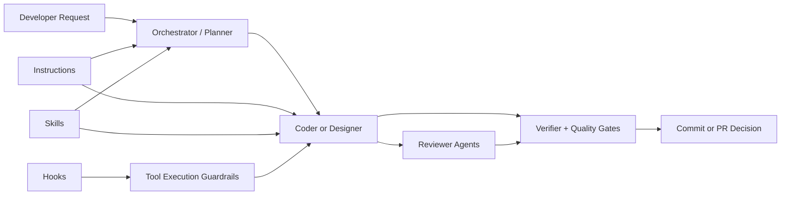

# Multi-Agent Bootstrap

A reusable multi-target agent bootstrap I drop into my other projects.

This repository is my personal starter kit for opinionated agent workflows in Python AI engineering repos. It packages the hooks, agents, skills, and instruction files I want available everywhere so I can keep quality and execution style consistent across GitHub Copilot, Claude Code, and OpenAI Codex.

Inspired and adapted from:

- [claude-code-my-workflow](https://github.com/pedrohcgs/claude-code-my-workflow)
- [armory](https://github.com/Mathews-Tom/armory)
- [ultralight](https://burkeholland.github.io/ultralight/)

## What This Repo Is

This is not an app.
It is a source-of-truth plus generated bootstrap. The editable sources live in `shared/` and the generated installable output lives in `dist/multi-agent/`.

Main goals:

- Keep coding workflow consistent across repositories.
- Enforce planning, verification, and quality gates.
- Make multi-agent execution predictable and repeatable.
- Capture learned patterns as reusable skills.

## Main Philosophy

I use a strict execution loop:

Plan -> Implement -> Verify -> Review -> Fix -> Score

Core principles:

- Plan first for non-trivial work.
- Config-first design for new features.
- Verify every change with tests, typing, and linting.
- Use reviewer agents to challenge implementation quality.
- Ship only when quality gates are met.
- Preserve lessons learned in memory and session logs.

## Quick Copy

Regenerate first, then copy the single generated bootstrap.

```bash
set -euo pipefail

# 1) Set paths
BOOTSTRAP_REPO="/absolute/path/to/github_copilot_bootstrap"
TARGET_REPO="/absolute/path/to/your-project"

# 2) Regenerate installable output
cd "$BOOTSTRAP_REPO"
python3 scripts/generate_targets.py --all

# 3) Copy the generated bootstrap into the project root
rsync -av "$BOOTSTRAP_REPO/dist/multi-agent/" "$TARGET_REPO/"

# 4) Ensure shared hook scripts are executable
chmod +x "$TARGET_REPO/.claude/hooks/scripts/"*.sh

# 5) Optional: commit in target repo
cd "$TARGET_REPO"
git add -A
git commit -m "chore: add agent bootstrap"
```

If you are already inside this bootstrap repo and only need to set the target path:

```bash
set -euo pipefail

TARGET_REPO="/absolute/path/to/your-project"
python3 scripts/generate_targets.py --all
rsync -av "dist/multi-agent/" "$TARGET_REPO/"
chmod +x "$TARGET_REPO/.claude/hooks/scripts/"*.sh
```

Generated layout:

- `.claude/`: shared basis for skills, canonical agent bodies, instructions, plans, explorations, logs, reports, memory, templates, prompts, hook scripts, and Claude settings
- `.github/`, `.vscode/mcp.json`: GitHub Copilot native adapters/config
- `CLAUDE.md`, `.mcp.json`: Claude Code native entrypoints/config
- `AGENTS.md`, `.codex/`: OpenAI Codex native adapters/config

If you do not use one of the tools, delete only that tool's native adapter/config files after copying. Keep `.claude/` unless you are intentionally removing the shared basis.

Optional pruning after copy:

- No Copilot: delete `.github/` and `.vscode/mcp.json`.
- No Claude Code: delete `CLAUDE.md`, `.mcp.json`, and `.claude/settings.json`.
- No Codex: delete `AGENTS.md` and `.codex/`.

## Architecture Flow



Interpretation:

- Instructions define non-negotiable rules.
- Skills provide reusable playbooks for specific tasks.
- Agents execute and review the work.
- Hooks enforce safety and log lifecycle events.
- Verifier and quality gates decide whether code is ready.

## What Is Included

- Generated bootstrap: installable output in [dist/multi-agent/](dist/multi-agent/)
- Source policies: reusable instruction files in [shared/policies/](shared/policies/)
- Agents: canonical metadata and target forks in [shared/agents/](shared/agents/)
- Skills: reusable workflows in [shared/skills/](shared/skills/)
- Hooks: policy and observability scripts in [shared/hooks/](shared/hooks/)
- MCP config: shared Semble and context-mode server definitions in [shared/mcp/](shared/mcp/)
- Templates, prompts, memory, plans, session logs, quality reports, and quality scoring rendered into the shared `.claude/` basis

## Most Important Instructions

These are the source files that render into `.claude/instructions/` in every generated target:

- [workflow.instructions.md](shared/policies/workflow.instructions.md)
  - Plan-first protocol
  - Orchestrator loop and review order
  - Session logging and context management
- [quality-and-testing.instructions.md](shared/policies/quality-and-testing.instructions.md)
  - Verification commands and required testing order
  - Quality scoring rubric and gates
- [code-standards.instructions.md](shared/policies/code-standards.instructions.md)
  - Naming, architecture patterns, deprecation protocol
- [tests.instructions.md](shared/policies/tests.instructions.md)
  - Fixture design, mocking boundaries, async testing patterns
- [config-first-design.instructions.md](shared/policies/config-first-design.instructions.md)
  - Pure ConfigStore approach (no YAML)
  - Dataclass validation and registration patterns
- [api-service-standards.instructions.md](shared/policies/api-service-standards.instructions.md)
  - BentoML service design, async endpoints, Pydantic validation
- [deployment.instructions.md](shared/policies/deployment.instructions.md)
  - Pre-deploy checks, Bento build/container workflow, health checks
- [tool-routing.instructions.md](shared/policies/tool-routing.instructions.md)
  - Routing between direct reads, `rg`, Semble, and context-mode

## Most Important Skills

Skills have two visibility levels: **public** skills appear in the `/` slash menu; **background** skills are hidden from the menu but auto-load when the model's description matches the task context. Both types are documented in the skills table in `copilot-instructions.md`.

There are many skills; these are the high-leverage ones I rely on most:

Core workflow:

- [plan-decomposition](shared/skills/plan-decomposition/SKILL.md)
- [iterative-plan-review](shared/skills/iterative-plan-review/SKILL.md)
- [create-feature](shared/skills/create-feature/SKILL.md)
- [run-tests](shared/skills/run-tests/SKILL.md)
- [refactor](shared/skills/refactor/SKILL.md)
- [code-review](shared/skills/code-review/SKILL.md)

Quality and architecture:

- [code-style](shared/skills/code-style/SKILL.md)
- [testing-patterns](shared/skills/testing-patterns/SKILL.md)
- [review-api](shared/skills/review-api/SKILL.md)
- [text-to-sql-safety](shared/skills/text-to-sql-safety/SKILL.md)
- [debug-investigator](shared/skills/debug-investigator/SKILL.md)

Communication and context control:

- [caveman](shared/skills/caveman/SKILL.md)
- [caveman-compress](shared/skills/caveman-compress/SKILL.md)

Project acceleration:

- [setup-project](shared/skills/setup-project/SKILL.md)
- [add-dependency](shared/skills/add-dependency/SKILL.md)
- [deploy-service](shared/skills/deploy-service/SKILL.md)
- [hydra-config](shared/skills/hydra-config/SKILL.md)
- [bentoml-service](shared/skills/bentoml-service/SKILL.md)

These skills encode battle-tested workflows and reduce ad-hoc execution.

## Agent System

The agent layer gives me orchestration plus specialist reviews. Full shared agent bodies render into `.claude/agents/`; Copilot and Codex keep thin native wrappers in `.github/agents/` and `.codex/agents/`.

Primary flow for complex work:

- orchestrator -> planner -> coder/designer -> reviewers -> verifier

Key reviewer agents:

- code-reviewer
- security-reviewer
- architecture-reviewer
- test-reviewer
- api-reviewer
- config-reviewer
- performance-reviewer
- documentation-reviewer

Reviewer agents run adversarial dual-pass review through two model-specific sub-agents (`review-pass-codex` and `review-pass-sonnet`) and synthesize findings into one report. When only one sub-agent is available, reviewers fall back to single-pass mode and label findings as `[single-pass, unconfirmed]`.

Orchestrator routing:

- The orchestrator does a shallow exploration pass, then decides between `--mode micro-plan` (small, well-scoped changes) and `--mode full-plan` (new features, cross-cutting changes) before delegating to the planner.
- The planner does NOT self-classify; routing ownership stays with the orchestrator.
- Planner micro-plan mode: load skills → draft → done (no interview required).
- Planner full-plan mode: intake → exploration → interview (min 2 rounds) → module sketch → draft → optional devil's advocate.
- Control-plane files (`.claude/`, `.github/`, `.codex/`, `CLAUDE.md`, `AGENTS.md`, `.github/copilot-instructions.md`) always use full-plan and always trigger dual adversarial review.

Coder skill loading:

- Tier 1 (always): `code-style/SKILL.md`, `testing-patterns/SKILL.md`
- Tier 2: task-specific skills loaded by type (e.g. `hydra-config` for config work, `bentoml-service` for API work)
- Coder pauses and asks the user before modifying any control-plane file.

## Hooks

Hooks provide guardrails and lightweight observability.

Configured events:

- PreToolUse
  - [protect-files.sh](shared/hooks/scripts/protect-files.sh) blocks protected files (env files, key files, secrets patterns, lockfiles) and hook config files; handles both relative and absolute paths correctly
  - [git-protection.sh](shared/hooks/scripts/git-protection.sh) blocks dangerous git commands (force push, reset --hard, clean -fd, deleting main/master)
  - [context-mode-dispatch.sh](shared/hooks/scripts/context-mode-dispatch.sh) forwards optional context-mode hook events after guardrails run
- PostToolUse / PreCompact
  - [context-mode-dispatch.sh](shared/hooks/scripts/context-mode-dispatch.sh) forwards optional context-mode lifecycle events and warns without failing when context-mode is unavailable
- SessionStart / Stop
  - [session-log.sh](shared/hooks/scripts/session-log.sh) appends lifecycle entries to `.claude/session_logs/hooks-sessions.log`
  - SessionStart also calls [context-mode-dispatch.sh](shared/hooks/scripts/context-mode-dispatch.sh) when available

Core Copilot hook adapter source: [hooks.json](shared/hooks/hooks.json)

Design intent:

- deny risky actions early
- keep audit trails lightweight and local
- leave nuanced coaching (reminders/cadence) to instruction files

## Verification Defaults

Expected verification commands after implementation:

- uv run pytest tests/ -q --tb=short
- uv run mypy src/ --ignore-missing-imports --explicit-package-bases
- uv run ruff check src/ tests/
- uv run ruff format src/ tests/
- uv run python .claude/scripts/quality_score.py src/ --json  (when available)

Quality gates:

- >= 80: commit-ready
- >= 90: PR-ready

## Optional Retrieval Helpers

VS Code can load the checked-in MCP servers from [.vscode/mcp.json](.vscode/mcp.json):

- `semble` uses `uvx --from "semble[mcp]" semble`.
- `context-mode` uses the portable bare `context-mode` command.

For machines without a global `context-mode` binary, install it globally or adapt local setup to use `npx -y context-mode`. Hook events already go through `.claude/hooks/scripts/context-mode-dispatch.sh`, which maps the calling target id to the context-mode target name, falls back to `npx -y context-mode hook ...` when `npx` is available, and otherwise prints `WARN` while exiting successfully.

Install `context-mode` with npm when Node.js is already available:

```bash
npm install -g context-mode
context-mode --help
```

If Node.js is not installed and you do not want to use `sudo`, install the official Node.js LTS binary under `~/.local` and expose it through `~/.local/bin`:

```bash
NODE_VERSION="v24.15.0"
NODE_DIST="node-${NODE_VERSION}-linux-x64"
mkdir -p "$HOME/.local/bin" "$HOME/.local/nodejs"
curl -L -o "/tmp/${NODE_DIST}.tar.xz" "https://nodejs.org/dist/${NODE_VERSION}/${NODE_DIST}.tar.xz"
tar -xJf "/tmp/${NODE_DIST}.tar.xz" -C "$HOME/.local/nodejs"
ln -sf "$HOME/.local/nodejs/${NODE_DIST}/bin/node" "$HOME/.local/bin/node"
ln -sf "$HOME/.local/nodejs/${NODE_DIST}/bin/npm" "$HOME/.local/bin/npm"
ln -sf "$HOME/.local/nodejs/${NODE_DIST}/bin/npx" "$HOME/.local/bin/npx"
"$HOME/.local/bin/npm" install -g context-mode
ln -sf "$HOME/.local/nodejs/${NODE_DIST}/bin/context-mode" "$HOME/.local/bin/context-mode"
```

Make sure `~/.local/bin` is on `PATH` before starting VS Code:

```bash
export PATH="$HOME/.local/bin:$PATH"
```

Run the bootstrap runtime check after copying optional surfaces:

```bash
python3 scripts/check_runtime.py
```

## How To Use This Bootstrap In Another Project

1. Regenerate the installable output with `python3 scripts/generate_targets.py --all`.
2. Copy `dist/multi-agent/` into your target project.
3. Review and adjust the generated root guidance for project-specific stack details.
4. Keep hooks enabled and ensure `.claude/hooks/scripts/*.sh` is executable in your environment.
5. Update instruction apply scopes to match your project paths.
6. Add or remove skills and agents in `shared/`, then regenerate instead of hand-editing `dist/`.

## Customization Notes

This bootstrap is intentionally opinionated, because consistency beats improvisation when quality matters.

If you customize it, prioritize:

- preserving the plan/verify/review/score loop
- keeping verification commands accurate for your stack
- maintaining clear ownership between instructions, skills, and hooks
- treating terse-mode and compression as opt-in guardrailed tools, not blanket rewrites of source-of-truth customization files
