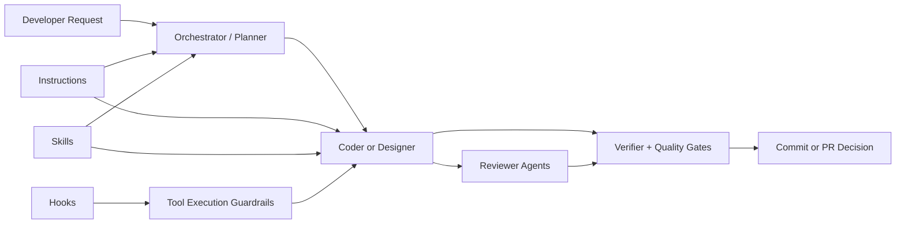

# Multi-Agent Bootstrap

A reusable multi-target agent bootstrap I drop into my other projects.

This repository is my personal starter kit for opinionated agent workflows in Python AI engineering repos. It packages the hooks, agents, skills, and instruction files I want available everywhere so I can keep quality and execution style consistent across GitHub Copilot, Claude Code, and OpenAI Codex.

Inspired and adapted from:

- [claude-code-my-workflow](https://github.com/pedrohcgs/claude-code-my-workflow)
- [armory](https://github.com/Mathews-Tom/armory)
- [ultralight](https://burkeholland.github.io/ultralight/)

## What This Repo Is

This is not an app.
It is a source-of-truth plus generated-target bootstrap. The editable sources live in `shared/` and the generated installable targets live in `dist/`.

Main goals:

- Keep coding workflow consistent across repositories.
- Enforce planning, verification, and quality gates.
- Make multi-agent execution predictable and repeatable.
- Capture learned patterns as reusable skills.

## Main Philosophy

I use a strict execution loop:

Plan -> Implement -> Verify -> Review -> Fix -> Score

Core principles:

- Plan first for non-trivial work.
- Config-first design for new features.
- Verify every change with tests, typing, and linting.
- Use reviewer agents to challenge implementation quality.
- Ship only when quality gates are met.
- Preserve lessons learned in memory and session logs.

## Quick Copy

Regenerate first, then copy the target you actually use.

```bash
set -euo pipefail

# 1) Set paths
BOOTSTRAP_REPO="/absolute/path/to/github_copilot_bootstrap"
TARGET_REPO="/absolute/path/to/your-project"
BOOTSTRAP_TARGET="github-copilot"   # github-copilot | claude-code | openai-codex

# 2) Regenerate installable outputs
cd "$BOOTSTRAP_REPO"
python3 scripts/generate_targets.py --all

# 3) Copy one generated target into the project root
rsync -av "$BOOTSTRAP_REPO/dist/$BOOTSTRAP_TARGET/" "$TARGET_REPO/"

# 4) Ensure hook scripts are executable
case "$BOOTSTRAP_TARGET" in
  github-copilot) chmod +x "$TARGET_REPO/.github/hooks/scripts/"*.sh ;;
  claude-code) chmod +x "$TARGET_REPO/.claude/hooks/scripts/"*.sh ;;
  openai-codex) chmod +x "$TARGET_REPO/.codex/hooks/scripts/"*.sh ;;
esac

# 5) Optional: commit in target repo
cd "$TARGET_REPO"
git add -A
git commit -m "chore: add agent bootstrap"
```

If you are already inside this bootstrap repo and only need to set the target path:

```bash
set -euo pipefail

TARGET_REPO="/absolute/path/to/your-project"
BOOTSTRAP_TARGET="github-copilot"   # github-copilot | claude-code | openai-codex
python3 scripts/generate_targets.py --all
rsync -av "dist/$BOOTSTRAP_TARGET/" "$TARGET_REPO/"
case "$BOOTSTRAP_TARGET" in
  github-copilot) chmod +x "$TARGET_REPO/.github/hooks/scripts/"*.sh ;;
  claude-code) chmod +x "$TARGET_REPO/.claude/hooks/scripts/"*.sh ;;
  openai-codex) chmod +x "$TARGET_REPO/.codex/hooks/scripts/"*.sh ;;
esac
```

Target layouts:

- `github-copilot`: `.github/`, `.vscode/mcp.json`
- `claude-code`: `CLAUDE.md`, `.claude/`, `.mcp.json`
- `openai-codex`: `AGENTS.md`, `.codex/`, `.agents/skills/`

## Copy All Targets

If you use GitHub Copilot, Claude Code, and OpenAI Codex interchangeably, copy all generated targets into the same project. Each tool will read its native entrypoint while sharing the same generated workflow philosophy from `shared/`.

```bash
set -euo pipefail

# 1) Set paths
BOOTSTRAP_REPO="/absolute/path/to/github_copilot_bootstrap"
TARGET_REPO="/absolute/path/to/your-project"

# 2) Regenerate installable outputs
cd "$BOOTSTRAP_REPO"
python3 scripts/generate_targets.py --all

# 3) Copy every generated target into the project root
rsync -av "$BOOTSTRAP_REPO/dist/github-copilot/" "$TARGET_REPO/"
rsync -av "$BOOTSTRAP_REPO/dist/claude-code/" "$TARGET_REPO/"
rsync -av "$BOOTSTRAP_REPO/dist/openai-codex/" "$TARGET_REPO/"

# 4) Ensure hook scripts are executable
chmod +x "$TARGET_REPO/.github/hooks/scripts/"*.sh
chmod +x "$TARGET_REPO/.claude/hooks/scripts/"*.sh
chmod +x "$TARGET_REPO/.codex/hooks/scripts/"*.sh

# 5) Optional: commit in target repo
cd "$TARGET_REPO"
git add -A
git commit -m "chore: add multi-agent bootstrap"
```

This creates parallel native entrypoints:

- GitHub Copilot reads `.github/copilot-instructions.md`
- Claude Code reads `CLAUDE.md`
- OpenAI Codex reads `AGENTS.md`

When switching systems mid-task, point the next tool at the current `git diff` plus the latest relevant plan or session log from the previous tool namespace.

## Architecture Flow



Interpretation:

- Instructions define non-negotiable rules.
- Skills provide reusable playbooks for specific tasks.
- Agents execute and review the work.
- Hooks enforce safety and log lifecycle events.
- Verifier and quality gates decide whether code is ready.

## What Is Included

- Generated targets: installable outputs in [dist/](dist/)
- Source policies: reusable instruction files in [shared/policies/](shared/policies/)
- Agents: canonical metadata and target forks in [shared/agents/](shared/agents/)
- Skills: reusable workflows in [shared/skills/](shared/skills/)
- Hooks: policy and observability scripts in [shared/hooks/](shared/hooks/)
- MCP config: shared Semble and context-mode server definitions in [shared/mcp/](shared/mcp/)
- Templates and scripts: planning, session logs, quality scoring

## Most Important Instructions

These are the files that matter most in day-to-day use:

- [workflow.instructions.md](.github/instructions/workflow.instructions.md)
  - Plan-first protocol
  - Orchestrator loop and review order
  - Session logging and context management
- [quality-and-testing.instructions.md](.github/instructions/quality-and-testing.instructions.md)
  - Verification commands and required testing order
  - Quality scoring rubric and gates
- [code-standards.instructions.md](.github/instructions/code-standards.instructions.md)
  - Naming, architecture patterns, deprecation protocol
- [tests.instructions.md](.github/instructions/tests.instructions.md)
  - Fixture design, mocking boundaries, async testing patterns
- [config-first-design.instructions.md](.github/instructions/config-first-design.instructions.md)
  - Pure ConfigStore approach (no YAML)
  - Dataclass validation and registration patterns
- [api-service-standards.instructions.md](.github/instructions/api-service-standards.instructions.md)
  - BentoML service design, async endpoints, Pydantic validation
- [deployment.instructions.md](.github/instructions/deployment.instructions.md)
  - Pre-deploy checks, Bento build/container workflow, health checks
- [tool-routing.instructions.md](.github/instructions/tool-routing.instructions.md)
  - Routing between direct reads, `rg`, Semble, and context-mode

## Most Important Skills

Skills have two visibility levels: **public** skills appear in the `/` slash menu; **background** skills are hidden from the menu but auto-load when the model's description matches the task context. Both types are documented in the skills table in `copilot-instructions.md`.

There are many skills; these are the high-leverage ones I rely on most:

Core workflow:

- [plan-decomposition](.github/skills/plan-decomposition/SKILL.md)
- [iterative-plan-review](.github/skills/iterative-plan-review/SKILL.md)
- [create-feature](.github/skills/create-feature/SKILL.md)
- [run-tests](.github/skills/run-tests/SKILL.md)
- [refactor](.github/skills/refactor/SKILL.md)
- [code-review](.github/skills/code-review/SKILL.md)

Quality and architecture:

- [code-style](.github/skills/code-style/SKILL.md)
- [testing-patterns](.github/skills/testing-patterns/SKILL.md)
- [review-api](.github/skills/review-api/SKILL.md)
- [text-to-sql-safety](.github/skills/text-to-sql-safety/SKILL.md)
- [debug-investigator](.github/skills/debug-investigator/SKILL.md)

Communication and context control:

- [caveman](.github/skills/caveman/SKILL.md)
- [caveman-compress](.github/skills/caveman-compress/SKILL.md)

Project acceleration:

- [setup-project](.github/skills/setup-project/SKILL.md)
- [add-dependency](.github/skills/add-dependency/SKILL.md)
- [deploy-service](.github/skills/deploy-service/SKILL.md)
- [hydra-config](.github/skills/hydra-config/SKILL.md)
- [bentoml-service](.github/skills/bentoml-service/SKILL.md)

These skills encode battle-tested workflows and reduce ad-hoc execution.

## Agent System

The agent layer gives me orchestration plus specialist reviews.

Primary flow for complex work:

- [orchestrator](.github/agents/orchestrator.agent.md) -> [planner](.github/agents/planner.agent.md) -> [coder](.github/agents/coder.agent.md)/[designer](.github/agents/designer.agent.md) -> reviewers -> [verifier](.github/agents/verifier.agent.md)

Key reviewer agents:

- [code-reviewer](.github/agents/code-reviewer.agent.md)
- [security-reviewer](.github/agents/security-reviewer.agent.md)
- [architecture-reviewer](.github/agents/architecture-reviewer.agent.md)
- [test-reviewer](.github/agents/test-reviewer.agent.md)
- [api-reviewer](.github/agents/api-reviewer.agent.md)
- [config-reviewer](.github/agents/config-reviewer.agent.md)
- [performance-reviewer](.github/agents/performance-reviewer.agent.md)
- [documentation-reviewer](.github/agents/documentation-reviewer.agent.md)

Reviewer agents run adversarial dual-pass review through two model-specific sub-agents (`review-pass-codex` and `review-pass-sonnet`) and synthesize findings into one report. When only one sub-agent is available, reviewers fall back to single-pass mode and label findings as `[single-pass, unconfirmed]`.

Orchestrator routing:

- The orchestrator does a shallow exploration pass, then decides between `--mode micro-plan` (small, well-scoped changes) and `--mode full-plan` (new features, cross-cutting changes) before delegating to the planner.
- The planner does NOT self-classify; routing ownership stays with the orchestrator.
- Planner micro-plan mode: load skills → draft → done (no interview required).
- Planner full-plan mode: intake → exploration → interview (min 2 rounds) → module sketch → draft → optional devil's advocate.
- Control-plane files (`.github/agents/`, `.github/instructions/`, `.github/hooks/`, `copilot-instructions.md`) always use full-plan and always trigger dual adversarial review.

Coder skill loading:

- Tier 1 (always): `code-style/SKILL.md`, `testing-patterns/SKILL.md`
- Tier 2: task-specific skills loaded by type (e.g. `hydra-config` for config work, `bentoml-service` for API work)
- Coder pauses and asks the user before modifying any control-plane file.

## Hooks

Hooks provide guardrails and lightweight observability.

Configured events:

- PreToolUse
  - [protect-files.sh](.github/hooks/scripts/protect-files.sh) blocks protected files (env files, key files, secrets patterns, lockfiles) and hook config files; handles both relative and absolute paths correctly
  - [git-protection.sh](.github/hooks/scripts/git-protection.sh) blocks dangerous git commands (force push, reset --hard, clean -fd, deleting main/master)
  - [context-mode-dispatch.sh](.github/hooks/scripts/context-mode-dispatch.sh) forwards optional context-mode hook events after guardrails run
- PostToolUse / PreCompact
  - [context-mode-dispatch.sh](.github/hooks/scripts/context-mode-dispatch.sh) forwards optional context-mode lifecycle events and warns without failing when context-mode is unavailable
- SessionStart / Stop
  - [session-log.sh](.github/hooks/scripts/session-log.sh) appends lifecycle entries to `.github/session_logs/hooks-sessions.log`
  - SessionStart also calls [context-mode-dispatch.sh](.github/hooks/scripts/context-mode-dispatch.sh) when available

Core hook config: [hooks.json](.github/hooks/hooks.json)

Design intent:

- deny risky actions early
- keep audit trails lightweight and local
- leave nuanced coaching (reminders/cadence) to instruction files

## Verification Defaults

Expected verification commands after implementation:

- uv run pytest tests/ -q --tb=short
- uv run mypy src/ --ignore-missing-imports --explicit-package-bases
- uv run ruff check src/ tests/
- uv run ruff format src/ tests/
- uv run python .github/scripts/quality_score.py src/ --json  (when available)

Quality gates:

- >= 80: commit-ready
- >= 90: PR-ready

## Optional Retrieval Helpers

VS Code can load the checked-in MCP servers from [.vscode/mcp.json](.vscode/mcp.json):

- `semble` uses `uvx --from "semble[mcp]" semble`.
- `context-mode` uses the portable bare `context-mode` command.

For machines without a global `context-mode` binary, install it globally or adapt local setup to use `npx -y context-mode`. Hook events already go through `.github/hooks/scripts/context-mode-dispatch.sh`, which calls `context-mode hook vscode-copilot ...`, falls back to `npx -y context-mode hook vscode-copilot ...` when `npx` is available, and otherwise prints `WARN` while exiting successfully.

Install `context-mode` with npm when Node.js is already available:

```bash
npm install -g context-mode
context-mode --help
```

If Node.js is not installed and you do not want to use `sudo`, install the official Node.js LTS binary under `~/.local` and expose it through `~/.local/bin`:

```bash
NODE_VERSION="v24.15.0"
NODE_DIST="node-${NODE_VERSION}-linux-x64"
mkdir -p "$HOME/.local/bin" "$HOME/.local/nodejs"
curl -L -o "/tmp/${NODE_DIST}.tar.xz" "https://nodejs.org/dist/${NODE_VERSION}/${NODE_DIST}.tar.xz"
tar -xJf "/tmp/${NODE_DIST}.tar.xz" -C "$HOME/.local/nodejs"
ln -sf "$HOME/.local/nodejs/${NODE_DIST}/bin/node" "$HOME/.local/bin/node"
ln -sf "$HOME/.local/nodejs/${NODE_DIST}/bin/npm" "$HOME/.local/bin/npm"
ln -sf "$HOME/.local/nodejs/${NODE_DIST}/bin/npx" "$HOME/.local/bin/npx"
"$HOME/.local/bin/npm" install -g context-mode
ln -sf "$HOME/.local/nodejs/${NODE_DIST}/bin/context-mode" "$HOME/.local/bin/context-mode"
```

Make sure `~/.local/bin` is on `PATH` before starting VS Code:

```bash
export PATH="$HOME/.local/bin:$PATH"
```

Run the bootstrap runtime check after copying optional surfaces:

```bash
python .github/scripts/check_agent_runtime.py
```

## How To Use This Bootstrap In Another Project

1. Regenerate targets with `python3 scripts/generate_targets.py --all`.
2. Copy exactly one `dist/<target>/` directory into your target project.
3. Review and adjust the generated root guidance for project-specific stack details.
4. Keep hooks enabled and ensure scripts are executable in your environment.
5. Update instruction apply scopes to match your project paths.
6. Add or remove skills and agents in `shared/`, then regenerate instead of hand-editing `dist/`.

## Customization Notes

This bootstrap is intentionally opinionated, because consistency beats improvisation when quality matters.

If you customize it, prioritize:

- preserving the plan/verify/review/score loop
- keeping verification commands accurate for your stack
- maintaining clear ownership between instructions, skills, and hooks
- treating terse-mode and compression as opt-in guardrailed tools, not blanket rewrites of source-of-truth customization files
