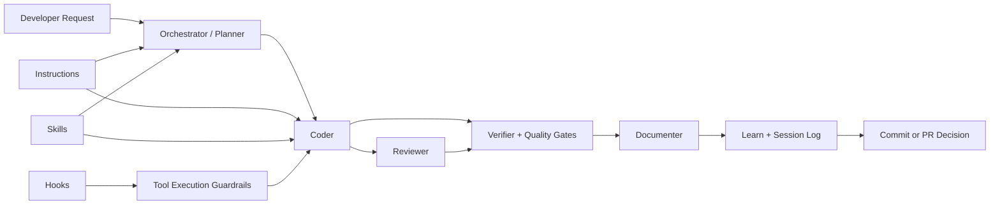

# Multi-Agent Bootstrap

A reusable multi-target agent bootstrap I drop into my other projects.

This repository is my personal starter kit for opinionated agent workflows in Python AI engineering repos. It packages the hooks, agents, skills, and instruction files I want available everywhere so I can keep quality and execution style consistent across GitHub Copilot, Claude Code, and OpenAI Codex.

Inspired and adapted from:

- [claude-code-my-workflow](https://github.com/pedrohcgs/claude-code-my-workflow)
- [armory](https://github.com/Mathews-Tom/armory)
- [ultralight](https://burkeholland.github.io/ultralight/)

## What This Repo Is

This is not an app.
It is a source-of-truth plus generated bootstrap. The editable sources live in `shared/` and the generated installable output lives in `dist/multi-agent/`.

Main goals:

- Keep coding workflow consistent across repositories.
- Enforce planning, verification, and quality gates.
- Make multi-agent execution predictable and repeatable.
- Capture learned patterns as reusable skills.

## Main Philosophy

I use a strict execution loop:

Pre-flight -> Branch -> Plan -> Implement -> Verify -> Review -> Score -> Document -> Learn -> Session Log -> Commit

Core principles:

- Start from `dev`, branch for each big plan, and keep plan frontmatter current.
- Plan first for non-trivial work and split big plans into commit-sized small plans.
- Config-first design for new features.
- Verify every change with tests, typing, and linting.
- Use the unified reviewer to challenge implementation quality.
- Ship only after score >= 90, documentation updates, learning capture, and closeout logs.
- Preserve lessons learned in memory and session logs.

## Quick Install

Regenerate first, then install the single generated bootstrap into a target repo.
The installer copies the generated AI files, substitutes the target repo name into
the workspace instructions, keeps `.devcontainer/` trackable, adds an idempotent
`.gitignore` block for generated/private AI content, writes the project-specific
Hugging Face sync path into the devcontainer config, and uploads the bootstrap
bundle when auth is available.

A bucket is **required** — pass `--bucket <org/bucket[/prefix]>` or set
`HF_AI_SYNC_BUCKET`; there is no baked-in default, so no personal namespace ships
in the bootstrap. The installer exits with an instruction if neither is set.

```bash
set -euo pipefail

# 1) Set paths
BOOTSTRAP_REPO="/absolute/path/to/github_copilot_bootstrap"
TARGET_REPO="/absolute/path/to/your-project"
PROJECT_NAME="$(basename "$TARGET_REPO")"
HF_BUCKET_PATH="Ghisso/vscode_mounts/$PROJECT_NAME"

# 2) Regenerate installable output
cd "$BOOTSTRAP_REPO"
uv run python scripts/generate_targets.py --all

# 3) Install into the project root and upload the private AI bootstrap bundle
uv run python scripts/install_bootstrap.py "$TARGET_REPO" --bucket "$HF_BUCKET_PATH"

# 4) Commit the trackable devcontainer and ignore rule in the target repo
cd "$TARGET_REPO"
git add .devcontainer .gitignore
git commit -m "chore: add AI devcontainer bootstrap"
```

If you are already inside this bootstrap repo and only need to set the target path:

```bash
set -euo pipefail

TARGET_REPO="/absolute/path/to/your-project"
PROJECT_NAME="$(basename "$TARGET_REPO")"
HF_BUCKET_PATH="Ghisso/vscode_mounts/$PROJECT_NAME"
uv run python scripts/generate_targets.py --all
uv run python scripts/install_bootstrap.py "$TARGET_REPO" --bucket "$HF_BUCKET_PATH"
```

For `img-classification`, that expands to:

```bash
uv run python scripts/install_bootstrap.py "$TARGET_REPO" --bucket Ghisso/vscode_mounts/img-classification
```

and stores files under `hf://buckets/Ghisso/vscode_mounts/img-classification/`.

Hugging Face auth is resolved in this order: `HF_TOKEN` env var, then
`HUGGING_FACE_HUB_TOKEN`, then the cached token at `~/.cache/huggingface/token`.
Inside the devcontainer the host HF cache is bind-mounted at
`/home/vscode/.cache/huggingface`, so any token saved by `huggingface-cli login`
or `hf auth login` on the host is automatically available — no env var needed.
Missing auth, missing bucket access, or network failures produce warnings and leave
local files in place.

## Updating Existing Repos

When you update this bootstrap (new hooks, revised instructions, agent changes),
push the new version to all consumer repos with:

```bash
uv run python scripts/update_consumers.py \
  /path/to/repo1 \
  /path/to/repo2 \
  /path/to/repo3
```

The script regenerates `dist/` automatically, then for each repo it:

- Backs up `.claude/MEMORY.md` in memory before installing
- Runs `install_bootstrap.py` (copies all bootstrap-controlled files, uploads to HF)
- Restores the original `.claude/MEMORY.md` after installing

Files that exist only in the consumer repo — plans, session logs, quality reports,
explorations — are never touched. Only bootstrap-controlled files (agents, hooks,
instructions, skills, templates, settings, root guidance) are replaced.

Because the devcontainer pulls from the HF bucket on open, the HF upload is
included by default. Use `--skip-upload` for a local-only update.

```bash
# Preview without writing
uv run python scripts/update_consumers.py --dry-run /path/to/repo

# Local install only (no HF upload)
uv run python scripts/update_consumers.py --skip-upload /path/to/repo
```

Generated layout:

- `.devcontainer/`: trackable GPU sandbox and HF sync bootloader for consumer repos; Node.js 22 + `context-mode` pre-installed; the container mounts `~/.cache/huggingface` from the host so credentials and cached models are available without re-authenticating
- `.claude/`: shared basis for skills, canonical agent bodies, instructions, plans, explorations, logs, reports, memory, templates, prompts, hook scripts, and Claude settings
- `.github/`, `.vscode/mcp.json`, `.vscode/tasks.json`: GitHub Copilot native adapters/config; `tasks.json` auto-pulls AI state on folder open and exposes a manual push task
- `CLAUDE.md`, `.mcp.json`: Claude Code native entrypoints/config
- `AGENTS.md`, `.codex/`: OpenAI Codex native adapters/config

Consumer repos should commit `.devcontainer/` and `.gitignore`, but generated AI
content such as `.claude/`, `.codex/`, `AGENTS.md`, `CLAUDE.md`, native adapters,
and MCP files should stay ignored. A fresh clone can reopen in the devcontainer and
pull the ignored AI content from:

### GitHub Copilot: local-IDE vs cloud

By default the installer gitignores the GitHub Copilot surface
(`.github/agents/`, `.github/hooks/`, `.github/instructions/`,
`.github/copilot-instructions.md`), so **only local-IDE Copilot is configured** —
cloud Copilot agents read that surface only from the committed default branch and
will not see gitignored files. To enable cloud Copilot, install with
`--commit-copilot-surface`, which keeps those paths out of the ignore block so you
can commit them (like `.devcontainer/`); the AI state in `.claude/` still stays
ignored and HF-synced.

```text
hf://buckets/Ghisso/vscode_mounts/<project-name>/bootstrap/
hf://buckets/Ghisso/vscode_mounts/<project-name>/state/
```

For example, installing with `--bucket Ghisso/vscode_mounts/img-classification`
uses `img-classification/` as the project path inside the `Ghisso/vscode_mounts`
bucket.

If you do not use one of the tools, delete only that tool's native adapter/config
files after installing and then re-run the installer/upload if you want the pruned
bundle stored in HF. Keep `.claude/` unless you are intentionally removing the shared
basis.

Optional pruning after copy:

- No Copilot: delete `.github/` and `.vscode/mcp.json`.
- No Claude Code: delete `CLAUDE.md`, `.mcp.json`, and `.claude/settings.json`.
- No Codex: delete `AGENTS.md` and `.codex/`.

## Architecture Flow



Interpretation:

- Instructions define non-negotiable rules.
- Skills provide reusable playbooks for specific tasks.
- Agents execute and review the work.
- Hooks enforce safety and log lifecycle events.
- Verifier and quality gates decide whether code is ready.

## What Is Included

- Generated bootstrap: installable output in `dist/multi-agent/` (gitignored — run `uv run python scripts/generate_targets.py --all` to build)
- Source policies: reusable instruction files in [shared/policies/](shared/policies/)
- Agents: canonical metadata and prompts in [shared/agents/](shared/agents/)
- Review profiles: unified reviewer checklists in [shared/review-profiles/](shared/review-profiles/)
- Skills: reusable workflows in [shared/skills/](shared/skills/)
- Hooks: policy and observability scripts in [shared/hooks/](shared/hooks/)
- Devcontainer: GPU sandbox and HF sync bootloader in [shared/devcontainer/](shared/devcontainer/) — Node.js 22 (multi-stage build; avoids Ubuntu's outdated Node 18), `bubblewrap`, and `context-mode` are pre-installed; handles GID/UID conflicts in NVIDIA base images and mounts the host HF cache for seamless auth; `--cap-add=SYS_ADMIN` and `--security-opt=seccomp=unconfined` are set so bubblewrap namespace creation works inside Docker; `huggingface_hub>=1.0` is pinned directly in the image because `HfApi.sync_bucket` was added in 1.0 — older versions silently no-op; if a project dep downgrades the package anyway, `hf-ai-sync.py` detects the missing method and falls back to the `hf` CLI with a visible warning
- MCP config: shared Semble and context-mode server definitions in [shared/mcp/](shared/mcp/)
- Templates, prompts, memory, plans, session logs, quality reports, and quality scoring rendered into the shared `.claude/` basis

## Most Important Instructions

These are the source files that render into `.claude/instructions/` in every generated target:

- [workspace.instructions.md](shared/policies/workspace.instructions.md)
  - Shared workspace guidance
  - Agent and review-profile overview
  - Skill visibility and verification defaults
- [workflow.instructions.md](shared/policies/workflow.instructions.md)
  - Pre-flight, branch, plan, implementation, verification, review, score, documentation, learn, session-log, commit protocol
  - Branch lifecycle and commit/PR gates
  - Session logging and recovery reminders
- [quality-and-testing.instructions.md](shared/policies/quality-and-testing.instructions.md)
  - Verification commands and required testing order
  - Quality scoring rubric and gates
- [code-standards.instructions.md](shared/policies/code-standards.instructions.md)
  - Naming, architecture patterns, deprecation protocol
- [tests.instructions.md](shared/policies/tests.instructions.md)
  - Fixture design, mocking boundaries, async testing patterns
- [config-first-design.instructions.md](shared/policies/config-first-design.instructions.md)
  - Pure ConfigStore approach (no YAML)
  - Dataclass validation and registration patterns
- [api-service-standards.instructions.md](shared/policies/api-service-standards.instructions.md)
  - BentoML service design, async endpoints, Pydantic validation
- [deployment.instructions.md](shared/policies/deployment.instructions.md)
  - Pre-deploy checks, Bento build/container workflow, health checks
- [tool-routing.instructions.md](shared/policies/tool-routing.instructions.md)
  - Routing between direct reads, `rg`, Semble, and context-mode
  - Single authoritative home for retrieval-tool choice; agents point here instead of restating it
- [agent-reporting.instructions.md](shared/policies/agent-reporting.instructions.md)
  - Single home for how agents report back (caveman-full prose, structured content preserved) with the documenter's normal-prose exception

## Most Important Skills

Skills have machine-readable `visibility: public|background` frontmatter. **Public** skills are intended for direct use; **background** skills are hidden helpers loaded by description match or by agents.

There are many skills; these are the high-leverage ones I rely on most:

Core workflow:

- [plan-decomposition](shared/skills/plan-decomposition/SKILL.md)
- [create-feature](shared/skills/create-feature/SKILL.md)
- [run-tests](shared/skills/run-tests/SKILL.md)
- [refactor](shared/skills/refactor/SKILL.md)
- [code-review](shared/skills/code-review/SKILL.md)

Quality and architecture:

- [code-style](shared/skills/code-style/SKILL.md)
- [testing-patterns](shared/skills/testing-patterns/SKILL.md)
- [review-api](shared/skills/review-api/SKILL.md)
- [text-to-sql-safety](shared/skills/text-to-sql-safety/SKILL.md)
- [debug-investigator](shared/skills/debug-investigator/SKILL.md)

Communication and context control:

- [caveman](shared/skills/caveman/SKILL.md)
- [caveman-compress](shared/skills/caveman-compress/SKILL.md)

Project acceleration:

- [setup-project](shared/skills/setup-project/SKILL.md)
- [add-dependency](shared/skills/add-dependency/SKILL.md)
- [deploy-service](shared/skills/deploy-service/SKILL.md)
- [hydra-config](shared/skills/hydra-config/SKILL.md)
- [bentoml-service](shared/skills/bentoml-service/SKILL.md)

These skills encode battle-tested workflows and reduce ad-hoc execution.

## Agent System

The agent layer gives me orchestration plus profile-driven reviews. Full shared agent bodies render into `.claude/agents/`; Copilot and Codex keep thin native wrappers in `.github/agents/` and `.codex/agents/`.

Primary flow for complex work:

- orchestrator -> planner -> coder -> verifier -> reviewer -> documenter

Current agents:

- orchestrator
- planner
- coder
- reviewer
- verifier
- documenter

The unified `reviewer` loads one or more profiles from `.claude/review-profiles/` (`code`, `architecture`, `security`, `tests`, `api`, `config`, `performance`, `documentation`, `domain`), routed via the single authoritative table in `.claude/instructions/workspace.instructions.md`. It runs two passes itself — a primary pass, then a verification pass that refutes the primary findings and drops any that do not survive — then synthesizes the survivors into one report, with no helper agents.

Orchestrator routing:

- The orchestrator does a shallow exploration pass, then decides between `--mode micro-plan` (small, well-scoped changes) and `--mode full-plan` (new features, cross-cutting changes) before delegating to the planner.
- The planner does NOT self-classify; routing ownership stays with the orchestrator.
- Planner micro-plan mode: load skills → draft → done (no interview required).
- Planner full-plan mode: intake → exploration → interview (min 2 rounds) → module sketch → draft → optional devil's advocate.
- Control-plane files (`.claude/hooks/`, `.claude/settings.json`, `.github/hooks/`, `.codex/`, `.mcp.json`, `.devcontainer/`, `CLAUDE.md`, `AGENTS.md`) — the consumer-side surfaces that affect every session — always use full-plan and always trigger profile-driven review.

Coder skill loading:

- Tier 1 (always): `code-style/SKILL.md`, `testing-patterns/SKILL.md`
- Tier 2: task-specific skills loaded by type (e.g. `hydra-config` for config work, `bentoml-service` for API work)
- Coder pauses and asks the user before modifying any control-plane file.

## Hooks

Hooks provide guardrails and lightweight observability.

All hook commands route through [run-hook.sh](shared/hooks/scripts/run-hook.sh), a dispatcher that resolves the repo root robustly — via `BASH_SOURCE`, environment variable fallbacks (`GITHUB_WORKSPACE`, `WORKSPACE_FOLDER`, `VSCODE_CWD`), then `git rev-parse`. This avoids the broken-path failures that occur when `$CLAUDE_PROJECT_DIR` is empty or when `git rev-parse` runs from the wrong directory.

[hooks.json](shared/hooks/hooks.json) sets `"cwd": "."` on every entry rather than `"${workspaceFolder}"`. Copilot's hook runner does not interpolate VS Code variables, so using the literal string would resolve to a non-existent path and produce `spawn /bin/sh ENOENT` errors. `run-hook.sh` resolves the repo root itself, so `"."` is sufficient.

Generated Claude and Codex hook configs execute `run-hook.sh` directly, so the generator marks the generated dispatcher executable and the target validator fails if it is not runnable.

Configured events:

- SessionStart
  - [session-start-state.sh](shared/hooks/scripts/session-start-state.sh) reminds agents about the current branch, active plan phase, latest score report, and any open lifecycle state
  - [context-mode-dispatch.sh](shared/hooks/scripts/context-mode-dispatch.sh) forwards optional context-mode lifecycle events when available
- PreToolUse
  - [protect-files.sh](shared/hooks/scripts/protect-files.sh) blocks protected files (env files, key files, secrets patterns, lockfiles) and hook config files. Its primary check is pure bash (no `uv` dependency); a Python precision pass runs only as an enhancement when `uv` is present, and an internal error fails toward `ask` (deny on Codex), never a silent allow
  - [git-protection.sh](shared/hooks/scripts/git-protection.sh) blocks dangerous git commands (force push, reset --hard, clean -fd, deleting main/master) in pure bash — no `uv` dependency — and tokenizes past global git flags so forms like `git -C . reset --hard` are still caught
  - [enforce-branch-state.sh](shared/hooks/scripts/enforce-branch-state.sh) validates branch creation from clean `dev` into `<plan_name>_implementation`, including `git checkout -b`, `git checkout -B`, `git switch -c`, `git switch -C`, and `git switch --create`
  - [enforce-commit-gate.sh](shared/hooks/scripts/enforce-commit-gate.sh) blocks normal commits until the small plan is complete, the closeout log is completed, `[LEARN]` evidence exists, and a fresh score >= 90 report matches the current branch, phase, base ref, merge base, and HEAD SHA. The report must also record `tests_passed: true`, not be `tests_skipped`, and be `dirty: false` (no unstaged changes), and its `content_hash` — `git hash-object` of the diff against the merge base — must still match, so an amend/rebase/editor-touch that preserves content does not false-block while any real post-scoring edit does. Failure messages name the exact mismatch and the regenerate command. Classifiers tokenize past global git flags, so `git -C . commit` / `git -c k=v commit` cannot bypass the gate; on an unparseable payload the gate fails closed (exit 2)
  - [enforce-pr-gate.sh](shared/hooks/scripts/enforce-pr-gate.sh) requires `gh pr create --base dev` and blocks implementation-branch pushes until every phase is complete and bypasses are acknowledged
  - [context-mode-dispatch.sh](shared/hooks/scripts/context-mode-dispatch.sh) forwards optional context-mode hook events after guardrails run
- PostToolUse / PreCompact
  - [record-branch-state.sh](shared/hooks/scripts/record-branch-state.sh) records branch metadata and the active phase in the big plan after successful branch creation
  - [record-commit-closeout.sh](shared/hooks/scripts/record-commit-closeout.sh) advances the big-plan phase only after correlating the intercepted commit subject with `HEAD`; it completes the big plan after the final phase and logs allowed bypass commits
  - [context-mode-dispatch.sh](shared/hooks/scripts/context-mode-dispatch.sh) forwards optional context-mode lifecycle events and warns without failing when context-mode is unavailable
- SessionStart / Stop
  - [session-log.sh](shared/hooks/scripts/session-log.sh) appends lifecycle entries to `.claude/session_logs/hooks-sessions.log`; generates timestamps in bash (Claude Code payloads carry no `timestamp` field) and accepts both snake_case (`hook_event_name`) and camelCase (`hookEventName`) field names for cross-tool compatibility
- Stop
  - [stop-session-log-check.sh](shared/hooks/scripts/stop-session-log-check.sh) warns when code or docs changed but no session log was updated for the day
  - [hf-ai-sync.sh](shared/hooks/scripts/hf-ai-sync.sh) runs `push-state` only — it pushes mutable AI *state* to the configured Hugging Face sync path. Consumers never re-upload the canonical bootstrap bundle from a Stop hook; bootstrap uploads are an explicit installer/updater action, so a stale consumer copy can't clobber the shared bundle. With no bucket configured the helper warns and no-ops. Errors are written to `.claude/session_logs/hooks-errors.log` and stderr; missing HF auth or network access warns and exits successfully; stdin is drained with a 2-second timeout so the script does not hang when invoked via a VS Code task where stdin never closes
- `pull-state` (via VS Code tasks or AI SessionStart hooks) snapshots current state files to `.claude/.state_backups/` before overwriting, then deletes backups for files that were identical — only files that were actually overwritten by the pull retain a backup for manual review and recovery. `.state_backups/` is a local convenience; the durable copy of state is the HF bucket. `push-state --prune` reconciles the bucket (deletes remote files removed locally); it is opt-in

### Deterministic Commit Gate (`commit-msg` Git Hook)

`enforce-commit-gate.sh` above is a `PreToolUse` hook: it can only gate the AI agent's own Bash tool calls, so a human `git commit`, an IDE commit button, a script, or a `git ci` alias never pass through it. [commit-msg](shared/hooks/git-hooks/commit-msg) is a second, deterministic layer that runs inside git itself via `core.hooksPath` (set by [install_bootstrap.py](scripts/install_bootstrap.py) and, for fresh devcontainers, by `post-start.sh` before the state pull runs). Because it fires from git's own commit lifecycle, every commit reaching a `<plan_name>_implementation` branch is gated on one code path regardless of how it was invoked, with no command string to parse, no stdout convention, and no timeout to fail open on.

Both entry points share one ceremony contract — `assert_commit_invariants` in [_lib-frontmatter.sh](shared/hooks/scripts/_lib-frontmatter.sh) — covering the small-plan/closeout/score/LEARN checks, so the two paths cannot drift apart. They deliberately diverge on branch scope: `enforce-commit-gate.sh` denies an *agent* commit on any wrong branch, while `commit-msg` passes through untouched on any branch other than `<plan_name>_implementation` — merges and casual commits on `dev`/`main` are unaffected.

- `git commit --no-verify` is the sanctioned manual escape: git skips `commit-msg` entirely, and there is no git hook that fires when hooks are skipped.
- `.claude/` is gitignored and Hugging Face-synced in consumers, so on a fresh clone *before* the first sync, `.claude/hooks/git-hooks/` does not exist yet — git prints a warning and runs no hook (fails open for humans until sync completes). `post-start.sh` sets `core.hooksPath` before the pull runs so the devcontainer path closes this window as soon as the pull finishes.
- Per `githooks(5)`, `commit-msg` also fires for `git merge`, not just `git commit`. A plain merge commit carries no authored content of its own, so on an implementation branch it passes through unledgered — the ceremony re-attaches at the next real commit. `git rebase` and `git cherry-pick` do **not** invoke `commit-msg` at all (git behavior, not a bootstrap gap); the commits they create skip the git layer, but the next real commit is still gated. `git commit --amend` does invoke it, and `content_hash` freshness survives a content-preserving amend. The `MERGE_HEAD` passthrough is, like `--no-verify`, a known accepted escape: `git merge --no-commit` followed by manually staging extra changes lands ungated content on an implementation branch, since the hook cannot distinguish a pure merge from a merge plus manual staging.
- See [docs/plan-deterministic-commit-gate.md](docs/plan-deterministic-commit-gate.md) for the full design rationale.

Core Copilot hook adapter source: [hooks.json](shared/hooks/hooks.json)

Design intent:

- deny risky actions early
- keep audit trails lightweight and local
- leave nuanced coaching (reminders/cadence) to instruction files

## Verification Defaults

Expected verification commands after implementation:

- uv run pytest tests/ -q --tb=short
- uv run mypy src/ --ignore-missing-imports --explicit-package-bases
- uv run ruff check src/ tests/
- uv run ruff format src/ tests/
- uv run python .claude/scripts/quality_score.py src/ --phase <current_phase> --base-ref dev --json --out .claude/quality_reports/score-<timestamp>.json

Quality gates:

- >= 95: excellence target
- >= 90: required for commit and PR closeout
- < 90: blocked until implementation, verification, review, and score are rerun

Documentation gate:

- after score >= 90, update docs for changed public interfaces, config, workflows, and user-facing behavior before commit or PR closeout

## Optional Retrieval Helpers

VS Code can load the checked-in MCP servers from [.vscode/mcp.json](.vscode/mcp.json):

- `semble` uses `uvx --from "semble[mcp]" semble`.
- `context-mode` uses the portable bare `context-mode` command.

**Inside the devcontainer**, Node.js 22 and `context-mode` are pre-installed — no extra setup needed.

**Outside the devcontainer**, hook events go through `.claude/hooks/scripts/context-mode-dispatch.sh`, which maps the calling target id to the context-mode target name, falls back to `npx -y context-mode hook ...` when `npx` is available, and otherwise prints `WARN` while exiting successfully.

Install `context-mode` with npm when Node.js is already available:

```bash
npm install -g context-mode
context-mode --help
```

If Node.js is not installed and you do not want to use `sudo`, install the official Node.js LTS binary under `~/.local` and expose it through `~/.local/bin`:

```bash
NODE_VERSION="v24.15.0"
NODE_DIST="node-${NODE_VERSION}-linux-x64"
mkdir -p "$HOME/.local/bin" "$HOME/.local/nodejs"
curl -L -o "/tmp/${NODE_DIST}.tar.xz" "https://nodejs.org/dist/${NODE_VERSION}/${NODE_DIST}.tar.xz"
tar -xJf "/tmp/${NODE_DIST}.tar.xz" -C "$HOME/.local/nodejs"
ln -sf "$HOME/.local/nodejs/${NODE_DIST}/bin/node" "$HOME/.local/bin/node"
ln -sf "$HOME/.local/nodejs/${NODE_DIST}/bin/npm" "$HOME/.local/bin/npm"
ln -sf "$HOME/.local/nodejs/${NODE_DIST}/bin/npx" "$HOME/.local/bin/npx"
"$HOME/.local/bin/npm" install -g context-mode
ln -sf "$HOME/.local/nodejs/${NODE_DIST}/bin/context-mode" "$HOME/.local/bin/context-mode"
```

Make sure `~/.local/bin` is on `PATH` before starting VS Code:

```bash
export PATH="$HOME/.local/bin:$PATH"
```

Run the bootstrap runtime check after copying optional surfaces:

```bash
uv run python scripts/check_runtime.py
```

## How To Use This Bootstrap In Another Project

1. Regenerate the installable output with `uv run python scripts/generate_targets.py --all`.
2. Copy `dist/multi-agent/` into your target project.
3. Review and adjust the generated root guidance for project-specific stack details.
4. Keep hooks enabled and ensure `.claude/hooks/scripts/*.sh` is executable in your environment.
5. Update instruction apply scopes to match your project paths.
6. Add or remove skills and agents in `shared/`, then regenerate instead of hand-editing `dist/`.

## Customization Notes

This bootstrap is intentionally opinionated, because consistency beats improvisation when quality matters.

If you customize it, prioritize:

- preserving the pre-flight/branch/plan/verify/review/score/document/learn/session-log/commit workflow
- keeping verification commands accurate for your stack
- maintaining clear ownership between instructions, skills, and hooks
- treating terse-mode and compression as opt-in guardrailed tools, not blanket rewrites of source-of-truth customization files
