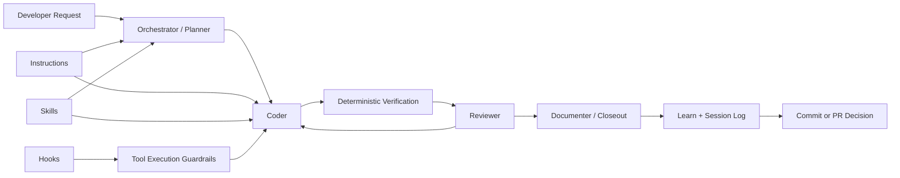

# Multi-Agent Bootstrap

A reusable multi-target agent bootstrap I drop into my other projects.

This repository is my personal starter kit for opinionated agent workflows in Python AI engineering repos. It packages the hooks, agents, skills, and instruction files I want available everywhere so I can keep quality and execution style consistent across GitHub Copilot, Claude Code, OpenAI Codex, and Google Antigravity.

Inspired and adapted from:

- [claude-code-my-workflow](https://github.com/pedrohcgs/claude-code-my-workflow)
- [armory](https://github.com/Mathews-Tom/armory)
- [ultralight](https://burkeholland.github.io/ultralight/)

## What This Repo Is

This is not an app.
It is a source-of-truth plus generated bootstrap. Bootstrap maintainers edit `shared/`; `dist/multi-agent/` is the generated installable output. In an installed project, `.claude/` is the canonical runtime basis, while generated root files such as `CLAUDE.md` and `AGENTS.md` are consumer-neutral entrypoints and must not be hand-edited. An optional, opt-in OpenWiki knowledge layer can generate descriptive `openwiki/` wiki pages for a repository, but it is derived context, never authority over source, tests, or human-authored policy — see [the knowledge-ownership contract](docs/architecture.md#openwiki-knowledge-layer).

Main goals:

- Keep coding workflow consistent across repositories.
- Enforce planning, verification, and quality gates.
- Make multi-agent execution predictable and repeatable.
- Capture learned patterns as reusable skills.

## Main Philosophy

I use a strict execution loop:

PRE-FLIGHT -> BRANCH -> PLAN when needed -> IMPLEMENT -> VERIFY -> REVIEW -> CLOSEOUT -> COMMIT -> PUSH

Core principles:

- Start from `dev`, branch for each big plan, and keep plan frontmatter current.
- Plan first for non-trivial work and split big plans into commit-sized small plans. If a phase is deliberately paused, resume that same small plan later; do not create a second plan for the checkpoint.
- During IMPLEMENT, the coder applies the vendored Ponytail skill once in `full` mode, then performs a lightweight changed-scope simplification and re-verification pass.
- Treat minimality as conceptual: prefer reuse, standard-library/native features, and the smallest correct set of concepts while clarity and maintainability outrank line count.
- Config-first design for new features.
- Verify every change with tests, typing, and linting.
- Use the unified reviewer to challenge implementation quality.
- Use the native Git `post-commit` boundary to advance a completed phase before AI-state synchronization; commit-message transport does not affect that transition.
- After each successful outer-repository commit, have the orchestrator attempt one normal non-force push. A missing remote or authentication/network failure is a warning that preserves the local commit. PRs and merges remain user-requested.
- Close out in one order: focused/fast checks, review, final docs/plan/log/LEARN state, explicit staging, findings, persisted phase evidence, persisted closeout evidence, then commit.
- Ship only after a passing `verify phase`/`verify closeout` receipt, a matching findings report with zero CRITICAL findings, documentation updates, learning capture, and closeout logs. Ponytail findings use the same ordinary severity gates as other profiles.
- Preserve lessons learned in memory and session logs.

For the authority, privacy, and conflict rules for that shared state, read
[the memory model](docs/architecture.md#memory-authority-and-privacy). For the
detailed threat model and reporting boundary, read [SECURITY.md](SECURITY.md).

## Quick Install

The installer supports two modes. **Full install** (`--mode full`, or the
default when the installer finds no other evidence) makes this bootstrap own
the target repository's whole agent harness: hooks, the lifecycle, a nested
AI-state repository, MCP configuration, and the devcontainer. Use it for a
repository you own outright. **Sidecar install** (`--mode sidecar`) adds a
small, private, per-clone overlay — a few skills and one short always-on rule
per client — inside a repository whose agent harness a team already owns.
Use it when you want your own coding-agent skills active in a team
repository without changing anything the team tracks. Neither mode is
detected by guessing. Running the plain installer with no `--mode` on a
repository that already tracks a path the full install writes, and that
carries no bootstrap or sidecar evidence, now refuses. It tells you to pass
one of the two flags explicitly (see
[Behavior changes](#behavior-changes-you-should-know-about) below).

### Full Install

Regenerate first, then install the single generated bootstrap into a target repo.
The installer copies the generated AI files, substitutes the target repo name into
the workspace instructions, keeps `.devcontainer/` trackable, adds an idempotent
`.gitignore` block for generated/private AI content, and turns `.claude/` into its
own nested git repository on a branch named `ai-state` that carries both the
bootstrap files and mutable AI state (plans, session logs, memory) — see
[ADR-002](plans/adr-002-git-backed-state-sync.md).

After installation, record project-specific facts in
`.claude/instructions/project-context.instructions.md`. Keep the generated root
guidance as an entrypoint to that installed basis; change bootstrap behavior in
`shared/` and regenerate rather than editing root adapters or `dist/` directly.

By default the nested repo's remote is this project's own `origin`, so no separate
credentials or bucket configuration are needed. Pass `--state-remote <git-url>`
(env `AI_STATE_REMOTE`) to point it somewhere else instead — a private personal
repo, for example, if you would rather AI state not be visible to anyone with
read access to the code remote.

Because it is a separate repository — not a worktree, not a branch of the outer
one — `ai-state` never shows up in the outer repo's own `git branch`/`git log`.
That is expected, not a sync failure. Inspect it explicitly: `git -C .claude
branch`, `git -C .claude log --oneline`, etc.

```bash
set -euo pipefail

# 1) Set paths
BOOTSTRAP_REPO="/absolute/path/to/github_copilot_bootstrap"
TARGET_REPO="/absolute/path/to/your-project"

# 2) Regenerate installable output
cd "$BOOTSTRAP_REPO"
uv run python scripts/generate_targets.py --all

# 3) Install into the project root
uv run python scripts/install_bootstrap.py "$TARGET_REPO"

# 4) Commit the trackable devcontainer and ignore rule in the target repo
cd "$TARGET_REPO"
git add .devcontainer .gitignore
git commit -m "chore: add AI devcontainer bootstrap"
```

#### What the gates need from your project

The deterministic verifier (`shared/scripts/verify.py`, installed as
`.claude/scripts/verify.py`) measures your own project's Ruff, mypy, and
pytest. A consumer repo needs:

- `ruff`, `mypy`, and `pytest` as dev dependencies (`uv add --dev ruff mypy
  pytest`). A missing executable reports `UNVERIFIED` with that same fix
  rather than a raw error.
- A mypy scope: a `src/` directory, or a `[tool.mypy]` entry in
  `pyproject.toml` with `files`, `packages`, or `modules`. Without one, mypy
  stays `UNVERIFIED` instead of guessing a scope.
- Tests, eventually. A brand-new project with no `test_*.py`/`*_test.py`
  files yet still gets a `PASS` receipt, with pytest reported as not
  applicable; once test files exist, pytest must collect and run them or the
  check stays `UNVERIFIED`.

If you are already inside this bootstrap repo and only need to set the target path:

```bash
set -euo pipefail

TARGET_REPO="/absolute/path/to/your-project"
uv run python scripts/generate_targets.py --all
uv run python scripts/install_bootstrap.py "$TARGET_REPO"
```

After an actual install or update, reopen or reload the repository in Codex for
VS Code. Project-hook trust is bound to the content/hash of
`.codex/hooks.json`, so changed generated hooks can require review and renewed
approval. Review and approve them when Codex prompts before relying on the
lifecycle hooks. The installer only reports this boundary; it never approves
hooks or changes user trust settings.

To keep AI state off the code remote instead of the default:

```bash
uv run python scripts/install_bootstrap.py "$TARGET_REPO" --state-remote git@github.com:you/private-ai-state.git
```

By default, a fresh install creates `bootstrap: init ai-state`; a repeat or
legacy refresh creates `bootstrap: update <timestamp>` after any migration.
The installer pushes that nested `ai-state` commit. Missing push access or
network failures produce warnings and leave the commit local; publish it later
with `state-sync.sh push` or the manual VS Code task. Normal Stop-hook runs do
not originate installer updates, but their `git add -A` commits any uncommitted
nested changes — including locally modified bootstrap-controlled files — as
session state. Clean installer/updater commits and the normal pull/rebase flow
are the intended protection.

To refresh a consumer completely while working offline or before an explicit
review, use `--local-only`:

```bash
uv run python scripts/install_bootstrap.py "$TARGET_REPO" --local-only
```

This refreshes every bootstrap-controlled file and commits the nested state
without contacting its remote: no fetch, `ls-remote`, pull, merge, or push. If
the consumer has pre-git `.claude/` content, the installer first records
`migrate: import pre-git state`, then records the bootstrap update. It prints
the nested `ai-state` status and a shell-safe `Publish later: ...` command for
the target path.

#### Self-installing this source repository

This repository can use the generated bootstrap itself to dogfood the same
`ai-state` lifecycle as consumer repositories. Its editable source of truth
remains `shared/`; do **not** commit the generated root adapters back into the
bootstrap source tree.

When the local `.claude/` directory already is a nested Git repository without
a remote, configure its `origin` to the outer repository's `origin` and restrict
its refspecs to `ai-state` before installing. The install then creates or updates
the nested-state commit, and Codex's `SessionStart`/`Stop` hooks pull/push that
branch automatically. `Stop` is best-effort — it fires only when the agent
process emits the event, not on tab closure — so the `post-commit` git hook
(pushed after every commit) is the durable checkpoint; see [Hooks](#hooks).

The source repository tracks authoring versions of files such as `AGENTS.md`,
`CLAUDE.md`, `.codex/config.toml`, and MCP config. During self-refresh and
state restoration, tracked `AGENTS.md` and `CLAUDE.md` are preserved byte-for-byte;
restore those authoring files after self-installing and keep the generated runtime overlay local via
`.git/info/exclude` (for example `.codex/hooks.json`, `.devcontainer/`, and
`.vscode/tasks.json`). This keeps `git status` clean while preserving the
installed hooks and devcontainer files locally.

The installed `.claude/bootstrap-ownership.env` is an inert ownership manifest,
not a shell configuration file. It records the selected Copilot mode and the
root adapters that state restoration may copy. The installer, restorer, updater,
and runtime checker use that one contract: tracked authoring adapters are
preserved where appropriate, bootstrap-controlled runtime files are refreshed,
and consumer-owned state remains untouched.

## Updating Existing Repos

`scripts/update_consumers.py` regenerates `dist/` once, then delegates each
listed target to `install_bootstrap.py`, in the order you passed the paths.
It never passes `--mode`, so each target's mode is detected on its own —
running one command over a batch that mixes full and sidecar consumers works
without any extra flag. When one target's installer exits non-zero, or a
listed path is not a directory, the updater records that target and moves on
to the next one; it does not stop the batch. After the last target, it
prints one line per failed target with its exit code and exits 1. It prints
`All projects updated.` only when every target succeeded. A failure in the
`dist/` regeneration step itself still stops the whole batch before any
target runs, since every target needs that output.

### Updating Full Consumers

When you update this bootstrap (new hooks, revised instructions, agent changes),
push the new version to all consumer repos with:

```bash
uv run python scripts/update_consumers.py \
  /path/to/repo1 \
  /path/to/repo2 \
  /path/to/repo3
```

The script regenerates `dist/` automatically, then delegates each consumer to
`install_bootstrap.py`. The installer owns legacy migration: when `.claude/`
predates git-backed state, it first creates `migrate: import pre-git state`
before replacing bootstrap-controlled files and creating its distinct
`bootstrap: update <timestamp>` commit. The default updater publishes that
commit to the nested `ai-state` remote.

Files that exist only in the consumer repo — `MEMORY.md`, plans, session logs,
quality reports, explorations — are never touched by the file-copy step. They
are state, tracked in git history rather than files a bucket pull could
silently overwrite, so there is no backup/restore step to run around them.
The generated `MEMORY.md` is a fresh-install seed only: if the consumer already
has `.claude/MEMORY.md`, reinstall and legacy migration preserve it byte-for-byte.
Refreshes also prune obsolete bootstrap-controlled files, including files no
longer generated after an upgrade or mode change. They do not prune consumer
state or nested `.claude/.git` metadata.

Treat `.claude/MEMORY.md` as curated, portable project authority. Passwords,
API tokens, confidential material, personal or customer-sensitive data, and
unredacted logs belong in approved protected data systems, never shared or
native memory. Only non-sensitive preferences and scratch may remain local.
Native client memory remains optional and machine-local; it is neither
synchronized by this bootstrap nor disabled.
See [the architecture memory model](docs/architecture.md#memory-authority-and-privacy).

```bash
# Preview without writing
uv run python scripts/update_consumers.py --dry-run /path/to/repo
```

The dry-run notice describes the trust action that an actual update may require;
it does not claim that hook content changed. Default and `--local-only` updates
print the same per-consumer reminder. After each actual update, reopen/reload
the repository in Codex for VS Code and approve project hooks if prompted.

For a durable offline batch refresh, pass `--local-only`. It applies the full
generated bootstrap to every target and preserves the same ordered migration
and bootstrap commits, but makes no remote reads or writes. Each target reports
its nested status and a quoted command to publish later.

```bash
uv run python scripts/update_consumers.py --local-only /path/to/repo
```

#### Upgrading a consumer with active work

Use the supported mid-plan refresh when a consumer already has active plans,
receipts, or other user state. Run the refresh with `--local-only` first. The
installer preserves the active and user-owned state, including historical
schema-v2/schema-v3 receipts, but those receipts cannot authorize current
schema-v4 gates: `verify.py` fails closed on a schema mismatch (a clear
"unsupported schema_version" error, never a silent pass or a crash) rather
than accepting or bypassing them. Recovery needs no manual receipt edit or
gate bypass — step 1 below regenerates a valid current-schema phase receipt
at its normal deterministic path.

After the refresh, verify the consumer's nested `.claude` repository has a
valid `HEAD` and a clean worktree. Then regenerate evidence with the current
runtime, in order:

1. Run focused/fast verification and complete review.
2. Update documentation, final small-plan state, `[LEARN]` evidence, and the
   completed session closeout log.
3. Checkpoint nested plan state, so the closeout receipt binds big-plan
   bytes that Git already holds. From an agent use
   `git -C .claude add -A && git -C .claude commit -m "checkpoint: <reason>"`;
   `bash .claude/hooks/scripts/state-sync.sh checkpoint` is the same operation for the
   editor task and the lifecycle hooks.
4. Explicitly stage intended outer files, inspect the staged diff, and persist
   the converged findings.
5. Run `verify phase --persist`, then `verify closeout --persist`. Closeout
   first runs every command in the plan's `## Verification` block itself and
   records each result in the receipt; one failing command means no receipt
   (see the Verification Evidence Contract in
   `.claude/instructions/workflow.instructions.md`).
6. Run `git commit` in its own command, after the receipts exist. The commit
   gate hook judges a command's text before it runs, so a chain that ends in
   `git commit` is denied on the old receipts and nothing in it executes. The
   orchestrator then attempts the permitted outer-repository push. The
   step-by-step version of this list, with the reason each step precedes the
   next, is the CLOSEOUT sequence in
   `.claude/instructions/workflow.instructions.md`.

Step 3's position is exact. `closeout --persist` refuses, writes nothing, and
names the remediation when the big plan is not yet retrievable from nested
Git, because a receipt bound to uncommitted big-plan bytes can never satisfy
the terminal push gate. Never checkpoint after step 5: that stales the
receipts and fails the commit closed.

Evidence-only checkpoints do not make current evidence stale. Changes to the
governing plan or runtime do make it stale and require the affected evidence
to be regenerated before continuing. If a governing plan or runtime change
occurs during the upgrade, rerun the verification and closeout sequence.

`verify phase`/`verify closeout` also measure `ruff format --check`, folded
into the existing `VFY-RUFF-001` check rather than a new check ID (a new ID
would invalidate every already-persisted receipt, since the gate validates
its own history against the exact recorded check set). A consumer refreshed
mid-plan whose already-tracked files are not yet formatted will newly fail
`VFY-RUFF-001`'s format half even though nothing about their plan changed.
Recovery is one command — `uv run ruff format` — then rerun the verification
and closeout sequence above.

More gates can newly block a first refresh — invalid plan status, an open
MAJOR finding, a missing final-phase stale-claims section, and more. See
[Other gates that newly block a refresh](docs/runtime-checks.md#other-gates-that-newly-block-a-refresh)
for the full table and recovery commands. The two most likely to surprise an
operator, and two practical notes worth knowing before you refresh:

- **Plan status.** A tracked plan with an invalid `status` blocks the next
  commit. Valid small-plan values: `planned`, `in-progress`, `paused`,
  `complete`, `cancelled` (new small-plan files default to `planned` for a
  phase that has not started yet). Valid big-plan values: `planning`,
  `in-progress`, `complete`, `cancelled`.
- **Unformatted tracked files.** Any unformatted tracked file now fails
  verification; run `uv run ruff format` before refreshing.
- **Root-owned tracked files.** A tracked file owned by `root` is a container
  artifact, not a bootstrap defect. The check itself still reports an ordinary
  formatting diff, but `ruff format` cannot clear it —
  `Permission denied`. Expect more such files than are currently failing, since
  an already-formatted file is never rewritten and so stays silent until
  something needs to change it. See
  [Other gates that newly block a refresh](docs/runtime-checks.md#other-gates-that-newly-block-a-refresh)
  for a command that enumerates the extent before you refresh, and for why a
  recursive `chown` deserves care.
- **`.devcontainer/hf-ai-sync.py` disappears.** It (and its earlier `.sh`
  form) is obsolete and the refresh deletes it; nothing to fix. Fix ownership
  and formatting, then refresh, in that order — after that, the obsolete
  file stops mattering because it is already gone.

When self-installing this repository, ignored generated overlays under the root
`.github/` tree are valid only when they are byte-identical to generated output.
Validation rejects a tracked, unignored, or stale overlay; keep editable source
files in `shared/` instead.

Generated layout:

- `.devcontainer/`: trackable GPU sandbox and AI-state sync bootloader for consumer repos
- `.claude/`: installed canonical runtime basis for skills, canonical agent bodies, instructions, plans, explorations, logs, reports, memory, templates, prompts, hook scripts, and Claude settings — its own nested git repo on branch `ai-state`, gitignored in the outer repo
- `.github/`, `.vscode/mcp.json`, `.vscode/tasks.json`: GitHub Copilot native adapters/config
- `CLAUDE.md`, `.mcp.json`: Claude Code native entrypoint/config
- `AGENTS.md`, `.codex/`: OpenAI Codex native entrypoint/adapters/config
- `.agents/`: Google Antigravity workspace adapters, skills, MCP configuration, and safety hook configuration

See [Installing the bootstrap, file ownership, and runtime drift
checks](openwiki/operations/install-ownership-and-runtime-checks.md) for
what each category means on refresh, and [Agent roster, prompts, and the
skill library](openwiki/architecture/agents-and-skills.md) for how each
native adapter renders an agent.

Consumer repos should commit `.devcontainer/` and `.gitignore`, but generated AI
content such as `.claude/`, `.codex/`, `AGENTS.md`, `CLAUDE.md`, native adapters,
and MCP files should stay ignored. A fresh clone can reopen in the devcontainer;
`post-start.sh` restores the ignored AI content by checking `.claude/` out from
the `ai-state` branch (and copying `.claude/bootstrap-root/` back out to the root
adapters — `CLAUDE.md`, `AGENTS.md`, etc.) using the same git credentials as the
code checkout, with no separate auth to configure.

**Changing dev machines without a devcontainer:** if you open a fresh clone in
plain VS Code, the `.vscode/tasks.json` `folderOpen` task now bootstraps state
automatically — it calls `.devcontainer/state-sync.sh setup` (idempotent; creates
`.claude/.git` and resolves the remote from the outer repo's own `origin` if
`.claude/` doesn't exist yet) followed by `pull`, so opening the folder is enough.
Without VS Code at all, run the same two commands by hand once:

```bash
bash .devcontainer/state-sync.sh setup
bash .devcontainer/state-sync.sh pull
```

Both are safe to (re-)run anytime — `setup` no-ops once `.claude/.git` already
exists. `.claude/hooks/scripts/state-sync.sh` (the copy normal hooks call) can't
be used for this first bootstrap: it doesn't exist until `.claude/` does, which
is exactly why `.devcontainer/` carries its own copy of the same script.
`setup` also activates the Git hooks: once the checkout populates
`.claude/hooks/git-hooks/`, it sets `core.hooksPath` to that directory itself
(and `pull`/`checkpoint` keep it active on every later sync), so there is no
separate step to remember. A session that starts with the hooks checked out
but not yet active is told to re-run `setup`.

#### GitHub Copilot surface ownership

By default the installer gitignores the GitHub Copilot surface
(`.github/agents/`, `.github/hooks/`, `.github/instructions/`,
`.github/copilot-instructions.md`). Use `--commit-copilot-surface` when you need
those generated files tracked in the consumer repository; the AI state in
`.claude/` still stays ignored and git-backed. The selected mode is persisted in
the ownership manifest: later installs and `update_consumers.py` retain it
unless you explicitly pass `--commit-copilot-surface` or
`--no-commit-copilot-surface`. The supported Copilot claim here is limited to
custom agents in local VS Code; this bootstrap does not claim Copilot CLI or
cloud-agent support.

If you do not use one of the tools, you may delete its native adapter/config
files locally after installing. A later installer refresh restores every path
present in `dist/`; persistent pruning requires changing the source/ownership
contract and regenerating. Keep `.claude/` unless you are intentionally removing
the shared basis.

Optional pruning after copy:

- No Copilot: delete `.github/` and `.vscode/mcp.json`.
- No Claude Code: delete `CLAUDE.md`, `.mcp.json`, and `.claude/settings.json`.
- No Codex: delete `AGENTS.md` and `.codex/`.

### Personal Sidecar Install

Use this when you work in a repository your team owns and you cannot, or
should not, run the full install there. The full install is a takeover of
the target repository (see [What a full install changes in a team
repository](#what-a-full-install-changes-in-a-team-repository) below). This
bootstrap has no automatic full-to-sidecar or sidecar-to-full migration. The
sidecar gives you your own copy of four coding-agent skills and one
always-on rule per supported client, without touching anything the team
tracks.

```bash
uv run python scripts/install_bootstrap.py /path/to/team-repo --mode sidecar
```

Run it from the main worktree checkout. Sidecar mode aborts in a linked
worktree — a worktree that Git created with `git worktree add`, or that VS
Code or the Codex app creates for a background session — because a linked
worktree has its own Git directory, separate from the shared one the sidecar
writes its manifest into.

**What it installs**, at two write roots, `.claude/skills/` and
`.agents/skills/`:

- Four skills: `debug-investigator`, `humanize`, `ponytail`, and
  `ponytail-review`. The two vendored Ponytail skills each ship their MIT
  `LICENSE` file alongside the skill content, at both write roots.
- One short always-on rule per client that natively supports one: a Claude
  Code rule (`.claude/rules/ai-bootstrap-sidecar.md`) and a Copilot
  instructions file (`.github/instructions/ai-bootstrap-sidecar.instructions.md`,
  `applyTo: "**"`). The rule tells the client to apply `ponytail` in `full`
  mode to coding tasks and `ponytail-review` on non-trivial diffs, unless the
  team's own guidance says otherwise.

**What it does not install:** hooks, the plan/review/commit lifecycle, a
nested AI-state git repository, MCP server configuration, a devcontainer, a
`.gitignore` edit, a `core.hooksPath` change, or custom agents. The sidecar
is not a smaller copy of the full bootstrap — it is a fixed, narrow overlay,
and it stays that way.

Every sidecar file is kept out of the team's Git state through a marked
block in the local, untracked `.git/info/exclude` (not the tracked
`.gitignore`), proven ignored before anything is written. An ownership
manifest, `ai-bootstrap-sidecar.json`, and a staging folder,
`ai-bootstrap-sidecar-staging/`, live inside the Git directory itself
(`git rev-parse --git-dir`), where neither can be tracked or committed.

**Reports on install, rerun, and update.** Re-running the same command later
reconciles your sidecar to the current bootstrap version: it updates a
changed skill, installs an added one, and removes an unchanged one that was
dropped, while leaving team-tracked files alone. Two report categories name a
path the sidecar left untouched, together with the fix:

| Category | Cause | Meaning | Remedy |
| --- | --- | --- | --- |
| `SKIPPED` | Team-tracked path | A file inside a sidecar unit is tracked by the team. | The repository tracks that path; the sidecar already skips that skill at every root. To get the skill back, the team would need to stop tracking the path. |
| `SKIPPED` | Skill name taken | A skill name is taken by non-sidecar content the sidecar can see, tracked or not (in `.claude/skills/`, `.agents/skills/`, `.github/skills/`, `.agent/skills/`, or `.codex/skills/`). | The repository already has that folder and skill name; the sidecar skips that skill at every root. This does not mean the colliding content is tracked — only that it exists. |
| `SKIPPED` | Foreign file in the way | An untracked file is in a path the sidecar wants to use, but the manifest does not own it. | The sidecar will not replace that path; rename or remove the file only if you do not need it. |
| `RETAINED` | Team took over a sidecar unit | The team started tracking a file inside a unit the sidecar used to own; the sidecar deleted its own copies that matched what it wrote, but left behind untracked files it did not recognize. | Delete the file or commit it. |

A locally modified sidecar file (one you hand-edited) is kept, not
overwritten, and reported with "delete or restore `<path>`, then rerun to
take the current version" on every run until you act. See **Limits** below
for why editing a sidecar file is fragile in the first place.

**Manual removal.** There is no uninstall command. To remove the sidecar by
hand:

1. Read `ai-bootstrap-sidecar.json`, inside the Git directory, for the exact
   paths it owns.
2. Delete every one of those paths.
3. Delete the marked `# BEGIN ai-bootstrap sidecar` / `# END ai-bootstrap
   sidecar` block from `.git/info/exclude`.
4. Delete the manifest file and the `ai-bootstrap-sidecar-staging/` folder,
   both inside the Git directory.

**Switching modes manually.** There is no automatic migration. To move from
sidecar to full, remove the sidecar by hand as above, then run the installer
with `--mode full`. To move from full to sidecar, you would need to remove
the full install's `.claude/`, root adapters, and devcontainer changes by
hand first — in practice, choose the right mode before your first install
instead.

**Client support.** Claude Code, Codex, and Copilot in VS Code (both the
Local agent and Agent Host sessions) are verified with a real client run
(`native-run` evidence in
[docs/sidecar-provider-contract.md](docs/sidecar-provider-contract.md)).
Codex is skill-only by design: no client mechanism lets an instruction file
both stay additive to `AGENTS.md` and load in every session without a
project-trust config file, so no Codex bridge ships. In a Copilot Local
agent session, both bridge files load, so the one bridge body appears twice;
the text is identical, so this is harmless. Google Antigravity is
unverified for sidecar v1 — no client was available to run the fixture — and
gets no rules file. Copilot CLI and cloud agents are out of scope, matching
this project's existing Copilot claim.

**Limits:**

- The main worktree's `info/exclude` lines also hide the sidecar's paths in
  every linked worktree, because `info/exclude` is shared by all worktrees
  of one repository.
- A linked worktree that VS Code or the Codex app creates for a background
  session starts with no sidecar files at all, unless you list them in VS
  Code's `git.worktreeIncludeFiles` setting or a `.worktreeinclude` file for
  the Codex app — those tools copy an ignored file into a new worktree only
  when it is explicitly listed.
- Git treats an ignored file as disposable: if the team later commits a
  tracked file at the same path as one of your sidecar files, `git
  checkout`/`pull` silently overwrites your copy with the team's, without
  warning. Keep any personal edits somewhere else, not inside a sidecar
  file, if you want them to survive.
- `.git/info/exclude` is a convenience, not a security boundary. A team
  `.gitignore` rule can win over it and expose a sidecar path; the installer
  proves every path is actually ignored before writing anything, but that
  proof does not stop the team from changing their own ignore rules later.

### What a full install changes in a team repository

The full installer is a takeover, and its protection is narrower than it
looks — this is why the sidecar exists as a separate mode instead of a
gentler full install. Checked against `scripts/install_bootstrap.py`:

- Its only refusal about existing content is for an `.agents/` tree it
  cannot prove it generated.
- A non-empty `.claude/` with no `.git` is treated as legacy state and
  turned into a nested Git repository.
- Under `.claude/`, it overwrites every file it generates and deletes every
  other file that is not consumer state, tracked or not; a copy survives
  only in the new nested repository's history.
- Inside the root adapter paths, it deletes every untracked file it does not
  generate as an "obsolete generated file". Tracked root adapter files such
  as `CLAUDE.md` and `AGENTS.md` are preserved, except the Copilot surface
  in committed mode, where tracked team Copilot files are overwritten or
  deleted.
- It overwrites `.devcontainer/` even when the team tracks it.
- It rewrites the tracked `.gitignore` and sets `core.hooksPath`.

A full install into a team repository therefore changes and deletes team
files. Use the sidecar instead when you do not own the repository's agent
harness.

### Behavior changes you should know about

- **A plain install can now refuse.** With no `--mode`, the installer now
  aborts on a repository that already tracks a path the full install writes
  and carries no bootstrap or sidecar evidence yet. Pass `--mode full` to
  keep today's takeover, or `--mode sidecar` for the overlay. This includes a
  fresh clone of a repository that a full install already manages, whose
  `.claude/` has not been restored yet: run `bash
  .devcontainer/state-sync.sh setup` first, or pass `--mode full`.
- **Sidecar mode supports only the main worktree.** It aborts in a linked
  worktree; see Limits above.
- **A batch update no longer stops at the first failure.** See [Updating
  Sidecar Consumers](#updating-sidecar-consumers) below.

### Updating Sidecar Consumers

The same `update_consumers.py` command updates a sidecar consumer: it
detects the sidecar mode on that target and reconciles it by the rules in
[Personal Sidecar Install](#personal-sidecar-install) — no separate script or
flag. A batch that mixes full and sidecar consumers, or that mixes healthy
and unsafe targets, updates every target it can and reports the rest:

```bash
uv run python scripts/update_consumers.py /path/to/team-repo /path/to/own-repo
```

If a target now carries evidence of both a full install and a sidecar
overlay, or fails its own preflight checks for another reason, that
installer run exits non-zero, refuses before writing anything, and the
updater records it, continues with the remaining targets, and exits 1 at the
end with that target named alongside its exit code. Nothing about a sidecar
target's installer run needs `--mode`: the same auto-detection that a single
`install_bootstrap.py` run uses also runs inside the batch.

## Architecture Flow



Interpretation:

- Instructions define non-negotiable rules.
- Skills provide reusable playbooks for specific tasks.
- Agents execute and review the work.
- Hooks enforce safety and log lifecycle events.
- Deterministic verification, independent review, and closeout gates decide whether code is ready.

## What Is Included

- Generated bootstrap: full-install output in `dist/multi-agent/`, and the personal sidecar overlay in `dist/sidecar/` (both gitignored — run `uv run python scripts/generate_targets.py --all` to build; see [Personal Sidecar Install](#personal-sidecar-install))
- Source policies: reusable instruction files in [shared/policies/](shared/policies/)
- Agents: canonical metadata and prompts in [shared/agents/](shared/agents/)
- Review profiles: unified reviewer checklists in [shared/review-profiles/](shared/review-profiles/)
- Skills: reusable workflows in [shared/skills/](shared/skills/)
- Ponytail: pinned MIT-licensed coding and optional complexity-review skills with provenance in [shared/third_party/ponytail/](shared/third_party/ponytail/)
- Hooks: policy and observability scripts in [shared/hooks/](shared/hooks/)
- Devcontainer: GPU sandbox and git-backed AI-state sync bootloader in [shared/devcontainer/](shared/devcontainer/). Create the host `~/.openwiki` directory before the first container build, or Docker can create it as `root` and prevent the `vscode` user from writing to it. `--cap-add=SYS_ADMIN` and `--security-opt=seccomp=unconfined` are set so bubblewrap namespace creation works inside Docker — see [ADR-002](plans/adr-002-git-backed-state-sync.md)
- MCP config: shared Semble, Context7, and filtered Context Mode server definitions in [shared/mcp/](shared/mcp/); Context Mode's MCP surface is pinned to exactly four guarded tools (`ctx_index`, `ctx_search`, `ctx_stats`, `ctx_doctor`)
- Templates, prompts, memory, plans, session logs, quality reports, and deterministic verification receipts rendered into the shared `.claude/` basis

See [Source, generated output, consumer repo, and nested AI
state](openwiki/architecture/source-generated-consumer-layout.md) for what
each of these directories holds, who edits it, and how generation renders
`shared/` into `dist/multi-agent/`.

## Most Important Instructions

These are the source files that render into `.claude/instructions/` in every generated target:

- [workspace.instructions.md](shared/policies/workspace.instructions.md)
  - Shared workspace guidance
  - Agent and review-profile overview
  - Skill visibility and verification defaults
- [workflow.instructions.md](shared/policies/workflow.instructions.md)
  - Pre-flight, branch, plan, implementation, verification, review, documentation, learn, session-log, commit protocol; coder-time Ponytail discipline and conditional review routing are defined here
  - Branch lifecycle and commit/PR gates
  - Session logging and recovery reminders
- [quality-and-testing.instructions.md](shared/policies/quality-and-testing.instructions.md)
  - Verification commands and required testing order
  - Deterministic PASS/FAIL verification detail and severity-gated findings contract (CRITICAL/MAJOR block phase completion, MINOR needs an explicit disposition and reason) — there is no numeric score
- [code-standards.instructions.md](shared/policies/code-standards.instructions.md)
  - Naming, architecture patterns, deprecation protocol
- [tests.instructions.md](shared/policies/tests.instructions.md)
  - Fixture design, mocking boundaries, async testing patterns
- [config-first-design.instructions.md](shared/policies/config-first-design.instructions.md)
  - Pure ConfigStore approach (no YAML)
  - Dataclass validation and registration patterns
- [api-service-standards.instructions.md](shared/policies/api-service-standards.instructions.md)
  - BentoML service design, async endpoints, Pydantic validation
- [deployment.instructions.md](shared/policies/deployment.instructions.md)
  - Pre-deploy checks, Bento build/container workflow, health checks
- [tool-routing.instructions.md](shared/policies/tool-routing.instructions.md)
  - Routing between direct reads, `rg`, Semble, and the four guarded Context Mode MCP tools (`ctx_index`, `ctx_search`, `ctx_stats`, `ctx_doctor`), alongside its lifecycle hooks
  - Single authoritative home for retrieval-tool choice; agents point here instead of restating it
- [agent-reporting.instructions.md](shared/policies/agent-reporting.instructions.md)
  - Single audience-aware policy for human-facing prose and compact internal handoffs; agents point here instead of duplicating reporting rules

The [audience-aware reporting policy](shared/policies/agent-reporting.instructions.md)
is the canonical source for communication style. Human-facing answers and
documentation use clear, direct prose; compact internal handoffs may use
`caveman full` when it improves precision. The policy is inspired by
ASD-STE100 principles, but this project does not claim formal compliance. It
also protects exact technical material and does not require a separate rewrite
stage for ordinary interaction. The documenter performs a narrow targeted
`humanize edit` self-check on prose it changes, with exact technical
preservation taking priority.

For example, write “The validator rejected `shared/policies/agent-reporting.instructions.md`
because `REPORTING_POLICY_POINTER` is missing” instead of “Policy pointer
validation failed due to an absent reporting artifact.” The clearer sentence
keeps the exact path and identifier unchanged.

### Conditional policy applicability

`shared/policies/` is the sole editable policy library. Every policy declares
target-neutral `applicability`: either `always` or an explicit YAML list of
repository-relative path patterns. Generation copies the canonical policy to
`.claude/instructions/`; target-native files are discovery adapters, never
second authoring sources.

Claude Code is the primary scoped-policy path: conditional policies generate
`.claude/rules/*.instructions.md` files with equivalent `paths` frontmatter.
Always-on policy remains in concise root guidance rather than consuming an
unconditional rule. This matches Claude's native path-scoped rules, which load
when a matching file is read. See [Claude Code rules and memory
documentation](https://code.claude.com/docs/en/memory).

Codex is also primary: its root `AGENTS.md` holds durable repository-wide
guidance. Codex discovers `AGENTS.md` from the repository root to the current
working directory; closer files take precedence, and the combined project
guidance limit defaults to 32 KiB. Generate nested `AGENTS.md` only where a
policy owns one stable concrete directory. Mixed, file-specific, or glob scopes
use the corresponding `.claude/skills/` workflow instead, so the root guidance
budget is not widened speculatively. See [Codex AGENTS.md
guidance](https://learn.chatgpt.com/docs/agent-configuration/agents-md).

GitHub Copilot has first-class **VS Code custom-agent** support. Its
`.github/instructions/` adapters derive `applyTo` from the same target-neutral
patterns, and its custom agents are structurally validated with the shared
metadata. This claim excludes Copilot CLI and Copilot cloud coding agents.
Authenticated VS Code loading remains separate native evidence.

## Most Important Skills

Skills have machine-readable `visibility: public|background` frontmatter. **Public** skills are intended for direct use; **background** skills are hidden helpers loaded by description match or by agents.

There are many skills; these are the high-leverage ones I rely on most:

Core workflow:

- [ponytail](shared/skills/ponytail/SKILL.md)
- [ponytail-review](shared/skills/ponytail-review/SKILL.md)
- [plan-decomposition](shared/skills/plan-decomposition/SKILL.md)
- [create-feature](shared/skills/create-feature/SKILL.md)
- [run-tests](shared/skills/run-tests/SKILL.md)
- [refactor](shared/skills/refactor/SKILL.md)
- [code-review](shared/skills/code-review/SKILL.md)

Quality and architecture:

- [code-style](shared/skills/code-style/SKILL.md)
- [testing-patterns](shared/skills/testing-patterns/SKILL.md)
- [review-api](shared/skills/review-api/SKILL.md)
- [text-to-sql-safety](shared/skills/text-to-sql-safety/SKILL.md)
- [debug-investigator](shared/skills/debug-investigator/SKILL.md)

Communication and context control:

- [caveman](shared/skills/caveman/SKILL.md)
- [caveman-compress](shared/skills/caveman-compress/SKILL.md)

Project acceleration:

- [setup-project](shared/skills/setup-project/SKILL.md)
- [add-dependency](shared/skills/add-dependency/SKILL.md)
- [deploy-service](shared/skills/deploy-service/SKILL.md)
- [hydra-config](shared/skills/hydra-config/SKILL.md)
- [bentoml-service](shared/skills/bentoml-service/SKILL.md)

These skills encode battle-tested workflows and reduce ad-hoc execution.

## Agent System

The agent layer gives me orchestration plus profile-driven reviews. Five
universal agents render for GitHub Copilot, Claude Code, and OpenAI Codex;
Codex and Google Antigravity each add their own bounded specialists
(`antigravity_flash_coder` for Antigravity).

Universal agents:

- `orchestrator`
- `planner`
- `coder`
- `reviewer`
- `documenter`

Codex-only agents:

- `luna_coder`
- `sol_coder`

| Agent | Claude model | Claude effort | Codex model | Codex effort |
| --- | --- | --- | --- | --- |
| orchestrator | session (`/model`) | session (`/effort`) | `gpt-5.6-sol` | `xhigh` |
| planner | `opus` | `xhigh` | `gpt-5.6-sol` | `xhigh` |
| reviewer | `sonnet` | `xhigh` | `gpt-5.6-sol` | `high` |
| coder | `sonnet` | `xhigh` | `gpt-5.6-terra` | `high` |
| documenter | `sonnet` | `medium` | `gpt-5.6-luna` | `medium` |
| luna_coder | — | — | `gpt-5.6-luna` | `xhigh` |
| sol_coder | — | — | `gpt-5.6-sol` | `xhigh` |

The specialist flow for standard and high-risk implementation work is
orchestrator -> conditional planner -> coder -> reviewer -> closeout. PLAN
is conditional; VERIFY and CLOSEOUT are lifecycle stages run by the
orchestrator and canonical scripts, not delegated agent roles. The unified
`reviewer` loads one or more profiles from `.claude/review-profiles/`,
routed via the single authoritative table in
`.claude/instructions/workspace.instructions.md`, and runs a primary pass
plus a verification pass that refutes and drops findings that do not
survive, with no helper agents.

See [Agent roster, prompts, and the skill
library](openwiki/architecture/agents-and-skills.md) for how each target
renders an agent, review-profile routing, and the skill library, and
[Custom Agents](docs/architecture.md#custom-agents) for the Codex
bounded-implementation route and the Google Antigravity native-acceptance
status.

### Task lanes

Task lanes are this bootstrap's repository policy, not Codex, Claude Code, or
Copilot-native task thresholds. The single normative table is
[`workflow.instructions.md`](shared/policies/workflow.instructions.md), which
also covers orchestrator routing and coder skill-loading tiers in full.

| Lane | Typical example | Owner and outcome |
| --- | --- | --- |
| Read-only/reporting | Explain a failing test or review a diff. | The main agent gathers evidence only. A diagnosis stays read-only until you ask for a fix. |
| Lightweight edit | Correct one explicit typo in `README.md`, with no requested commit or PR. | The main agent makes the one low-risk, non-control-plane edit and runs focused verification. It creates no plan, receipt, session log, or other lifecycle artifact. |
| Standard implementation | Make a requested single-file behavior change, or any change for which you request a commit or PR. | The main-thread orchestrator runs the specialist loop and completes the lifecycle. |
| Control-plane/high-risk | Change a hook, script, generator, dependency or lockfile, migration, security-sensitive behavior, user-data handling, or more than one file. | The orchestrator uses a full plan and the required `code`, `architecture`, `security`, `tests`, and `ponytail` review. |

See [Task lanes and the enforced lifecycle](openwiki/workflows/lifecycle-and-task-lanes.md)
for how a request is classified, how the PRE-FLIGHT-to-PUSH lifecycle and
closeout sequence run, and which rules hooks enforce mechanically versus
policy text.

## Hooks

Hooks provide guardrails and lightweight observability. GitHub Copilot,
Claude Code, and OpenAI Codex hook commands route through
[run-hook.sh](shared/hooks/scripts/run-hook.sh) into the same shared guard
scripts under `shared/hooks/scripts/` (installed as
`.claude/hooks/scripts/`); Google Antigravity's static `.agents/hooks.json`
calls the direct Python bridge `antigravity-pretool.py` instead, which
normalizes its payload into the same guards. A single ordered Bash lane
(protected files, dangerous Git, branch, commit, then PR) decides every
Bash tool call, and matching git hooks (`commit-msg`, `pre-push`) enforce
the same commit and push contracts directly inside Git. See [Hook
dispatcher and guardrail
scripts](openwiki/architecture/hooks-and-guardrails.md) for the full event
map, guard-by-guard behavior, and log locations.

Core Copilot hook adapter source: [hooks.json](shared/hooks/hooks.json)

Design intent:

- deny risky actions early
- keep audit trails lightweight and local
- leave nuanced coaching (reminders/cadence) to instruction files

### Deterministic Commit And Push Gates (Git Hooks)

`enforce-commit-gate.sh` and `enforce-pr-gate.sh` above are `PreToolUse` hooks: they can only gate the AI agent's own Bash tool calls, so a human `git commit`/`git push`, an IDE button, a script, or a `git ci` alias never pass through them. Two generated git hooks close that gap — [commit-msg](shared/hooks/git-hooks/commit-msg) for the commit invariant and [pre-push](shared/hooks/git-hooks/pre-push) for the push invariant — both installed via `core.hooksPath`. Because they fire from git's own lifecycle, every commit or push reaching a `<plan_name>_implementation` branch is gated on one code path regardless of how it was invoked, with no command string to parse, no stdout convention, and no timeout to fail open on. See [Hook dispatcher and guardrail scripts](openwiki/architecture/hooks-and-guardrails.md) for the full two-layer contract, including how each guard scopes to the repository a command targets.

- `git commit --no-verify` / `git push --no-verify` are the sanctioned manual escapes: git skips the hook entirely, and there is no git hook that fires when hooks are skipped.
- Per `githooks(5)`, `commit-msg` also fires for `git merge`, not just `git commit`. A plain merge commit carries no authored content of its own, so on an implementation branch it passes through unledgered — the ceremony re-attaches at the next real commit. `git rebase` and `git cherry-pick` do **not** invoke `commit-msg` at all (git behavior, not a bootstrap gap); the commits they create skip the git layer, but the next real commit is still gated. `git commit --amend` does invoke it, and `content_hash` freshness survives a content-preserving amend. The `MERGE_HEAD` passthrough is, like `--no-verify`, a known accepted escape: `git merge --no-commit` followed by manually staging extra changes lands ungated content on an implementation branch, since the hook cannot distinguish a pure merge from a merge plus manual staging.
- See [docs/plan-deterministic-commit-gate.md](docs/plan-deterministic-commit-gate.md) and [plans/plan-post-review-hardening.md](plans/plan-post-review-hardening.md) for the full design rationale.

## Verification Defaults

Expected verification commands after implementation:

- uv run pytest tests/ -q --tb=short
- uv run mypy src/ --ignore-missing-imports --explicit-package-bases
- uv run ruff check src/ tests/
- uv run ruff format --check src/ tests/
- uv run python .claude/scripts/verify.py fast --format json
- uv run python .claude/scripts/verify.py phase --format json --persist
- uv run python .claude/scripts/verify.py closeout --format json --persist [--documentation-na "<reason>"]
- uv run python .claude/scripts/record_findings.py src/ --profile code --profile security [--profile ponytail] --phase <current_phase> --base-ref dev --findings-json <path-or-stdin> --out .claude/quality_reports/findings-<current_phase>.json

`fast` gives focused feedback during IMPLEMENT, `phase` persists reusable
evidence once ordinary checks are clean, and `closeout` reuses that fresh
evidence and binds the final tracked state during final closeout. A normal
completion commit requires a passing receipt, zero open CRITICAL or MAJOR
findings, and an explicit disposition and reason on every surviving MINOR;
PR/push closeout re-checks that same contract across every completed
phase. See [Deterministic verification: verify.py modes, receipts, and
findings](openwiki/operations/deterministic-verification.md) for the full
receipt schema, the Ponytail metadata contract, and what each `verify.py`
mode measures.

Documentation gate:

- after review converges, update docs for changed public interfaces, config, workflows, and user-facing behavior before persisting findings; this binds their hashes to the final tree before commit or PR closeout

## Optional Retrieval Helpers

VS Code can load the checked-in MCP servers from [.vscode/mcp.json](.vscode/mcp.json):

- `semble` uses `uvx --from "semble[mcp]" semble`.
- `context-mode` routes through [context-mode-dispatch.sh](shared/hooks/scripts/context-mode-dispatch.sh) `server` mode, which forwards a public-stdio filter (`shared/hooks/scripts/context-mode-mcp-filter.mjs`) in front of pinned Context Mode `1.0.169`. All three generated targets (GitHub Copilot, Claude Code, OpenAI Codex) route through the same dispatcher. The filter advertises and allows exactly four tools — `ctx_index`, `ctx_search`, `ctx_stats`, `ctx_doctor` — and rejects every other tool (`ctx_execute`, `ctx_execute_file`, `ctx_batch_execute`, `ctx_fetch_and_index`, `ctx_upgrade`, `ctx_purge`, `ctx_insight`, and any unknown tool) locally, before the request reaches upstream. Guarded `ctx_index` accepts content, a contained regular file, or a contained real directory. Directory-policy knobs stay fixed at the pinned upstream defaults, so callers do not pass `include`, `exclude`, `maxDepth`, `maxFiles`, `extensions`, `respectGitignore`, or `followSymlinks`.

**Inside the devcontainer**, Node.js 22 and `context-mode` are pre-installed — no extra setup needed.

Hook events and the MCP server use the canonical absolute project-local cache at `.claude/.cache/context-mode/`. That subtree is the only cache location the bootstrap owns: a `CONTEXT_MODE_DIR` override is honoured only when it resolves at or beneath it, and any other value — elsewhere in the repository, or anywhere outside it — is refused with a warning while the project-local cache is used instead. External paths are deliberately not adopted, because quarantine works by renaming the cache directory, and renaming user-owned state outside the repository is not the bootstrap's to do; a refused path is never created, stamped, renamed, or otherwise modified. The nested state repository ignores and untracks `.cache/`, so cache state is never committed or published from this repository's own writes — but because `.cache/` is only untracked, not deleted, bytes committed to `ai-state` history by a hostile or compromised remote can still land on disk during reconciliation before being untracked again. To keep that scenario from ever becoming a trusted cache, `configure_storage` in the dispatcher gates every cache directory on a random secret generated once and stored at `.context-mode-provenance.secret`, outside the nested `ai-state` working tree, where `state-sync.sh` never adds, commits, or restores anything. Any cache directory missing or mismatching that secret (along with the repository/version/filter fields) is quarantined next to it as `<cache>.untrusted.<timestamp>.<pid>` and never deleted, and a fresh, empty guarded cache is created instead — so no cache is ever searched or cited as lifecycle evidence unless the dispatcher produced it locally itself. When Context Mode is unavailable or its version does not match the pin, hooks warn and fail open and the MCP server warns clearly and exits nonzero; fall back to direct reads, `rg`, and Semble, which remain normal retrieval routes rather than replacements for Context Mode.

**Version pinning applies to hook mode too, not just MCP.** The MCP filter proves the pin over the wire by checking `serverInfo.version`, but a `context-mode` executable on `PATH` is not asked its version by that path, so the dispatcher verifies it before running it: it resolves the executable and reads the owning package manifest's `name`/`version`. Context Mode 1.0.169 has no working `--version` flag and its `doctor` command is slow and performs a network npm check, so neither is usable as a per-hook-event gate. A binary that is not provably exactly `1.0.169` — wrong version, or a version that cannot be determined — is never executed. `--self-check` reports `required-version`, `resolved-path`, `observed-version`, and a `version-contract` result, so the check proves the pin rather than restating it.

**Outside the devcontainer**, the dispatcher falls back to `npx -y context-mode@1.0.169 hook ...` when no pinned `context-mode` executable is available, including when one is present but fails the version check; the fallback names the version in the command, so it is pinned by construction. Missing tools or cache failures warn and fail open for optional hooks.

Install `context-mode` with npm when Node.js is already available. The dispatcher, devcontainer, and runtime checks all pin the exact same version:

```bash
npm install -g context-mode@1.0.169
context-mode --help
```

If Node.js is not installed and you do not want to use `sudo`, install the official Node.js LTS binary under `~/.local` and expose it through `~/.local/bin`:

```bash
NODE_VERSION="v24.15.0"
NODE_DIST="node-${NODE_VERSION}-linux-x64"
mkdir -p "$HOME/.local/bin" "$HOME/.local/nodejs"
curl -L -o "/tmp/${NODE_DIST}.tar.xz" "https://nodejs.org/dist/${NODE_VERSION}/${NODE_DIST}.tar.xz"
tar -xJf "/tmp/${NODE_DIST}.tar.xz" -C "$HOME/.local/nodejs"
ln -sf "$HOME/.local/nodejs/${NODE_DIST}/bin/node" "$HOME/.local/bin/node"
ln -sf "$HOME/.local/nodejs/${NODE_DIST}/bin/npm" "$HOME/.local/bin/npm"
ln -sf "$HOME/.local/nodejs/${NODE_DIST}/bin/npx" "$HOME/.local/bin/npx"
"$HOME/.local/bin/npm" install -g context-mode@1.0.169
ln -sf "$HOME/.local/nodejs/${NODE_DIST}/bin/context-mode" "$HOME/.local/bin/context-mode"
```

Make sure `~/.local/bin` is on `PATH` before starting VS Code:

```bash
export PATH="$HOME/.local/bin:$PATH"
```

Run the bootstrap runtime check after copying optional surfaces:

```bash
uv run python scripts/check_runtime.py
```

For release-only behavior that structural validation cannot establish, use the
opt-in [native client acceptance probe](docs/native-client-acceptance.md).
It is Codex-first, then Claude: the normal offline suite remains deterministic
and credential-free, while native availability, trust, and other unresolved
native evidence are `WARN` unless the release command adds `--require`.
For real native execution, first prepare a dedicated stable workspace with
`--workspace <path> --prepare-only`, inspect it and trust it manually, then
rerun with the same `--workspace`; the default temporary mode intentionally
does not launch either client. The runner never mutates trust.

## How To Use This Bootstrap In Another Project

1. Regenerate the installable output with `uv run python scripts/generate_targets.py --all`.
2. Copy `dist/multi-agent/` into your target project.
3. Put project-specific stack details in `.claude/instructions/project-context.instructions.md`; do not edit generated root guidance.
4. Keep hooks enabled and ensure `.claude/hooks/scripts/*.sh` is executable in your environment.
5. Update instruction apply scopes to match your project paths.
6. Add or remove skills and agents in `shared/`, then regenerate instead of hand-editing `dist/`.

## Customization Notes

This bootstrap is intentionally opinionated, because consistency beats improvisation when quality matters.

If you customize it, prioritize:

- preserving the PRE-FLIGHT -> BRANCH -> PLAN when needed -> IMPLEMENT -> VERIFY -> REVIEW -> CLOSEOUT -> COMMIT -> PUSH workflow, with Ponytail applied during coder implementation and conditionally during REVIEW
- keeping verification commands accurate for your stack
- maintaining clear ownership between instructions, skills, and hooks
- treating terse-mode and compression as opt-in guardrailed tools, not blanket rewrites of source-of-truth customization files

See [plans/adr-001-multi-target-lcd.md](plans/adr-001-multi-target-lcd.md) for the recorded decision behind supporting Copilot, Claude, and Codex from one shared basis instead of native Claude plugin packaging, and [plans/adr-002-git-backed-state-sync.md](plans/adr-002-git-backed-state-sync.md) for why AI state syncs through a nested git repository instead of a Hugging Face bucket.
