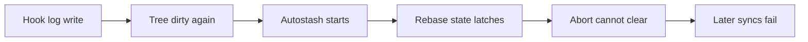

# State-sync rebase recovery — 2026-08-09

This dated record is the single source for the state-sync incident that began
on 2026-08-09 and for the repairs completed on 2026-08-11. The measured source
is `.claude/session_logs/hooks-errors.log`; phase plans and session logs retain
the implementation and review details.

## Measured evidence

The retained error log contains these incident signatures:

- 1 `Created autostash`
- 9 `already a rebase-merge` failures after the latch formed
- 5 earlier `Cannot rebase onto multiple branches` failures whose cause was
  not reproduced

The first two counts support the causal chain below. The third is historical
evidence only; it does not prove a cause.

## Causal chain

The state repository can write its own tracked hook logs while sync is running.
That made the tree dirty again after an earlier checkpoint. `git pull --rebase
--autostash` created an autostash commit and a `rebase-merge` directory, then
detected new unstaged changes and stopped. Git left a half-initialized directory
that contained the autostash marker but lacked the metadata needed by
`git rebase --abort`.

The old recovery command hid that failure with `2>/dev/null || true`. Each later
sync therefore encountered the same `rebase-merge` directory and stopped. The
warn-never-fail script still exited successfully at its public boundary, so the
latched state persisted while unpublished nested commits accumulated.

The failure sequence is:

## Why `--quit` is different

`git rebase --abort` tries to restore the pre-rebase branch and worktree. It
needs metadata such as `head-name`, which the observed half-initialized state
did not contain. It therefore could not clear that fixture.

`git rebase --quit` removes the rebase bookkeeping without moving `HEAD` or
restoring the worktree. The recovery now uses `--quit` only for the exact
observed pre-existing orphan shape: one regular, non-symlink `autostash` file
and no other rebase metadata. Valid or unknown operator rebase state is
preserved. Rebase state created by the current pull uses `--abort`, then
`--quit` only if abort fails.

## Preventing another latch

Sync now repeats the active-rebase preflight immediately before its local
checkpoint. It commits tracked log churn at that boundary and runs pull without
`--autostash`. A residual dirty-tree race can still make that pull fail, but it
fails before Git creates a rebase directory and can retry later.

The read-only `state-sync.sh status` command now reports `rebase: none` or
`rebase: in-progress`. This makes a latched state visible even though sync
remains warn-never-fail. The latch began at 10:35:57Z, the final repeated
failure was recorded at 11:31:53Z, and publication resumed at about 11:33:51Z:
approximately 58 minutes. Eleven unpublished nested commits corroborate the
impact during that interval.

## Refspec defence assumption

**ASSUMPTION — needs empirical verification:** legacy nested repositories with
wildcard fetch refspecs may have contributed to the five historical `Cannot
rebase onto multiple branches` errors. That cause could not be reproduced.
State sync now re-pins fetch and push refspecs to `ai-state` because this is the
correct single-branch contract regardless of whether it caused those errors.
Do not cite the historical errors as proof of that mechanism.

## Lifecycle record correction

The Graphify Phase 0 NO-GO exposed a separate lifecycle vocabulary gap. The
Graphify plan previously explained its inaccurate terminal state with this
sentence:

> `complete` is the only terminal status the frontmatter validator accepts.

The cancellation contract now records that result without fabricating six
phase closeouts. The Graphify big plan and never-authorized phases A through F
are cancelled against their existing Phase 0 evidence. Phase 0 remains
complete because it ran and produced the NO-GO result. No Graphify retry or
adoption work is scheduled.
