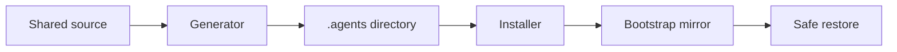
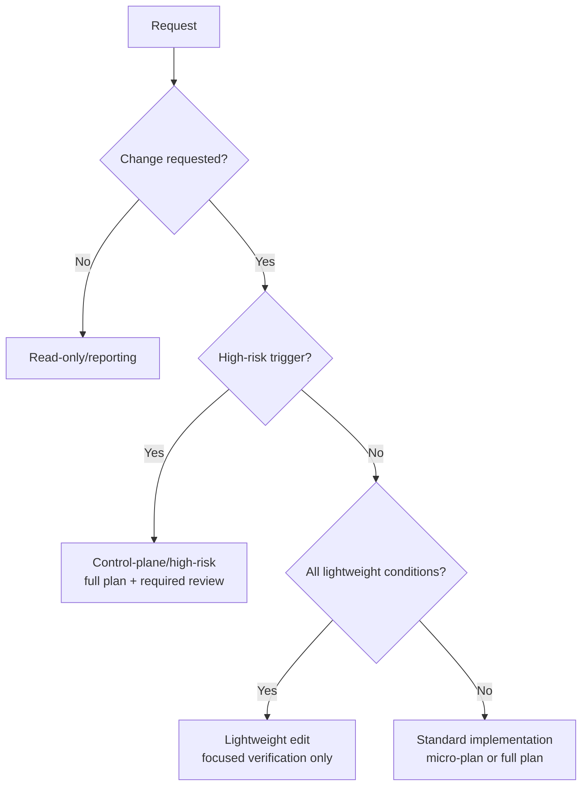
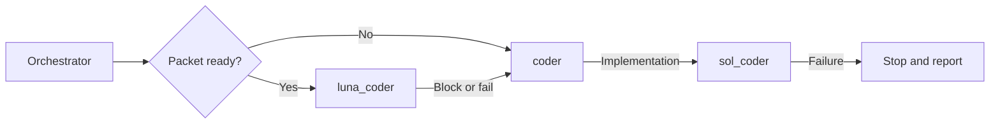

# Architecture

The bootstrap now uses a source-of-truth plus generated-target layout.

## Source Directories

`shared/` holds every canonical source a maintainer edits: `policies/`
(workflow, quality, code, testing, routing, and deployment guidance),
`skills/` (public and background skills), `third_party/ponytail/` (pinned
provenance and license), `hooks/` (config and guardrail scripts),
`devcontainer/` (the GPU devcontainer bootloader, including
`state-sync.sh`/`restore-root-adapters.sh`), `mcp/servers.json` (Semble,
Context7, and the filtered Context Mode server), `vscode/tasks.json`,
`agents/` (canonical custom-agent metadata and prompts), `review-profiles/`,
`prompts/`, `templates/`, `scripts/`, `MEMORY.md`, and `schemas/`. See
[Source, generated output, consumer repo, and nested AI
state](../openwiki/architecture/source-generated-consumer-layout.md) for
what each holds, who edits it, and the fixed render sequence
`scripts/generate_targets.py` runs over them.

Communication guidance is centralized in
[`shared/policies/agent-reporting.instructions.md`](../shared/policies/agent-reporting.instructions.md).
It selects audience-appropriate prose: clear, direct language for people and
optional compact `caveman full` handoffs between agents. The documenter also
performs a targeted `humanize edit` self-check on prose it changes. Generated
agent prompts point to this policy instead of copying its rules, while exact paths,
identifiers, commands, logs, and other evidence remain unchanged. This static
reporting guidance applies to all four supported targets. The generated
`reporting-reminder.sh` adds recurring prompt-start and selected late-turn
reminders only for Claude Code and OpenAI Codex.

### Policy applicability and native discovery

Policy scope is authored once in `shared/policies/` with target-neutral
frontmatter (`applicability: always` or an explicit path-pattern list), and
generation derives each target's native discovery adapter from it: Claude
Code conditional `.claude/rules/` with `paths`, Codex nested `AGENTS.md`
only where a policy owns a stable directory, and GitHub Copilot
`applyTo`-scoped instruction adapters. These are discovery adapters, not
editable policy copies, and structural parity is not itself proof that a
real client loaded one — runtime loading is probed separately by
`scripts/check_native_clients.py`. See [Source, generated output, consumer
repo, and nested AI
state](../openwiki/architecture/source-generated-consumer-layout.md)'s
"Policy discovery per host" for the full per-target mechanics, and
[Claude's rules documentation](https://code.claude.com/docs/en/memory) and
[Codex's AGENTS.md documentation](https://learn.chatgpt.com/docs/agent-configuration/agents-md)
for the native behavior each adapter follows.

## Generated Target

The full-install output is `dist/multi-agent/`.

It includes a trackable `.devcontainer/` GPU sandbox plus the `.claude/` shared basis for skills, instructions, review profiles, canonical agent bodies, prompts, memory, plans, explorations, session logs, quality reports, templates, third-party notices, and hook scripts — `.claude/` is itself a nested git repository (branch `ai-state`; see "Git-Backed State Sync" below). Native files outside `.claude/` are thin adapters or runtime config for GitHub Copilot, Claude Code, OpenAI Codex, and Google Antigravity. `.vscode/tasks.json` provides VS Code-native AI state sync that works independently of any AI tool session.

A second generated target, `dist/sidecar/`, sits beside `dist/multi-agent/`.
It renders the fixed, four-skill sidecar profile from `scripts/runtime_ownership.py`'s
`SIDECAR_SKILLS`, plus the two client bridges, with the bootstrap's own
remaining self-references rewritten so a sidecar file never names a path the
sidecar does not install. `scripts/install_bootstrap.py --mode sidecar`
copies from this target instead of `dist/multi-agent/`, into a repository
whose agent harness a team, not this bootstrap, owns. See [README.md's
Personal Sidecar Install](../README.md#personal-sidecar-install) and
[docs/target-mapping.md's Sidecar
Overlay](target-mapping.md#sidecar-overlay) for what it installs and how it
updates, and [docs/sidecar-provider-contract.md](sidecar-provider-contract.md)
for the per-client evidence behind it.

### Skill Library Validation Contract

`scripts/validate_targets.py`'s `validate_docs_parity` function is the single
gate for skill-library invariants, in the skill-frontmatter-integrity block
it has always owned; there is no second `validate_skills.py` gate. It
enforces only high-confidence, deterministic facts about
`shared/skills/*/SKILL.md` (the canonical authoring sources) and fails the
run when any is violated:

- frontmatter follows the gate's limited flat grammar: matched `---`
  delimiters; top-level `key: value` lines (with indented block-scalar
  continuations); no duplicate top-level keys; and no tab characters. The
  tab prohibition is a house rule, not a YAML requirement;
- frontmatter `name` matches the skill's directory name after normalizing its
  scalar value; matching single or double quotes and a trailing `#` comment
  do not change the result;
- `visibility` is a recognized normalized scalar value (`public` or
  `background`), so its matching quote style and trailing `#` comment do not
  change the result;
- public and background skills alike have a non-empty `description`;
- no two skills share an identical `description` (a duplicate breaks
  description-match loading of background skills);
- every `shared/skills/*` directory has a root `SKILL.md`;
- a backtick-quoted local reference that names a known repository root
  (`shared/`, `scripts/`, `docs/`, `tests/`, `.claude/`, `.github/`,
  `.codex/`, `.agents/`, or a same-directory `references/...` path) resolves
  to a real file. A bare illustrative filename with no such prefix (for
  example `pyproject.toml` in an example command) makes no repository-file
  claim and is intentionally not checked, nor is a glob/placeholder pattern
  (`**`, `[skill-name]`, `<skill-name>`). A small named-exception set covers
  paths that are legitimately consumer- or onboarding-populated rather than
  generated (for example `.claude/instructions/project-context.instructions.md`);
- generated targets stay synchronized with canonical sources. `validate_determinism`
  already proves this for the whole tree (a fresh `generate_targets.py --all`
  run must byte-match the current `dist/`), so the skill-integrity block does
  not repeat that check per skill.

Everything else about a skill is a semantic judgment, not a deterministic
fact, and is deliberately left to review and to the `deep-audit` skill's
advisory hygiene checks instead of this gate: a suspiciously broad public
trigger description, duplicated normative policy, an unconditional
full-repository read, an unqualified version-sensitive claim, a
project-specific benchmark or timing claim in shared guidance,
canonical-versus-generated ownership confusion in prose, or a stale
reference to a removed script, path, or lifecycle concept. Promoting one of
these to a hard rule here requires evidence that it is high-confidence and
false-positive-free across the current skill set, not just plausible.

Canonical `shared/skills/**` sources are hand-edited authoring inputs;
`.claude/skills/**` (and the sibling adapter roots under `dist/multi-agent/`)
are regenerated outputs of `scripts/generate_targets.py`. A skill body may
reference either root, but only the canonical root is ever hand-edited.

## Memory Authority and Privacy

`.claude/MEMORY.md` is the curated, portable project-memory authority. It is
tracked in the nested `ai-state` repository and available to every generated
target after state restoration. Record concise, reviewable facts that another
maintainer or client needs: stable workflow decisions, verified commands,
architecture constraints, and reusable lessons. The installer seeds it only on
a fresh consumer; existing consumer memory is preserved byte-for-byte during
install, update, and migration.

Client-native memory is a complementary local scratch layer, never the shared
authority. Claude Code documents auto memory as per-repository, machine-local
notes and leaves it enabled by default; users may manage it with `/memory`.
Codex can reuse locally stored context across sessions, but this bootstrap does
not depend on an undocumented path or format for that feature. Neither native
memory system is synchronized, generated, or automatically disabled here.

Only non-sensitive preferences and scratch may remain local. Passwords, API
tokens, confidential material, personal or customer-sensitive data, and
unredacted logs belong in approved protected data systems—never in shared or
native memory.
See [Claude Code's memory documentation](https://code.claude.com/docs/en/memory)
and [Codex Memories](https://learn.chatgpt.com/docs/customization/memories)
for their current client behavior.

Promote an item from local notes only after it is accurate, durable,
project-relevant, and safe to share with everyone who can read the AI-state
remote. Sanitize it first: remove credentials, personal data, private URLs,
customer content, and unredacted logs; keep that material only in an approved
protected data system. Non-sensitive transient preferences may remain in local
native memory. When shared and native notes conflict,
the reviewed `.claude/MEMORY.md` contract wins for repository behavior; correct
or remove the stale local note. A Git conflict in shared narrative state aborts
for a manual semantic merge—do not auto-resolve it merely to proceed.

This division complements, rather than replaces, project instructions:
`project-context.instructions.md` carries current project configuration,
`MEMORY.md` carries curated cross-session learning, and native memory may keep
only non-sensitive local scratch. The [security model](../SECURITY.md) defines the related
trust and credential boundaries.

## OpenWiki Knowledge Layer

OpenWiki is an optional, opt-in knowledge layer: repository-descriptive wiki
pages generated under `openwiki/**`. It is enabled only when a maintainer has
written `openwiki/INSTRUCTIONS.md`, a human-authored repository brief that
doubles as the deterministic enablement marker the hook guard checks.

Refresh is host-driven: the coding agent calls OpenWiki's own MCP tools
directly (see the `.claude/skills/knowledge-refresh/` skill for usage) — there is no
bootstrap-spawned process. OpenWiki's server writes `openwiki/**` and, at
`openwiki_begin` only, a managed block into root `AGENTS.md` and
`CLAUDE.md`. A hook guard, `openwiki-guard.sh pre|post`, snapshots both
adapters and the OpenWiki workflow-file path before `openwiki_begin` and
restores them byte-for-byte after; `mode: "update"` is the only mode it
allows, because `init` creates a scheduled workflow and replaces the wiki.
Automatic restore coverage differs by host: on Claude Code it is wired to
both `PostToolUse` and `PostToolUseFailure`, so a failed call still
restores; on Codex it is wired to `PostToolUse` and to the `Stop` hook, with
no automatic restore when the tool call itself errors, so the skill has the
agent run `openwiki-guard.sh post` manually right after `openwiki_begin`.
The guard's own module docstring documents the residual limits inherited
from the earlier runner design: a write outside this repository is
invisible to it, it covers only the two adapters and the workflow path, and
the agent's own writes stay governed by the existing `protect-files` hooks.
A commit-time check in `verify.py` is an independent backstop: it refuses a
commit that still carries the managed block, an untracked or newly staged
OpenWiki workflow file, or a tracked `openwiki/.run.json`, whether or not
the guard ran.

See `workspace.instructions.md`'s Knowledge Ownership section for the
authority contract: OpenWiki is derived context, never authority over
source, tests, or human-authored policy.

## Ponytail Integration

Ponytail `v4.8.4` is vendored at the portable skill layer rather than installed
as a per-user plugin. Every full-install target receives `.claude/skills/ponytail/`,
`.claude/skills/ponytail-review/`, and the upstream license/provenance; the
sidecar overlay ships the same two skills, with the same license notice, at
its own two write roots. The
`ponytail` skill is coder-time implementation discipline: once per coding task,
the coder applies `full` mode, then simplifies and re-verifies the changed
scope. It is not a standalone lifecycle phase. Minimality means fewer concepts,
dependencies, abstractions, layers, paths, and behaviors; clarity and
maintainability outrank physical line count.

The separate `ponytail-review` skill is a reviewer-facing checklist. The
unified reviewer selects the `ponytail` profile when the authoritative routing
table requires it: deterministic control-plane/high-risk, multi-file,
dependency, script, generator, or similarly complex work, or when the reviewer
identifies complexity expansion. An exemption is exactly one documentation OR
one mutable workflow-state file, only when no control-plane/high-risk condition
applies; every multi-file diff is high-risk. The metadata matrix is exact:
selecting the profile always emits `ponytail_reviewed: true` and a numeric
`ponytail_findings` count, while a new unselected report omits both. Optional
diffs can read compatible legacy `false`/`0` reports, but high-risk routing
requires true evidence. Ponytail findings use the ordinary gates: CRITICAL and
MAJOR both block the phase-completion commit, and a surviving MINOR needs an
explicit `disposition` and non-empty `reason` but is otherwise advisory. An
intermediate commit made while the phase is still in progress is not blocked
merely because an unresolved MAJOR exists. There is no special
zero-Ponytail-finding gate.

Do not edit `dist/` manually. Regenerate it with:

```bash
uv run python scripts/generate_targets.py --all
```

## Hook Dispatcher

GitHub Copilot, Claude Code, and OpenAI Codex hook commands route through
`shared/hooks/scripts/run-hook.sh`, which resolves the repository root and
then dispatches into the shared guard scripts under
`shared/hooks/scripts/`. Google Antigravity is the deliberate exception:
its static `.agents/hooks.json` adapter calls `antigravity-pretool.py`
directly because its documented payload and response protocol require a
Python bridge. Both routes converge on the same ordered Bash safety lane
and the same protected-file classifier. See [Hook dispatcher and guardrail
scripts](../openwiki/architecture/hooks-and-guardrails.md) for the full
`REPO_ROOT` resolution order, the per-target `PreToolUse` matcher groups,
and the hook error log locations.

### Target-native PreToolUse routing

Claude and Codex use target-native matcher groups to keep the safety lane
narrow: native edits to `protect-files.sh`, `Bash` to
`pretool-bash-guard.sh`, and the wildcard matcher to optional
`context-mode-dispatch.sh` observability only. `pretool-bash-guard.sh` runs
one ordered lane — protected files, dangerous Git, branch, commit, then PR
— and fails closed on any guard error or malformed output. See [Hook
dispatcher and guardrail
scripts](../openwiki/architecture/hooks-and-guardrails.md) for the exact
guard order and behavior.

### Google Antigravity safety boundary

Antigravity uses one named `bootstrap-safety` configuration with one
`PreToolUse` group whose matcher is `*`. The bridge requires valid JSON
object payloads and documented fields, emits exactly one JSON decision on
stdout, and writes diagnostics only to stderr. Unknown tools, malformed
input, missing Python or guard failures, malformed guard output, and
existing `ask` results deny by default because Antigravity has no approval
response in this bridge. The canonical guards retain command and mutation
protection, including symlink-safe path classification and
protected-source checks. The Antigravity adapter intentionally defines no
`PreInvocation`, `PostToolUse`, `Stop`, or `UserPromptSubmit` equivalence;
it does not claim lifecycle parity, and durable Git-hook/state-sync
behavior remains the existing cross-provider boundary.

### Google Antigravity adapters and ownership

The generator creates the Antigravity workspace surface from the same
canonical metadata and assets as the other adapters, and the installer
treats `.agents/` as a single bootstrap-owned root adapter, like `.codex/`,
with a pre-write takeover check that never silently adopts or deletes
consumer content. See [Agent roster, prompts, and the skill
library](../openwiki/architecture/agents-and-skills.md) for the roster
Antigravity renders and [Runtime
Checks](runtime-checks.md#google-antigravity-evidence-boundary) for the
external native-acceptance blocker.



## Task-Lane Routing

The Task Lanes table in `shared/policies/workflow.instructions.md` is the
single normative classifier — repository policy over the generated
bootstrap, not a claim that Codex, Claude Code, or Copilot applies these
thresholds natively. High-risk triggers take precedence over every other
lane, and a requested commit or PR always escalates past a lightweight
edit.



See [Task lanes and the enforced lifecycle](../openwiki/workflows/lifecycle-and-task-lanes.md)
for the full lane table, the audited commit-subject bypasses, and how the
orchestrator chooses between a micro-plan and a full plan.

## Lifecycle Enforcement

The canonical workflow is:

```text
PRE-FLIGHT -> BRANCH -> PLAN WHEN NEEDED -> IMPLEMENT -> VERIFY -> REVIEW -> CLOSEOUT -> COMMIT -> PUSH
```

Lifecycle hook scripts keep that workflow stateful: `enforce-branch-state.sh`
and `record-branch-state.sh` gate and record branch creation;
`enforce-commit-gate.sh` and `record-commit-closeout.sh` gate the commit
ceremony and advance the plan's current phase from the native `post-commit`
hook; `enforce-pr-gate.sh` gates the push and PR contract, including the
historical receipt-chain check across every completed phase;
`session-start-state.sh` and `stop-session-log-check.sh` provide reminders
for stale phase and session-log state. `verify.py closeout --persist`
refuses to write a receipt the terminal push gate could never accept when
the big plan is not yet retrievable from nested Git. See [Task lanes and
the enforced lifecycle](../openwiki/workflows/lifecycle-and-task-lanes.md)
for the full closeout sequence, the pause/cancel paths, and which rules
these hooks enforce mechanically versus policy text.

### Reporting reminders

`reporting-reminder.sh` is a short, warn-never-fail context reminder wired
only for Claude Code and OpenAI Codex, though the static reporting policy
applies to all four supported targets. Its current reminder is 183 bytes
and stays below the 200-byte ceiling. The reminder is deliberately not
periodic and does not rewrite output at `Stop` or inject at `PreCompact`.

### Deterministic verification and provenance

`shared/scripts/verify.py` is the authoritative verifier rendered into each
consumer's `.claude/scripts/verify.py`. `fast` runs cheap changed-Python
feedback only; `phase` runs the full measurement group and can persist a
reusable receipt; `closeout` reuses that receipt and persists the final
receipt that lifecycle gates consume rather than selecting a newest report
themselves. See [Deterministic verification: verify.py modes, receipts,
and findings](../openwiki/operations/deterministic-verification.md) for
the full receipt schema, `control_plane_provenance`, the findings report,
and the `gate` mode relations.

`protect-files.sh` invokes its bundled classifier directly with `python3`;
it does not use `uv run`, because protection must work before a project
environment exists. `git-protection.sh` remains a Bash guard. How far the
classifier reaches differs by rule: the hook paths and protected hook
configuration files that identify this repository's own guardrail setup
are scoped to this repository only, decided on the candidate's resolved
real path, while the credential-shaped rules (`.env*`, `uv.lock`,
`credentials*`, `.pem`/`.key`) reach any path, in this repository or any
other. A candidate whose real path cannot be resolved stays protected
rather than being allowed.

## Git-Backed State Sync

`.claude/` in each consumer is its own self-contained git repository on
branch `ai-state`, tracking both the bootstrap-controlled files and mutable
AI state, chosen over Hugging Face bucket mirroring, `git worktree`, or
committing state into code branches so that state can privately point at a
different remote and stay decoupled from the outer repo's worktree
bookkeeping. See [ADR-002](../plans/adr-002-git-backed-state-sync.md) for
the full rationale and rejected alternatives, and [Git-backed AI-state
sync](../openwiki/operations/git-backed-ai-state-sync.md) for
`state-sync.sh`'s `setup`/`pull`/`checkpoint`/`publish`/`push`/`status`
commands, the warn-never-fail contract, the root-adapter mirror, and where
each hook and git-hook path runs it.

## VS Code Tasks

`.vscode/tasks.json` (source: `shared/vscode/tasks.json`) provides AI state sync that works without an active AI tool session:

- **AI state: pull** — runs automatically on `folderOpen` (VS Code prompts once to allow automatic tasks). Pulls state silently in the background via `state-sync.sh pull`.
- **AI state: push** — run manually via `Tasks: Run Task` or a keyboard shortcut binding. It retains the compatible `state-sync.sh push` checkpoint-then-publish behavior.

These complement the AI SessionStart/Stop hooks, which retain the normal
pull/push flow for sessions in that consumer. For a guaranteed local boundary,
run `state-sync.sh checkpoint` explicitly before publishing later.

## Custom Agents

Custom agents are source-controlled under `shared/agents/<agent-id>/`: an
`agent.yaml` (metadata, capabilities, visibility, delegates, target
eligibility, prompt composition, and per-target model/effort intent) plus
one or more prompt bodies. The shared loader validates all metadata before
any target renders; `luna_coder` and `sol_coder` declare only
`openai-codex`, so they never generate a Claude or Copilot adapter.

The table below is the per-agent model and reasoning-effort matrix. `README.md`'s Agent
System section carries the same table because `scripts/validate_targets.py` requires it there; edit both
together, and the validator rejects a README copy that no longer matches the canonical
`model_intent` metadata:

| Agent | Claude model | Claude effort | Codex model | Codex effort |
| --- | --- | --- | --- | --- |
| orchestrator | session (`/model`) | session (`/effort`) | `gpt-5.6-sol` | `xhigh` |
| planner | `opus` | `xhigh` | `gpt-5.6-sol` | `xhigh` |
| reviewer | `sonnet` | `xhigh` | `gpt-5.6-sol` | `high` |
| coder | `sonnet` | `xhigh` | `gpt-5.6-terra` | `high` |
| documenter | `sonnet` | `medium` | `gpt-5.6-luna` | `medium` |
| luna_coder | — | — | `gpt-5.6-luna` | `xhigh` |
| sol_coder | — | — | `gpt-5.6-sol` | `xhigh` |

The orchestrator (main-thread persona) follows the session's model/effort
in Claude Code; Claude subagents inherit the session's extended-thinking
state, so there is no per-agent thinking knob. Codex's interactive root
session is intentionally unpinned in `.codex/config.toml`; every generated
`.codex/agents/*.toml` is self-contained with its own pinned model and
effort and does not read `.claude/agents/<id>.md` at runtime. Antigravity's
declared intents are Pro for orchestrator/planner/canonical
coder/reviewer and Flash for `antigravity_flash_coder`/documenter, with
one configured Flash-to-Pro escalation target — a static configuration
contract, not evidence of a backing model or native tier routing.

The Codex-only orchestrator supplement (`prompt.openai-codex.md`) adds an
experimental bounded-implementation route: for each approved step it
builds a packet and starts with `luna_coder` only when the outcome, code
locations, constraints, and verification are already clear, otherwise
`coder` directly.



The escalation graph is exactly `luna_coder -> coder -> sol_coder`; Sol has
no successor, and the route never retries or skips a tier. Before
automatic Terra-to-Sol recovery, the orchestrator classifies existing
verification/review evidence as `implementation`, `environment`,
`baseline`, or `indeterminate`, and only an implementation-attributable
failure advances automatically. See [Agent roster, prompts, and the skill
library](../openwiki/architecture/agents-and-skills.md) for how each
target renders an agent from this metadata, prompt-composition rules, and
review-profile routing, and the [dated Codex routing compatibility
record](2026-08-08-codex-routing-compatibility.md) for the `[features.multi_agent_v2]`
shim and `max_depth` removal gates.

## Design Decisions

- [ADR-001: Multi-target bootstrap over native per-platform packaging](../plans/adr-001-multi-target-lcd.md) — why this repo generates thin adapters for Copilot/Claude/Codex from one shared basis instead of shipping Claude-native plugin packaging, what that costs, and the trigger for revisiting it.
- [ADR-002: Git-backed AI state sync over object-storage mirroring](../plans/adr-002-git-backed-state-sync.md) — why `.claude/` is a nested git repository synced via `state-sync.sh` instead of Hugging Face bucket mirroring, and the `--state-remote` privacy trade-off.

The unified `reviewer` runs both review passes itself (a primary pass, then a verification pass that refutes the primary findings and drops any that do not survive), so it is a single-nesting-level operation that executes identically on every runtime — there are no separate review-helper agents. The orchestrator is the main-thread persona: it holds `edit`+`execute` and owns the branch/commit/PR and memory/session-log ceremony itself rather than delegating it. UI work goes through the `coder` (which loads the `gradio-streamlit` skill); there is no separate designer agent. Verification and findings/receipt persistence run through canonical lifecycle scripts, not a verifier agent.
