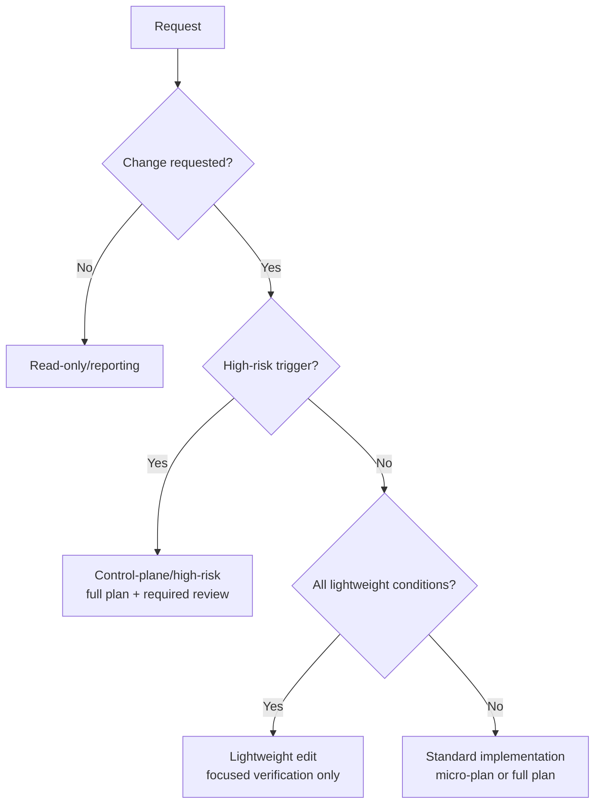
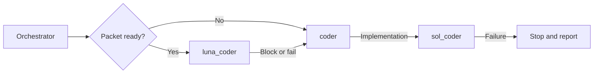

# Architecture

The bootstrap now uses a source-of-truth plus generated-target layout.

## Source Directories

- `shared/policies/`: reusable workflow, quality, code, testing, routing, and deployment guidance.
- `shared/skills/`: reusable skills with `visibility: public|background` metadata.
- `shared/third_party/ponytail/`: pinned Ponytail provenance and MIT license; portable skills live in `shared/skills/ponytail*`.
- `shared/hooks/`: hook config and guardrail scripts.
- `shared/devcontainer/`: GPU devcontainer bootloader. The `Dockerfile` uses a two-stage build: Node.js 22 binaries are copied from `node:22-bookworm-slim` into the NVIDIA CUDA DL base image (Ubuntu ships Node 18, which is too old for `context-mode`). `bubblewrap` and `context-mode` are installed so hook events work inside the container. `--cap-add=SYS_ADMIN` and `--security-opt=seccomp=unconfined` are required for bubblewrap namespace creation inside Docker. The `Dockerfile` also handles pre-existing GID/UID 1000 conflicts (GID guard by numeric ID; user rename via `usermod`/`groupmod` when UID is already taken). The devcontainer bind-mounts `~/.cache/huggingface` from the host so cached credentials and models are available without re-authenticating inside the container — used by the projects themselves, not by AI state sync (see [ADR-002](../plans/adr-002-git-backed-state-sync.md)). `post-start.sh` bootstraps AI state via `state-sync.sh`/`restore-root-adapters.sh`, both also rendered here (see "Git-Backed State Sync" below).
- `shared/mcp/servers.json`: shared MCP definitions for Semble, Context7, and Context Mode. Context Mode routes through `bash .claude/hooks/scripts/context-mode-dispatch.sh server`, which starts a public-stdio filter (`context-mode-mcp-filter.mjs`) in front of pinned Context Mode `1.0.169`. The filter advertises and allows exactly four tools — `ctx_index`, `ctx_search`, `ctx_stats`, `ctx_doctor` — and rejects every other tool, including any unknown one, before it reaches upstream. Guarded `ctx_index` accepts content, a contained regular file, or a contained real directory; directory-policy knobs remain fixed at the pinned upstream defaults. The `1.0.169` pin is enforced on both routes rather than only over MCP: hook mode verifies a direct `context-mode` executable against its owning package manifest before running it, and refuses any binary whose version is wrong or undeterminable, falling back to pinned `npx` when available. The dispatcher owns exactly one cache location, `.claude/.cache/context-mode`; a `CONTEXT_MODE_DIR` override is honoured only at or beneath that subtree, and any other value is refused while the bootstrap keeps its project-local cache boundary.
- `shared/vscode/tasks.json`: VS Code workspace tasks source. Rendered into `.vscode/tasks.json` by the generator. Contains two tasks: an auto-pull on `folderOpen` (runs `state-sync.sh pull` silently when the workspace opens) and a manual push task for non-AI sessions.
- `shared/agents/`: canonical custom-agent metadata and neutral prompts.
- `shared/review-profiles/`: checklists consumed by the unified `reviewer` agent.
- `shared/prompts/`: reusable prompt templates.
- `shared/templates/`, `shared/scripts/`, `shared/MEMORY.md`, and state README directories: source inputs rendered into the shared `.claude/` basis.
- `shared/schemas/`: schema documentation for shared metadata.

Communication guidance is centralized in
[`shared/policies/agent-reporting.instructions.md`](../shared/policies/agent-reporting.instructions.md).
It selects audience-appropriate prose: clear, direct language for people and
optional compact `caveman full` handoffs between agents. The documenter also
performs a targeted `humanize edit` self-check on prose it changes. Generated
agent prompts point to this policy instead of copying its rules, while exact paths,
identifiers, commands, logs, and other evidence remain unchanged.

### Policy applicability and native discovery

Policy scope is authored once in `shared/policies/` with target-neutral
frontmatter: `applicability: always` or an explicit list of repository-relative
patterns. The generator validates that minimal schema, installs every canonical
policy under `.claude/instructions/`, and derives native discovery adapters.
The adapters are not editable policy copies.

Claude Code is the primary scoped-policy implementation. A conditional policy
becomes `.claude/rules/<policy>.instructions.md` with equivalent YAML `paths`;
always-on policy stays in the concise root guidance. Claude natively loads
path-scoped rules when it reads a matching file, keeping unrelated guidance out
of context. [Claude's rules documentation](https://code.claude.com/docs/en/memory)
describes this behavior and its use alongside skills.

Codex is the other primary implementation. Its `AGENTS.md` guidance is
hierarchical: discovery runs from repository root to the current working
directory, and a closer file overrides earlier guidance. The default combined
project-document cap is 32 KiB. Therefore this bootstrap creates a nested
`AGENTS.md` only for a policy that owns a stable concrete directory; a mixed,
file-specific, or glob scope instead maps to an existing `.claude/skills/`
workflow. That avoids broadening scope or consuming Codex's combined guidance
budget. [Codex's AGENTS.md documentation](https://learn.chatgpt.com/docs/agent-configuration/agents-md)
is the source for this native behavior.

GitHub Copilot is secondary compatibility coverage. Its instruction adapters
derive `applyTo` from the same canonical patterns, and generation validates
their scope parity with Claude's `paths`. These structural checks do not claim
that a real client has loaded an adapter; runtime loading is probed separately
by `scripts/check_native_clients.py`.

## Generated Target

The single installable output is `dist/multi-agent/`.

It includes a trackable `.devcontainer/` GPU sandbox plus the `.claude/` shared basis for skills, instructions, review profiles, canonical agent bodies, prompts, memory, plans, explorations, session logs, quality reports, templates, quality scoring, third-party notices, and hook scripts — `.claude/` is itself a nested git repository (branch `ai-state`; see "Git-Backed State Sync" below). Native files outside `.claude/` are thin adapters or runtime config for GitHub Copilot, Claude Code, OpenAI Codex, and Google Antigravity. `.vscode/tasks.json` provides VS Code-native AI state sync that works independently of any AI tool session.

## Memory Authority and Privacy

`.claude/MEMORY.md` is the curated, portable project-memory authority. It is
tracked in the nested `ai-state` repository and available to every generated
target after state restoration. Record concise, reviewable facts that another
maintainer or client needs: stable workflow decisions, verified commands,
architecture constraints, and reusable lessons. The installer seeds it only on
a fresh consumer; existing consumer memory is preserved byte-for-byte during
install, update, and migration.

Client-native memory is a complementary local scratch layer, never the shared
authority. Claude Code documents auto memory as per-repository, machine-local
notes and leaves it enabled by default; users may manage it with `/memory`.
Codex can reuse locally stored context across sessions, but this bootstrap does
not depend on an undocumented path or format for that feature. Neither native
memory system is synchronized, generated, or automatically disabled here.

Only non-sensitive preferences and scratch may remain local. Passwords, API
tokens, confidential material, personal or customer-sensitive data, and
unredacted logs belong in approved protected data systems—never in shared or
native memory.
See [Claude Code's memory documentation](https://code.claude.com/docs/en/memory)
and [Codex Memories](https://learn.chatgpt.com/docs/customization/memories)
for their current client behavior.

Promote an item from local notes only after it is accurate, durable,
project-relevant, and safe to share with everyone who can read the AI-state
remote. Sanitize it first: remove credentials, personal data, private URLs,
customer content, and unredacted logs; keep that material only in an approved
protected data system. Non-sensitive transient preferences may remain in local
native memory. When shared and native notes conflict,
the reviewed `.claude/MEMORY.md` contract wins for repository behavior; correct
or remove the stale local note. A Git conflict in shared narrative state aborts
for a manual semantic merge—do not auto-resolve it merely to proceed.

This division complements, rather than replaces, project instructions:
`project-context.instructions.md` carries current project configuration,
`MEMORY.md` carries curated cross-session learning, and native memory may keep
only non-sensitive local scratch. The [security model](../SECURITY.md) defines the related
trust and credential boundaries.

## Ponytail Integration

Ponytail `v4.8.4` is vendored at the portable skill layer rather than installed
as a per-user plugin. Every target receives `.claude/skills/ponytail/`,
`.claude/skills/ponytail-review/`, and the upstream license/provenance. The
`ponytail` skill is coder-time implementation discipline: once per coding task,
the coder applies `full` mode, then simplifies and re-verifies the changed
scope. It is not a standalone lifecycle phase. Minimality means fewer concepts,
dependencies, abstractions, layers, paths, and behaviors; clarity and
maintainability outrank physical line count.

The separate `ponytail-review` skill is a reviewer-facing checklist. The
unified reviewer selects the `ponytail` profile when the authoritative routing
table requires it: deterministic control-plane/high-risk, multi-file,
dependency, script, generator, or similarly complex work, or when the reviewer
identifies complexity expansion. An exemption is exactly one documentation OR
one mutable workflow-state file, only when no control-plane/high-risk condition
applies; every multi-file diff is high-risk. The metadata matrix is exact:
selecting the profile always emits `ponytail_reviewed: true` and a numeric
`ponytail_findings` count, while a new unselected report omits both. Optional
diffs can read compatible legacy `false`/`0` reports, but high-risk routing
requires true evidence. Ponytail findings use the ordinary gates: CRITICAL
blocks commit, MAJOR blocks push/PR, and MINOR is advisory. There is no special
zero-Ponytail-finding gate.

Do not edit `dist/` manually. Regenerate it with:

```bash
uv run python scripts/generate_targets.py --all
```

## Hook Dispatcher

Claude, Codex, and Copilot hook commands route through
`shared/hooks/scripts/run-hook.sh`. Google Antigravity is the deliberate
exception: its static `.agents/hooks.json` adapter calls
`antigravity-pretool.py` directly because its documented payload and response
protocol require a Python bridge. The bridge invokes the canonical guards after
normalizing the payload. The shared dispatcher resolves `REPO_ROOT` in order:

1. `BASH_SOURCE[0]` relative navigation (primary — works when the script is called by path)
2. Environment variable fallbacks: `GITHUB_WORKSPACE`, `WORKSPACE_FOLDER`, `VSCODE_CWD`, `PWD`
3. `git rev-parse --show-toplevel` from the current directory

This fixes two real failure modes found in consumer repos:

- `$CLAUDE_PROJECT_DIR` being empty in Claude Code, producing paths like `/.claude/hooks/scripts/...`
- `$(git rev-parse --show-toplevel)` resolving to a different directory than the repo root when invoked from certain working directories

The generated Claude, Codex, and Copilot hook configs use the pattern:

```bash
REPO_ROOT="<root-expr>"; "$REPO_ROOT/.claude/hooks/scripts/run-hook.sh" <script> [args...]
```

Claude and Codex generated configs execute `run-hook.sh` directly. `scripts/generate_targets.py` therefore marks the generated dispatcher executable, and `scripts/validate_targets.py` treats a non-executable dispatcher as a structural failure.

Hook errors (from `state-sync.sh` and others) are written to `.claude/session_logs/hooks-errors.log` in addition to stderr, so failures are auditable after the fact.

### Target-native PreToolUse routing

Claude and Codex use target-native matcher groups to keep the safety lane narrow.
Claude sends `Edit|MultiEdit|Write` to `protect-files.sh`; Codex sends
`Edit|Write`. Both send `Bash` to `pretool-bash-guard.sh`, while the wildcard
matcher runs only optional `context-mode-dispatch.sh` observability. Read and
MCP tools have no mutation guard handler, so they do not incur a no-op safety
classification.

`pretool-bash-guard.sh` is one ordered Bash lane: `protect-files.sh`,
`git-protection.sh`, `enforce-branch-state.sh`, `enforce-commit-gate.sh`, then
`enforce-pr-gate.sh`. It returns the first deny/ask decision and fails closed
if a safety guard errors or produces malformed output. This avoids relying on
the target runtime's parallel execution order while leaving lifecycle wrappers
and wildcard observability independent.

### Google Antigravity safety boundary

Antigravity uses one named `bootstrap-safety` configuration with one
`PreToolUse` group whose matcher is `*`. The bridge runs with the Python 3.9
standard library and emits exactly one JSON decision on stdout; diagnostics go
to stderr. It allows the explicit documented non-mutating provider tools,
normalizes `run_command` into the canonical Bash guard, and normalizes write
tools into the canonical protected-file guard. Unknown tools, malformed
payloads, missing command or target fields, guard failures, and malformed guard
responses deny by default. Existing `ask` results also deny because this
provider has no approval response in the bridge.

The canonical guards retain command and mutation protection, including
symlink-safe path classification and protected-source checks. The Antigravity
adapter intentionally defines no `PreInvocation`, `PostToolUse`, `Stop`, or
`UserPromptSubmit` equivalence. It does not claim lifecycle parity; durable
Git-hook/state-sync behavior remains the existing cross-provider boundary.

### Google Antigravity adapters and ownership

The generator creates the Antigravity workspace surface from the same canonical
metadata and assets as the other adapters. The installer treats `.agents/` as a
single bootstrap-owned root adapter, like `.codex/`. The consumer `.gitignore`
therefore has one `.agents/` entry, while the nested state mirror uses
`.claude/bootstrap-root/.agents/` and the ordinary `BOOTSTRAP_ROOT_PATH=.agents`
record.


`AGENTS.md` is provider-neutral guidance shared by Codex and Antigravity.
Antigravity structurally receives six roles: the five universal roles plus
`antigravity_flash_coder`; Codex-only `luna_coder` and `sol_coder` do not
render. The native default agent is the Antigravity main thread and reads its
orchestration contract from root `AGENTS.md`. All custom adapters set
`mainAgent: false`; the five specialists set `subagent: true`, and the custom
`orchestrator` sets `subagent: false`. The declared Flash-to-Pro coder handoff,
model tiers, specialist MCP inheritance, shared skills, and MCP configuration
are static contracts. They are not native loading, routing, escalation, skill,
or MCP-use proof.

An existing `.agents/` tree must pass a pre-write takeover check. The installer
accepts only current generated bytes, a byte-matching prior
`.claude/bootstrap-root/.agents/` mirror, or strictly validated legacy
Antigravity evidence. Unknown, modified, unsafe, non-regular, or unproved
content blocks before any filesystem, nested-state, ignore, or Git mutation and
reports sorted paths with instructions to back up or move the content, remove
it only if intended, and rerun. It never silently adopts or deletes consumer
content. After migration, there is no Antigravity per-file allowlist or manifest;
the directory-level root record is the only ownership contract. Rules are
deferred because no verified serialized activation schema exists. The external
native-acceptance blocker is documented in [Runtime Checks](runtime-checks.md#google-antigravity-evidence-boundary).

## Task-Lane Routing

The Task Lanes table in `shared/policies/workflow.instructions.md` is the
single normative classifier. It is repository policy over the generated
bootstrap, not a claim that Codex, Claude Code, or Copilot applies these
thresholds natively. Target-native instructions and agents refer back to that
one table instead of defining competing lane rules.



High-risk triggers take precedence: control-plane, security,
dependency/lockfile, migration, multi-file, user-data, generator, and script
changes always use the full orchestrated lane. A lightweight edit requires an
explicit request, exactly one non-control-plane file, low risk, no high-risk
impact, and no requested commit or PR. For example, correcting one explicit
README typo can be lightweight; changing a hook or requesting a commit cannot.

Standard implementation covers every remaining requested change, including all
commit- or PR-bound work. The orchestrator chooses a micro-plan only for an
obvious, one-phase standard change; ambiguous, multi-phase, and new-module work
uses a full plan. A lightweight edit is not a micro-plan and creates no
lifecycle artifacts. An explicit request or approved plan is enough authority
for a known high-risk change; only unclear targets, authority, or material scope
require clarification.

The audited `fixup!`, `squash!`, `chore(typo):`, and `docs(typo):` bypasses are
recovery exceptions, not lane classification or a safety exemption. The
existing branch, commit, and PR gates remain unchanged; the bypasses retain the
branch-shape check and require acknowledgement before PR or push closeout.

## Lifecycle Enforcement

The canonical workflow is:

```text
PRE-FLIGHT -> BRANCH -> PLAN WHEN NEEDED -> IMPLEMENT -> VERIFY -> REVIEW -> CLOSEOUT -> COMMIT
```

Lifecycle hook scripts keep that workflow stateful without mutating during validation hooks:

- `enforce-branch-state.sh` runs before branch commands and validates clean `dev`, branch naming, and big-plan metadata. It recognizes `git checkout -b`, `git checkout -B`, `git switch -c`, `git switch -C`, `git switch --create`, and `git switch --create=<branch>` forms.
- `record-branch-state.sh` runs after successful branch creation and records `originating_branch`, `implementation_branch`, `started_at`, and `current_phase`.
- `enforce-commit-gate.sh` keeps two paths. A normal completion commit requires completed small-plan metadata, completed closeout logs, `[LEARN]` evidence, and a fresh score >= 90 report for the current branch and phase; the report must also match `base_ref`, merge-base SHA, current HEAD SHA, `tests_passed: true`, `dirty: false`, a repo-relative target, and a matching `content_hash`. An explicit pause checkpoint is separate: it requires valid pause evidence and real outer work, creates no empty outer-repository commit, does not advance the phase, and does not require final score, findings, LEARN, DOCUMENT, or `**Status:** COMPLETED` closeout. `in-progress` and `cancelled` phases still cannot certify commits. The report selection, content-hash freshness, tokenized Git classification, and nested `ai-state` exemption remain as documented by `_lib-frontmatter.sh`; compound commands are checked per Git invocation.
- `record-commit-closeout.sh` runs after successful commits and advances the big-plan phase or marks the big plan complete only after the intercepted commit subject correlates with `HEAD`. `commit_subject_from_command` tokenizes the command (honoring quotes) to read `-m`/`--message`/`-F <file>`/`--file=<file>`; `-F -`/`--file=-` (message piped via stdin) has no subject the hook can read from the command string alone, so it leaves a clear `additionalContext` note naming the supported forms and pointing at manual phase advancement instead of silently skipping the phase advance with no explanation.
- `enforce-pr-gate.sh` blocks PRs or pushes unless every phase is complete or fully evidenced as cancelled, at least one phase is complete, the base is `dev`, and bypass commits have been acknowledged. Commit counts include completed phases only, and findings bind to the last completed phase. It exempts nested `.claude/` pushes (`state-sync.sh push`) the same way and with the same per-invocation scoping as the commit gate above.
- `session-start-state.sh` and `stop-session-log-check.sh` provide reminders for stale phase, score, and session-log state.

Bypass commit prefixes `fixup!`, `squash!`, `chore(typo):`, and `docs(typo):` are allowed for short-lived recovery work, but they skip only the plan-ceremony checks (small-plan/closeout/score/LEARN) — branch-shape validation still runs, so a bypass commit off a non-`*_implementation` branch is still denied. Bypasses are logged and must be acknowledged before PR or push.

`protect-files.sh` invokes its bundled classifier directly with `python3`; it
does not use `uv run`, because protection must work before a project environment
exists. `python3` is therefore a required safety dependency: if it is absent,
the hook fails closed. `git-protection.sh` remains a Bash guard. A classifier
error, incomplete redirect, in-place edit without a determinable target, or
ambiguous shell segment also fails closed. Classification is target-aware per
segment rather than a whole-command heuristic, so a proven read-only
protected-config inspection is allowed while mutations through native tools,
redirects, `sed -i`/`perl -i`, and mutating commands remain protected. Copy,
install, and move operations include both source and destination operands in
the protection check, preventing a protected source file from being copied out
through a write-bearing command; unknown command syntax with a protected literal
is denied rather than guessed.

`git-protection.sh` scans a possibly-chained Bash command for destructive git subcommands (`reset --hard`, `push --force`, `checkout --`, `clean -fd`, deleting `main`/`master`). Because `_shell_tokenize` drops shell operators (`;`/`|`/`&`) as mere separators, the flattened token stream for `git clean -f && ls -d /tmp` has no trace of the `&&` — scanning "does -d appear anywhere after clean" would misattribute `ls`'s unrelated `-d` to `git clean`, denying a wholly benign command (and the same shape misattributes an unrelated later `--force` to an earlier `git push`). `git_danger_reason` bounds each invocation's argument scan to `_unquoted_operator_boundary` — the point right before the next unquoted operator — so a later chained command's flags can never bleed into an earlier invocation's danger check, while a real danger later in the same chain (`git status && git reset --hard`) is still caught on its own invocation.

The direct Python classifier normalizes repository-relative and absolute paths.
For an opaque or interpreter-style command that is not on the proven read-only
list, conservative protected-literal detection covers `.env*`, `uv.lock`,
`credentials*`, names containing `secret`, `.pem`/`.key` files, every
`.github`/`.claude`/`.codex` hook path, and the protected Claude/Codex hook
configuration files. It does not claim all unfamiliar commands are mutations:
an unfamiliar command is denied only when it carries one of those protected
literals, while syntax that prevents safe parsing fails closed. This prevents
bypasses such as `cp app/secrets/db_secret.txt other/` and false confidence in
an unfamiliar interpreter or archive command, while the explicit read-only
command set remains inspectable.

## Git-Backed State Sync

`.claude/` in each consumer is a plain, self-contained git repository (its own `.git/` inside `.claude/`), tracking both the bootstrap-controlled files and mutable AI state (`MEMORY.md`, `plans/**`, `explorations/**`, `session_logs/**`, `quality_reports/**`) on one branch, `ai-state`. The outer consumer repo gitignores `.claude/` entirely, so the nested repo is invisible to the code branches. See [ADR-002](../plans/adr-002-git-backed-state-sync.md) for the full rationale and the alternatives it replaced (Hugging Face bucket mirroring, `git worktree`, committing state into code branches) — `git worktree` in particular was rejected, not overlooked: a worktree must belong to the same repository as its parent, which would rule out pointing state at a different remote (the `--state-remote` privacy escape) and would couple the state checkout to the outer repo's worktree bookkeeping.

**This is a genuinely separate repository, not a branch of the outer one — plain `git branch`/`git log` run at the consumer root will never show `ai-state` or its commits.** Inspect it with `git -C .claude <command>` (e.g. `git -C .claude branch`, `git -C .claude log --oneline`), or `cd .claude` first. Looking for `ai-state` with the outer repo's own `git branch -a` and finding nothing is expected, not a sign that the sync failed.

`shared/hooks/scripts/state-sync.sh` (pure bash, no `uv`/Python) implements seven subcommands. It drains stdin with the same two-second timeout as the old helper. `setup`, `pull`, `checkpoint`, `publish`, `push`, and `migrate-from-hf` remain warn-never-fail for hook compatibility and emit operational diagnostics on stderr; only `status` deliberately writes its stable report to stdout.

- **`setup`** — idempotent. If `.claude/.git` is missing: `git init`, resolve and configure the remote (`AI_STATE_REMOTE` / `--state-remote` at install time, else the outer repo's own `origin`), commit whatever is already on disk (there is always something — at minimum this script itself), then reconcile with `origin/ai-state` via `git merge --allow-unrelated-histories` if it already exists remotely (a real merge, not a bare checkout, so it combines file-by-file instead of refusing to overwrite untracked files that are about to converge anyway). A genuine conflict aborts the merge and warns, leaving the local commit as the source of truth.
- **`pull`** — records local nested changes, then reconciles committed state with `origin/ai-state`. On conflict, it aborts cleanly and leaves local files intact.
- **`checkpoint`** — initializes local nested Git state if needed and commits local AI state as the durable boundary. It performs no remote Git operation, including no fetch, `ls-remote`, pull, merge, or push.
- **`publish`** — sends already committed state only. It never stages or commits; if the nested worktree is dirty, it warns and preserves that uncheckpointed state. From a clean worktree it reconciles with `origin/ai-state`, then pushes; repeated clean publication is a no-op. With `--local-only`, it skips remote interaction without mutation.
- **`push`** — the backward-compatible composition: checkpoint, then publish. Existing SessionStop, post-commit, and VS Code task wiring continues to use it.
- **`status`** — read-only and network-free. It reports whether the nested repository is initialized, its clean/dirty worktree state, remote configuration without exposing its URL, and cached tracking ahead/behind information when available. It also reports the existing error-log path and the last state-sync error; it never fetches or exposes credentials.
- **`migrate-from-hf`** — one-way, explicit: if `.claude/` has content but no `.claude/.git` yet, initializes it, commits everything on disk as `migrate: import pre-git state`, then reconciles and publishes when safe. No automatic pull from the retired Hugging Face bucket occurs; the local tree is the source of truth at migration time. `install_bootstrap.py` invokes this before replacing generated files.

Bootstrap updates land as `bootstrap:`-prefixed commits (made by `install_bootstrap.py` through the updater); session state lands as `session:`-prefixed commits when a consumer's Stop hook runs the normal push flow. The commit log on `ai-state` cleanly separates the two — `git -C .claude log --stat` is a full audit trail of what every session and every bootstrap update changed, something the old bucket mirror had no equivalent of.

**Multi-writer conflict policy.** `init_nested_repo` writes a `.gitattributes` into the nested `.claude/` repo alongside its `.gitignore`. Append-only machine logs matching `session_logs/*.log` get git's built-in `merge=union` driver, so two sessions appending different lines to the same log auto-reconcile during rebase instead of conflicting. Narrative state — `plans/**`, `MEMORY.md`, and session-log prose — intentionally keeps the default conflict-and-abort behavior, so a genuine divergence there still stops for a manual semantic merge rather than being silently resolved ours/theirs. Both files are written by `init_nested_repo` at nested-repo init, so this policy reaches every fresh nested `.claude/` repo the same way the existing `.gitignore` does — not just repos created before this policy existed.

**Durable checkpoints vs. best-effort hooks.** `checkpoint` is the explicit network-free local durability boundary. Post-commit continues to invoke compatible `push`, which attempts checkpoint then publication. Runtime-specific Stop paths are best-effort: they run only when the runtime emits the event, and closing a browser tab or editor window is not guaranteed to do so. Run `checkpoint` explicitly when local durability matters before a later `publish`; the hooks remain warn-never-fail, so sync trouble never blocks a session or outer-repo commit.

**Runtime lifecycle boundaries.** Matching Stop handlers can run concurrently, so Codex and Claude each use one sequential wrapper. Both continue after a child failure; checkpointed local commits remain available for a later retry, with failures recorded in `.claude/session_logs/hooks-errors.log` and inspectable through `state-sync.sh status`.

| Runtime | Turn-scoped Stop | Prompt retry | Failure/end boundary |
| --- | --- | --- | --- |
| Codex | [`codex-stop.sh`](../shared/hooks/scripts/codex-stop.sh): log, check, checkpoint, publish; one JSON stdout response | `push`, 60 seconds | Delayed best-effort SessionEnd: local `checkpoint`, 3 seconds, no publication |
| Claude CLI / VS Code | [`claude-stop.sh`](../shared/hooks/scripts/claude-stop.sh): log, check, checkpoint, publish; no stdout | `push`, 60 seconds | StopFailure: local `checkpoint`; SessionEnd: `push`, 60 seconds |

Claude VS Code bundles the Claude runtime and reads the same generated `.claude/settings.json` as the CLI; no second settings adapter exists. Post-commit and the manual **AI state: push** VS Code task remain the durable checkpoint-and-publish paths.

**Codex for VS Code trust.** `.codex/hooks.json` is a project hook surface
whose trust is bound to its content/hash. A direct install or per-consumer batch
update can therefore require review and renewed approval. Reopen/reload the
repository in Codex for VS Code and approve the project hooks when prompted;
the installer reports this requirement but never approves hooks or changes
user trust settings. A dry run only previews that possible action and does not
claim to have changed hook content.

Both human CLIs push by default after a complete refresh. Their `--local-only`
mode still refreshes all bootstrap-controlled files and creates durable nested
commits, including ordered `migrate:` then `bootstrap:` commits for a legacy
consumer, but has a hard remote-I/O boundary: it performs no fetch,
`ls-remote`, pull, merge, or push. The installer prints nested status and a
shell-quoted manual `state-sync.sh push` command so publication is deliberate.

`state-sync.sh` and `restore-root-adapters.sh` (which copies `.claude/bootstrap-root/` — the root-level adapter files that live outside `.claude/`, such as `CLAUDE.md`/`AGENTS.md`/`.mcp.json`/`.codex/**` — back out to the repo root) are rendered in two locations: `.claude/hooks/scripts/` for normal use, and `.devcontainer/` so `post-start.sh` has a copy it can run before `.claude/` exists at all on a fresh clone.

`MEMORY.md` is single-homed as a tracked file in `.claude/`, evolving via `session:`/`bootstrap:` commits like everything else — no separate bundle or restore-order dependency the old bucket split required.

## VS Code Tasks

`.vscode/tasks.json` (source: `shared/vscode/tasks.json`) provides AI state sync that works without an active AI tool session:

- **AI state: pull** — runs automatically on `folderOpen` (VS Code prompts once to allow automatic tasks). Pulls state silently in the background via `state-sync.sh pull`.
- **AI state: push** — run manually via `Tasks: Run Task` or a keyboard shortcut binding. It retains the compatible `state-sync.sh push` checkpoint-then-publish behavior.

These complement the AI SessionStart/Stop hooks, which retain the normal
pull/push flow for sessions in that consumer. For a guaranteed local boundary,
run `state-sync.sh checkpoint` explicitly before publishing later.

## Custom Agents

Custom agents are source-controlled under `shared/agents/<agent-id>/`.

Each agent contains:

- `agent.yaml`: stable metadata, capabilities, visibility, delegates, target
  eligibility, prompt composition, and per-target model/effort intent.
- `prompt.md`: target-neutral behavior for a normal agent or prompt base.
- `prompt.openai-codex.md`: an optional Codex-only supplement. Derived agents
  use it with `prompt_base` instead of copying the base `prompt.md`.

The shared loader validates all metadata before any target renders. Omitted
`targets` means all supported targets, which keeps the five universal agents
eligible for GitHub Copilot, Claude Code, and Codex. `luna_coder` and
`sol_coder` explicitly declare only `openai-codex`, so they never generate a
Claude or Copilot adapter. The loader also rejects empty, duplicated, unknown,
or model-inconsistent targets. Copilot model fields are target bindings, not
portable semantics. GitHub Copilot agent `model` fields must be one supported
Copilot model string. Claude and Codex adapters must not include Copilot model
pins.

The Claude Code target carries per-agent model and reasoning-effort tiers. Each `agent.yaml` sets `model_intent.claude-code` to an object (`{ "model": ..., "effort": ... }`); the generator emits matching `model:` and `effort:` frontmatter on each `.claude/agents/*.md`, skipping `inherit` values so the orchestrator (main-thread persona) follows the session. Effort-heavy roles run on the stronger model (planner `opus`/`xhigh`, reviewer and coder `sonnet`/`xhigh`, documenter `sonnet`/`medium`). Verification runs through canonical lifecycle scripts rather than a dedicated agent. **Extended thinking is intentionally not configured per agent**: Claude Code subagents inherit the session's thinking state, so there is no per-agent knob to set.

Agent names are identical wherever an agent is eligible; the generator performs
no per-target renaming. Codex agents are project-scoped
`.codex/agents/*.toml` files. Each file is self-contained: a generated metadata
header is followed by the exact target-transformed role body, and the agent does
not read `.claude/agents/<id>.md` at runtime. A normal role body is its own
`prompt.md`, optionally followed by exactly one derived role-supplement
delimiter and its Codex supplement. A derived role body is exactly one
target-transformed base `prompt.md`, the same delimiter, and its supplement.
The loader permits only one inheritance level, rejects self-reference,
multi-level inheritance, cycles, missing bases or supplements, duplicate
delimiters, and supplements that copy the complete base prompt.

`agent.yaml` remains the source for metadata, eligibility, composition, and
model intent; the Codex prompt is derived output, not a second editable role
definition. The root Codex session is intentionally unpinned in
`.codex/config.toml`, leaving the user free to choose the interactive model and
effort. The five universal Codex agents are orchestrator Sol/xhigh, planner
Sol/xhigh, reviewer Sol/high, coder Terra/high, and documenter Luna/medium.
The two Codex-only agents are `luna_coder` Luna/xhigh and
`sol_coder` Sol/xhigh. Agent files omit per-agent MCP and skill overrides and
inherit the trusted project's registrations. Structural size measurements are
observability only; no official per-agent instruction-size cap is asserted.
The dated 2026-08-09 native evidence covers the historical six-role matrix, not
the two newly declared specialists. Future optional persistent-thread probes
may exercise the current seven Codex roles, but this feature does not require a
native run. Claude and Copilot retain their existing five-agent output.

The orchestrator's own `prompt.openai-codex.md` is also target-scoped. It adds
the experimental bounded implementation policy only to the generated Codex
orchestrator; Claude and Copilot keep their existing behavior. For every
approved step, the orchestrator builds a packet containing the goal and
plan-step identity, relevant code or failures, constraints, rejected approaches
when relevant, required skills, acceptance criteria, verification commands,
and freedom to choose the smallest maintainable implementation. It chooses
`luna_coder` only when five conditions establish a clear outcome, known code
locations, known constraints, objective verification, and no unresolved
architecture, interface, root-cause, migration, security, or ownership
decision. Otherwise it chooses `coder` directly.

The named Codex route is shown below. Every tier has a fixed model in its own
self-contained agent TOML; spawning does not supply a model or effort override.



Before editing where possible, `luna_coder` validates the packet. If it cannot
proceed, it returns only a prompt-enforced object with `status`, one of six
exact `reason` values, `workspace_changed`, `evidence`, and `needed`. This is a
handoff contract, not a native typed protocol. If Luna changed the workspace,
`coder` inspects the current diff and preserves useful prior work instead of
restarting blindly. The declared escalation graph is exactly
`luna_coder -> coder -> sol_coder`; Sol has no successor, and the route never
retries or skips a tier.

Before automatic Terra-to-Sol recovery, the orchestrator classifies the
existing verification commands/results and reviewer findings as exactly one of
`implementation`, `environment`, `baseline`, or `indeterminate`. Only an
implementation-attributable failure advances automatically. Environment and
baseline failures stop model escalation and are reported. Indeterminate
evidence returns to orchestrator judgment with no automatic escalation. A
verification failure alone is not implementation attribution, and the orchestrator
must not invent evidence. `visibility: hidden` on the two specialists is an
internal orchestration convention, not a native Codex invisibility guarantee.
Optional `initial-coder`, `fallback`, and `reason` facts may use an existing
closeout or session log; they do not introduce telemetry, a token tracker, a
new artifact, or a gate.

Codex skills are wired through `[[skills.config]]` entries in `.codex/config.toml` whose `path` points at each skill's `SKILL.md` file; the config omits the redundant flat `[features]` block (hooks are on by default), uses the documented `agents.max_concurrent_threads_per_session = 6`, and does not restate the enabled-by-default `agents.enabled`. It retains `max_depth = 1` independently and sets `hide_spawn_agent_metadata = false` with `tool_namespace = "agents"` so named model/effort profiles are selectable. Measured against Codex 0.147.0 on 2026-08-09, `tool_namespace` has **no observable effect** — the collaboration tools are exposed as `collaboration.spawn_agent`, `followup_task`, `send_message`, `interrupt_agent`, `list_agents`, and `wait_agent`, with nothing under `agents.*`. Named routing was nonetheless verified correct with the block present, so this records an inert key, not a removable shim. The [dated compatibility record](2026-08-08-codex-routing-compatibility.md) distinguishes the historical 0.144.x runtime result, local alpha parsing evidence, and current official documentation; static validation protects the configuration, while native probes remain the only removal gate for the shim or `max_depth`. Routing itself was verified on 2026-08-09 with the shim present; the shim-removed candidate is still untested.

## Design Decisions

- [ADR-001: Multi-target bootstrap over native per-platform packaging](../plans/adr-001-multi-target-lcd.md) — why this repo generates thin adapters for Copilot/Claude/Codex from one shared basis instead of shipping Claude-native plugin packaging, what that costs, and the trigger for revisiting it.
- [ADR-002: Git-backed AI state sync over object-storage mirroring](../plans/adr-002-git-backed-state-sync.md) — why `.claude/` is a nested git repository synced via `state-sync.sh` instead of Hugging Face bucket mirroring, and the `--state-remote` privacy trade-off.

The unified `reviewer` runs both review passes itself (a primary pass, then a verification pass that refutes the primary findings and drops any that do not survive), so it is a single-nesting-level operation that executes identically on every runtime — there are no separate review-helper agents. The orchestrator is the main-thread persona: it holds `edit`+`execute` and owns the branch/commit/PR and memory/session-log ceremony itself rather than delegating it. UI work goes through the `coder` (which loads the `gradio-streamlit` skill); there is no separate designer agent. Verification and score persistence run through canonical lifecycle scripts, not a verifier agent.
