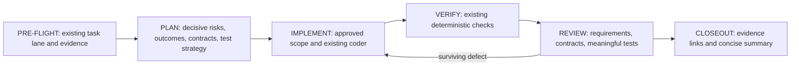

# Implementation Design

**Status:** Proposed; source-supported gaps are in [the investigation](README.md).

## One Existing Lifecycle

Branch creation, plan approval, commit, push, and PR authorization retain
their current places in the canonical policy. The diagram emphasizes the
engineering steps; it does not replace the full lifecycle.

### PRE-FLIGHT and PLAN

Reuse the supplied evidence packet and approved decisions. Ask only about
material unresolved choices. A lightweight task does not gain a spec,
traceability table, spike, or extra approval by default.

For complex work, establish success evidence before splitting phases:

1. Identify assumptions that could invalidate the design. Resolve from
   existing code/docs first, then use a bounded experiment where needed.
   Specify question, observable result, stop condition, and remaining limits.
   A scratch experiment never authorizes production changes.
2. Use the existing requirements template when a separate spec helps; an
   equivalent section in the big plan is enough. Preserve user decisions.
3. Cite existing contracts and expected failure/compatibility behavior.
4. Identify critical tests, negative cases, real integration boundaries,
   independent expected values, and criteria with no available verification.
5. Decompose phases and check the requirement mapping for gaps or conflicts.

Use optional stable requirement IDs when references span artifacts; simple
tasks need neither IDs nor a separate specification.
Do not recycle an ID to mean something different. Requirement changes follow
the existing material-scope decision process; do not edit completed evidence.

Suggested optional table, maintained in one place:

| Requirement | Acceptance and existing contract | Owning phase | Implementation | Evidence |
| --- | --- | --- | --- | --- |
| REQ-001 | User-observable behavior; source/symbol | phase slug | Intended module, later actual symbol | Test/probe ID; later result/log/receipt link |

The approved plan/specification and approved scope changes own required
behavior. Identify their versions in handoffs; an approved change supersedes
the affected original requirement without rewriting historical evidence.
Small plans reference IDs where present rather than duplicating requirements.
The session log records completion links;
it need not rewrite the table or copy receipt output beyond today's rules.
Deferred/untestable rows stay explicit. A valid Markdown table is not proof
of satisfaction and gets no new deterministic gate.

### IMPLEMENT, VERIFY, and REVIEW

Coder handoffs include the requirement/contract references. A changed
interface, extra feature, or failed decisive assumption is reported through
the existing scope-change route. The coder does not silently rewrite the
approved requirements to match its implementation.

Keep executable commands under `## Verification` and human/native-session
observations under `## Optional Verification`. Keep receipt and findings
schemas intact. Missing required executable evidence remains FAIL or
UNVERIFIED under the current contract. An unavailable optional observation
must limit the claim of completion for the affected behavior.

The existing reviewer receives the approved plan/specification, approved
scope-change records, relevant IDs when present, contracts, scoped diff, and
verification evidence. Review against these authoritative artifacts, not a
reconstructed interpretation or a newly preferred design. Surface ambiguity
or missing authority through the existing clarification route; do not invent
requirements. Existing correctness/security obligations still apply under
their own policy authority. Its normal passes ask:
Does every in-scope behavior have implementation and evidence? Is there
unapproved scope? Is a test expected value derived from the implementation?
Does the original bug reproduction now produce the expected behavior?

Return gaps using the ordinary finding fields and existing severity profiles;
put a requirement ID in a title/location when useful. Missing material
functionality is an ordinary correctness finding, not a new convergence
status. Style omissions alone must not be escalated into missing behavior.
The reviewer remains read/search-only. The orchestrator/coder run requested
tests or bounded negative controls and give back the evidence.

### CLOSEOUT and Learning

Use one short phase-boundary update: objective; completed scope; deviations;
verification with evidence links; open findings; any decision needed; next
operation. This is a view of existing artifacts, not a new persistent report.
Do not request approval when the next operation is already authorized.
Only an explicit user request activates the existing `paused` contract.

For a substantive observed failure, the existing log records reproduction,
cause, smallest correction, and regression evidence. LEARN routes the
durable lesson: code/test enforcement where possible, an existing skill
when reusable, or project memory for non-rederivable rationale. First check
whether the existing model/instructions already produce the desired behavior.
No automatic new rule per failure and no mandatory classification schema.

## Bounded Evaluation Pilot

### Existing machinery to reuse

Use `scripts/check_native_clients.py` for process limits, marker-owned
workspace checks, client isolation, versions, and controlled result output.
Keep `FROZEN_PLANNER_WORKLOADS`, `PLANNER_WORKLOAD_SCHEMA`, and the current
`--planner-workloads` behavior/results unchanged. Its existing candidate is
a shim-removal experiment; do not repurpose it as a general A/B workspace.

The proposed separate `--behavioral-workloads` option is a **new bootstrap
CLI option**, justified after inspecting `parse_args`, `prepare_workspace`,
`planner_workload_result`, and `build_report`. It is not a claimed vendor
flag. It runs only the new pilot workloads and version/preflight checks;
do not silently launch the older acceptance runs as well. Reject ambiguous
combinations with the old workload flag. Use existing provider command
shapes where the evidence phase confirms them. Do not introduce an SDK,
persistent-thread protocol, external judge, or plugin architecture.

### Three initial cases

Create small authored packets under `tests/fixtures/behavioral/`. Stage or
copy only the packet into the prepared model-readable workspace. Keep the
expected answers and scorer outside that workspace and omit them from the
supplied context. Read-only execution limits writes; it does not establish
that every host path is unreadable. Record the actual read boundary in the
evidence phase. An observed read of oracle/scorer material invalidates the
run; absent read events leave oracle non-access unverified. Do not claim
adversarial isolation from the working-directory layout alone. All cases
are read-only.

| Case | Packet and task | Independent expected result | Observable behavior |
| --- | --- | --- | --- |
| Ambiguous retention | A request to expire records, with no retention period or definition of eligible records; current code does not settle those choices. Ask for a plan. | Two material questions remain unresolved; no chosen period or deletion implementation is approved. A matched control supplies both answers and should need no repeated interview. | A returned question/action artifact grounded in the missing fields, no writes, no invented deletion policy. Assess the actual artifact; do not ask the agent to rate its own restraint. |
| Missing requirement coverage | Approved requirements for rejecting invalid input, preserving order, and retaining duplicates; a supplied phase plan covers only the first two and the code drops duplicates. Ask for consistency review. | The duplicate-preservation requirement lacks implementation and a regression check. Repaired, valid-alternative, and approved-scope-change controls must follow their approved authority rather than inventing requirements. | Correct requirement reference and cited approved scope/code/plan evidence; no extra component proposal. Expected gap IDs are not included in the prompt or result schema. |
| Weak regression test | A tiny function must reject a negative value; a generated test asserts only non-None output and passes with a broken implementation. Ask for test review. | The test fails to establish rejection. The corrected test fails against the planted broken variant and passes against the good variant, as the host verifies offline. | Identification of the missing behavioral assertion and an appropriate failure-case test. Reviewer execution is not required; the host owns the negative-control run. |

Use structured result fields to carry **task outputs**, such as questions,
requirement references, and issue locations. The host compares them with
independent fixture truth. Transport validity and behavioral correctness are
separate. Natural-language explanations are checked with a small human
rubric when a deterministic semantic check is inappropriate; do not compare
whole response strings or call an LLM judge a deterministic oracle.

For exposed tool events, derive only allowlisted indicators such as relevant
artifact read, attempted forbidden write, and observed check outcome. Keep
raw events in memory only and discard them after extraction. Missing event
coverage is `unobserved`, never zero calls or an inferred PASS. A correct
task answer does not prove a file was read. Preserve these as separate
result dimensions. Unknown event formats stop the relevant measurement.

### Scoring and replayable evidence

Phase A freezes scenario inputs, independent oracles, the initial human
rubric, and the capture format before baseline collection. Preserve every
attempt's bounded synthetic-fixture task output and allowlisted observations
in companion evidence files under `docs/evidence/engineering-behavioral/`.
Scores alone are insufficient. Phase B implements and validates the evaluator
against that frozen evidence and independent controls, then freezes the final
scorer implementation and rubric before any Phase C workflow change.

Each attempt records a stable run/case/control/repetition ID, scenario and
oracle revision hashes, capture format, task-output/evidence hashes, bootstrap
source revision and generated-bundle identity, UTC date, provider/client and
version, requested model and reasoning effort, observed model/effort when
exposed, permission mode, duration, and exposed usage counts. Record missing
metadata as unknown; never infer that requested and observed settings match.
Each scoring result references the input hashes, scorer/rubric revision, and
any human judgment. Keep the human rubric separate from automated checks.

Retain the complete bounded task answer used for scoring, including explanatory
text needed by the rubric, rather than a lossy summary or self-score. Save
normalized event indicators only where Phase A demonstrates their meaning.
Do not persist provider transcripts, raw events, credentials, user paths,
raw commands, environment dumps, or unrelated model text. Map fixture paths
to case-local identifiers without altering scored meaning. If safe retention
would remove evidence needed for replay, mark it unavailable for that check;
do not silently score a sanitized substitute. Preserve bounded safe malformed
task payloads where possible, otherwise retain the invalid-output reason.
Legacy modes retain their existing raw-output disposal behavior.

Replay baseline and candidate evidence through the **same final scorer** and
rubric. Append versioned results; never overwrite original observations or
baseline judgments. A changed scorer requires revalidation and rescoring both
saved sets under a newly frozen revision. Never compare old baseline scores
with new candidate scores. If a later check needs uncaptured evidence, mark
it unobserved/unscorable for the affected attempt instead of inferring it.

Distinguish three conclusions:

- Offline parser/scorer tests passed: deterministic implementation evidence.
- The agent produced a correct task output: fixture-specific behavioral result.
- A required action was observed: event-based execution evidence.

No conclusion implies the others. Keep unavailable runs (missing client,
timeout, unsupported transport), invalid outputs (malformed, duplicate, or
oracle-contaminated), missing observations, and scored behavioral failures
separate. A valid answer with missing events can have an output verdict while
its action evidence stays unobserved. Neither missing nor invalid evidence
becomes a behavioral PASS or FAIL. Existing deterministic gate results remain
authoritative and untouched.

### Cost, comparison, and baseline

Freeze packets and expected results in Phase A, validate/freeze the evaluator
in Phase B, then change workflow guidance and evaluate the candidate in Phase C.
Start with one installed, trusted provider and three repetitions of each
case: nine primary runs per revision. Run matched controls once each as
measurement checks. Additional approved-change/valid-alternative variants
are offline controls within the coverage case, not extra primary scenarios
or native runs. A second provider is optional and scored separately.
No automatic retries, provider/model switching, or escalation of effort.
Retain every attempt in the attempt totals, with separate counts for valid
scored outputs, behavioral failures, invalid outputs, unavailable runs, and
missing observations. State the denominator of each rate. Missing evidence
must not inflate a score or be pooled into behavioral failures.

With the runner's existing 420-second limit, nine primary attempts have a
63-minute timeout ceiling per provider/revision, plus up to 21 minutes for
three controls and setup. These are ceilings, not measured costs. Use one
explicitly bounded wave first; record actual time/usage before expanding.
Do not estimate token prices from memory or claim cost savings without data.

Compare Phase A's saved baseline and Phase C's candidate using the same final
Phase B scorer, scenario/oracle revisions, provider, model, reasoning effort,
client/runtime, and permissions. Use separately prepared workspaces from
recorded source revisions and generated bundles. The intended workflow change
explains their source/bundle differences; identify unrelated source drift or
unknown/changed comparison settings explicitly as confounding factors.
Measurement code is held fixed and outside the task's supplied context.
Do not claim a matched improvement for a confounded or unreplayable comparison.
The existing shim-control/candidate pair is not
the baseline/candidate pair for this experiment. Report per-case counts,
false positives on controls, missing evidence, time, and usage. Nine primary
runs are a diagnostic pilot, not statistical proof or a provider leaderboard.

The evidence phase first establishes the real transport for each selected
provider using existing commands and a small scratch packet. If it cannot
observe a capability, mark it unobserved and narrow the pilot. Do not write
a new provider adapter around an assumed event format. If no provider can
produce the bounded task outputs, Phase B's native extension waits; the
planner may revise only that affected future scope.

### Existing and deferred scenarios

Protected writes, incomplete receipts, and sidecar team preservation already
have real deterministic hook/verifier/Git tests. Reuse them instead of paying
for model runs to re-prove enforcement. Prompt restraint about unnecessary
infrastructure is included in the coverage case. Context recovery already
has policy and native-probe evidence classes, but robust interruption/resume
evaluation needs a persistent session; defer it. Writable agent E2E and
sidecar state-write evaluation belong to the existing native/provider work
and separate sidecar repair, not this read-only pilot.

## Risks and Alternatives

| Risk | Decision |
| --- | --- |
| Additional prose slows simple tasks | Scope new sections to material uncertainty/complexity; matched clear-task control measures over-questioning. |
| Agent can guess fixture answers without doing requested work | Keep the oracle outside its workspace, use repaired controls, and separate correct output from observed actions. Do not promise intent detection. |
| Native schema or permissions differ by provider/version | Phase A evidence first; supported observations only. No privilege changes to rescue a measurement. |
| Requirement IDs turn into a second state machine | Optional Markdown only; no new frontmatter parser, receipt fields, or auto-created tasks. |
| Reviewers mistake alternative designs for deviations | Approved plan/spec and approved changes are authority; include valid-alternative and approved-change controls within the coverage case. |
| Scorer changes make apparent improvements incomparable | Preserve task outputs; freeze the evaluator before workflow changes; replay both sets through the same final scorer and report confounding. |
| Large multi-file policy change is hard to review | Four phases: evidence, evaluator, workflow/candidate evaluation, required final knowledge refresh. Measurement changes precede changes to the measured workflow. |
| New workflow text conflicts with sidecar repair | Rebase on its final path/content choices. Keep this work out of installer state migration and discovery changes. |

## Devil's Advocate Result

CHANGE the initial idea of a new behavioral framework: extend the existing
runner. CHANGE mandatory traceability into optional complex-task guidance.
CHANGE convergence from an append-tasks operation to the existing read-only
review and scoped fix loop. INVESTIGATE native transport and baseline
behavior before adding provider-specific measurement. ACCEPT the limits of
a small, non-gating pilot and human judgment for semantic output. REJECT a
new agent, evaluator dependency, generalized mutation engine, or receipt gate.
