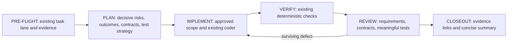

# Implementation Design

**Status:** Proposed guidance changes; based on `dev` at `1626364` after
sidecar repair PR #43. See [the investigation](README.md) and the separate
[optional behavioral pilot](behavioral-evaluation-pilot.md).

## One Existing Lifecycle

Branch creation, plan approval, commit, push, and PR authorization retain
their current places in the canonical policy. The diagram emphasizes the
engineering steps; it does not replace the full lifecycle.

### PRE-FLIGHT and PLAN

Reuse the supplied evidence packet and approved decisions. Ask only about
material unresolved choices. A lightweight task does not gain a spec,
traceability table, spike, or extra approval by default.

For complex work, establish success evidence before splitting phases:

1. Identify assumptions that could invalidate the design. Resolve from
   existing code/docs first, then use a bounded experiment where needed.
   Specify question, observable result, stop condition, and remaining limits.
   A scratch experiment never authorizes production changes.
2. Use the existing requirements template when a separate spec helps; an
   equivalent section in the big plan is enough. Preserve user decisions.
3. Cite existing contracts and expected failure/compatibility behavior.
4. Identify critical tests, negative cases, real integration boundaries,
   independent expected values, and criteria with no available verification.
5. Decompose phases and check the requirement mapping for gaps or conflicts.

Use optional stable requirement IDs when references span artifacts; simple
tasks need neither IDs nor a separate specification.
Do not recycle an ID to mean something different. Requirement changes follow
the existing material-scope decision process; do not edit completed evidence.

Suggested optional table, maintained in one place:

| Requirement | Acceptance and existing contract | Owning phase | Implementation | Evidence |
| --- | --- | --- | --- | --- |
| REQ-001 | User-observable behavior; source/symbol | phase slug | Intended module, later actual symbol | Test/probe ID; later result/log/receipt link |

The approved plan/specification and approved scope changes own required
behavior. Identify their versions in handoffs; an approved change supersedes
the affected original requirement without rewriting historical evidence.
Small plans reference IDs where present rather than duplicating requirements.
The session log records completion links;
it need not rewrite the table or copy receipt output beyond today's rules.
Deferred/untestable rows stay explicit. A valid Markdown table is not proof
of satisfaction and gets no new deterministic gate.

### IMPLEMENT, VERIFY, and REVIEW

The orchestrator already requires plan requirements and non-goals for every
delegation. Align that general rule with the reviewer-specific handoff and
the reviewer's own input list, and explicitly require comparison against the
approved requirements and scope changes. This closes an instruction mismatch;
it does not introduce requirement handoffs from nothing.

Coder handoffs include the requirement/contract references. A changed
interface, extra feature, or failed decisive assumption is reported through
the existing scope-change route. The coder does not silently rewrite the
approved requirements to match its implementation.

Keep executable commands under `## Verification` and human/native-session
observations under `## Optional Verification`. Keep receipt and findings
schemas intact. Missing required executable evidence remains FAIL or
UNVERIFIED under the current contract. An unavailable optional observation
must limit the claim of completion for the affected behavior.

The existing reviewer receives the approved plan/specification, approved
scope-change records, relevant IDs when present, contracts, scoped diff, and
verification evidence. Review against these authoritative artifacts, not a
reconstructed interpretation or a newly preferred design. Surface ambiguity
or missing authority through the existing clarification route; do not invent
requirements. Existing correctness/security obligations still apply under
their own policy authority. Its normal passes ask:
Does every in-scope behavior have implementation and evidence? Is there
unapproved scope? Is a test expected value derived from the implementation?
Does the original bug reproduction now produce the expected behavior?

Return gaps using the ordinary finding fields and existing severity profiles;
put a requirement ID in a title/location when useful. Missing material
functionality is an ordinary correctness finding, not a new convergence
status. Style omissions alone must not be escalated into missing behavior.
The reviewer remains read/search-only. The orchestrator/coder run requested
tests or bounded negative controls and give back the evidence.

### CLOSEOUT and Learning

Use one short phase-boundary update: objective; completed scope; deviations;
verification with evidence links; open findings; any decision needed; next
operation. This is a view of existing artifacts, not a new persistent report.
Do not request approval when the next operation is already authorized.
Only an explicit user request activates the existing `paused` contract.

For a substantive observed failure, the existing log records reproduction,
cause, smallest correction, and regression evidence. LEARN routes the
durable lesson: code/test enforcement where possible, an existing skill
when reusable, or project memory for non-rederivable rationale. First check
whether the existing model/instructions already produce the desired behavior.
No automatic new rule per failure and no mandatory classification schema.

## Focused Verification

Phase A updates guidance and adds small checks in the existing
`tests/test_validate_targets.py`. Check the meaning of required clauses in
shared source and generated full/sidecar output: approved requirements and
scope changes are supplied and used in review, original symptoms are checked
after fixes, and separate specifications/IDs remain optional. Avoid complete
prose snapshots or a dependency on one exact sentence.

Existing plan, hook, verifier, and sidecar tests protect current contracts.
A small reviewed example can explain investigating a technical uncertainty;
an unspecified user preference is a different problem, resolved by clarification.
Neither examples nor instruction-presence tests are evidence of improved
model behavior. No model calls, new evaluator, or native baseline belong to
this plan.

## Preserve the Merged Sidecar Repair

PR #43 is already merged. Workflow state stays under `.ai-bootstrap/`.
Planner and reviewer agents return text; the caller saves it under
`.ai-bootstrap/plans/` or `.ai-bootstrap/quality_reports/`. Preserve the
read-only specialist boundary and the existing caller persistence path.

Adapt guidance in existing workflow role prompts, rules, and templates.
Do not add a specification unit, new hook, receipt, mandatory branch,
or commit gate. Team instructions retain precedence; missing specialists
retain the existing fallbacks and honest self-review label. Skills-only
sidecars keep their current unit set. Provider discovery and installer
repair are outside this plan.

## Separate Optional Evaluation

The earlier combined proposal is superseded. The immediate plan has two
phases: guidance with deterministic checks, then the required knowledge
refresh. REQ-006 is explicitly deferred to the separate optional proposal.
It does not block delivery and is not marked complete by text checks.

Before building that pilot, demonstrate that each case detects its intended
defect. For the reviewer, supply the approved plan with an ordinary code-review
request; do not say “check requirements” or “consistency review” in the task,
because that would supply the instruction being tested. Verify which role
instructions the client actually loads. A deliberately broken versus correct
handoff tests handoff sensitivity; a reviewer instruction change also needs
a check that exercises the reviewer with the same supplied requirements.
These are separate claims.

Any later before/after comparison must use one runner and scorer against two
recorded source versions. Preserve task outputs and basic run identity, and
report invalid/missing results separately. Further details and unresolved
choices belong to the optional proposal rather than the immediate phases.

## Risks and Decisions

| Concern | Decision |
| --- | --- |
| More instructions burden simple work | Keep specifications, IDs, extra investigation, and clarification conditional. |
| Reviewer substitutes its own desired design | Approved requirements and approved scope changes are authority; existing correctness/security policy still applies. |
| Text checks are mistaken for behavior evidence | Claim only instruction presence, consistency, generation, and preserved contracts. |
| Guidance changes regress the sidecar repair | Keep `.ai-bootstrap/`, caller-saved outputs, team precedence, and relaxed semantics. |
| Measurement work delays useful guidance | Defer it; require a useful broken-versus-correct check before investing in a runner. |
| Later results reflect test-prompt hints instead of changed guidance | Use ordinary task requests and verify actual role loading before comparison. |

The independent reviewer, deterministic verification authority, and existing
closeout process remain intact. No new agent, state machine, dependency,
model judge, or automatic behavior gate is proposed.
