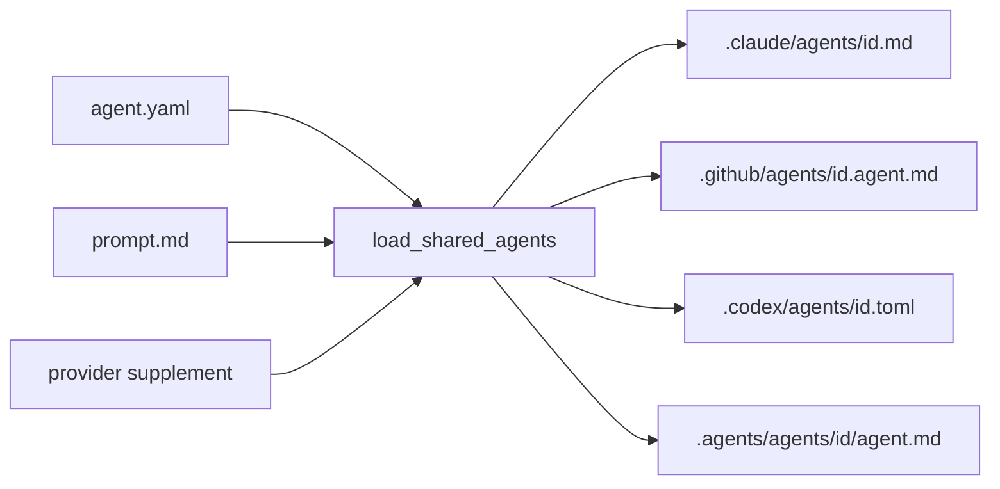

# Agent roster, prompts, and the skill library

Source, tests, and the policies under `shared/policies/` outrank this page.

Every agent is defined once under `shared/agents/<id>/` and rendered into a native adapter for each host it is eligible for. Skills live once under `shared/skills/` and are copied to every host the same way. The generator does the rendering, and the target validator refuses output that breaks the contract.

## How one agent definition becomes four adapters

This diagram shows what the generator reads for one agent and what it writes per host.

An agent directory holds two kinds of file:

- `agent.yaml`, which holds JSON metadata despite its name: `id`, `description`, `role_type`, `visibility`, `capabilities`, optional `delegates`, optional `targets`, optional `prompt_base`, and a `model_intent` object.
- One or more prompt bodies: a canonical `prompt.md`, or a provider supplement named `prompt.openai-codex.md` or `prompt.google-antigravity.md`.

The generator's `load_shared_agents` parses every `agent.yaml`, validates it, requires unique ids, and checks prompt composition before anything renders. That validation is code, not policy: a bad metadata file stops generation.

## The metadata contract

`validate_agent_metadata` in `scripts/generate_targets.py` enforces these rules:

- Unknown fields are rejected.
- `id`, `description`, `role_type`, and `visibility` are required. `visibility` is `public` or `hidden`.
- `capabilities` come from a fixed vocabulary (`read`, `search`, `edit`, `execute`, `delegate`, `todo`, and a few more).
- `delegates` must be stable agent ids.
- `model_intent` must have an entry for exactly the targets the agent is eligible for, no more and no fewer.
- An agent that omits `targets` is eligible for all four hosts. One that lists them is rendered only there.

## The roster

Five canonical agents are eligible everywhere and each has its own `prompt.md`.

| Agent | Role | Visibility | Note |
| --- | --- | --- | --- |
| `orchestrator` | main-thread lifecycle driver | public | the only agent with `delegates`: `planner`, `coder`, `reviewer`, `documenter` |
| `planner` | phased implementation plans | hidden | |
| `coder` | implementation and focused verification | hidden | its Codex `model_intent` names `sol_coder` as the escalation target |
| `reviewer` | profile-driven review in two passes | hidden | |
| `documenter` | README and docs updates | hidden | |

Three more agents exist for one provider each and are derived from `coder` through `prompt_base`:

- `luna_coder` and `sol_coder` for `openai-codex`.
- `antigravity_flash_coder` for `google-antigravity`.

A derived agent has no `prompt.md`. It carries only its provider supplement, and the generator composes the base prompt plus the supplement at render time.

## Prompt composition rules

Composition is one level deep, and `validate_prompt_composition` enforces it. The generator refuses:

- a `prompt_base` that points at itself, at a missing agent, or at an agent that itself has a `prompt_base`;
- a derived agent that also ships a `prompt.md`;
- an empty supplement;
- a supplement that contains the whole transformed base prompt, so a supplement cannot silently fork the canonical text;
- a supplement file on a canonical agent for a provider that agent is not eligible for.

## What each host receives

- **Claude Code.** `render_claude_agents` writes `.claude/agents/<name>.md` with `name`, `description`, a `tools` list derived from `capabilities`, and optional `model` and `effort` from `model_intent["claude-code"]`. The body is the canonical prompt with target path rewrites.
- **GitHub Copilot.** `render_github_agent_adapter` writes a thin pointer: frontmatter with `name`, `description`, tools, an `agents:` list from `delegates`, `user-invocable: false` for hidden agents, and `disable-model-invocation: true` for the orchestrator. The body tells Copilot to read the canonical `.claude/agents/<name>.md`. An agent not eligible for Claude Code gets a self-contained body instead.
- **OpenAI Codex.** `render_codex_agent_adapter` emits TOML with `name`, `description`, optional `model` and `model_reasoning_effort`, a `sandbox_mode` derived from capabilities, and the composed prompt as `developer_instructions`.
- **Google Antigravity.** `render_antigravity_agent_adapter` writes `.agents/agents/<id>/agent.md` with `mainAgent: false`, `subagent: true` for every agent except the orchestrator, the provider model, and `inheritMcp: true` for subagents.

## Review profiles

The `reviewer` carries no checklists in its prompt. It loads one or more profiles from `shared/review-profiles/`, each with its own `## Severity` section, then runs a primary pass and a verification pass that tries to refute each finding. It repeats until a pass changes nothing, at most three rounds.

The ten profiles are `api`, `architecture`, `code`, `config`, `documentation`, `domain`, `performance`, `ponytail`, `security`, and `tests`.

Which profiles apply is decided by the routing table in `shared/policies/workspace.instructions.md`, not by the reviewer:

- Hooks, scripts, generators, and control-plane code always get `code`, `architecture`, `security`, `tests`, and `ponytail`.
- Ponytail review is mandatory for every control-plane or high-risk diff and every multi-file diff. The commit gate enforces this by requiring `ponytail_reviewed=true` in the findings report for such diffs.
- Ponytail is optional only for a single low-complexity documentation file or a single workflow-state file.

## The skill library

Skills live under `shared/skills/<name>/SKILL.md`. At the time of writing there are 55: 40 with `visibility: public` and 15 with `visibility: background`.

- Public skills are invoked by name.
- Background skills are loaded by matching their `description`, which is why two skills may not share a description.
- `shared/templates/skill-template.md` is the starting shape: `name`, `visibility`, `description`, an optional `argument-hint`, then Problem, Trigger Conditions, and Solution sections.

Two skills are special:

- `ponytail` and `ponytail-review` are adapted third-party skills. The validator requires them to ship, stay public, and keep `license: MIT`, with the upstream LICENSE and provenance under `.claude/third_party/ponytail/`. The workflow policy requires the coder to apply `ponytail` in `full` mode once per coding task.
- `humanize` adapts the third-party `avoid-ai-writing` skill. The generated target must expose only `humanize`, never the upstream name.

### How skills reach each host

- Claude Code: `copy_skills` copies `shared/skills/` into `.claude/skills/` and rewrites target paths inside `.md`, `.py`, and `.sh` files.
- Codex: `.codex/config.toml` gains one `[[skills.config]]` entry per skill, each pointing at `../.claude/skills/<name>/SKILL.md`.
- Antigravity: a plain copy of the tree under `.agents/skills/`.

There is one library, rendered three ways.

### What the validator enforces on skills

`shared_skill_integrity_errors` in `scripts/validate_targets.py` treats these as hard failures:

- every skill directory has a root `SKILL.md` (`SKILL_MISSING_ROOT`);
- frontmatter is flat YAML with matched `---` delimiters, no tabs, and no duplicate keys (`SKILL_FRONTMATTER_INVALID`);
- frontmatter `name` equals the directory name (`SKILL_NAME_MISMATCH`);
- `visibility` is `public` or `background`, and `description` is non-empty and unique across the library;
- a backtick-quoted path naming a known repository root or a `references/` path must resolve to a real file (`SKILL_BROKEN_REFERENCE`). Bare filenames and glob patterns are not checked.

`validate_skills_and_paths` adds the target-level checks: the generated skill count equals the shared count, the Ponytail and humanize contracts hold, and the generated documenter prompt still references `humanize`. Semantic skill quality is left to the `deep-audit` skill on purpose.

## Representative tests

`tests/test_validate_targets.py` covers the agent loader's refusals (invalid target scope, non-object metadata, prompt-base cycles, copied base prompts, supplements on ineligible providers), target-scoped rendering (a Codex-only agent renders only to Codex; a GitHub-only agent embeds its prompt), the exact Codex coder specialist metadata, and the stale-skill contract checks.

## Related pages

- [Source, generated output, consumer repo, and nested AI state](/openwiki/architecture/source-generated-consumer-layout.md)
- [Task lanes and the enforced lifecycle](/openwiki/workflows/lifecycle-and-task-lanes.md)
