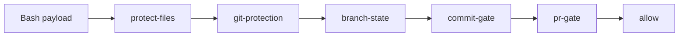

# Hook dispatcher and guardrail scripts

Source, tests, and the policies under `shared/policies/` outrank this page.

All guardrail logic lives in `shared/hooks/scripts/` and is installed into a consumer as `.claude/hooks/scripts/`. Each host has its own hook configuration, generated by `scripts/generate_targets.py`, and all of them call the same scripts. The guards deny or ask before a tool call runs; a second layer of real Git hooks re-checks commits and pushes that reach Git by any path.

## One script tree, four hook configurations

| Host | Hook configuration | How it reaches the scripts |
| --- | --- | --- |
| GitHub Copilot | `.github/hooks/hooks.json` (copied from `shared/hooks/hooks.json`) | `run-hook.sh <script> [args]` |
| Claude Code | `.claude/settings.json` | `run-hook.sh <script> [args]` |
| OpenAI Codex | `.codex/hooks.json` | `run-hook.sh <script> [args]` |
| Google Antigravity | `.agents/hooks.json` | `antigravity-pretool.py`, a Python bridge that normalizes the payload and calls the same guards |

`run-hook.sh` is the dispatcher. It finds the repository root in this order: its own location, then `GITHUB_WORKSPACE`, `WORKSPACE_FOLDER`, `VSCODE_CWD`, or `PWD`, then `git rev-parse --show-toplevel`. It then runs `.claude/hooks/scripts/<name>` under `/bin/bash`.

- A missing script name exits 2, which denies the tool call on hosts that key blocking on exit status.
- A missing script file only warns and exits 0, so a partial install degrades instead of blocking every call.

## What runs on each event

Claude Code and Codex share this shape:

- **SessionStart**: `state-sync.sh pull`, `session-log.sh`, `session-start-state.sh` (reports the active plan and phase), `context-mode-dispatch.sh sessionstart`.
- **PreToolUse**, split by matcher so the safety lane stays narrow: `Edit|Write` runs `protect-files.sh`; `Bash` runs `pretool-bash-guard.sh`; `*` runs only the optional `context-mode-dispatch.sh`; the MCP tool `mcp__openwiki__openwiki_begin` runs `openwiki-guard.sh pre`.
- **PostToolUse** on `Bash`: `record-branch-state.sh`, `context-mode-dispatch.sh`, `reporting-reminder.sh late-report`. On `openwiki_begin`: `openwiki-guard.sh post`.
- **Stop**: one ordered wrapper, `claude-stop.sh` or `codex-stop.sh`, runs session logging, the log freshness check, `state-sync.sh checkpoint`, then `state-sync.sh publish`. A failing child is logged and skipped, never fatal.

Two per-host differences matter:

- Claude Code fires `PostToolUseFailure` when an MCP tool returns an error, so `openwiki-guard.sh post` is wired there too.
- Codex fires nothing on an MCP tool error, so its Stop also runs a payload-free `openwiki-guard.sh post`. Codex additionally runs `state-sync.sh push` and `reporting-reminder.sh prompt` on `UserPromptSubmit`, and `state-sync.sh checkpoint` on `SessionEnd`.

GitHub Copilot's configuration has no matchers, so it lists the five Bash guards individually under `PreToolUse`. Antigravity wires only a `*` PreToolUse bridge and, on purpose, no lifecycle hooks.

## The ordered Bash safety lane

Hosts start sibling hooks at the same time, so `pretool-bash-guard.sh` exists to impose order. This diagram shows the sequence for one Bash tool call.

- Each guard receives the same payload. The first one that prints a `deny` or `ask` decision wins and the wrapper exits.
- A guard that exits non-zero, or prints anything other than a well-formed decision, makes the wrapper fail closed.
- Decisions are JSON `hookSpecificOutput` objects with `permissionDecision` set to `deny` or `ask` plus a reason.
- `fail_closed` in `_lib-frontmatter.sh` is the shared error path. It appends a line to `.claude/session_logs/hooks-errors.log`, emits a deny whose reason starts with `hook could not evaluate the request safely, denying:`, and exits 2.
- An empty payload is allowed, because some events send nothing. A present but unparseable payload fails closed.

## The guards

- **`protect-files.sh` and `protect-files.py`** (PreToolUse on Edit, Write, and Bash). Classifies mutations of protected files: credential-shaped names (`.env`, `.env.*`, `credentials*`), `uv.lock`, and the four hook configuration files (`.github/hooks/hooks.json`, `.claude/settings.json`, `.codex/config.toml`, `.codex/hooks.json`). It understands edit payloads, patch blocks, shell redirects, simple mutators such as `rm` and `tee`, and variable tricks. A protected mutation is denied on Codex and Antigravity and becomes an `ask` on other hosts. The wrapper runs the classifier with plain `python3`, not `uv run`, so protection works before a project environment exists. Recovery: a compound command that merely names a protected path can be refused; split it into simple commands or use the editor tool.
- **`git-protection.sh`** (PreToolUse on Bash). Denies destructive Git forms anywhere in the command: `git reset --hard`, force pushes (`-f`, `--force`, `--force-with-lease`), `git push --mirror`, `git checkout --`, `git restore --source`, `git clean` with both `f` and `d`, and deleting `main` or `master`. It tokenizes each `git` clause up to the next unquoted shell operator and lowercases tokens. Recovery: use `git restore -- <path>` where you would reach for `git checkout -- <path>`.
- **`enforce-branch-state.sh`** (PreToolUse on Bash). Gates branch creation. The branch must be named `<plan_name>_implementation`, be created from a clean `dev`, and have `.claude/plans/<plan_name>.md` with `type: big-plan`, exactly one `status`, and a status of `planning` or `in-progress`. A branch created in another repository through `-C`, `--git-dir`, or `--work-tree` is judged by that repository.
- **`enforce-commit-gate.sh`** (PreToolUse on Bash). Gates `git commit`. It stands down for commits aimed at the nested `.claude` repository or at another repository; a compound command that mixes those with an outer commit is still gated. It requires an implementation branch and, for an ordinary commit, `assert_commit_invariants`: a passing closeout receipt, a findings report, LEARN evidence, and the closeout session log. Bypass subjects (`fixup!`, `squash!`, and `chore(typo):` or `docs(typo):` over eligible documentation paths) skip the ceremony but not the branch check and are ledgered. Recovery: the reason names the missing artifact; produce it and retry the commit alone.
- **`enforce-pr-gate.sh`** (PreToolUse on Bash). Gates `git push` and `gh pr create`. A push aimed at the nested or another repository stands down; a pull request never does, because `gh -R` names an owner and repository, not a path. Pushes need an implementation branch and `assert_push_invariants`; pull requests also need `--base dev` and `assert_closeout_invariants`. A chained commit-and-push is refused with an explanation, because the gate evaluates the HEAD that exists before the command runs.
- **`openwiki-guard.sh` and `openwiki-guard.py`** (PreToolUse and PostToolUse on `openwiki_begin`). `pre` denies `mode: "init"`, a root outside this repository, and a repository without `openwiki/INSTRUCTIONS.md`; otherwise it snapshots root `AGENTS.md`, `CLAUDE.md`, and the OpenWiki workflow path under `.claude/.cache/openwiki-guard/`. `post` restores them byte for byte, removes an adapter that did not exist before, refuses a symlinked path, and exits 2 without touching a file that changed concurrently. Recovery: `bash .claude/hooks/scripts/openwiki-guard.sh post </dev/null`.
- **`reporting-reminder.sh`** (PostToolUse on Bash; Codex prompt submit). Advisory only. It fails open on any internal error and adds reminder context about user-facing reporting.

## Recording hooks

- `record-branch-state.sh` runs after every Bash call. When a branch was just created it writes `originating_branch`, `implementation_branch`, `started_at`, and `current_phase` into the big plan and flips the first `planned` phase to `in-progress`. An unsafe value or unexpected status is reported, not written.
- `record-commit-closeout.sh` runs from the Git `post-commit` hook. It advances `current_phase` after a completed-phase commit and ledgers bypass commits in `.claude/session_logs/hooks-bypass.log`. A merge never infers a phase transition.
- `session-log.sh` appends session events to `.claude/session_logs/hooks-sessions.log`, translating between Claude Code's snake_case and Codex's camelCase payload keys.

## Git hooks as the second layer

`shared/hooks/git-hooks/` holds `commit-msg`, `pre-push`, and `post-commit`. `state-sync.sh` activates them by setting `core.hooksPath` to `.claude/hooks/git-hooks`.

- Git runs them from the working-tree root with the commit message or ref lines as input, so there is no command string to classify or evade.
- `commit-msg` and `pre-push` re-check the same invariants as the PreToolUse gates.
- `post-commit` runs the closeout recorder and then `state-sync.sh push`. Git ignores its exit status and `state-sync.sh` never fails, so it can never break a commit.

## Logs

- `.claude/session_logs/hooks-errors.log`: fail-closed denials, Stop wrapper child failures, `git-protection` and `state-sync.sh` warnings. Local only; `state-sync.sh` git-ignores and untracks it in the nested repository.
- `.claude/session_logs/hooks-bypass.log`: every successful commit-gate bypass. Tracked; publication is blocked until bypasses are acknowledged in the big plan.
- `.claude/session_logs/hooks-sessions.log` and `hooks-commit-closeout.log`: session events and the commits the closeout recorder has processed.

## Representative tests

- `tests/test_hook_gates.py` and `tests/test_lifecycle_hooks.py` run the gates against real temporary repositories, including plan-frontmatter assertions, receipt relations, and the Bash 3.2 array idiom the scripts must keep for macOS.
- `tests/test_openwiki_guard.py` covers each `pre` denial, the snapshot on allow, byte-for-byte restore, removal of an adapter absent before, and the exit-2 path for a concurrently edited adapter.
- `tests/test_protect_files_scoping.py` covers the classifier's scoping rules.

## Related pages

- [Task lanes and the enforced lifecycle](/openwiki/workflows/lifecycle-and-task-lanes.md)
- [Deterministic verification: verify.py modes, receipts, and findings](/openwiki/operations/deterministic-verification.md)
- [Git-backed AI-state sync](/openwiki/operations/git-backed-ai-state-sync.md)
- [Context Mode dispatcher: version pin, tool filter, and cache security](/openwiki/operations/context-mode-dispatcher.md)
