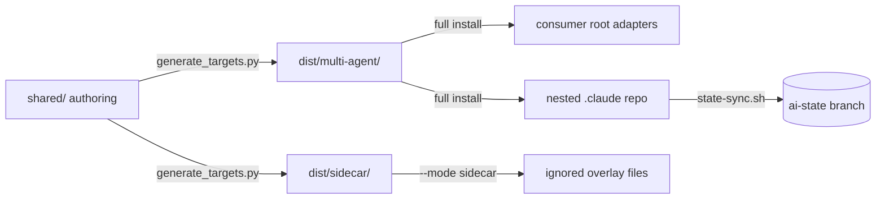

# Source, generated output, consumer repo, and nested AI state

Source, tests, and the policies under `shared/policies/` outrank this page.

This repository is not an application. It is a source-of-truth plus generated bootstrap for AI coding agents. Maintainers edit `shared/`, and a generator renders it into two installable trees. A full install copies the full tree into a consumer, and the consumer's `.claude/` becomes its own Git repository for AI state. A sidecar install projects a small personal overlay into a team-owned repository instead.

## The four places

This diagram shows where the bootstrap lives and how content moves between the places.

| Place | What it holds | Who edits it |
| --- | --- | --- |
| `shared/` here | policies, agent metadata and prompts, skills, hooks, MCP definitions, templates, the verifier, memory seed, devcontainer, the sidecar bridge text | bootstrap maintainers, by hand |
| `dist/multi-agent/` here | the full-install target rendered from `shared/` | nobody; regenerated by the generator and git-ignored |
| `dist/sidecar/` here | the sidecar target: four skills at two skill roots plus two instruction bridges | nobody; regenerated by the generator and git-ignored |
| a consumer's outer repository, full install | thin root adapters (`AGENTS.md`, `CLAUDE.md`, `.mcp.json`, `.github/**`, `.codex/**`, `.agents/**`, `.vscode/**`) plus the installed `.claude/` basis | the installer writes adapters; the consumer edits only project context and its own state |
| a consumer's outer repository, sidecar install | the team's own tracked files, untouched, plus Git-ignored sidecar skills and bridges and a manifest inside the Git directory | the team owns every tracked file; the sidecar installer owns only its ignored files |
| the nested `.claude/` repository | a separate Git repository on branch `ai-state` with the installed basis and the mutable AI state; full installs only | hooks and the installer commit it; the outer repository ignores it |

The authoring repository's root `.gitignore` states both boundaries: `dist/` is generated build output, and `.claude/` is tracked in the nested repository, not the outer one. A sidecar install creates no nested repository; see [Sidecar overlay](/openwiki/operations/sidecar-overlay.md).

## Authoring repository versus consumer

Two facts about this repository do not carry over to consumers:

- The tracked root `AGENTS.md`, `CLAUDE.md`, `.mcp.json`, and `.codex/config.toml` here are authoring versions, kept byte-stable across self-refreshes. In a consumer they are generated adapters that must not be hand-edited.
- This repository installs its own generated output into itself with `scripts/install_bootstrap.py . --local-only --allow-self` so the whole lifecycle can be exercised end to end. A normal consumer never sees `shared/`; it receives only the rendered copy.

## What `shared/` contains

- `shared/policies/*.instructions.md`: workflow, workspace, quality and testing, code standards, config-first design, tool routing, agent reporting, API and deployment guidance. Each has frontmatter declaring `applicability: always` or a list of path patterns.
- `shared/agents/<id>/`: JSON metadata in `agent.yaml` plus prompt bodies. See [Agent roster, prompts, and the skill library](/openwiki/architecture/agents-and-skills.md).
- `shared/skills/<name>/SKILL.md`: the skill library, with `visibility: public|background`.
- `shared/hooks/`: `hooks.json` for Copilot, the `scripts/` guardrails, and `git-hooks/`.
- `shared/mcp/servers.json`: the MCP servers `semble` (through `uvx`), `context-mode` (through `context-mode-dispatch.sh server`), and `context7`.
- `shared/scripts/verify.py` and `shared/scripts/record_findings.py`: the verifier and findings recorder, copied into every consumer's `.claude/scripts/`.
- `shared/templates/`, `shared/MEMORY.md`, `shared/review-profiles/`, `shared/prompts/`, `shared/schemas/`, `shared/devcontainer/`, `shared/vscode/tasks.json`, and the README seeds for the state directories.
- `shared/sidecar/bridge.md`: the one short rule body that every sidecar bridge file carries.

## How generation works

`scripts/generate_targets.py` has two targets, `multi-agent` and `sidecar`. Its `generate` function resets each target's output directory, calls `render_multi_agent` or `render_sidecar`, raises `ValueError` for any other name, and strips quarantined content. `render_multi_agent` runs a fixed sequence:

1. `render_devcontainer` writes the trackable `.devcontainer/` GPU sandbox.
2. `render_shared_basis` writes the `.claude/` basis: `MEMORY.md`, templates, `verify.py`, `record_findings.py`, and every policy under `.claude/instructions/`, plus Claude path-scoped rules for conditional policies. It copies `runtime_ownership.py` and `validate_plan_frontmatter.py` verbatim, because provider path rewriting would corrupt those target-neutral authorities, and writes `bootstrap-ownership.env`, the manifest of installer-owned root adapters.
3. Root `AGENTS.md` comes from `render_root_guidance("multi-agent")`.
4. `render_github` writes `.github/copilot-instructions.md`, one instruction adapter per policy, the copied `hooks.json`, `.vscode/mcp.json`, `.vscode/tasks.json`, and one `.github/agents/<id>.agent.md` per eligible agent.
5. `render_claude` writes `CLAUDE.md`, `.mcp.json`, and `.claude/settings.json` with the hook wiring.
6. `render_codex` writes `.codex/config.toml` (MCP servers plus one `[[skills.config]]` entry per skill), `.codex/hooks.json`, and one `.codex/agents/<id>.toml` per eligible agent.
7. `render_antigravity` writes a copy of the skill tree under `.agents/skills/`, `.agents/mcp_config.json`, `.agents/hooks.json`, and one `.agents/agents/<id>/agent.md` per eligible agent.

Text copied into a target passes through `transform_target_paths`, a table of literal replacements per provider. For Claude Code, `.github/copilot-instructions.md` becomes `CLAUDE.md` and `.github/hooks` becomes `.claude/hooks`; for Codex they become `AGENTS.md` and `.codex/hooks`. One canonical policy text can therefore name the root guidance file correctly on every host.

`render_sidecar` builds the much smaller sidecar tree from constants in `scripts/runtime_ownership.py`:

1. It copies each skill in `SIDECAR_SKILLS` (`debug-investigator`, `humanize`, `ponytail`, `ponytail-review`) into both `SIDECAR_SKILL_WRITE_ROOTS`, `.claude/skills/` and `.agents/skills/`.
2. It rewrites each copied `SKILL.md` through `SIDECAR_TEXT_REPLACEMENTS`, so no sidecar file names a bootstrap path the sidecar does not install.
3. It copies the vendored Ponytail MIT `LICENSE` into `ponytail/` and `ponytail-review/` at both roots.
4. It renders each bridge in `SIDECAR_BRIDGES` from `shared/sidecar/bridge.md`, adding only that client's frontmatter: none for `.claude/rules/ai-bootstrap-sidecar.md`, and `applyTo: "**"` for `.github/instructions/ai-bootstrap-sidecar.instructions.md`.

## What the validator proves

`scripts/validate_targets.py` is the structural gate over `dist/`. Its `main` runs a fixed sequence of checks and prints `FAIL ...` lines and exits 1 on any error, or `PASS generated target is structurally valid`. The checks, in order:

- the task-lane contract and the Codex model contract;
- agents, MCP and hook wiring, the Antigravity manifest and skills, the Context Mode tool surface;
- skills and paths;
- the sidecar target and its adversarial cases: only allowlisted skill, `LICENSE`, and bridge paths; the exact source set, with nothing missing and nothing extra; no bootstrap-only path, `mcp__`, or `ctx_` reference; no leftover `SIDECAR_TEXT_REPLACEMENTS` phrase; the license and the `humanize` credit present; each bridge with its client's frontmatter;
- coverage of every `dist/multi-agent/` file by `FULL_INSTALL_ROOT_PATHS`, the list the installer uses to recognize a team-owned repository, with its adversarial cases;
- docs parity (which owns the skill-library integrity rules);
- memory security authority and routing-table parity;
- root-source mirror cases, runtime drift cases, the Ponytail diff classifier, the typo-bypass path restriction;
- end-to-end receipt-chain lifecycle cases, stale-receipt rejection, single-phase terminal publication, JSON report readers;
- devcontainer and installer, state sync, installer commit failure, local-only state sync;
- determinism, then the presence of hook-gate regression tests.

Three rules are worth knowing on their own:

- The sidecar source contract is one exact set, built from the live profile constants in `scripts/runtime_ownership.py`: each skill's `SKILL.md` at both write roots, a `LICENSE` in `ponytail/` and `ponytail-review/` at both roots, and every bridge. The validator and the sidecar installer's `--source` check both compare a tree against that set and report each missing and each unexpected path, so a half-rendered `dist/sidecar/` fails both instead of silently uninstalling the missing skills.
- `validate_determinism` regenerates the target into a temporary directory and requires it to byte-match the current `dist/`. Any hand edit to generated output fails validation on the next run.
- Many gates run real subprocesses in temporary repositories (installer, state sync, receipt chains). That is why the validator is slow and why it is a required item in every phase's verification block rather than a unit test.

## Policy discovery per host

Policies are authored once and discovered natively per host:

- Claude Code loads conditional policies as path-scoped rules under `.claude/rules/`; always-on policy stays in the root guidance.
- Codex reads hierarchical `AGENTS.md` files with a combined size cap, so a conditional policy becomes a nested `AGENTS.md` only when it owns a stable directory, and otherwise maps to an existing skill.
- GitHub Copilot's instruction adapters derive `applyTo` from the same patterns, and generation checks their scope parity with Claude's `paths`.

Runtime loading by a real client is probed separately by `scripts/check_native_clients.py`; the structural validator does not claim it.

## Representative tests

`tests/test_validate_targets.py` exercises the generator and validator together: agent target scoping and rendering, the Antigravity static adapter, Codex specialist metadata, skill-contract checks, and the README agent contract. The validator's own end-to-end cases run under `uv run python scripts/validate_targets.py`.

## Related pages

- [Agent roster, prompts, and the skill library](/openwiki/architecture/agents-and-skills.md)
- [Installing the bootstrap, file ownership, and runtime drift checks](/openwiki/operations/install-ownership-and-runtime-checks.md)
- [Sidecar overlay](/openwiki/operations/sidecar-overlay.md)
- [Git-backed AI-state sync](/openwiki/operations/git-backed-ai-state-sync.md)
