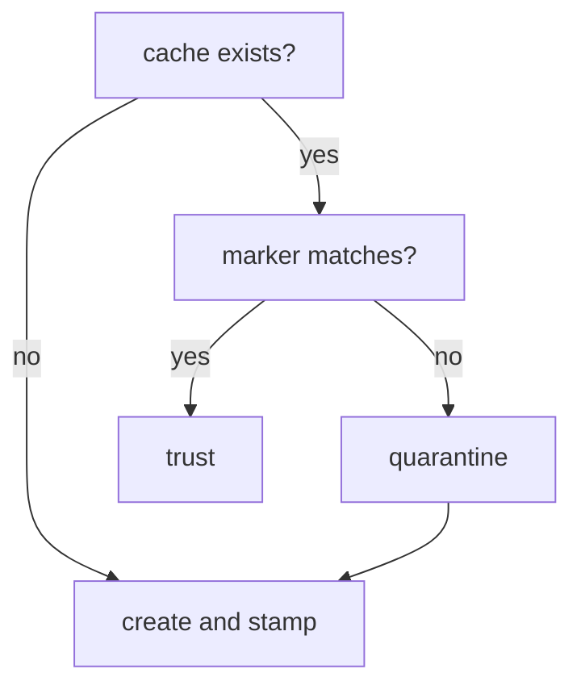

# Context Mode dispatcher: version pin, tool filter, and cache security

Source, tests, and the policies under `shared/policies/` outrank this page.

Context Mode is an optional retrieval helper (an MCP server that indexes and searches large outputs). The bootstrap never runs it directly. Every host reaches it through one script, `shared/hooks/scripts/context-mode-dispatch.sh`, which pins the version, restricts the tool surface, and guards the on-disk cache. The dispatcher is generated into consumers as `.claude/hooks/scripts/context-mode-dispatch.sh`.

## Two modes, one script

- **Server mode** (`context-mode-dispatch.sh server`) is what `.mcp.json`, `.vscode/mcp.json`, `.codex/config.toml`, and `.agents/mcp_config.json` launch. It starts `context-mode-mcp-filter.mjs` under Node in front of the pinned Context Mode, so every MCP message passes through the filter first.
- **Hook mode** (`context-mode-dispatch.sh <host> <event>`) runs from SessionStart, PreToolUse, PostToolUse, and PreCompact hooks. It maps the host name to Context Mode's own target name (`github-copilot` to `vscode-copilot`, `openai-codex` to `codex`) and runs `context-mode hook <target> <event>`.

The two modes differ in how they fail. Hook mode is optional observability, so a missing `context-mode` binary (with no `npx` fallback) or unavailable storage warns and exits 0; hook mode never checks for Node. Server mode is the real tool, so the same two conditions print an `ERROR context-mode-dispatch:` line and exit non-zero, and server mode additionally requires Node and the filter script, failing the same way when either is missing.

## The version pin is proven, not assumed

The pinned version is `1.0.169`, held in `PINNED_CONTEXT_MODE_VERSION`. `resolve_context_mode` uses a `context-mode` executable on `PATH` only when it is provably that version:

- Context Mode 1.0.169 has no working `--version` flag, and its `doctor` command is slow and calls the network, so neither can gate a hook event.
- Instead the dispatcher resolves the executable's symlink to the installed package directory and reads `name` and `version` from that `package.json`. A nested dependency manifest cannot be mistaken for Context Mode's own because the name is checked too.
- A binary whose version is wrong or cannot be determined is never executed. The dispatcher falls back to `npx -y context-mode@1.0.169`, which is pinned by construction because the version is in the command.

The filter proves the pin a second time over the wire by checking `serverInfo.version` in the `initialize` response; on a mismatch it exposes no tools at all.

`context-mode-dispatch.sh --self-check` prints one `PASS context-mode-dispatch:` line per fact so the check proves the contract instead of restating it: `required-version`, `resolved-path`, `observed-version`, `launcher`, `version-contract` (`pinned-direct-binary` or `pinned-via-npx@1.0.169`), `filter`, `storage-root`, `storage` (`writable` or `creatable`), and `nested-ignore`. `scripts/check_runtime.py` runs this self-check and fails on a version or storage problem.

## The four-tool filter

`context-mode-mcp-filter.mjs` sits between the host and Context Mode on standard input and output:

- It advertises and allows exactly four tools: `ctx_index`, `ctx_search`, `ctx_stats`, `ctx_doctor`. Every other tool call, known or unknown, is answered locally with a JSON-RPC error (`Context Mode tool is not allowed by repository policy`) and never reaches upstream.
- `ctx_index` accepts only `content`, `path`, and `source`. Exactly one of `content` or `path` is required; `path` must exist, be a regular file or directory, not be a symbolic link, and resolve inside the repository. Directory-policy knobs such as `include`, `exclude`, `maxDepth`, `maxFiles`, `extensions`, `respectGitignore`, and `followSymlinks` are rejected, so they stay at the pinned upstream defaults.
- Responses to `tools/list` are filtered by request id, and ids are counted rather than remembered once, so two requests that reuse an id cannot leak the unfiltered tool list.

## One cache location, and only one

Context Mode stores its index under a directory named by `CONTEXT_MODE_DIR`. The bootstrap owns exactly one location for it: `.claude/.cache/context-mode/` inside the repository. `select_storage_root` enforces this:

- No override: the project-local cache is used.
- An override that is relative, unsafe to canonicalize, or resolves anywhere other than the project-local cache or a path beneath it is refused with a warning. The project-local cache is used instead, and the refused path is never created, stamped, renamed, or otherwise touched.

The reason is ownership, not just safety. Quarantine, described next, works by renaming the cache directory. Honoring an arbitrary external path would let the bootstrap reorganize user-owned state outside the repository.

The nested `ai-state` repository ignores and untracks `.cache/`, so the cache is never committed from this repository's own writes.

## Cache trust and quarantine

The remaining risk is a cache that arrives by another route. `.cache/` is only untracked, not deleted, so bytes committed to `ai-state` history by a hostile or compromised remote can land on disk during reconciliation before being untracked again. `configure_storage` runs before every hook event and every server start and decides whether the cache on disk can be trusted. This diagram shows the decision.

The marker check compares four lines: repository, pinned version, filter contract, and the secret. Quarantine renames the directory to `<cache>.untrusted.<UTC timestamp>.<pid>`.

- The marker is `.bootstrap-provenance` inside the cache, with four lines: `repository=<root>`, `context-mode=1.0.169`, `filter=ctx-index-file-content-v1`, and `secret=<value>`.
- The first three fields are public and predictable. The secret is what makes the marker unforgeable: a random 32-byte value generated once with `openssl rand` or `/dev/urandom` and stored at `.context-mode-provenance.secret` in the repository root, outside `.claude/`. `state-sync.sh` never adds, commits, or restores anything at the root, so a hostile remote can neither read nor plant it. The installer's ignore block and `.openwikiignore` both exclude `.context-mode-provenance.secret*`.
- The secret is written to a temporary sibling and moved into place with `mv -n`, so two dispatcher invocations racing on first run still end with one secret on disk.
- A cache missing the marker or with any mismatching line is renamed to `<cache>.untrusted.<UTC timestamp>.<pid>` next to it and never deleted. A warning names the quarantine path. A fresh, empty guarded cache is created and stamped.

The consequence for lifecycle evidence is simple. No cache is ever searched or cited unless this dispatcher produced it locally.

## Where the rules live

- The tool allowlist and the four-tool contract are also stated in `shared/policies/tool-routing.instructions.md`, and `validate_targets.py`'s Context Mode tool-surface check keeps the generated configuration in agreement.
- Hook wiring per host is in `scripts/generate_targets.py`; see [Hook dispatcher and guardrail scripts](/openwiki/architecture/hooks-and-guardrails.md).

## Representative tests

- `tests/test_context_mode_dispatch.py` covers the storage rules (relative, traversal, tracked, symlinked, and external overrides all fall back and never create the refused path; an approved subtree is preserved), the version contract (direct binary only at the exact pin, refusal of wrong or undeterminable versions, `npx` fallback), the self-check fields, and the server-mode failure messages when Node or the filter is missing.
- `tests/test_context_mode_mcp_filter.py` covers the exact allowlist in `initialize` and `tools/list`, no tools on a version mismatch, blocked and unknown calls never reaching upstream, guarded `ctx_index` arguments, and the duplicate-id and racing-id leak cases.

## Related pages

- [Hook dispatcher and guardrail scripts](/openwiki/architecture/hooks-and-guardrails.md)
- [Source, generated output, consumer repo, and nested AI state](/openwiki/architecture/source-generated-consumer-layout.md)
