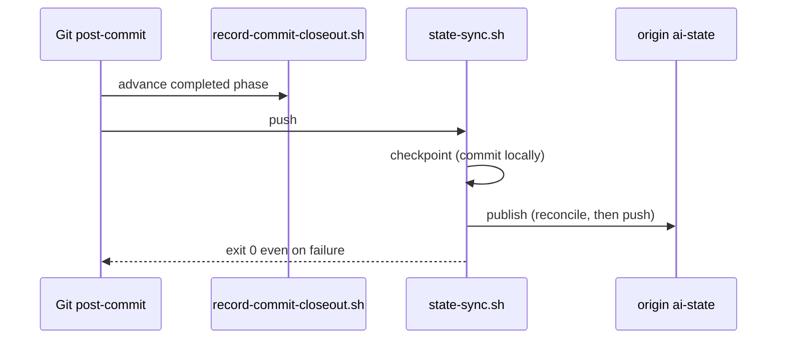

# Git-backed AI-state sync

Source, tests, and the policies under `shared/policies/` outrank this page.

In every full-install consumer, `.claude/` is a plain, self-contained Git repository with its own `.git/` directory on one branch named `ai-state`. It tracks the installed bootstrap files and the mutable AI state: `MEMORY.md`, `plans/**`, `explorations/**`, `session_logs/**`, and `quality_reports/**`. The outer repository ignores `.claude/` entirely, so `git branch` and `git log` at the root never show `ai-state`. Inspect it with `git -C .claude <command>`.

A sidecar install (`--mode sidecar`) has none of this. The installer hands a sidecar target to `install_sidecar`, and `--uninstall` to `uninstall_sidecar`, before any full-install step, so no nested repository, `ai-state` branch, or state sync is created or touched; see [Sidecar overlay](/openwiki/operations/sidecar-overlay.md).

## Two kinds of commit

- `bootstrap:` commits come from the installer and the batch updater when they refresh bootstrap-controlled files.
- `session:` commits come from session hooks saving state.

`git -C .claude log --stat` is therefore an audit trail of what every session and every bootstrap update changed. The nested remote is, by default, the outer repository's own `origin` with refspecs pinned to `ai-state`; an install-time `--state-remote` can point it elsewhere for privacy.

## The publication path after a commit

This diagram shows what happens after every outer-repository commit.

## `state-sync.sh` commands

`shared/hooks/scripts/state-sync.sh` is pure Bash with no `uv` or Python dependency. It is rendered into `.claude/hooks/scripts/` for normal use and into `.devcontainer/` as a bootstrap copy that exists before `.claude/` does on a fresh clone. `--local-only` or `AI_STATE_LOCAL_ONLY=1` skips every remote interaction.

| Command | What it does |
| --- | --- |
| `setup` | On a missing `.claude/.git`: init, configure the remote and pinned refspecs, write the nested `.gitignore` and `.gitattributes`, commit what is on disk, merge `origin/ai-state` allowing unrelated histories, restore root adapters, activate the outer Git hooks. On an existing repository it stays local and does none of that. |
| `pull` | Record local changes, reconcile with `origin/ai-state`, then restore root adapters and checkpoint. A conflict aborts cleanly and skips restoration. |
| `checkpoint` | Commit local AI state with no remote operation. Initializes the repository first if needed. |
| `publish` | Send already committed state only. A dirty worktree warns and preserves the uncheckpointed state. Repeated clean publication is a no-op. |
| `push` | `checkpoint` then `publish`. A failed checkpoint skips publication. |
| `status` | Read-only and network-free: initialized, clean or dirty, remote configured without exposing its URL, cached ahead and behind counts, rebase state, last recorded error. |
| `migrate-from-hf` | One-way import of pre-Git state as a `migrate:` commit. Historical. |

Every mutating command goes through `dispatch_mutating`, which checks for a rebase left in progress. A valid pre-existing rebase is preserved and the command returns a distinct protected-rebase status. `pull` clears only the half-initialized state its own previous run left behind.

## Warn, never fail

The dispatcher wraps every command in a warn-and-continue and always exits 0. Warnings go to stderr and to `.claude/session_logs/hooks-errors.log`. This is deliberate:

- The script runs from SessionStart and Stop hooks, the outer `post-commit` Git hook, and VS Code tasks.
- A missing remote, an offline network, or a rebase conflict must never block a session or turn a completed commit into a failed one.
- The cost is that a sync problem shows only in the log and in `status`. The SessionStart hook reports hook-path and sync problems as context for the next session.

## What the nested repository never tracks

- `.cache/` (Context Mode storage and the OpenWiki guard's snapshot directory) and `session_logs/hooks-errors.log` are ignored. `checkpoint` and every successful reconcile untrack them if an earlier commit tracked them, without deleting the files.
- `session_logs/hooks-bypass.log` stays tracked.
- The `.gitattributes` gives append-only `session_logs/*.log` files Git's `merge=union` driver, so two sessions appending to the same log reconcile automatically. Plans, `MEMORY.md`, and prose keep conflict-and-abort behavior so a real divergence stops for a human.

## Root adapters and the bootstrap-root mirror

`state-sync.sh` only checks out `.claude/`. The installer-owned files outside it (`AGENTS.md`, `CLAUDE.md`, `.mcp.json`, `.codex/**`, `.agents/**`, `.vscode/*.json`, and the Copilot surface when not committed) are carried inside the nested repository under `.claude/bootstrap-root/`:

- `restore-root-adapters.sh` copies them back to their real locations, reading the list from `.claude/bootstrap-ownership.env`. It exits 0 silently when the mirror or the manifest is absent.
- `state-sync.sh` calls it on a fresh `setup`, on every successful `pull`, and on a `checkpoint` that had to initialize the repository.
- `verify.py` fingerprints the same mirror to prove control-plane provenance, so an adapter edited outside a bootstrap refresh fails verification until the refresh remirrors it.

`configure_outer_hooks_path`, called from the same restore path, sets the outer `core.hooksPath` to the fixed literal `.claude/hooks/git-hooks` once that directory exists. A matching value is left alone, a different value is overwritten with a warning naming the old one, and a failure only warns. It is the one write `state-sync.sh` makes outside `.claude/`, and nothing from the nested checkout is interpolated into it.

## Where sync runs

- **SessionStart** on every host: `state-sync.sh pull`, then `session-start-state.sh` reports the active plan and phase.
- **Stop**: `claude-stop.sh` and `codex-stop.sh` run `checkpoint` then `publish`. Codex also runs `push` on `UserPromptSubmit` and a short local `checkpoint` on `SessionEnd`. Stop paths are best-effort; closing an editor tab does not guarantee the event.
- **Outer `post-commit` Git hook**: the closeout recorder, then `state-sync.sh push` with stdin from `/dev/null`. Git ignores the hook's exit status, so this is the durable publication boundary the Stop hooks cannot promise.
- **VS Code tasks**: an automatic `AI state: pull` on folder open and a manual `AI state: push`.

## Representative tests

`tests/test_state_sync.py` runs the real script against temporary repositories: checkpoint commits locally without remote I/O; setup and pull activate the outer hooks path and do not rewrite a matching one; the error log and cache are never tracked and are untracked without deletion; publish refuses a dirty worktree and is idempotent; push stays checkpoint-then-publish; status is credential-safe; and the rebase cases prove that half-initialized state is cleared only by the run that created it.

## Related pages

- [Installing the bootstrap, file ownership, and runtime drift checks](/openwiki/operations/install-ownership-and-runtime-checks.md)
- [Hook dispatcher and guardrail scripts](/openwiki/architecture/hooks-and-guardrails.md)
- [Source, generated output, consumer repo, and nested AI state](/openwiki/architecture/source-generated-consumer-layout.md)
- [Sidecar overlay](/openwiki/operations/sidecar-overlay.md)
