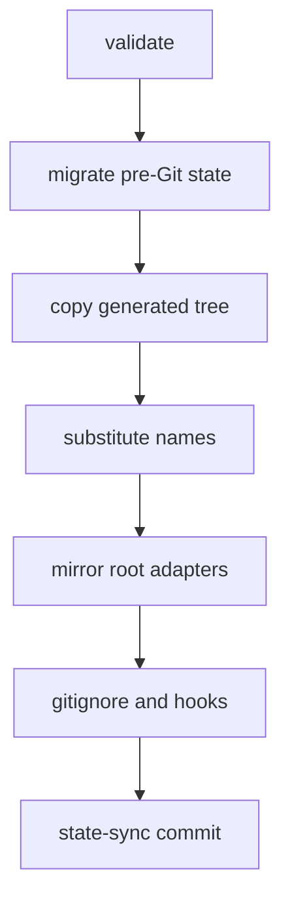

# Installing the bootstrap, file ownership, and runtime drift checks

Source, tests, and the policies under `shared/policies/` outrank this page.

The installer copies the generated target into a consumer and refreshes it later without touching what the consumer owns. What it may overwrite, preserve, or prune is decided by one small ownership contract that the installer, the restore script, the verifier, and the validators all share.

## The ownership model

`scripts/runtime_ownership.py` classifies only the boundaries that matter during a refresh. Each category has a fixed effect.

| Category | Paths | On refresh |
| --- | --- | --- |
| Bootstrap-controlled | everything under `.claude/` not listed below, plus the generated root adapters | replaced by the generated copy; files no longer generated are pruned |
| Root adapters (`ROOT_ADAPTER_PATHS`) | `CLAUDE.md`, `AGENTS.md`, `.mcp.json`, `.codex`, `.agents`, `.vscode/mcp.json`, `.vscode/tasks.json` | regenerated and mirrored into `.claude/bootstrap-root/` |
| Copilot surface (`COPILOT_SURFACE_PATHS`) | `.github/agents`, `.github/hooks`, `.github/instructions`, `.github/copilot-instructions.md` | mirrored and ignored like a root adapter, unless the consumer chose `--commit-copilot-surface` |
| Tracked authoring adapters (`TRACKED_AUTHORING_PATHS`) | `AGENTS.md`, `CLAUDE.md` when tracked by the target's outer Git | preserved byte for byte |
| Consumer state (`CONSUMER_STATE_PATHS`) | under `.claude/`: `MEMORY.md`, `plans`, `explorations`, `session_logs`, `quality_reports`, `.cache`, `instructions/project-context.instructions.md`, `settings.local.json` | never compared, overwritten, or deleted; a seed is used only on a fresh install |
| State-directory READMEs | the `README.md` in `plans`, `explorations`, `session_logs`, `quality_reports` | regenerated even inside consumer-owned directories; siblings untouched |
| Third-party skill bundles (`THIRD_PARTY_SKILL_PATHS`) | `skills/openwiki` under `.claude` or `.agents`, once it contains `.openwiki-install.json` | preserved, not refreshed, excluded from drift and takeover comparisons |

The marker rule matters most. A directory shaped like `skills/openwiki` is ordinary bootstrap content until OpenWiki's own installer writes `.openwiki-install.json` inside it. From then on:

- the bootstrap installer preserves it;
- `check_runtime.py` stops drift-checking it;
- the installer's `.agents` takeover check ignores it;
- the verifier's bootstrap-root fingerprint excludes it.

Ownership keys on a fact only the intended owner produces, not on path shape. `is_third_party_skill_dir` requires both the shape and the marker.

## The installer sequence

```
uv run python scripts/install_bootstrap.py <target-repo> [--source dist/multi-agent]
    [--state-remote <git-url>] [--commit-copilot-surface] [--local-only]
    [--dry-run] [--allow-self]
```

This diagram shows the order `main` follows.



1. `validate_install_roots` rejects overlapping source and target trees. `--allow-self` permits exactly one overlap: this repository refreshing its own overlay from its own `dist/`.
2. `validate_agents_takeover` refuses to write when an existing `.agents` tree cannot be proven generated. It compares the live tree, the mirror under `.claude/bootstrap-root/.agents`, and the generated source, all with marker-claimed bundles pruned, and reports conflicts with `Refusing .agents takeover; move or back up the listed content ...`.
3. The Copilot surface mode is resolved: explicit flag, else the mode persisted in `.claude/bootstrap-ownership.env`, else local-only.
4. `migrate_pre_existing_state` commits a pre-Git `.claude/` with real content as `migrate: import pre-git state` before anything is replaced.
5. `copy_generated_tree` copies `dist/multi-agent/` over the target. It logs `preserve consumer state`, `preserve tracked authoring adapter`, and `preserve third-party skill`, and `remove obsolete generated file` for bootstrap-owned files the new generation no longer produces. Pruning walks only `.claude/` and the restorable root paths.
6. Project name and Python version are substituted into the installed instructions.
7. `populate_bootstrap_root` mirrors the root adapters into `.claude/bootstrap-root/` so the Git-backed checkout carries them.
8. `merge_gitignore` writes or refreshes an idempotent block between `# BEGIN multi-agent bootstrap generated/private AI content` and its `# END` marker; runtime scripts are made executable; `configure_git_hooks_path` sets `core.hooksPath` to `.claude/hooks/git-hooks`; tracked paths that should be ignored are reported with the exact `git rm --cached` command.
9. `sync_state_after_install` runs `state-sync.sh` to make the `bootstrap: install/update <timestamp>` nested commit and, unless `--local-only`, publish it.
10. A reminder that Codex for VS Code may require renewed approval of the content-bound `.codex/hooks.json`. The installer never approves hooks itself.

`--local-only` does the full refresh and creates the nested commits but performs no fetch, `ls-remote`, pull, merge, or push; it prints a quoted `state-sync.sh push` command for later. `--dry-run` prints the plan without writing.

## Self-refresh of this repository

This repository refreshes its own overlay with `uv run python scripts/install_bootstrap.py . --local-only --allow-self`.

- Tracked `AGENTS.md`, `CLAUDE.md`, `.mcp.json`, and `.codex/config.toml` are preserved, so entries another tool added (for example OpenWiki's MCP server) survive and are remirrored.
- The refresh is also how a stale `.claude/bootstrap-root/` mirror is healed after a root adapter changes. That is what clears a `receipt metadata control-plane provenance is invalid` failure in the verifier.
- The refresh prunes obsolete installed copies as a side effect. Observe stale state before running it if the observation matters.

## Batch updates

`uv run python scripts/update_consumers.py <repo>...` regenerates `dist/` (unless `--skip-regen`) and runs the installer for each consumer, passing through `--dry-run`, `--local-only`, `--allow-self`, and the Copilot surface flags. Each consumer gets the same migration-then-`bootstrap:` commit order.

## What `check_runtime.py` reports

`uv run python scripts/check_runtime.py` checks the installed runtime wiring in this repository and exits 1 with `FAIL ...` lines on any of these:

- a missing required generated file or directory;
- invalid plan frontmatter under `.claude/plans/`, delegated to `validate_plan_frontmatter.py`;
- runtime drift: an installed file whose bytes differ from the generated source, or one absent from the generated target (`stale runtime path: <path>; authoritative source: absent from generated target`);
- a Context Mode dispatch problem (wrong or undeterminable pinned version, filter or storage misconfiguration);
- an unguarded `"${arr[@]}"` expansion in any hook script, which aborts under `set -u` on macOS's Bash 3.2.

On success it prints `PASS` lines for optional binaries found, the Semble launcher, the Python baseline, and finally `PASS generated runtime wiring is present`. Drift checking honors the ownership model: consumer state is never compared, `.claude/.git` and the mirror are skipped, and a marker-claimed third-party bundle is exempt in both the drift and the obsolete directions.

## Representative tests

- `tests/test_install_bootstrap.py` covers the takeover check (unproved content, a private mirror, symlinked evidence, marker-claimed bundles ignored while unmarked same-shaped directories still conflict), consumer-state preservation across reinstall, and the marker-gated third-party preservation and drift exemption.
- `tests/test_check_runtime.py` covers the plan-frontmatter delegation and every shape of the Bash 3.2 array-expansion rule.

## Related pages

- [Source, generated output, consumer repo, and nested AI state](/openwiki/architecture/source-generated-consumer-layout.md)
- [Git-backed AI-state sync](/openwiki/operations/git-backed-ai-state-sync.md)
- [Deterministic verification: verify.py modes, receipts, and findings](/openwiki/operations/deterministic-verification.md)
