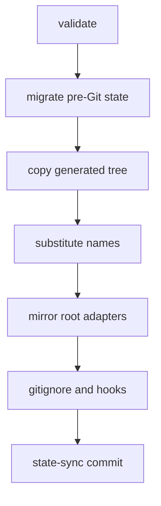

# Installing the bootstrap, file ownership, and runtime drift checks

Source, tests, and the policies under `shared/policies/` outrank this page.

The installer has two modes. A full install copies the generated target into a consumer and refreshes it later without touching what the consumer owns; what it may overwrite, preserve, or prune is decided by one small ownership contract that the installer, the restore script, the verifier, and the validators all share. A sidecar install adds a small personal overlay to a team-owned repository, in one of two profiles (`skills` or `workflow`), and never changes a tracked file; [Sidecar overlay](/openwiki/operations/sidecar-overlay.md) covers it in full.

## Install modes and mode detection

`--mode full` or `--mode sidecar` selects a mode. Without `--mode`, `detect_install_mode` in `scripts/install_bootstrap.py` decides from the target alone, before any write. Before that, `main` removes Git's repository-local environment variables (`GIT_REPO_LOCAL_ENV_VARS` in `scripts/runtime_ownership.py`, such as `GIT_DIR` and `GIT_INDEX_FILE`), so an exported one can never point detection or a later write at another repository. One option runs before everything else: `--backup-state` is a standalone action that copies the workflow profile's state folder into the preserved-copy folder (`_run_backup_state`), takes priority over `--uninstall` and every install option, never runs mode detection, and with `--dry-run` only prints `would back up ...`. `_run_backup_state` refuses a target that is not a directory and hands everything else to `backup_sidecar_state`, whose shared sidecar preflight aborts a target that is not a Git repository with `<target> is not a Git repository`.

Detection looks for three kinds of evidence:

- Sidecar evidence: anything at the manifest path `ai-bootstrap-sidecar.json` in the Git directory, valid or not and including a dangling symlink, or a sidecar marker block in `info/exclude` (a local, untracked ignore file, separate from the team's tracked `.gitignore`). The exclude file is found through the common Git directory and read only when it is a regular file.
- Full evidence: `--allow-self` with this repository as the target, or, when the outer index has no entry of any kind (file, symlink, or gitlink) at or under `.claude`, either `.claude/.git` as a real directory or `.claude/bootstrap-ownership.env` present (checked with `lexists`). `_full_install_evidence` reads the index once, before either check. A tracked `.claude` in any form is therefore team configuration even when it carries the ownership file: a team submodule at `.claude`, an embedded repository tracked as a gitlink, tracked files under `.claude/`, or `.claude` as a tracked symlink. Before this rule, a team that shipped its own AI-state repository as a submodule handed every clone "full evidence", and a plain install then committed an `ai-state` branch inside the team's submodule. When neither modern marker is present, a real, untracked `.claude` directory can still be a recognized older full install: it needs at least two of this bootstrap's hook scripts (`run-hook.sh`, `protect-files.sh`, `session-log.sh`, `context-mode-dispatch.sh`, `git-protection.sh`) under `.claude/hooks/scripts/`, plus either a tracked `.devcontainer/hf-ai-sync.py` or `.devcontainer/state-sync.sh`, or a local `.claude/scripts/verify.py`. An arbitrary hooks folder or a single matching name is not evidence.
- Team configuration: `git ls-files -z` lists a path under `FULL_INSTALL_ROOT_PATHS` (`.claude`, `.devcontainer`, and the restorable root adapter paths). These are the agent-harness paths. A tracked `.gitignore` is not one of them, so a repository that tracks only code and `.gitignore` gets the fresh full-install default.

Detection runs Git with `LC_ALL=C`, so its error text is in English. A Git failure other than "not a git repository", such as a dubious-ownership error, aborts detection in every mode with Git's message and a `git config --global --add safe.directory` remedy, instead of silently falling through to a full install. An unbalanced or doubled sidecar marker block in `info/exclude` also aborts detection in every mode, with the marker remedy rather than the `safe.directory` hint: `Refusing to detect an install mode: <reason>. To recover, fix info/exclude by hand: the sidecar's own BEGIN/END markers must appear exactly once each, with BEGIN before END, then rerun.` A missing `git` executable ends every entry path, including `--uninstall`, with `git not found on PATH: install Git or add it to PATH, then rerun.` instead of a traceback.

The table shows the result for each case, in the order the function checks it.

| Request | Evidence found | Result |
| --- | --- | --- |
| `--mode sidecar` | full evidence | refuse |
| `--mode sidecar` | a linked worktree (its `--git-dir` differs from `--git-common-dir`) | refuse |
| `--mode sidecar` | anything else | sidecar install |
| `--mode full` | sidecar evidence | refuse |
| `--mode full` | no full evidence, and the target is a subfolder, a linked worktree, a bare repository, or has `.claude` as a regular file | refuse |
| `--mode full` | anything else | full install |
| no `--mode` | both kinds of evidence | refuse, advising a backup and a manual cleanup |
| no `--mode` | sidecar evidence | sidecar install |
| no `--mode` | full evidence | full install (refresh) |
| no `--mode` | team configuration only, next to an untracked `.claude` directory | refuse, offering only `--mode full` |
| no `--mode` | team configuration only | refuse, offering `--mode full` or `--mode sidecar` |
| no `--mode` | nothing, but the target is a subfolder, a linked worktree, a bare repository, or has `.claude` as a regular file | refuse |
| no `--mode` | nothing | full install (fresh default) |

Every refusal is a `SystemExit` that names the evidence found and the way forward. The `--mode full` refusal on a sidecar consumer offers three ways forward: run without `--mode full` to keep the overlay, run `--uninstall` to remove it first, or ask whoever manages the sidecar to remove it. The both-evidence refusal does not suggest a flag, because every explicit mode and `--uninstall` also refuse while both remain: it says to back up the target, decide which installation to keep, and remove the other by hand. When an untracked `.claude` directory sits next to the team configuration, the refusal says a sidecar overlay must not sit next to an existing per-clone `.claude/` setup and offers only `--mode full`. Otherwise, when the tracked paths include `.devcontainer/state-sync.sh`, the team-configuration refusal adds that the target looks like a fresh clone of a full consumer and says to run `bash .devcontainer/state-sync.sh setup` first, or pass `--mode full`.

The two "nothing, but" rows come from `_fresh_default_refusal`, which runs only when no bootstrap evidence exists, so an existing full consumer is never affected. It refuses, in this order, a target that is not `git rev-parse --show-toplevel` of its repository, a linked worktree (its `--git-dir` differs from `--git-common-dir`), a bare repository, and a `.claude` that `os.lstat` reports as a regular file. Each message names the shape and then says `The full install supports only the root of a main worktree`, followed by a remedy: run from the repository root, run from the main worktree checkout, use a repository with a working tree, or let `.claude` become a directory. A target that is not a Git repository, or a target folder that does not exist, shows no evidence and falls through to the fresh full-install default. `tests/test_install_bootstrap.py` covers every row of the table, each refusal message, the tracked-`.claude` shapes with the ownership file (tracked files, a submodule, a tracked symlink), the four fresh-default shapes in both plain and `--mode full` runs, the dubious-ownership abort, the doubled-marker remedy, the missing-`git` message, and the dangling manifest symlink.

After detection, `main` picks the profile and the source. In sidecar mode the profile is `--profile` when given, else the profile an existing manifest records (`read_sidecar_profile`; a version-1 manifest reads as `skills`), else `skills`; the source is `--source` when given, otherwise `dist/sidecar/<profile>/` (`default_sidecar_source`). In full mode the source is `--source` or `dist/multi-agent/`, and `--profile` or `--purge-state` each draw one warning (`full install ignores --profile`, `full install ignores --purge-state`). `require_source_exists` refuses a missing source; a missing default source says to run `uv run python scripts/generate_targets.py --all`, and a missing explicit `--source` names that path. A sidecar target then gets `validate_install_roots` with `allow_self=False` and no `--allow-self` hint, one warning naming any full-only option it ignores (`--commit-copilot-surface` or `--no-commit-copilot-surface`, `--state-remote`, `AI_STATE_REMOTE`, `--allow-self`, and `--purge-state`, which only `--uninstall` reads), and a hand-off to `install_sidecar(target, source, profile=...)`. `--local-only` is accepted as a no-op there, and `--dry-run` works. No full-install step below ever runs for a sidecar target.

`--uninstall` skips the mode table entirely. `_run_uninstall` refuses `--mode full`, a target that is not a directory (`Refusing --uninstall: <target> is not a directory.`, exit 1), and any full evidence. It then warns once about ignored full-only options (`--uninstall ignores full-only option(s): ...`, naming `--source`, `--local-only`, `--state-remote` or `AI_STATE_REMOTE`, the Copilot surface flags, and `--profile`, since uninstall removes every profile's units regardless). When there is no sidecar evidence, it prints where the preserved-copy folder is if that folder holds anything, then prints `no sidecar found; nothing to do` and exits 0; a target that Git does not recognize as a repository instead exits 1 with `Refusing --uninstall: <target> is not a Git repository, so it cannot hold a sidecar overlay.` Otherwise it hands the target to `uninstall_sidecar(target, dry_run=..., purge_state=...)`: by default the workflow profile's state folder `.ai-bootstrap/` (and any retained legacy `.claude/ai-bootstrap/`) is kept in place and still hidden, and `--purge-state` moves each into the preserved-copy folder instead. A recognized older full install refuses here too, as full evidence. Because it never runs the team-configuration check, it works in a team repository; [Sidecar overlay](/openwiki/operations/sidecar-overlay.md) describes what it removes and keeps.

## The ownership model

`scripts/runtime_ownership.py` classifies only the boundaries that matter during a full-install refresh. Each category has a fixed effect.

| Category | Paths | On refresh |
| --- | --- | --- |
| Bootstrap-controlled | everything under `.claude/` not listed below, plus the generated root adapters | replaced by the generated copy; files no longer generated are pruned |
| Root adapters (`ROOT_ADAPTER_PATHS`) | `CLAUDE.md`, `AGENTS.md`, `.mcp.json`, `.codex`, `.agents`, `.vscode/mcp.json`, `.vscode/tasks.json` | regenerated and mirrored into `.claude/bootstrap-root/` |
| Copilot surface (`COPILOT_SURFACE_PATHS`) | `.github/agents`, `.github/hooks`, `.github/instructions`, `.github/copilot-instructions.md` | mirrored and ignored like a root adapter, unless the consumer chose `--commit-copilot-surface` |
| Tracked authoring adapters (`TRACKED_AUTHORING_PATHS`) | `AGENTS.md`, `CLAUDE.md` when tracked by the target's outer Git | preserved byte for byte |
| Consumer state (`CONSUMER_STATE_PATHS`) | under `.claude/`: `MEMORY.md`, `plans`, `explorations`, `session_logs`, `quality_reports`, `.cache`, `instructions/project-context.instructions.md`, `settings.local.json` | never compared, overwritten, or deleted; a seed is used only on a fresh install |
| State-directory READMEs | the `README.md` in `plans`, `explorations`, `session_logs`, `quality_reports` | regenerated even inside consumer-owned directories; siblings untouched |
| Third-party skill bundles (`THIRD_PARTY_SKILL_PATHS`) | `skills/openwiki` under `.claude` or `.agents`, once it contains `.openwiki-install.json` | preserved, not refreshed, excluded from drift and takeover comparisons |

The marker rule matters most. A directory shaped like `skills/openwiki` is ordinary bootstrap content until OpenWiki's own installer writes `.openwiki-install.json` inside it. From then on:

- the bootstrap installer preserves it;
- `check_runtime.py` stops drift-checking it;
- the installer's `.agents` takeover check ignores it;
- the verifier's bootstrap-root fingerprint excludes it.

Ownership keys on a fact only the intended owner produces, not on path shape. `is_third_party_skill_dir` requires both the shape and the marker.

## The full-install sequence

```
uv run python scripts/install_bootstrap.py <target-repo> [--mode full|sidecar]
    [--profile skills|workflow] [--source <generated-tree>] [--state-remote <git-url>]
    [--commit-copilot-surface] [--local-only] [--dry-run] [--allow-self]
    [--uninstall [--purge-state]] [--backup-state]
```

This diagram shows the order `main` follows in full mode, after mode detection.


```mermaid
flowchart TD
    V[validate] --> M[migrate pre-Git state]
    M --> C[copy generated tree]
    C --> S[substitute names]
    S --> B[mirror root adapters]
    B --> I[gitignore and hooks]
    I --> Y[state-sync commit]
```

1. `validate_install_roots` rejects overlapping source and target trees. `--allow-self` permits exactly one overlap: this repository refreshing its own overlay from its own `dist/`.
2. `validate_agents_takeover` refuses to write when an existing `.agents` tree cannot be proven generated. It compares the live tree, the mirror under `.claude/bootstrap-root/.agents`, and the generated source, all with marker-claimed bundles pruned, and reports conflicts with `Refusing .agents takeover; move or back up the listed content ...`.
3. `require_full_source_complete` refuses a source without `.claude/hooks/scripts/state-sync.sh`. This catches a half-built tree or `--source dist/sidecar` in full mode before any write, instead of failing deep inside state sync after the `.gitignore` block and `core.hooksPath` were already written.
4. The Copilot surface mode is resolved: explicit flag, else the mode persisted in `.claude/bootstrap-ownership.env`, else local-only.
5. `migrate_pre_existing_state` commits a pre-Git `.claude/` with real content as `migrate: import pre-git state` before anything is replaced.
6. `copy_generated_tree` copies `dist/multi-agent/` over the target. It logs `preserve consumer state`, `preserve tracked authoring adapter`, and `preserve third-party skill`, and `remove obsolete generated file` for bootstrap-owned files the new generation no longer produces. Pruning walks only `.claude/` and the restorable root paths.
7. Project name and Python version are substituted into the installed instructions.
8. `populate_bootstrap_root` mirrors the root adapters into `.claude/bootstrap-root/` so the Git-backed checkout carries them.
9. `merge_gitignore` writes or refreshes an idempotent block between `# BEGIN multi-agent bootstrap generated/private AI content` and its `# END` marker; runtime scripts are made executable; `configure_git_hooks_path` sets `core.hooksPath` to `.claude/hooks/git-hooks`; tracked paths that should be ignored are reported with the exact `git rm --cached` command. That check runs after most of the writes, so `warn_tracked_paths` turns a Git failure into the warning `could not check for tracked generated paths: <error>` instead of stopping the install.
10. `sync_state_after_install` runs `state-sync.sh` to make the `bootstrap: install/update <timestamp>` nested commit and, unless `--local-only`, publish it.
11. A reminder that Codex for VS Code may require renewed approval of the content-bound `.codex/hooks.json`. The installer never approves hooks itself.

`--local-only` does the full refresh and creates the nested commits but performs no fetch, `ls-remote`, pull, merge, or push; it prints a quoted `state-sync.sh push` command for later. `--dry-run` prints the plan without writing.

## Self-refresh of this repository

This repository refreshes its own overlay with `uv run python scripts/install_bootstrap.py . --local-only --allow-self`.

- Tracked `AGENTS.md`, `CLAUDE.md`, `.mcp.json`, and `.codex/config.toml` are preserved, so entries another tool added (for example OpenWiki's MCP server) survive and are remirrored.
- The refresh is also how a stale `.claude/bootstrap-root/` mirror is healed after a root adapter changes. That is what clears a `receipt metadata control-plane provenance is invalid` failure in the verifier.
- The refresh prunes obsolete installed copies as a side effect. Observe stale state before running it if the observation matters.

## Batch updates

`uv run python scripts/update_consumers.py <repo>...` regenerates `dist/` (unless `--skip-regen`) and runs the installer for each consumer. It passes through `--dry-run`, `--local-only`, `--allow-self`, and the Copilot surface flags, but never `--mode`, `--uninstall`, `--profile`, or `--source`, so the installer detects each target's mode, each sidecar consumer keeps the profile its manifest records, and a batch never removes a sidecar. A mixed batch of full, `skills`, and `workflow` consumers therefore works, and a sidecar target warns once about the full-only options it ignores. Each full consumer gets the same migration-then-`bootstrap:` commit order.

A failed target no longer stops the batch:

1. A generator failure still stops everything before any target runs.
2. A target that is not a directory, or whose installer exits non-zero (for example a mode refusal), is recorded, and the batch moves on to the next target.
3. After the last target, each failure prints as `FAILED: <path> (exit <code>)` and the updater exits 1.
4. `All projects updated.`, or `Preview complete; no projects were updated.` in `--dry-run`, prints only when every target succeeded.

`tests/test_sidecar_update.py` covers refused targets in the middle of a batch, a mixed full and sidecar batch, and option forwarding; `tests/test_sidecar_workflow_scenario.py` covers a batch with one `skills` and one `workflow` consumer, each updated in its own profile.

## What `check_runtime.py` reports

`uv run python scripts/check_runtime.py` checks the installed runtime wiring in this repository and exits 1 with `FAIL ...` lines on any of these:

- a missing required generated file or directory;
- invalid plan frontmatter under `.claude/plans/`, delegated to `validate_plan_frontmatter.py`;
- runtime drift: an installed file whose bytes differ from the generated source, or one absent from the generated target (`stale runtime path: <path>; authoritative source: absent from generated target`);
- a Context Mode dispatch problem (wrong or undeterminable pinned version, filter or storage misconfiguration);
- an unguarded `"${arr[@]}"` expansion in any hook script, which aborts under `set -u` on macOS's Bash 3.2.

On success it prints `PASS` lines for optional binaries found, the Semble launcher, the Python baseline, and finally `PASS generated runtime wiring is present`. Drift checking honors the ownership model: consumer state is never compared, `.claude/.git` and the mirror are skipped, and a marker-claimed third-party bundle is exempt in both the drift and the obsolete directions.

## Representative tests

- `tests/test_install_bootstrap.py` covers mode detection and every refusal (including a team `.claude` submodule, a dubious-ownership Git error, a non-UTF-8 or non-regular `info/exclude`, a dangling manifest symlink, a sidecar tree passed to full mode, and the `--uninstall` hint in the `--mode full` refusal), the full-install default for a repository that tracks only code and `.gitignore`, the tracked-path warning on a Git failure, the takeover check (unproved content, a private mirror, symlinked evidence, marker-claimed bundles ignored while unmarked same-shaped directories still conflict), consumer-state preservation across reinstall, and the marker-gated third-party preservation and drift exemption.
- `tests/test_sidecar_update.py` covers batch updates that mix full and sidecar consumers and continue past a refused target.
- `tests/test_check_runtime.py` covers the plan-frontmatter delegation and every shape of the Bash 3.2 array-expansion rule.

## Related pages

- [Sidecar overlay](/openwiki/operations/sidecar-overlay.md)
- [Source, generated output, consumer repo, and nested AI state](/openwiki/architecture/source-generated-consumer-layout.md)
- [Git-backed AI-state sync](/openwiki/operations/git-backed-ai-state-sync.md)
- [Deterministic verification: verify.py modes, receipts, and findings](/openwiki/operations/deterministic-verification.md)
