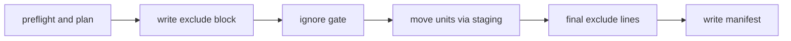

# Sidecar overlay: a personal install inside a team-owned repository

Source, tests, and the policies under `shared/policies/` outrank this page.

A sidecar install is a private, per-clone overlay for a repository that a team owns. It adds a few skills and one short always-on rule per client as Git-ignored files, and it never changes a tracked file. It is not equivalent to the full bootstrap: a full install owns the agent harness, while the sidecar only adds to a harness the team owns.

```bash
uv run python scripts/install_bootstrap.py <team-repo> --mode sidecar
```

`scripts/install_bootstrap.py` detects the mode and hands the target to `install_sidecar` in `scripts/sidecar_overlay.py`; see [Installing the bootstrap](/openwiki/operations/install-ownership-and-runtime-checks.md) for mode detection.

## What it installs and what it never touches

A unit is one skill directory at one write root, or one bridge file. The sidecar writes these units, all defined in `scripts/runtime_ownership.py`:

| Unit | Paths |
| --- | --- |
| Skills (`SIDECAR_SKILLS`) | `debug-investigator`, `humanize`, `ponytail`, `ponytail-review` under both `.claude/skills/` and `.agents/skills/` |
| Ponytail license | `LICENSE` (MIT) inside `ponytail/` and `ponytail-review/` at both roots |
| Claude Code bridge | `.claude/rules/ai-bootstrap-sidecar.md`, no frontmatter |
| Copilot in VS Code bridge | `.github/instructions/ai-bootstrap-sidecar.instructions.md`, with `applyTo: "**"` |

Both bridges carry the same short body from `shared/sidecar/bridge.md`: tracked repository guidance wins over the sidecar, and `ponytail` applies to coding tasks in `full` mode.

The sidecar also keeps three things in the Git directory, where they can never be tracked:

- the manifest `ai-bootstrap-sidecar.json`, which records each owned unit's per-file SHA-256 hashes and the paths of retained files;
- the staging folder `ai-bootstrap-sidecar-staging`, used for atomic moves and emptied by every run;
- one marked block in `info/exclude` (a local, untracked ignore file inside the Git directory, separate from the team's tracked `.gitignore`), between `# BEGIN ai-bootstrap sidecar` and `# END ai-bootstrap sidecar`.

It never installs hooks, changes `core.hooksPath`, creates a nested `.claude` repository, writes MCP configuration or a devcontainer, edits `.gitignore`, or adds custom agents.

## Client support

Support is claimed only where a real client run observed it. `docs/sidecar-provider-contract.md` records the evidence from native runs on 2026-09-25.

| Client | Reads | Bridge | Status |
| --- | --- | --- | --- |
| Claude Code | `.claude/skills/` | `.claude/rules/ai-bootstrap-sidecar.md` | verified |
| OpenAI Codex | `.agents/skills/` | none by design; skills only | verified |
| Copilot in VS Code, Local agent | `.agents/skills/`, `.github/skills/`, `.claude/skills/` | loads both bridges, so it sees the bridge text twice | verified |
| Copilot in VS Code, Agent Host with the Copilot harness | all three folders | `.github/instructions/` bridge | verified |
| Google Antigravity | `.agents/skills/` (documented) | none shipped | unverified for sidecar v1 |

Every verified client loaded skills and bridges that only `info/exclude` hides. Copilot CLI and cloud agents are out of scope.

## Preflight

`install_sidecar` runs these checks in order and aborts before any write, with `sidecar-install: ABORT: <evidence>` and a remedy line on stderr and exit code 1:

1. The source exists and every file in it belongs to a sidecar unit, so `--source dist/multi-agent` is refused.
2. Git is 2.31 or newer, because the sidecar needs `git rev-parse --path-format`.
3. The target is the top level of the main worktree, not a subdirectory and not a linked worktree.
4. The Git directory and the worktree are on the same filesystem, because atomic moves need one filesystem.
5. The manifest, when present, parses and names only paths inside the sidecar namespace.
6. `info/exclude` is not a symlink.
7. No unit path, and no existing ancestor of it inside the worktree, is a symlink.

An invalid manifest gets this remedy: move the manifest aside and rerun with `--mode sidecar`. Units that the exclude block lists and that match current content are then adopted. `tests/test_sidecar_install.py` covers each abort.

## How each unit is classified

The planner, `plan_sidecar_reconciliation`, is pure. The apply step gathers tracked files, on-disk hashes, and ignore status with Git, and the planner turns them into actions. A unit's hash is SHA-256 over its files sorted by relative path, with each record framed as the path, a NUL byte, the file's own hex digest, and a newline.

`_classify_unit` checks these cases in order, and the first match wins:

| State of the unit | Result |
| --- | --- |
| The team tracks a file in it, and the manifest records it | team takeover (see below) |
| The team tracks a file in it, with no record | team-owned: skipped, no exclude line, no record |
| Absent, and still wanted | install (this also reinstalls a deleted owned unit) |
| Absent, recorded, and no longer wanted | drop the record |
| On disk equals the record, and the unit is no longer wanted | remove |
| On disk equals the record and the wanted content | unchanged |
| On disk equals the record, and the wanted content changed | update |
| On disk equals the wanted content, and the sidecar's exclude block already lists the unit | adopt and record |
| Recorded, but the files differ | locally modified: kept, reported |
| Anything else | foreign: skipped, reported, never hidden |

Adoption needs the sidecar's own exclude line, so it never claims or hides a file the sidecar did not plan. It finishes an interrupted install or update, or rebuilds a lost manifest. `tests/test_sidecar_overlay.py` has one case per row.

## Anti-shadowing across every skill folder

A skill name that non-sidecar content already uses is skipped at both write roots. This covers a team-owned, team-taken, or foreign unit at either write root, and any skill of that name in `.github/skills/`, `.agent/skills/`, or `.codex/skills/`. An unchanged or updatable sidecar copy of that skill is removed, a planned install is dropped, and a modified copy is kept and reported.

The rule exists because Copilot's Local agent lists one copy per skill name and prefers `.agents/skills/`. In a native run, a sidecar copy there hid the team's skill of the same name in `.github/skills/`. When the only collision is in one of the read-only folders, the planner adds one `SKIPPED` report naming that folder.

## Team takeover and retained files

A team takeover happens when the team starts tracking a file in a unit the manifest records. Git overwrites an ignored file on checkout without warning, so the planner handles the rest of that unit:

- Untracked files whose bytes match the record are deleted.
- Other untracked files that are currently ignored are kept as retained files, each hidden by its own escaped exact-path line.
- Visible untracked files are left alone and get no line.

The unit loses its record and its unit line. A retained file keeps its line and a `RETAINED` report until it is deleted or tracked; then its entry and line are dropped.

## The exclude block and the ignore gate

Each owned unit gets one anchored line with no trailing slash, for example `/.claude/skills/ponytail`. Exact-path lines escape the gitignore pattern characters `\`, `*`, `?`, and `[`, a leading `!` or `#`, and trailing spaces; non-ASCII text stays raw UTF-8. Without the escaping, a line for `notes[1].md` would hide an unrelated `notes1.md` instead.

After writing the block, `run_ignore_gate` pipes every path that must stay ignored to `git check-ignore --stdin -z` and passes only when the printed set equals that set exactly. Plain `--stdin` exits 0 as soon as one path is ignored, and `-v` exits 0 even for a path a negation rule re-includes, so neither is enough on its own. On failure the installer restores the previous exclude file, and it names each path with the winning rule from `git check-ignore -v -n`. A typical cause is a team `.gitignore` negation such as `!.claude/skills/**`.

## Write order and crash recovery

This diagram shows the order of the writes in a real run.



1. The exclude block gets a line for every unit that is owned after the run, being written, or being removed, plus the exact-path lines of a takeover. Then the gate runs.
2. The staging folder is emptied. Each new unit is built in staging, the old copy is moved into staging, and the new copy is moved into place with `os.replace`. A removed unit is moved into staging, and a takeover's matching files are deleted.
3. The block drops the lines of removed units and deleted files.
4. The manifest is written last, through a temporary file and `os.replace`, and staging is emptied.

The exclude file and the manifest are written only when their bytes change, so a second run with no upstream change writes nothing. There are no intent records. After a crash, each unit is old, new, or absent, and the next run's classification finishes the work: the adopt row takes a new unit whose record was not written, and the install row restores an absent one. `tests/test_sidecar_install.py` injects faults after the exclude write, in the middle of a unit swap, and before the manifest write, and checks that a rerun recovers.

## Dry-run

`--dry-run` runs preflight and planning, then the same gate on the candidate block through a temporary `core.excludesFile` outside the worktree and the Git directory. It prints each action as `would ...` and writes nothing, including the staging folder. Git ranks `info/exclude` above `core.excludesFile`, so the output says the dry-run gate is an approximation and the real run's gate decides.

## Reports and remedies

A run prints `sidecar-install: installed N, updated N, removed N, adopted N, unchanged N`, then one line per skipped or retained path. Per-path skips never fail the run; only a preflight abort exits non-zero.

| Report | Cause | Remedy printed |
| --- | --- | --- |
| `SKIPPED` | the team tracks the path | the repository tracks the path; the sidecar skips the skill at every root |
| `SKIPPED` | a read-only folder already has the skill | the repository has `<folder>/<skill>`; the sidecar skips the skill at every root |
| `SKIPPED` | a recorded unit was edited | delete or restore the path, then rerun to take the current version |
| `SKIPPED` | an unrecorded file is in the way | the sidecar will not replace the path; rename or remove it only if it is not needed |
| `RETAINED` | a file was left behind by a team takeover | delete it or commit it |

## Limits

- Sidecar mode supports only the main worktree. The main worktree's `info/exclude` also hides the sidecar's paths in every linked worktree, because all worktrees share it.
- Worktrees that VS Code or the Codex app create for background sessions contain no sidecar files, unless they are listed in `git.worktreeIncludeFiles` or `.worktreeinclude`.
- Git overwrites an edited sidecar file without warning when the team later commits a file at the same path, so keep personal edits elsewhere.
- `info/exclude` is a convenience, not a security boundary.

## Updating and removing

`scripts/update_consumers.py` updates sidecar consumers through the same `install_sidecar` path, because it passes no `--mode` and the installer detects sidecar evidence. `tests/test_sidecar_update.py` covers updates across two bootstrap versions: changed, added, and removed skills, bridge changes, local edits, team takeovers, a deleted exclude block, a corrupted manifest, and an idempotent second update.

There is no uninstall command. To remove the sidecar by hand:

1. Read `ai-bootstrap-sidecar.json` in the Git directory for the owned unit paths and retained paths.
2. Delete those paths.
3. Delete the marked block in `.git/info/exclude`.
4. Delete the manifest and the `ai-bootstrap-sidecar-staging` folder.

## Representative tests

- `tests/test_sidecar_overlay.py` covers the planner: every classification row, manifest validation, anti-shadowing, team takeover, retained files, escaping against real `git check-ignore`, and plan-apply-plan idempotency.
- `tests/test_sidecar_install.py` covers preflight aborts, a four-client team fixture that stays byte-identical, the ignore gate, dry-run, fault recovery, and reruns.
- `tests/test_sidecar_update.py` covers upgrades and mixed full and sidecar batches.

## Related pages

- [Installing the bootstrap, file ownership, and runtime drift checks](/openwiki/operations/install-ownership-and-runtime-checks.md)
- [Source, generated output, consumer repo, and nested AI state](/openwiki/architecture/source-generated-consumer-layout.md)
- [Agent roster, prompts, and the skill library](/openwiki/architecture/agents-and-skills.md)
