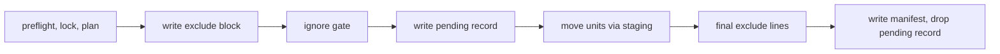

# Sidecar overlay: a personal install inside a team-owned repository

Source, tests, and the policies under `shared/policies/` outrank this page.

A sidecar install is a private, per-clone overlay for a repository that a team owns. It adds Git-ignored files and never changes a tracked file. It comes in two profiles. The `skills` profile adds four skills and one short always-on rule per client. The `workflow` profile adds every eligible skill, the five agents, a relaxed rule set, review profiles, templates, and a personal state folder for plans, memory, and logs, all still hidden from the team's Git. Neither is equivalent to the full bootstrap: a full install owns the agent harness, while the sidecar only adds to a harness the team owns, and the workflow profile ships no hook, no `settings.json`, and no gate, only rules the agents follow.

```bash
uv run python scripts/install_bootstrap.py <team-repo> --mode sidecar                     # skills profile
uv run python scripts/install_bootstrap.py <team-repo> --mode sidecar --profile workflow  # workflow profile
uv run python scripts/install_bootstrap.py <team-repo> --backup-state
uv run python scripts/install_bootstrap.py <team-repo> --uninstall [--purge-state]
```

`scripts/install_bootstrap.py` detects the mode and hands the target to `install_sidecar(target, source, dry_run=..., profile=...)`, `uninstall_sidecar(target, dry_run=..., purge_state=...)`, or `backup_sidecar_state(target, dry_run=...)` in `scripts/sidecar_overlay.py`; see [Installing the bootstrap](/openwiki/operations/install-ownership-and-runtime-checks.md) for mode detection and how the profile and source are chosen.

## What it installs and what it never touches

A unit is one skill directory at one write root, one single-file unit (a bridge, an agent, a rule, an instructions file, a review profile, or a template), or the state folder. The sidecar writes these units, all defined in `scripts/runtime_ownership.py` (`SIDECAR_PROFILES`, `SIDECAR_PROFILE_SKILLS`, `SIDECAR_PROFILE_FILE_UNITS`, `SIDECAR_PROFILE_STATE_ROOT`); `load_desired_units(source, profile)` reads them from `dist/sidecar/<profile>/`:

| Unit | Profile | Paths |
| --- | --- | --- |
| Skills | both | `skills`: `debug-investigator`, `humanize`, `ponytail`, `ponytail-review`; `workflow`: every public skill not listed in `shared/sidecar/workflow/skills.txt` (24 today); each under both `.claude/skills/` and `.agents/skills/`, copied whole |
| Ponytail license | both | `LICENSE` (MIT) inside `ponytail/` and `ponytail-review/` at both roots |
| Claude Code bridge | `skills` | `.claude/rules/ai-bootstrap-sidecar.md`, no frontmatter |
| Copilot in VS Code bridge | `skills` | `.github/instructions/ai-bootstrap-sidecar.instructions.md`, with `applyTo: "**"` |
| Agents | `workflow` | `.claude/agents/<id>.md` for `orchestrator`, `planner`, `coder`, `reviewer`, `documenter`, rendered from each agent's `workflow-prompt.md` with no `mcp__` tool grant |
| Rules | `workflow` | `.claude/rules/ai-bootstrap-workflow.md`, `ai-bootstrap-reporting.md`, `ai-bootstrap-tool-routing.md` |
| Copilot instructions | `workflow` | `.github/instructions/ai-bootstrap-workflow.instructions.md`, with `applyTo: "**"` |
| Review profiles | `workflow` | `.claude/review-profiles/<name>.md` |
| Templates | `workflow` | `.claude/templates/plan-big.md`, `plan-small.md`, `session-log.md`, `quality-report.md`, relaxed variants that name no verifier or receipt |
| State folder | `workflow` | `.ai-bootstrap/` at the repository root with `MEMORY.md` and the `plans/`, `session_logs/`, `explorations/`, `quality_reports/` READMEs as seeds; hidden by the one line `/.ai-bootstrap` |

Both bridges carry the same short body from `shared/sidecar/bridge.md`: tracked repository guidance wins over the sidecar, and `ponytail` applies to coding tasks in `full` mode. The workflow rules describe a relaxed loop (read memory, plan when a task spans several files, implement, run the project's own checks, review a non-trivial diff, log the session) that nothing enforces. No `.github/agents` or `.codex/agents` file ships in either profile, because neither Copilot nor Codex has a config-free way to discover a custom agent from an ignored file; `docs/sidecar-provider-contract.md` records the native runs behind that.

The sidecar also keeps six things in the Git directory, where they can never be tracked:

- the manifest `ai-bootstrap-sidecar.json`, which records the profile it was written for (`schema_version` 2; a version-1 manifest has no `profile` key and reads as `skills`, and the next run rewrites it as version 2), each owned unit's per-file SHA-256 hashes, and the paths of retained files; the state folder has no record, only its exclude line;
- the pending ownership record `ai-bootstrap-sidecar.json.next`, the next manifest written before any unit moves and removed once the real manifest lands, so an interrupted update can still prove which bytes are the sidecar's own;
- the staging folder `ai-bootstrap-sidecar-staging`, used for atomic moves and emptied by every run;
- the preserved-copy folder `ai-bootstrap-sidecar-preserved`, which holds edited copies moved out of the client folders and which the sidecar never empties;
- the lock file `ai-bootstrap-sidecar.lock`, an empty file that a real run holds with a non-blocking `flock` from after preflight to the end of apply, so a second run in the same clone is refused with `another sidecar run is active in <target>`; a dry run takes no lock, and the file stays behind;
- one marked block in `info/exclude` (a local, untracked ignore file, separate from the team's tracked `.gitignore`), between `# BEGIN ai-bootstrap sidecar` and `# END ai-bootstrap sidecar`.

It never installs hooks, changes `core.hooksPath`, creates a nested `.claude` repository, writes MCP configuration or a devcontainer, or edits `.gitignore`. Only the `workflow` profile adds agents, and only as Claude Code files. It never deletes, moves, or writes anything inside a nested repository or a submodule.

## Client support

Support is claimed only where a real client run observed it. `docs/sidecar-provider-contract.md` records the evidence from native runs on 2026-09-25.

| Client | Reads | Bridge | Status |
| --- | --- | --- | --- |
| Claude Code | `.claude/skills/` | `.claude/rules/ai-bootstrap-sidecar.md` | verified |
| OpenAI Codex | `.agents/skills/` | none by design; skills only | verified |
| Copilot in VS Code, Local agent | `.agents/skills/`, `.github/skills/`, `.claude/skills/` | loads both bridges, so it sees the bridge text twice | verified |
| Copilot in VS Code, Agent Host with the Copilot harness | all three folders | `.github/instructions/` bridge | verified |
| Google Antigravity | `.agents/skills/` (documented) | none shipped | unverified for sidecar v1 |

Every verified client loaded skills and bridges that only `info/exclude` hides. Copilot CLI and cloud agents are out of scope.

## Preflight

Install and uninstall share one preflight, `_run_target_preflight`. Every check runs before any write, in the real run and in `--dry-run`, and a failure prints `sidecar-install: ABORT: <evidence>` with a remedy and exits 1:

1. For an install only, the source exists and holds exactly the profile's sidecar source set: every skill's `SKILL.md` at both roots, both Ponytail licenses, every single-file unit, and the state seeds, with any extra file inside a shipped skill folder allowed and nothing else. A half-built `dist/sidecar/<profile>/` or `--source dist/multi-agent` is refused.
2. Git is 2.31 or newer, because the sidecar needs `git rev-parse --path-format`.
3. The target is a Git repository, is the top level of its worktree, and is not a linked worktree.
4. The Git directory and the worktree are on the same filesystem, because atomic moves need one filesystem.
5. The manifest, staging, preserved-copy, and `info/exclude` paths are built from the Git directory, never through `--git-path`, which resolves symlinks. Each is checked with `lstat`: none may be a symlink, the manifest and exclude file must be regular files, and the two folders must be real folders. `info/` itself must be a real folder, neither a symlink nor a file. A named pipe is refused without being opened. An exclude file that exists but cannot be read aborts with `cannot read <exclude>: <strerror>`; during mode detection the same file counts as sidecar evidence, `unreadable <path> (<strerror>)`, so a full install never guesses past it.
6. The manifest, when present, parses and names only paths inside the sidecar namespace (every profile's write roots, single-file units, retired units, and the state root). A pending record `ai-bootstrap-sidecar.json.next` that is a regular file and parses is loaded too; one that does not parse is ignored here and removed by the next real run.
7. No nested repository or submodule sits at or above a skill write root, a single-file unit's parent folder, or the state root, and every existing ancestor of those paths is a real folder on the target's device. A state root that exists as a file or a symlink is refused here too. Skill folders themselves follow the unit-level rule in the next section.
8. No tracked path sits under either state root, `.ai-bootstrap/` or the legacy `.claude/ai-bootstrap/`; a team that tracks anything there makes the run abort before any write, the same way any other tracked-path collision does.
9. The sidecar markers in `info/exclude` form exactly one BEGIN line followed by one END line. Anything else is refused, naming the line numbers, because an orphan BEGIN would otherwise let a run erase the person's own ignore lines.

After preflight, the run gathers each unit's state from disk and the index, then plans. These checks also run before any write:

- Gathering asks `git check-ignore` which untracked files are already ignored. A Git exit other than 0 or 1, such as 128 for a path inside a submodule, raises `GitCheckIgnoreError`, and the run aborts with Git's own message instead of planning from a partial answer.
- The device check also runs on every existing skill folder, so a folder on another filesystem is refused before a move could fail.
- A symlinked ancestor of a planned unit aborts the run, because sidecar mode does not support a symlinked skill folder or projection parent. A symlink inside a unit does not abort; it makes the unit incomplete.
- A recorded or listed skill folder that holds a nested repository aborts the run, as the next section describes.
- A folder that a move must change must be writable: every folder inside a unit being removed, the parent of every file a team takeover deletes, the nearest existing ancestor of every preserve destination, and the Git directory itself (with `info/` when it is a folder), because staging, the pending record, and the manifest live there. The check runs in the dry run as well.

After preflight a real run takes the lock, and everything from gathering to the last write runs inside one `OSError` handler. A permission error, a full disk, or a folder that vanished mid-run ends with `ABORT: filesystem error at <path>: <strerror>` and the remedy to fix the cause and rerun; the run stopped part-way and a rerun picks up where it stopped. An unreadable regular file inside a unit does not abort; it makes the unit incomplete, as the ownership section describes.

An invalid manifest gets this remedy: move the manifest aside and rerun with `--mode sidecar`. Units that the exclude block lists are then recovered: matching units are adopted, and any other listed unit is kept hidden and reported. `tests/test_sidecar_install.py` covers each abort in both the real run and the dry run.

## Repository boundaries at skill folders

The outer repository's `info/exclude` does not apply inside a submodule, and the files of a nested repository belong to that repository. Gathering therefore stops at a gitlink (a submodule entry, mode `160000`, in the index) and at a `.git` entry, at any depth, and never hashes or follows anything below either one.

Each skill folder then falls into one of these cases:

- The folder is itself a gitlink. It is team-owned: the run drops any record, plans no file action, and reports that the sidecar never touches files inside a submodule and skips the skill at every root.
- The folder holds a `.git` entry that is not inside a gitlink, and the manifest records the unit or the exclude block lists it. The run aborts before any write, with a message that sidecar mode does not support the nested repository or submodule at that path and that nothing was written.
- The folder holds such a `.git` entry, but the sidecar never recorded or listed it, as with a personal clone. The unit is foreign: its skill is taken, and nothing inside it is touched.

A gitlink can also sit below a skill folder, for example a team skill that carries its own submodule in `vendor/`. Its paths are never sent to `git check-ignore`, and a retained or listed file line under it is dropped and reported as now visible. `tests/test_sidecar_install.py` covers every case through real Git, including a real `git submodule add` at a recorded unit.

## How ownership is decided

The planner, `plan_sidecar_reconciliation`, is pure. The apply step gathers Git and disk state, and the planner turns it into actions. A unit's hash is SHA-256 over its files sorted by relative path, with each record framed as the path bytes, a NUL byte, the file's own hex digest, and a newline.

Ownership comes from the Git index, not from files on disk. A unit is tracked when the index has any entry at or under its path, including `skip-worktree`, intent-to-add, gitlink, and symlink entries, even when the file is deleted from disk. This holds for every single-file unit (a bridge, an agent, a rule, a review profile, or a template) as well as a skill folder: a team that commits a file at or under a unit's path makes that unit team-owned, so the sidecar drops its record and never moves it. When `core.ignorecase` is true, index paths are compared without regard to case. The sidecar never restores or writes over a deleted tracked file.

"Listed" below means the sidecar's own exclude block has the unit's line. `_classify_unit` checks these cases in order, and the first match wins:

| State of the unit | Result |
| --- | --- |
| The unit path is a gitlink | gitlink: team-owned, skipped, nothing inside it is touched |
| Tracked, and recorded in the manifest or listed | team takeover (see below) |
| Tracked, neither recorded nor listed | team-owned: skipped, no exclude line, no record |
| Absent, or a folder holding only folders, and still wanted | install (this also reinstalls a deleted owned unit) |
| Absent, recorded, and no longer wanted | drop the record |
| Complete, equals the record, and no longer wanted | remove |
| Complete, equals the record and the wanted content | unchanged |
| Complete, equals the record, and the wanted content changed | update |
| Complete, equals the wanted content, and listed or recorded | adopt and record |
| Complete, and equals the pending record from an interrupted update | update to the wanted content, or remove when nothing is wanted |
| Recorded, but different or incomplete | locally modified: kept, reported |
| Listed, with no record | unfinished sidecar copy: kept hidden by its line, reported |
| Anything else | foreign: skipped, reported, never hidden |

The pending-record row is what lets an update interrupted between the unit swap and the manifest write converge on a rerun with a newer bootstrap: the units on disk match neither the old record nor the new content, but they match the record the run wrote before it moved them. The record is evidence only and never drives an action by itself.

A unit is incomplete when it holds a symlink, named pipe, socket, device, empty subfolder, unreadable subfolder, or unreadable file at any depth. The unit hash cannot represent those entries, so an incomplete unit never matches its record or the wanted content, and a run never deletes it as an unchanged copy. A folder that holds no non-folder entry at any depth still counts as absent, so install replaces an empty leftover folder.

A symlink or a plain file at a unit path is classified like any other entry: a tracked one is team-owned, a recorded one is locally modified, and an untracked, unrecorded one is foreign. Adoption needs a record or the sidecar's own exclude line, so it never claims or hides a file the sidecar did not plan. It finishes an interrupted install or update, or rebuilds a lost manifest. `tests/test_sidecar_overlay.py` has cases for every row.

The state folder is the one unit that never enters this table. `_classify_state_unit` never hashes or compares it: an absent folder is seeded from the profile's seed files (one `install` unit in the summary); an existing folder gets one `seed_missing` action per seed file it lacks, printed as `seeded <path>`, and nothing already there is ever touched; its exclude line is kept even when the active profile has no state root, so switching to `skills` keeps an existing folder hidden. Under uninstall it is kept in place and reported as `RETAINED .ai-bootstrap: kept .ai-bootstrap and its exclude line; pass --purge-state to remove it`, or, with `--purge-state`, moved into the preserved-copy folder as `state--<UTC timestamp>` (with `-2`, `-3` appended while that name exists or is already reserved by another state root in the same run) and reported as `PRESERVED`. A retained legacy `.claude/ai-bootstrap/` gets the same treatment as its own unit.

`backup_sidecar_state` copies every existing state root to the same place without touching anything else. It runs the shared preflight, so a symlinked state folder or preserved-copy folder is refused. A real backup takes the run lock, copies into a temporary folder created inside the preserved-copy folder, and gives the copy its `state--<timestamp>` name with `os.rename` only after the copy succeeds. A filesystem failure prints `ABORT: filesystem error at <path>: <reason>` and removes only this run's partial copy; if that cleanup fails too, the message names the incomplete path. It prints `backed up <folder> -> <destination>`, `would back up ...` in a dry run (which takes no lock), or `no state folder found; nothing to back up`. The lock serializes sidecar commands only, so another editor can still change the folder during a copy.

## State folder location and migration

The state folder lives at `.ai-bootstrap/` (`SIDECAR_STATE_ROOT`), outside `.claude/`, because Claude Code refuses agent writes anywhere under `.claude/`, even an ignored path; `docs/sidecar-provider-contract.md` records the native write gate. Earlier workflow installs used `.claude/ai-bootstrap/` (`SIDECAR_LEGACY_STATE_ROOT`), which the installer still recognizes but never seeds.

Before planning, a workflow install or update calls `_legacy_state_migration_outcome`, which reads only whether each root is a folder and whether the sidecar's own exclude block lists the legacy root. That listing is the only ownership evidence; a folder with familiar file names is not enough.

| Folders found | Outcome |
| --- | --- |
| neither | seed `.ai-bootstrap/` as usual |
| only `.ai-bootstrap/` | keep it; seed only missing files |
| only `.claude/ai-bootstrap/`, listed in the block | migrate |
| only `.claude/ai-bootstrap/`, not listed | refuse before any write: the run will not claim an unrecognized folder |
| both | refuse before any write: back up both, decide which holds current work, remove the other by hand |

`_perform_legacy_state_migration` runs under the install lock:

1. It adds the `/.ai-bootstrap` line next to the legacy line and proves the new root ignored with the ignore gate; on failure it restores `info/exclude` to its original bytes.
2. It refuses a legacy folder on a different filesystem than the target, before any backup is made, and restores `info/exclude`.
3. It makes a full backup with the same copy helper as `--backup-state`, copying a symlink inside the folder as a symlink.
4. It rechecks that `.ai-bootstrap/` is still absent, then renames the folder with `os.rename`, never merging, and prints `moved <old> -> <new>`.
5. Ordinary reconciliation then runs in the same call, and drops the old exclude line because the old folder no longer exists.

Fault points `after_legacy_state_backup` and `after_legacy_state_rename` let tests interrupt the migration; a rerun converges without moving or resetting the state again. A dry run prints `would back up ...` and `would move ...` and writes nothing. Skills-profile runs and plain `--uninstall` leave a legacy folder where it is, and a later workflow install migrates it.

## Team precedence

The planner decides which skills are taken before it settles any unit's action. It decides for every shipped skill and for the skill of every unit the run must handle, so a skill that a newer bootstrap dropped follows the same rule while its recorded copies remain. A skill is taken when any of these holds:

- a write-root unit for it is team-owned, a team takeover, a gitlink, or foreign;
- `.github/skills/`, `.agent/skills/`, or `.codex/skills/` has an entry with its name;
- the index has an entry under a read folder for that name;
- a non-sidecar `SKILL.md` in a read folder declares it as its frontmatter `name:`;
- `core.ignorecase` is true and a case variant of its name exists in any read folder, including a write root.

The same rule, without the frontmatter source, decides the workflow profile's agents, the one other unit kind with more than one folder of its own (`.claude/agents` is the write root; `.github/agents`, `.codex/agents`, and `.agents/agents` are read-only). An entry's identity is its name up to the first dot (`_entry_id`), because each client keeps an agent in its own shape: `reviewer.md`, `reviewer.agent.md` (Copilot), `reviewer.toml` (Codex), or the folder `reviewer/`, which holds `agent.md` (Antigravity). Any of those, on disk or in the index, takes the agent `reviewer`, and the report names the entry that took it. A rule, review profile, template, or instructions file has only its one folder, so its own team-owned or foreign classification covers it.

Folder names, agent entries, and frontmatter names come from one enumerator, `_enumerate_read_entries`, so every scan follows the same path-identity rule:

- A read folder, or an entry in one, is an alias when its resolved path differs from its own path and lies inside a write root. An alias only mirrors the sidecar's own copies and contributes nothing, whether the link is the folder itself (`.github/skills -> ../.claude/skills`), a parent above it (`.agent -> .claude`, which makes `.agent/skills/<x>` an alias although `.agent/skills` is not a link), or one entry inside it.
- Every other entry, including a broken symlink or a folder reached through a link that resolves outside the write roots, is listed by its own name. Write roots are listed directly, so a case variant or a differently named folder there is seen.

A frontmatter `name:` is read from the first 4096 bytes of a `SKILL.md`, decoded with replacement for any cut character and with a leading byte-order mark stripped, so a team skill whose body is non-ASCII still declares its name. A closing `---` beyond that window declares nothing; that limit is accepted and documented by a test.

A taken skill or agent may only end with an allowed outcome. `_convert_for_taken_skill` turns a planned install into nothing, an unchanged, updated, or adopted copy into a removal, and a locally modified or unfinished copy into a preserve. A new outcome kind that the table does not cover fails loudly instead of slipping past, which is how an adopted copy once escaped. The report names every path that took the skill, and a property test asserts that no taken skill ever keeps, installs, updates, or adopts a copy.

The rule exists because Copilot's Local agent lists one copy per skill name and prefers `.agents/skills/`. In a native run, a sidecar copy there hid the team's skill of the same name in `.github/skills/`.

## Preserved copies

When a skill is taken and the person edited a sidecar copy of it, the copy is moved, never deleted. The destination is `<git dir>/ai-bootstrap-sidecar-preserved/<unit path with "/" replaced by "__">--<content hash>`, one level deep: a folder for a skill and a file for a bridge. An incomplete copy is moved whole, with every entry intact. The run prints `PRESERVED <unit> -> <path>`, drops the unit's record, and drops its exclude line.

A move never overwrites anything. When the destination already exists, the unit stays in place with its record and line, and the report names both paths as a conflict. While that conflict keeps an edited copy, the skill's other taking paths are reported as keeping the skill until the conflict is resolved, not as skipped at every root. The Git directory is out of reach of `git checkout` and `git clean`, so a preserved copy stays until the person copies it back or deletes it on purpose.

## Team takeover and retained files

A team takeover happens when the team starts tracking a file in a unit the manifest records or the block lists. Git overwrites an ignored file on checkout without warning, so the planner handles the rest of that unit:

- Untracked files whose bytes match the record, the wanted content, or the pending record of an interrupted update are the sidecar's own and are deleted.
- Other untracked files that are currently ignored are kept as retained files, each hidden by its own escaped exact-path line. A retained name may contain a backslash; the manifest writer validates every retained path before rendering, so the sidecar never records a path its own parser refuses.
- An untracked symlink has no hash to match, so it is never deleted. It is retained with its own line when ignored, like a file that matches nothing.
- A retained name that gitignore cannot express, one with a newline or a trailing carriage return, gets no line and is reported instead.
- Visible untracked entries are left alone and get no line.

The unit loses its record and its unit line. A retained file keeps its line and a `RETAINED` report until it is deleted or tracked; then its entry and line are dropped. A file-level line in the block keeps hiding its file even when the manifest is lost. The owning unit of every file line is always gathered, so a retained file of a skill that a later bootstrap version dropped keeps hiding, and uninstall reports it as now visible.

## The exclude block and the ignore gate

Each owned unit gets one anchored line with no trailing slash, for example `/.claude/skills/ponytail`. Exact-path lines escape the gitignore pattern characters `\`, `*`, `?`, and `[`, a leading `!` or `#`, and trailing spaces. Without the escaping, a line for `notes[1].md` would hide an unrelated `notes1.md` instead.

Every exclude-block reader and writer splits lines on `\n` only, as Git does, and ignores one trailing carriage return when comparing. Python's `str.splitlines()` also splits on characters such as a form feed or U+2028. That would turn one escaped retained-file line into two patterns, and the extra pattern could hide unrelated team files.

Reading the block, the planner sorts each line into a unit line, a file line, or a line it does not recognize. An unrecognized line is kept on every run and reported once, so a run never un-hides a file through a line it does not understand; a blank line is kept without a report. The block is written as the sidecar's own lines, sorted, followed by the person's unrecognized lines in their original order, because gitignore's last matching rule wins and re-sorting `*.tmp` and `!keep.tmp` would hide a file that was visible.

The planner returns the gate paths next to the exclude lines. On install and update the gate checks every unit and file path the write-phase block lists, including unfinished and locally modified units and retained files, not only manifest records and actions. `run_ignore_gate` pipes those paths to `git check-ignore --stdin -z` and passes only when the printed set equals that set exactly.

A skill unit that is a real folder, or absent, is gated as `<unit>/`, so a team rule ending in `/`, such as `!.claude/skills/*/`, is caught before the folder exists. A unit that exists as a symlink or another non-folder is gated as `<unit>`, because Git refuses a trailing slash beyond a symlink. On failure the installer restores the previous exclude file and names each path that is not ignored, with its winning rule from `git check-ignore -v -n -z --stdin`; a correctly ignored path is never listed. A Git exit other than 0 or 1 also restores the exclude file and aborts with Git's message. When Git names no rule for a path, the message says that a rule ending in `/`, or a plain negation naming the folder below the block or in a `.gitignore`, may be un-ignoring it.

Every Git path is handled as bytes (`os.fsdecode` and `os.fsencode`), so a legal but non-UTF-8 file name never crashes a run.

## Write order and crash recovery

This diagram shows the order of the writes in a real install or update.


```mermaid
flowchart LR
    P[preflight, lock, plan] --> E[write exclude block]
    E --> G[ignore gate]
    G --> N[write pending record]
    N --> U[move units via staging]
    U --> F[final exclude lines]
    F --> M[write manifest, drop pending record]
```

1. The exclude block gets a line for every unit that is owned after the run, being written, removed, or preserved, plus the exact-path lines of a takeover. Then the gate runs.
2. The next manifest is written to `ai-bootstrap-sidecar.json.next` before any unit moves.
3. The staging folder is emptied. Each new unit is built in staging, the old copy is moved into staging, and the new copy is moved into place with `os.replace`. A removed unit is moved into staging, a preserved unit is moved into the preserved-copy folder, and a takeover's matching files are deleted.
4. The block drops the lines of removed and preserved units and of deleted files.
5. The manifest is written last, through a temporary file and `os.replace`, the pending record is unlinked, and staging is emptied.

Every write of the exclude file, the manifest, or the pending record goes through `_atomic_write`: a temporary file in the same folder, `fsync`, `os.replace`, and an `fsync` of the folder. An existing file keeps its mode, so a group-shared `info/exclude` does not drop to `0600`; a new file gets `0o666` less the umask. The exclude file and the manifest are written only when their bytes change.

There are no intent records: the pending record is ownership evidence and never drives an action on its own. After a crash, each unit is old, new, or absent, and the next run's classification finishes the work: the adopt row takes a new unit whose record was not written when the same source is rerun, the pending-record row takes it when a newer source is rerun, and the install row restores an absent one. Tests inject faults after the exclude write, in the middle of a unit swap, and before the manifest write, rerun with the same and with a newer bootstrap version, and add an uninstall after each; uninstall adds a fault after its units are removed, and the state migration adds faults after its backup and after its rename. Each rerun converges. Uninstall follows the same order, as described below.

## Dry-run

`--dry-run` runs preflight and planning, then the same gate on the candidate block through a temporary `core.excludesFile` outside the worktree and the Git directory. It prints each action as `would ...` and writes nothing, including the staging folder, the pending record, and the lock file. It never prints a past-tense `removed`, `deleted`, `seeded`, or `PRESERVED ... ->` line for an action, and remedy texts use "would" wording, because `_print_report` skips those lines when `dry_run` is set. Git ranks `info/exclude` above `core.excludesFile`, so the output says the dry-run gate is an approximation and the real run's gate decides.

## Reports and remedies

An install prints `installed N, updated N, removed N, adopted N, unchanged N, preserved N, seeded N`, then, in a real run only, one line per removed, deleted, seeded, or preserved path, then one line per report. Per-path skips never fail an install. A remedy names a workflow unit by its kind word (`_unit_kind_word`: `the agent \`reviewer\``, `the rule \`ai-bootstrap-workflow\``, `review profile`, `template`, `state`); skills and the two original bridges keep the plain wording below. A unit's display name is the file name up to its first dot (`_unit_name`), so the Copilot instructions unit is `ai-bootstrap-workflow`.

| Report | Cause | What the remedy says |
| --- | --- | --- |
| `SKIPPED` | the team tracks a path in the unit | the repository tracks that path; the sidecar skips the skill at every root, or does not install the bridge; during uninstall, the sidecar leaves the skill alone |
| `SKIPPED` | the skill folder is a submodule | the sidecar never touches files inside a submodule and skips the skill at every root; during uninstall, it leaves the skill alone |
| `SKIPPED` | another path takes the skill name, or a team agent in any agent folder takes an agent | names that path; the sidecar skips the skill (or agent) at every root |
| `SKIPPED` | another path takes the skill while a preserve conflict keeps an edited copy | names that path; the skill is kept in place until its edited-copy conflict is resolved |
| `SKIPPED` | a recorded unit was edited or is incomplete | the copy is kept; a pull can overwrite hidden files; to take the current version, copy your edits elsewhere, delete the path, and rerun |
| `SKIPPED` | a listed copy has no record | the folder is listed by the sidecar's exclude block but never recorded, so the sidecar cannot verify it; it stays hidden; copy anything you need, delete it, and rerun |
| `SKIPPED` | an edited copy of a taken skill cannot move because the destination exists | the copy stays in place; resolve the two copies by hand, then rerun |
| `SKIPPED` | an unrecorded entry is in the way | the sidecar will not replace it and skips the skill at every root; during uninstall, it leaves the path alone |
| `PRESERVED` | an edited copy of a taken skill was moved | where the copy now lives; for a listed copy with no record, that it was listed but never recorded |
| `RETAINED` | a file was left behind by a team takeover | it stays hidden and a pull can overwrite it; move it out, or commit it with `git add -f` |
| `RETAINED` | a retained file now sits inside a submodule, or uninstall un-hid it | it is now visible to `git add -A`; when a team rule still ignores it after uninstall, that it is no longer hidden by the sidecar but a team rule still ignores it |
| `RETAINED` | a block line the sidecar does not recognize | the line is kept; move it outside the block to keep it, or delete it |
| `RETAINED` | the state folder under plain `--uninstall` | `kept .ai-bootstrap and its exclude line; pass --purge-state to remove it` |
| `PRESERVED` | the state folder under `--uninstall --purge-state` | where it was moved: `<git dir>/ai-bootstrap-sidecar-preserved/state--<UTC timestamp>` |

Every printed path passes through `_printable`, which escapes bytes that are not valid UTF-8 as `\xNN`, so a report line for such a name neither crashes the run nor emits a lone surrogate.

## Uninstall

`--uninstall` removes the overlay through the same preflight, the same planner, and the same write order and apply step as an install. With no manifest and no block, it prints where the preserved-copy folder is if that folder holds anything, then prints `no sidecar found; nothing to do` and exits 0.

Otherwise it gathers every well-known unit of every profile, including retired skill roots and retired bridges, and plans against an empty wanted set, so a `workflow` install and a `skills` install are removed by the same command with no `--profile`. Every classified unit is taken, including a skill the current bootstrap no longer ships, except the state folders (`.ai-bootstrap/` and a retained legacy `.claude/ai-bootstrap/`), each kept unless `--purge-state` is passed. Uninstall never refuses because both state roots exist; it handles each one separately:

- a unit whose content matches its record is removed;
- an edited or unfinished copy, including an incomplete one and a bridge, is preserved in the preserved-copy folder;
- team, submodule, and foreign content is never touched;
- a retained file loses its line and is reported as now visible to `git add -A`, unless `git check-ignore` against the final exclude text shows a team rule still ignores it, in which case the report says so;
- a block line the sidecar does not recognize is written back as a plain line where the block was, in its original order;
- the state folder's line stays inside a block that survives the uninstall (the block is kept whenever one of the sidecar's own lines remains), or is dropped with `--purge-state`.

The run then follows the install's order:

1. It writes the write-phase block. A rerun with no block and no line to write leaves the exclude file alone.
2. It runs the gate over only the paths whose lines the final block keeps. That set is empty unless a preserve conflict keeps a unit, so a team rule that exposes a path being removed never blocks an uninstall. A person's own negation that exposes a kept unit fails the gate, and the run restores the exclude file before any unit moves.
3. It empties staging and applies the actions through the same `_apply_actions` step as an install.
4. With no conflict and no kept state folder, it removes the block, deletes the manifest and the pending record, removes the staging folder, and removes `.claude/skills`, `.agents/skills`, `.claude/rules`, `.claude/agents`, `.claude/review-profiles`, `.claude/templates`, `.github/instructions`, and then `.claude`, `.agents`, and `.github` when each is empty, never a folder that holds anything. The same empty-folder cleanup runs at the end of every install, so switching from `workflow` to `skills` leaves no empty `.claude/templates`. With a conflict, it writes the final block and a manifest that holds only the kept units' records, empties staging, and exits 1.

Every run ends by printing `preserved copies are in <folder>; the sidecar never empties this folder` when that folder holds anything. The exit code depends only on the units a preserve conflict actually kept (`kept_conflicts`), so a preserve conflict is the only case where uninstall writes and still exits 1. Uninstall can also refuse before any write, with exit 1, on the same grounds as an install: a symlinked or nested-repository unit, an unwritable folder or preserved-copy root, a failed ignore proof for a unit it must keep, or a filesystem error. `tests/test_sidecar_uninstall.py` covers each path through real Git, including a dropped skill, a retired root and retired bridges, a team negation added after install, both crash points, and dry-run.

## Profile switching

`--profile skills` on a `workflow` install removes the workflow-only units through the ordinary remove-and-preserve rules and keeps the state folder in place and hidden. `--profile workflow` on a `skills` install adds the missing units and seeds the state folder. A manifest recording a different profile than the flag is an ordinary update, not an error, in either direction, and a rerun without `--profile` keeps the manifest's profile. Switching never touches the state folder's contents, except that switching back to `workflow` migrates a retained, owned legacy `.claude/ai-bootstrap/` as described above.

## Limits

- Sidecar mode supports only the main worktree. The main worktree's `info/exclude` also hides the sidecar's paths in every linked worktree, because all worktrees share it.
- Worktrees that VS Code or the Codex app create for background sessions contain no sidecar files, unless they are listed in `git.worktreeIncludeFiles` or `.worktreeinclude`.
- Git overwrites a hidden sidecar file without warning when the team later commits a file at the same path, so keep personal edits elsewhere.
- `info/exclude` is a convenience, not a security boundary.
- `git clean -x` (or `-fdx`) deletes ignored files, including the state folder. That is the one Git command that can destroy the workflow profile's plans, memory, and logs; `--backup-state` copies the folder into the Git directory, which `git clean` never touches, and a later install reseeds an empty folder.

## Updating

`scripts/update_consumers.py` updates sidecar consumers through the same `install_sidecar` path, because it passes no `--mode` and the installer detects sidecar evidence. It passes no `--profile` or `--source` either, so each consumer is updated in the profile its manifest records. It never passes `--uninstall`. `tests/test_sidecar_update.py` covers updates across two bootstrap versions: changed, added, and removed skills, bridge changes, local edits, team takeovers, a deleted exclude block, a corrupted manifest, and an idempotent second update. The README keeps a safe manual fallback for removal, which never deletes retained files or the preserved-copy folder.

## Representative tests

- `tests/test_sidecar_overlay.py` covers the planner: every classification row, team precedence as a property test with real `adopt` and `unchanged` fixtures, preserve and conflicts, block parsing, manifest validation, escaping against real `git check-ignore`, and plan-apply-plan idempotency.
- `tests/test_sidecar_install.py` covers preflight aborts, index-based ownership (sparse checkout, `skip-worktree`, gitlinks, deleted tracked files), repository boundaries at skill folders, incomplete units (pipes, sockets, empty subfolders, inner symlinks, a plain file), symlinked read folders, aliases, and case variants, frontmatter names, the gate (directory-only rules, symlink units, unfinished units, fatal Git errors), line splitting, non-UTF-8 names, dry-run, fault recovery, and reruns.
- `tests/test_sidecar_update.py` covers upgrades and mixed full and sidecar batches.
- `tests/test_sidecar_uninstall.py` covers uninstall, dropped skills and retired units, preserve conflicts with the gate, team rules that never block, crash convergence, and refusals.
- `tests/test_sidecar_workflow_scenario.py` runs the workflow profile end to end against a real team repository with a tracked `.claude/settings.json`, a team skill, agent, and rule: dry run, install, rerun with personal edits, both profile switches, backup (including a dry run), uninstall that keeps the state, purge, and reseed; a version-1 manifest upgrading in place; a team rule and team agents in each client's own file shape taking the sidecar's units; tracked and foreign review profiles and templates winning by name; the legacy-state migration, its refusals, its fault-point reruns, and its dry run; backup lock contention and failure injection; a tracked path under the state root aborting; `git clean -fdx` losing the state while the backup survives; and a mixed `skills` and `workflow` batch through the updater. `git status --porcelain --untracked-files=all` is asserted unchanged at every step.

## Related pages

- [Installing the bootstrap, file ownership, and runtime drift checks](/openwiki/operations/install-ownership-and-runtime-checks.md)
- [Source, generated output, consumer repo, and nested AI state](/openwiki/architecture/source-generated-consumer-layout.md)
- [Git-backed AI-state sync](/openwiki/operations/git-backed-ai-state-sync.md)
- [Agent roster, prompts, and the skill library](/openwiki/architecture/agents-and-skills.md)
- [Quickstart](/openwiki/quickstart.md)
