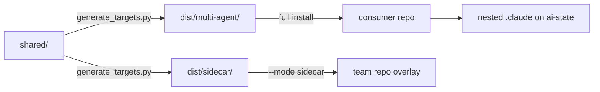

# Quickstart: where to look for what

Source under `shared/`, `scripts/`, and `tests/`, and the policies under `shared/policies/`, outrank every page in this wiki. When a page and the code disagree, the code is right; the page is refreshed, never hand-edited.

## The repository in one picture

This diagram shows how content moves from authoring source to a consumer.



This repository is a source-of-truth plus generated bootstrap for AI coding agents, not an application. Hooks enforce a plan-driven lifecycle, and `shared/scripts/verify.py` produces the receipts the commit and push gates check.

## Route by task

| I want to... | Read | Then open |
| --- | --- | --- |
| understand what lives where and why `dist/` and `.claude/` are ignored | [Source, generated output, consumer repo, and nested AI state](/openwiki/architecture/source-generated-consumer-layout.md) | `README.md`, `scripts/generate_targets.py` |
| classify a request, start a phase, or close one out | [Task lanes and the enforced lifecycle](/openwiki/workflows/lifecycle-and-task-lanes.md) | `shared/policies/workflow.instructions.md`, `shared/templates/plan-small.md` |
| understand why a commit, push, or PR was denied | [Deterministic verification](/openwiki/operations/deterministic-verification.md), then [Hook dispatcher and guardrail scripts](/openwiki/architecture/hooks-and-guardrails.md) | `shared/scripts/verify.py`, `docs/runtime-checks.md` |
| add or change an agent, a review profile, or a skill | [Agent roster, prompts, and the skill library](/openwiki/architecture/agents-and-skills.md) | `shared/agents/<id>/agent.yaml`, `shared/skills/<name>/SKILL.md`, `scripts/validate_targets.py` |
| add or change a hook or guardrail | [Hook dispatcher and guardrail scripts](/openwiki/architecture/hooks-and-guardrails.md) | `shared/hooks/scripts/`, the hook wiring in `scripts/generate_targets.py`, `tests/test_hook_gates.py` |
| choose an install mode, understand why a plain install refused, install or refresh a full consumer, run a batch update, or refresh this repository's own overlay | [Installing the bootstrap, file ownership, and runtime drift checks](/openwiki/operations/install-ownership-and-runtime-checks.md) | `scripts/install_bootstrap.py`, `scripts/runtime_ownership.py`, `scripts/update_consumers.py` |
| add a personal overlay to a team-owned repository, or act on a `SKIPPED` or `RETAINED` report | [Sidecar overlay](/openwiki/operations/sidecar-overlay.md) | `scripts/sidecar_overlay.py`, `docs/sidecar-provider-contract.md` |
| understand or debug AI-state sync, the nested repository, or a stale root adapter | [Git-backed AI-state sync](/openwiki/operations/git-backed-ai-state-sync.md) | `shared/hooks/scripts/state-sync.sh`, `tests/test_state_sync.py` |
| understand the Context Mode pin, tool filter, or cache quarantine | [Context Mode dispatcher](/openwiki/operations/context-mode-dispatcher.md) | `shared/hooks/scripts/context-mode-dispatch.sh`, `shared/hooks/scripts/context-mode-mcp-filter.mjs` |
| refresh this wiki | the `knowledge-refresh` skill, then OpenWiki's own `openwiki` skill | `shared/skills/knowledge-refresh/SKILL.md`, `shared/hooks/scripts/openwiki-guard.py` |

## Commands you will run most

Run these from the repository root. The verifier selects the right lint, type, and test scope for whichever repository it runs in, so prefer it over restating the scope by hand.

```
uv run python scripts/generate_targets.py --all
uv run python scripts/validate_targets.py
uv run python scripts/check_runtime.py
uv run python .claude/scripts/verify.py fast --format text
uv run python .claude/scripts/verify.py phase --format text
```

## Things that are historical, not current

- `.claude/plans/` and `.claude/session_logs/` record this checkout's own plans and sessions.
- Dated documents named `docs/2026-*` are point-in-time spikes and reviews.
- The root `plans/` directory holds architecture decision records and past phase plans.

A later phase may have reversed or refined any of them. Re-derive current behavior from `shared/`, `scripts/`, and `tests/`.

## Related pages

- [Source, generated output, consumer repo, and nested AI state](/openwiki/architecture/source-generated-consumer-layout.md)
- [Task lanes and the enforced lifecycle](/openwiki/workflows/lifecycle-and-task-lanes.md)
- [Agent roster, prompts, and the skill library](/openwiki/architecture/agents-and-skills.md)
- [Hook dispatcher and guardrail scripts](/openwiki/architecture/hooks-and-guardrails.md)
- [Deterministic verification: verify.py modes, receipts, and findings](/openwiki/operations/deterministic-verification.md)
- [Installing the bootstrap, file ownership, and runtime drift checks](/openwiki/operations/install-ownership-and-runtime-checks.md)
- [Sidecar overlay](/openwiki/operations/sidecar-overlay.md)
- [Git-backed AI-state sync](/openwiki/operations/git-backed-ai-state-sync.md)
- [Context Mode dispatcher: version pin, tool filter, and cache security](/openwiki/operations/context-mode-dispatcher.md)
