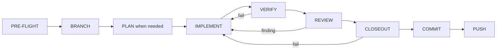

# Task lanes and the enforced lifecycle

Source, tests, and the policies under `shared/policies/` outrank this page. The normative text is `shared/policies/workflow.instructions.md`, installed as `.claude/instructions/workflow.instructions.md`.

Every change follows one lifecycle on one branch per big plan, and most of its rules are enforced by a hook, the plan validator, or the verifier rather than by policy text alone. Each rule below says which.

## Task lanes

A request is classified before planning or delegating, using the one decision table in the workflow policy. Time and line-count thresholds are never used. This is policy text; the hooks enforce what follows from it.

| Lane | Enter when | Owner and artifacts |
| --- | --- | --- |
| Read-only/reporting | no change is requested | main agent; evidence only; no lifecycle artifacts |
| Lightweight edit | explicit, one non-control-plane file, low risk, no commit or PR requested | main agent; focused edit plus proportionate verification; no lifecycle artifacts |
| Standard implementation | any other change, including anything with a requested commit or PR | orchestrator; micro-plan or full plan, then the specialist loop; full lifecycle |
| Control-plane/high-risk | any control-plane, security, dependency, migration, multi-file, user-data, generator, or script change | orchestrator; full plan; review with `code`, `architecture`, `security`, `tests`, `ponytail`; full lifecycle |

Any commit on an implementation branch must satisfy the full ceremony, whichever lane the work was classified into. The commit-subject bypasses (`fixup!`, `squash!`, `chore(typo):`, `docs(typo):`) are audited recovery exceptions, not a lane.

## Plans

- A **big plan** lives at `.claude/plans/<plan_name>.md` with `type: big-plan`, a `phases:` list, and `current_phase`. Statuses: `planning`, `in-progress`, `complete`, `cancelled`.
- A **small plan** lives at `.claude/plans/<phase_slug>.md` with `type: small-plan`, `parent_plan`, `phase_index`, `status`, and `closeout_session_log`. Statuses add `planned` and `paused`.
- `status` must occur exactly once. Templates are `shared/templates/plan-big.md` and `plan-small.md`.

`scripts/validate_plan_frontmatter.py`, shipped verbatim into consumers, enforces the frontmatter contract: valid statuses, exact pause and cancellation fields, the body phase inventory matching `phases:`, at most one unfinished `-knowledge-refresh` phase and only as the last phase, and the verification lints below. An earlier knowledge-refresh phase is exempt from that count only once it has settled, but a plan that has any knowledge-refresh phase must still end with one. Settled means the big plan's own `name` is not empty, and the sibling small-plan file named after the phase slug is a regular file, not a symlink, that declares `type: small-plan`, a `name` equal to the phase slug, a `parent_plan` equal to the big plan's `name`, and `status: complete` or `status: cancelled`. `check_runtime.py` and the `commit-msg` Git hook both run it.

Plan-first, as policy text: check `.claude/MEMORY.md` for lessons, clarify ambiguous work, draft into `.claude/plans/` (or `.claude/explorations/` for proofs of concept), get approval, then implement. Before each new phase the orchestrator checks whether earlier outcomes materially change the remaining work and, only then, invokes one planner to revise affected future phases.

## The lifecycle

This diagram shows the stages and the loop back from a failed check.

- **PRE-FLIGHT and BRANCH.** Work starts from a clean `dev`; each big plan gets exactly one branch named `<plan_name>_implementation`. `enforce-branch-state.sh` denies a misnamed branch, a dirty or non-`dev` start, or a missing big plan with the wrong type or status. `record-branch-state.sh` then writes the branch metadata and flips the first `planned` phase to `in-progress`.
- **IMPLEMENT.** Delegated to `coder`, which applies the `ponytail` skill once in `full` mode. Policy text.
- **VERIFY.** `verify.py fast` during implementation and `verify.py phase --persist` before review. The verifier is code.
- **REVIEW.** Delegated to `reviewer` with profiles from the routing table; findings return as JSON and are not yet persisted. Policy text, but the commit gate later requires the persisted report.
- **CLOSEOUT.** The fixed sequence below.
- **FIX LOOP.** Any failure returns to IMPLEMENT; a later code change restarts verification and review.
- **COMMIT.** One explicitly staged commit per completed small plan, gated by `enforce-commit-gate.sh` and the `commit-msg` Git hook.
- **PUSH.** One normal non-force push with `GIT_TERMINAL_PROMPT=0`; a missing remote or authentication failure is a warning. `enforce-pr-gate.sh` and the `pre-push` Git hook gate it. A PR to `dev` is opened only when the user asks and only after every phase is complete or cancelled.

## The closeout sequence

The policy fixes eight steps because each reads what the previous one produced.

1. **Documentation.** Update `README.md` and `docs/` for changed public behavior; on the big plan's last phase, also run the stale-claims audit.
2. **Final AI state.** Small plan `status: complete` with `closeout_session_log` filled and steps ticked; big-plan phase ticked; `[LEARN]` entries or the no-lessons marker in the log and `MEMORY.md`.
3. **First nested checkpoint.** `git -C .claude add -A && git -C .claude commit`. The verifier refuses to run closeout while the big plan is not retrievable from nested Git.
4. **Stage, findings, phase receipt, closeout dry run**, in one Bash command with no `git commit`: explicit `git add` of the intended files, a `disposition` and `reason` on every surviving MINOR, `record_findings.py` with one `--profile` per reviewed profile (including `ponytail` for any multi-file diff), `verify.py phase --persist`, then `verify.py closeout --format text`, whose summary lines go into the log with `**Status:** COMPLETED`.
5. **Second nested checkpoint**, because the closeout receipt hashes the session log.
6. **Closeout receipt.** `verify.py closeout --format json --persist`.
7. **Commit**, in its own Bash command. The `post-commit` Git hook advances `current_phase` and publishes nested state.
8. **Push.**

Two hard rules are enforced by the hooks:

- A Bash command that chains `git commit` after the findings or receipt steps is judged on the receipts that existed before it ran and is denied whole.
- Touching nested state between the receipt and the commit changes what the receipt binds and fails the commit with `closeout receipt governing control-plane provenance is stale`.

## What gates a completion commit

The commit gate requires, for an ordinary commit on an implementation branch:

- a passing closeout receipt whose `head_sha` and `tree_sha` match HEAD and the index;
- a findings report for the same phase with `counts.critical == 0` and `counts.major == 0` and a disposition on every MINOR;
- `ponytail_reviewed=true` in that report for a multi-file or high-risk diff;
- the closeout session log with LEARN evidence;
- a small plan whose frontmatter validates.

CRITICAL and MAJOR findings block the completion commit itself, not only the push. The push and PR gates re-check the same contract across every completed phase through the historical receipt chain, and a PR must target `dev`.

## The verification evidence contract

- A small plan's `## Verification` section holds fenced `bash` or `sh` blocks whose non-comment lines are required items. `verify.py closeout` runs them and records the results; the commit gate refuses a plan item without a result, a failed item, or an optional item without an outcome line.
- `## Optional Verification` holds numbered bullets for anything conditional or interactive. Each needs `- optional <n>: PASS|FAIL|NOT RUN — <detail>` in the log.
- At plan approval, `validate_plan_frontmatter.py` refuses a live plan (status `planned`, `in-progress`, or `paused`, dated on or after 2026-09-19) with no fenced block (`L1 verification-block-missing:`), hedged prose that makes a check conditional (`L2 hedged-verification:`), an item that cannot fail such as `|| true` (`L3 unfailable-verification:`), or an item that lists `verify.py closeout` (`L4 self-listed-closeout:`). Completed and cancelled plans are never re-judged.

## Pause and cancel

- **Pause** is small-plan-only and non-terminal, entered only on an explicit user request. It requires `paused_at` in exact UTC `YYYY-MM-DDTHH:MM:SSZ` form, a single-line `paused_reason`, and a `pause_session_log` containing `**Status:** PAUSED`. A checkpoint commit may then preserve tracked work without full closeout; it does not advance `current_phase` and still blocks PR creation. On resume the same plan returns to `in-progress`.
- **Cancel** means an authorized decision that a plan or phase will never run. It requires `cancelled_at`, a single-line `cancelled_reason`, and a `cancelled_evidence` artifact containing `**Status:** CANCELLED`. A cancelled phase needs no commit, findings, or closeout log; a cancelled big plan cannot start a branch; commit-count checks count completed phases only.

Both field sets are validated by `validate_plan_frontmatter.py`, including rejection of YAML block-scalar headers, impossible timestamps, and evidence missing the exact marker.

## Declaring future phases

New small plans default to `status: planned`. Branch creation activates the first phase and each completed-phase commit activates the next non-cancelled phase, flipping exactly one phase to `in-progress`. An unexpected next-phase status is never overwritten; the transition warns and leaves the phase machine where it is. `planned` blocks the same gates as `in-progress`.

## Reopening a completed big plan

A `complete` big plan can take new phases while its implementation branch still exists and is not merged; after a merge, a new big plan starts instead. The numbered procedure lives under "Reopening a completed big plan" in `shared/policies/workflow.instructions.md`. In short:

1. Record the new findings, then draft the new small plans as `planned`. Only a knowledge-refresh phase's slug may end in `-knowledge-refresh`, because the validator counts any slug with that suffix.
2. If any listed phase is a knowledge-refresh phase, append one new `-knowledge-refresh` phase after the new phases. The validator requires this, so the final refresh and the stale-claims audit always follow the final code.
3. Set the big plan to `in-progress`, point `current_phase` at the first new phase, and append the new phases to `phases:` and to the body phase list in the same order.
4. Never edit a completed phase's plan, closeout log, findings, or receipts, and never re-persist its receipts. Set the first new phase to `in-progress` by hand, because no hook does it on an existing branch.

Reopening defers the strict terminal gates to the new final phase; it never escapes them.

## Representative tests

- `tests/test_validate_plan_frontmatter.py` covers every pause and cancellation field, the block-scalar and near-miss marker rejections, and the knowledge-refresh position rule, including a completed or cancelled earlier refresh phase, appending after a finished refresh, a slug that fails the slug pattern, and a sibling that fails the identity check (a symlink, an unrelated `parent_plan`, the wrong `type` or `name`, or an empty big-plan `name`).
- `tests/test_commit_closeout.py` covers the post-commit phase advance across commit-message sources and its refusals.
- `tests/test_hook_gates.py` covers the commit and push gate assertions against real temporary repositories.

## Related pages

- [Agent roster, prompts, and the skill library](/openwiki/architecture/agents-and-skills.md)
- [Hook dispatcher and guardrail scripts](/openwiki/architecture/hooks-and-guardrails.md)
- [Deterministic verification: verify.py modes, receipts, and findings](/openwiki/operations/deterministic-verification.md)
