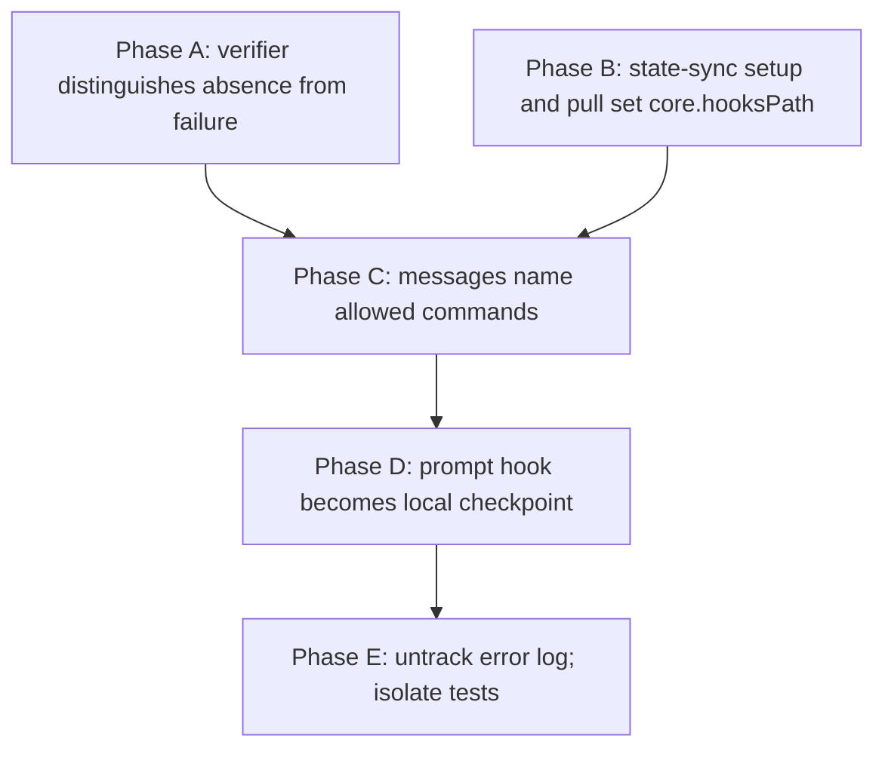

# Big Plan: Remove consumer ceremony friction that blocks or slows real work

## Context

A read-only audit of the generated consumer runtime (`dist/multi-agent`) on
2026-09-11 found two conditions under which a consumer can never complete a
commit through the agent, plus several recurring costs. Evidence was gathered
by reading the gate code, running the PreToolUse guards against sample
commands, and timing hook overhead. Details are in the session that produced
this plan; the measured facts each phase depends on are restated in that
phase's small plan.

The two blockers:

- `aggregate_status` turns any `UNVERIFIED` check into an `UNVERIFIED`
  receipt, and the commit and push gates accept only `PASS`. pytest exiting 5
  (no tests collected), mypy with no configured scope and no `src/`, or a
  missing ruff/mypy/pytest executable therefore blocks every commit forever.
  The docs mention `UNVERIFIED` only for mypy and never say it blocks commits.
- `core.hooksPath` is set only by `install_bootstrap.py` and
  `.devcontainer/post-start.sh`. The documented "new machine without a
  devcontainer" path (`state-sync.sh setup` then `pull`, or the VS Code
  folder-open task) never sets it, so commit-msg, post-commit, and pre-push
  never run, phases never advance, and the next push is refused with no hint.

The recurring costs:

- Every user prompt runs `state-sync.sh push`, which performs `ls-remote`,
  `fetch`, and `push` before the prompt is processed (about 1.5 s online, up
  to the 60 s hook timeout offline). Stop and SessionEnd publish as well.
- The verifier's remediation messages tell the agent to run
  `bash .claude/hooks/scripts/state-sync.sh checkpoint`, which the guard
  denies for the agent; `git -C .claude add -A && git -C .claude commit` is
  the allowed form.
- `git commit … && git push` in one Bash command is refused whole, because the
  push gate evaluates HEAD before the commit exists. Undocumented.
- `session_logs/hooks-errors.log` is tracked in `ai-state` with no cap. In this
  repository it holds 3513 lines, about 3200 written by the authoring test
  suite, which runs hook scripts with `REPO_ROOT` pointed at the live checkout.

The previous friction plan (`consumer-lifecycle-friction-hardening`) fixed
commit-driven phase advancement, root-adapter recovery diagnostics, empty-array
hook safety, the `planned` status, and the shell classifier. None of the items
above were in its scope.

## Goals

- A consumer with no tests yet can produce a `PASS` receipt, with the receipt
  stating plainly that pytest had nothing to run. A misconfigured or missing
  tool keeps blocking, with a message that names the exact fix.
- Every supported first-machine path configures `core.hooksPath`, and a
  session that starts without it is told so.
- Gate and verifier messages name commands the agent is allowed to run, and
  the chained commit-and-push refusal explains itself.
- Prompt submission does no network work; publication happens at Stop,
  SessionEnd, and post-commit, as it already does.
- The hook error log stops growing in `ai-state` history, and the test suite
  cannot write into the live log.

## Design Overview



Each phase is one commit and independently valuable. Phase D is a policy
change the user may cancel without affecting the others. Every phase touches
control-plane files (hook scripts, generators, the verifier, or tests), so
each carries the full review profile set.

## Phases

- [ ] `2026-09-11_phase-A-verify-absence-vs-failure` — pytest with no test
  files reports `NOT_APPLICABLE`; tool-missing and scope-missing messages name
  the fix; consumer prerequisites documented.
- [ ] `2026-09-11_phase-B-hooks-path-from-state-sync` — `state-sync.sh`
  configures `core.hooksPath` whenever it restores the checkout;
  session-start warns when it is missing.
- [ ] `2026-09-11_phase-C-agent-facing-gate-messages` — verifier messages
  name the agent-allowed checkpoint form; the push gate explains the chained
  commit-and-push refusal; the commit skill documents it.
- [ ] `2026-09-11_phase-D-prompt-time-local-checkpoint` — UserPromptSubmit
  runs `checkpoint` instead of `push` for Claude and Codex.
- [ ] `2026-09-11_phase-E-hook-log-hygiene` — untrack
  `session_logs/hooks-errors.log` from `ai-state`; make hook tests write only
  under `tmp_path`; add a leak guard.

## Verification

```bash
uv run pytest tests/ -q --tb=short
uv run mypy shared scripts tests --ignore-missing-imports --explicit-package-bases
uv run ruff check shared scripts tests
uv run ruff format --check shared scripts tests
uv run python scripts/generate_targets.py --all
uv run python scripts/install_bootstrap.py . --allow-self --local-only
uv run python scripts/validate_targets.py
uv run python scripts/check_runtime.py
```

## Completion Evidence

The final phase listed under `phases:` must also run a documentation,
memory, and LEARN audit: sweep every live-advice surface for claims this plan
or earlier work invalidated, correct or supersede each one, leave dated
records (archived plans, dated design narratives, closed session logs)
unchanged, and record the audited surfaces and each one's outcome under a
`## Stale-claims surfaces checked` heading in that phase's closeout session
log. `verify.py`'s closeout gate requires that exact heading, non-empty,
whenever the phase it is closing out is this list's last entry.

If Phase D is cancelled, Phase E remains the final phase and carries the
audit.
