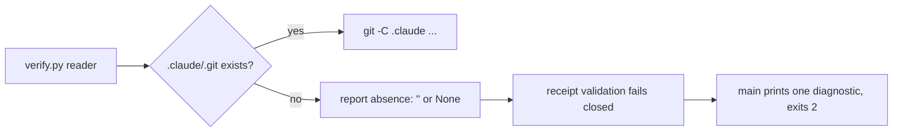

# Big Plan: Gate nested-state readers on a real nested repository

## Context

`.claude/` is normally its own nested Git repository on the `ai-state` branch.
Five helpers in `shared/scripts/verify.py` run Git from inside `.claude`
without first checking that `.claude/.git` exists: `nested_git_head`,
`nested_tracked_state_fingerprint`, `indexed_nested_file`,
`nested_revision_file`, and `relevant_nested_status_changes`. When `.claude`
is a plain directory, Git walks up and answers from the outer repository
instead of failing. The readers then return the outer repository's HEAD, the
outer repository's file bytes for the same relative path, and the outer
repository's dirty-state records.

`.claude/explorations/2026-09-11_nested-git-walkup-scope-confusion.md` records
the mechanism and the independent ruling on it. The ruling reproduced every
claimed behavior and, in addition, built the fail-open path the brief could
not: with an outer top-level `plans/` directory mirroring the nested plan bytes
at receipt time, `has_only_terminal_big_plan_change`,
`has_only_checkpointed_terminal_big_plan_change`, and
`terminal_control_plane_provenance_matches` all return `True` from outer state,
including when a nested later-phase plan on disk is not cancelled. A genuine
nested repository refuses that same state. The same ruling also measured that
in the plain-directory state the gates already refuse every publish, because
`tracked_state_fingerprint` binds outer dirty implementation files that vanish
at commit, so there is no working path that gating the readers could break.

`nested_state_repository` already exists (added in
`2026-09-11_phase-B-terminal-publication-recovery`) and answers the right
question. It guards only `unpublishable_closeout_reason`. This plan makes it
guard every reader.

## Goals

- Every nested-state reader reports absence rather than outer-repository
  content when `.claude` is not its own Git repository.
- The terminal push predicates return `False` from the outer-mirror fixture
  that today returns `True`.
- The verifier prints one plain diagnostic and exits non-zero, instead of an
  uncaught `ValueError` traceback, when `.claude` is present but not a
  repository.
- The installer's nested-HEAD durability check cannot be satisfied by the
  outer repository's HEAD.
- Regression tests build the real shape: a `.claude` directory holding plan
  content with no `git init`, not an absent `.claude`.

## Design Overview



One predicate, `nested_state_repository`, becomes the single entry guard for
the five readers. Nothing about the provenance schema, the terminal
predicates, or the strict comparison changes. The receipt-validation contract
already rejects an empty `nested_head`, so the readers reporting absence makes
the plain-directory consumer fail closed everywhere; the new `main()`
diagnostic only makes that failure legible and names the remediation.

## Phases

- [x] `2026-09-11_phase-A-gate-nested-readers` — gate the five readers, add the
  diagnostic, fix the installer check, add regression tests, regenerate
  targets, and run the final documentation, memory, and LEARN audit.

## Verification

```bash
uv run pytest tests/ -q --tb=short
uv run python scripts/generate_targets.py --all
uv run python scripts/validate_targets.py
uv run python scripts/check_runtime.py
```

## Completion Evidence

The final phase listed under `phases:` must also run a documentation,
memory, and LEARN audit: sweep every live-advice surface for claims this plan
or earlier work invalidated, correct or supersede each one, leave dated
records (archived plans, dated design narratives, closed session logs)
unchanged, and record the audited surfaces and each one's outcome under a
`## Stale-claims surfaces checked` heading in that phase's closeout session
log. `verify.py`'s closeout gate requires that exact heading, non-empty,
whenever the phase it is closing out is this list's last entry.

The Phase B closeout session log's "Known gap, deliberately left open" entry is
bound by a completed receipt and must not be edited; supersede it with a
sibling `.errata.md` file.
