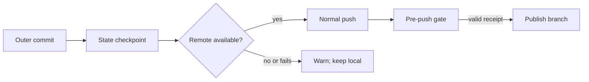

# Big Plan: Outer-repository automatic push

## Context

The bootstrap automatically publishes nested `.claude` `ai-state`, but the
orchestrator does not publish normal outer-repository commits. Its current
pre-push contract also rejects completed intermediate phases, so adding only a
prompt instruction would make each automatic outer push fail until final
closeout.

## Goals

- Make the orchestrator attempt a normal outer-repository push after every
  successful commit in this authoring repository and generated consumer repos.
- Select an existing branch upstream first, then `origin` when no upstream is
  configured. Never force-push or create a PR/merge automatically.
- Treat a missing remote, unavailable credentials, or network failure as a
  visible warning that preserves the local commit.
- Permit only receipt-backed completed-phase commits, paused checkpoints, and
  final closeout through the outer pre-push gate.
- Preserve the nested `.claude` `ai-state` checkpoint-and-publish behavior.

## Design Overview



The orchestrator is the only actor that gains this default. Manual commits,
pull requests, merges, force pushes, and nested `ai-state` publication retain
their existing rules.

## Phases

- [x] `2026-09-11_phase-A-outer-repo-auto-push` — add the publication contract,
  generated guidance, gate coverage, and documentation.

## Verification

```bash
uv run pytest tests/test_hook_gates.py tests/test_lifecycle_hooks.py -q --tb=short
uv run python scripts/generate_targets.py --all
uv run python scripts/validate_targets.py
uv run python scripts/check_runtime.py
```

## Completion Evidence

The final phase must audit root guidance, `README.md`, `docs/`, shared policy,
agent, hook, generator, validator, test, and runtime-mirror surfaces for stale
push behavior. Record every audited surface and outcome under
`## Stale-claims surfaces checked` in its completed closeout session log.
