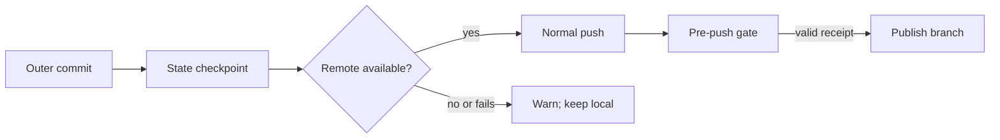

# Big Plan: Outer-repository automatic push

## Context

The bootstrap automatically publishes nested `.claude` `ai-state`, but the
orchestrator does not publish normal outer-repository commits. Its current
pre-push contract also rejects completed intermediate phases, so adding only a
prompt instruction would make each automatic outer push fail until final
closeout.

## Goals

- Make the orchestrator attempt a normal outer-repository push after every
  successful commit in this authoring repository and generated consumer repos.
- Select an existing branch upstream first, then `origin` when no upstream is
  configured. Never force-push or create a PR/merge automatically.
- Treat a missing remote, unavailable credentials, or network failure as a
  visible warning that preserves the local commit.
- Permit only receipt-backed completed-phase commits, paused checkpoints, and
  final closeout through the outer pre-push gate.
- Preserve the nested `.claude` `ai-state` checkpoint-and-publish behavior.
- Make the terminal completion commit of a big plan publishable too, so the
  automatic push is not silently unreachable on the last commit of every plan.

## Design Overview



The orchestrator is the only actor that gains this default. Manual commits,
pull requests, merges, force pushes, and nested `ai-state` publication retain
their existing rules.

## Phases

- [x] `2026-09-11_phase-A-outer-repo-auto-push` — add the publication contract,
  generated guidance, gate coverage, and documentation.
- [x] `2026-09-11_phase-B-terminal-publication-recovery` — make the terminal
  completion commit publishable, give a stale terminal receipt a real recovery
  path, and stop recommending a refresh that breaks the receipt chain.

## Phase A Follow-Up

Phase A's own completion commit could not be published. After `post-commit`
completes a terminal big plan, the push gate's control-plane provenance check
fails with `closeout receipt governing control-plane provenance is stale`.

The terminal allowance already exists — `terminal_control_plane_provenance_matches`
ignores `nested_head`, `tracked_state_fingerprint`, and `big_plan_digest` — but
its two gating predicates compare the recorded `big_plan_digest` against the
nested index or the blob at the recorded nested `HEAD`, while
`control_plane_provenance` records that digest from the working tree. A big
plan that is dirty when the receipt is persisted therefore records a digest
that is neither indexed nor committed, and no later state can make it match.
A multi-phase plan hides this because each intermediate commit checkpoints
nested state; a single-phase plan does not.

Two secondary defects were found with it. `verify.py closeout` refuses to
re-persist once the big plan is complete, so no correct post-transition
receipt can be produced; and the refusal message recommends a phase-receipt
refresh that invalidates the closeout receipt's bound `phase_receipt` hash,
which makes the state worse rather than better.

Phase B addresses all three.

## Verification

```bash
uv run pytest tests/test_hook_gates.py tests/test_lifecycle_hooks.py -q --tb=short
uv run python scripts/generate_targets.py --all
uv run python scripts/validate_targets.py
uv run python scripts/check_runtime.py
```

## Completion Evidence

The final phase must audit root guidance, `README.md`, `docs/`, shared policy,
agent, hook, generator, validator, test, and runtime-mirror surfaces for stale
push behavior. Record every audited surface and outcome under
`## Stale-claims surfaces checked` in its completed closeout session log.
