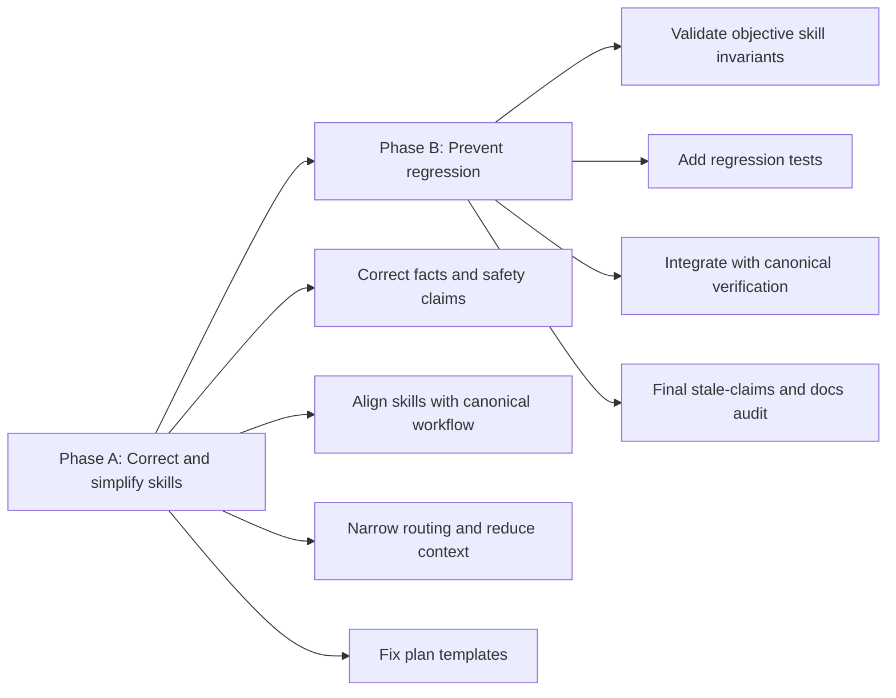

# Big Plan: 2026-09-12_skill-library-hardening

## Context

The shared skill library has grown across several rounds of bootstrap development and now serves multiple agent targets: Codex, Claude, Gemini/Antigravity, and GitHub Copilot. GPT-6 Astra is an occasional target, not the design baseline.

A repository-wide skill audit found that the overall architecture is sound, but a smaller set of skills contains factual errors, stale paths, unsafe or overstated guarantees, overly broad automatic triggers, duplicated canonical policy, rigid project-specific assumptions, or unnecessary context. The current `shared/templates/plan-small.md` also still carries the obsolete numeric-score lifecycle even though the active workflow now uses deterministic `verify phase` / `verify closeout` PASS/FAIL receipts.

The work should improve the existing skill system rather than redesign it. Deterministic hooks, verification receipts, provenance, lifecycle gates, and explicit completion semantics remain authoritative.

## Goals

- Correct factual, security, workflow, and path defects in the shared skill library.
- Keep skill behavior reliable across Codex, Claude, Gemini, and Copilot without assuming Astra-specific autonomy.
- Narrow public skill routing where descriptions can cause irrelevant automatic loading.
- Reduce duplicated policy and unnecessary context while keeping core cross-model execution rules explicit.
- Simplify skills that encode one project architecture or excessive ceremony as universal behavior.
- Preserve specialist knowledge that genuinely benefits agents, using progressive disclosure only where it reduces irrelevant context.
- Bring the plan templates back into agreement with the current deterministic PASS/FAIL lifecycle.
- Add deterministic validation for objective skill-library invariants so the same drift is harder to reintroduce.

## Non-Goals

- Do not redesign the canonical orchestrator lifecycle.
- Do not weaken hooks, protected-path enforcement, provenance receipts, or verification/closeout gates.
- Do not optimize the bootstrap specifically for GPT-6 Astra.
- Do not require every semantic quality judgment to become a hard deterministic lint rule.
- Do not split skills solely because they exceed an arbitrary line-count threshold.
- Do not impose a new universal application architecture on consumer repositories.

## Design Overview



The boundary is intentional. Phase A first establishes the desired skill-library state. Phase B then codifies only the objective properties that can be checked deterministically without turning subjective model-routing judgment into brittle lint.

## Cross-Model Principles

The implementation must preserve these principles:

1. **Canonical policy owns invariants.** Skills should reference policy instead of restating large normative contracts.
2. **Skills own task-specific knowledge or repeatable procedures.** A skill must earn its context cost.
3. **Deterministic tooling owns enforceable guarantees.** Do not replace hooks/verifiers with model judgment.
4. **Core workflow remains directly discoverable.** Progressive disclosure is for secondary detail and specialist references, not for hiding required lifecycle rules.
5. **Descriptions are routing interfaces.** Public descriptions must be specific enough that Codex, Claude, Gemini, and Copilot do not load them for unrelated work.
6. **Version-sensitive framework knowledge is qualified.** Learned integration facts must state tested/observed versions or instruct the agent to check the installed API when versions differ.

## Phases

- [ ] `2026-09-12_phase-A-skill-correctness-and-simplification` — correct factual/security/workflow defects, simplify routing and context, and align the plan templates with the current lifecycle.
- [ ] `2026-09-12_phase-B-skill-regression-prevention` — add deterministic skill validation and regression tests, integrate them into verification, and complete the final documentation/stale-claims audit.

## Verification

```bash
uv run python scripts/generate_targets.py --all
uv run python scripts/validate_targets.py
uv run python scripts/check_runtime.py
uv run pytest tests/ -q --tb=short
uv run ruff check .
uv run mypy . --ignore-missing-imports --explicit-package-bases
```

During implementation, use focused checks first. At each phase closeout, use the repository's canonical deterministic phase and closeout verification commands rather than reintroducing the removed numeric-score workflow.
