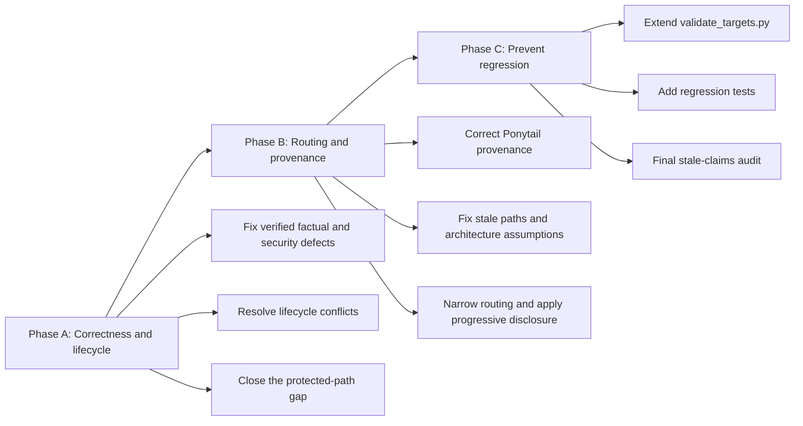

# Big Plan: 2026-09-12_skill-library-hardening

## Context

The shared skill library has grown across several rounds of bootstrap
development and now serves multiple agent targets: Codex, Claude,
Gemini/Antigravity, and GitHub Copilot. GPT-6 Astra is an occasional target,
not the design baseline.

A repository-wide skill audit found that the overall architecture is sound,
but a smaller set of skills contains factual errors, unsafe or overstated
security guarantees, guidance that conflicts with the canonical lifecycle,
and confusion between canonical `shared/**` authoring sources and generated
runtime copies.

Every finding carried into this plan was re-verified against the working tree
and is recorded with its source line in `## Verified audit evidence` below.
Three claims from the original audit did not survive verification and have
been removed rather than implemented:

- The numeric-score lifecycle is already gone from `shared/templates/plan-small.md`.
  All three copies are clean; it was removed in commit `2af3df7`.
- `.claude/instructions/workspace.md` is not obsolete. It is emitted on every
  generation run and is required by the target validator and the installer.
- The `ponytail` and `ponytail-review` descriptions are not over-broad for this
  bootstrap. They match a mandate this repository states deliberately.

The work should improve the existing skill system rather than redesign it.
Deterministic hooks, verification receipts, provenance, lifecycle gates, and
explicit completion semantics remain authoritative.

## Goals

- Correct the verified factual, security, and lifecycle defects in the shared
  skill library.
- Resolve canonical-versus-generated ownership confusion, including the
  protected-path gap that leaves `shared/skills/**` unguarded.
- Make the vendored Ponytail provenance record describe the real divergence.
- Keep skill behavior reliable across Codex, Claude, Gemini, and Copilot
  without assuming Astra-specific autonomy.
- Reduce duplicated policy and unnecessary context while keeping core
  cross-model execution rules explicit.
- Preserve specialist knowledge that genuinely benefits agents, using
  progressive disclosure only where it reduces irrelevant context.
- Add deterministic validation for objective skill-library invariants, inside
  the gate that already owns skill validation.

## Non-Goals

- Do not redesign the canonical orchestrator lifecycle.
- Do not weaken hooks, protected-path enforcement, provenance receipts, or
  verification/closeout gates.
- Do not modify `shared/skills/ponytail/SKILL.md` or
  `shared/skills/ponytail-review/SKILL.md`. Both are hash-pinned vendored
  files and their descriptions match canonical policy. See
  `## Decision: leave the vendored Ponytail pair unmodified`.
- Do not create a second skill-validation gate alongside `validate_targets.py`.
- Do not remove `shared/skills/data-analysis/`. It is a public, task-triggered
  skill whose standing context cost is its description block, not its body.
- Do not bump the vendored Ponytail import to upstream `v4.9.0`. See
  `## Decision: do not bump Ponytail to v4.9.0`.
- Do not optimize the bootstrap specifically for GPT-6 Astra.
- Do not require every semantic quality judgment to become a hard
  deterministic lint rule.
- Do not split skills solely because they exceed an arbitrary line count.
- Do not impose a new universal application architecture on consumer
  repositories.

## Design Overview



The phase boundaries are ordered by confidence. Phase A carries only
verified, mechanical corrections and touches no vendored or generated file.
Phase B carries judgment-heavy content work whose review is slower. Phase C
codifies only the objective properties that can be checked deterministically,
without turning subjective model-routing judgment into brittle lint.

## Cross-Model Principles

The implementation must preserve these principles:

1. **Canonical policy owns invariants.** Skills should reference policy
   instead of restating large normative contracts.
2. **Skills own task-specific knowledge or repeatable procedures.** A skill
   must earn its context cost.
3. **Deterministic tooling owns enforceable guarantees.** Do not replace
   hooks/verifiers with model judgment.
4. **Core workflow remains directly discoverable.** Progressive disclosure is
   for secondary detail and specialist references, not for hiding required
   lifecycle rules.
5. **Descriptions are routing interfaces.** Public descriptions must be
   specific enough that Codex, Claude, Gemini, and Copilot do not load them
   for unrelated work, and broad enough to match a mandate the repository
   actually states.
6. **Version-sensitive framework knowledge is qualified.** Learned integration
   facts must state tested/observed versions or instruct the agent to check
   the installed API when versions differ.

## Verified audit evidence

Each row was confirmed against the working tree. The coder must re-read the
cited line before editing, because line numbers drift.

| # | Finding | Evidence | Correction | Phase |
| --- | --- | --- | --- | --- |
| 1 | `isinstance(np.bool_(True), bool)` is documented as returning `True`. `np.bool_` subclasses `np.generic`, not Python `bool`. | `shared/skills/pandas-nan-bool-coercion/SKILL.md:28` | Correct the claim and make the surrounding examples internally consistent. | A |
| 2 | SQLite `?mode=ro` described as "enforced at the filesystem" and "enforced by SQLite/OS". It is a connection-level flag in the SQLite library. | `shared/skills/text-to-sql-safety/SKILL.md:22`, `:34` | Describe it as one connection-level defense; keep filesystem permissions as the separate stronger boundary. | A |
| 3 | Absence of the raw payload in serialized HTML is presented as proof of correct escaping. | `shared/skills/pyvis-xss-testing/SKILL.md:15-24` | Require testing the rendered sink or the exact escaping boundary being relied on. | A |
| 4 | `output_name` documented as "MUST match add_component() name". It names the router output socket. | `shared/skills/haystack-conditional-router/SKILL.md:23`, `:29` | Correct the explanation and qualify version-sensitive Haystack behavior. | A |
| 5 | A failing example command is reported as an absent script. | `shared/skills/run-tests/SKILL.md:40` | Detect whether the scripts exist; never convert a real failure into a success-looking message. | A |
| 6 | "Fix findings by severity: critical, then major, then minor" implies MINOR must be fixed. Canonical policy makes a surviving MINOR advisory with an explicit disposition and reason. | `shared/skills/code-review/SKILL.md:25` vs `shared/policies/workflow.instructions.md:139` | Align severity semantics with canonical policy. | A |
| 7 | The review skill persists its own report path. Canonical closeout has the orchestrator persist findings via `record_findings.py`. | `shared/skills/code-review/SKILL.md:28` vs `shared/policies/workflow.instructions.md:138` | In lifecycle mode return findings to the orchestrator; keep ad-hoc read-only review usable. | A |
| 8 | "If no suitable public method exists, add one" adds production API because a test lacks access. | `shared/skills/test-helper-public-api/SKILL.md:44` | Prefer observable public behavior or an existing seam; add a production seam only when it is a useful abstraction. | A |
| 9 | The compression detector protects the generated `/.claude/skills/**/SKILL.md` but not the canonical `/shared/skills/`, so every authoring source is compressible. | `shared/skills/caveman-compress/scripts/detect.py:171-177`, mirrored in `SKILL.md:45-48` | Protect `shared/skills/**` as well; keep the opt-in compression role. | A |
| 10 | `UPSTREAM.md` states local changes are "limited to formatting, the bootstrap's required `visibility` frontmatter, and references to this bootstrap's review workflow". The real divergence is far larger: `ponytail/SKILL.md` is 72 lines against upstream's 120 with three sections dropped; `ponytail-review/SKILL.md` is 38 against 57. | `shared/third_party/ponytail/UPSTREAM.md` | Describe the fork accurately so the next upstream bump is tractable. | B |
| 11 | Skills point authors at `.claude/instructions/workspace.md`, a generated runtime copy, as if it were an authoring source. | `shared/skills/onboard/SKILL.md:91`, `setup-project/SKILL.md:39`, `create-feature/SKILL.md:71` | Point authoring guidance at canonical sources; keep the generated alias working. | B |
| 12 | `create-feature` and `setup-project` impose one project architecture and populate a secret-bearing environment file by default. | `shared/skills/create-feature/SKILL.md`, `shared/skills/setup-project/SKILL.md` | Make architecture conditional on the repository; do not populate a secret-bearing environment file. | B |

## Decision: leave the vendored Ponytail pair unmodified

The original plan narrowed the `ponytail` and `ponytail-review` descriptions.
That step is dropped for four independent reasons:

1. **It contradicts stated policy.** `CLAUDE.md:30` requires loading
   `ponytail` in `full` mode before every coding task, and
   `shared/skills/ponytail/SKILL.md:24-25` states the final Ponytail diff
   review "remains mandatory". The descriptions match that mandate; they are
   accurate, not over-broad.
2. **It breaks the build.** Both files are hash-pinned at
   `scripts/validate_targets.py:7641-7660` and in
   `shared/third_party/ponytail/UPSTREAM.md`. Any edit changes the SHA-256 and
   fails `validate_targets.py`, which runs in every phase of this plan.
3. **It contradicts the vendoring design.** `UPSTREAM.md` states that local
   policies take precedence over imported wording "without modifying the
   imported skill files".
4. **Local policy is the correct lever.** Where Ponytail's lifecycle placement
   needs adjusting, change `shared/policies/workflow.instructions.md` and the
   review-routing table, which already own that decision.

Note that the MIT license permits modification. The obstacles here are the
repository's own hash pin and its own policy, not licensing.

## Decision: do not bump Ponytail to v4.9.0

Upstream `v4.9.0` (2026-08-08) is one release ahead of the pinned `v4.8.4`
(2026-06-29, commit `bc9ee94`, which matches the tag exactly). It is a large
release, but across the three vendored files the entire delta is one bullet in
`skills/ponytail/SKILL.md` (upstream commit `b6c0448`, narrowing the
`ponytail:` marker to real corner-cuts). `ponytail-review/SKILL.md` and
`LICENSE` are unchanged between the two tags.

That single change is already present in this bootstrap's copy at
`shared/skills/ponytail/SKILL.md:51-52`, which already restricts the marker to
simplifications with a real ceiling. Everything else in `v4.9.0` is plugin
hooks, the MCP server, plugin adapters, uninstall scripts, and tests, none of
which this bootstrap vendors.

A bump would therefore change no behavior and no file hash, while costing a
control-plane change. Phase B records the accurate divergence in `UPSTREAM.md`
instead, which is what makes a future real bump tractable.

## Phases

- [x] `2026-09-12_phase-A-skill-correctness-and-lifecycle` — correct the verified factual, security, and lifecycle defects, and close the protected-path gap.
- [x] `2026-09-12_phase-B-skill-routing-and-provenance` — fix provenance accuracy, stale authoring paths, rigid architecture assumptions, routing breadth, and reference-heavy skill roots.
- [x] `2026-09-12_phase-C-skill-regression-prevention` — extend the existing validation gate, add regression tests, and complete the final documentation and stale-claims audit.

## Verification

Generation runs before validation, so the validators inspect a current tree:

```bash
uv run python scripts/generate_targets.py --all
uv run python scripts/validate_targets.py
uv run python scripts/check_runtime.py
uv run pytest tests/ -q --tb=short
uv run mypy shared scripts tests --ignore-missing-imports --explicit-package-bases
uv run ruff check shared scripts tests
uv run ruff format --check shared scripts tests
```

During implementation, prefer the deterministic verifier, which selects the
correct scope for whichever repository it runs in:

```bash
uv run python .claude/scripts/verify.py fast --format text     # during IMPLEMENT
uv run python .claude/scripts/verify.py phase --format text    # before REVIEW
```

At each phase closeout, use the canonical deterministic phase and closeout
verification commands. Do not reintroduce the removed numeric-score workflow.

## Completion Evidence

The final phase listed under `phases:`
(`2026-09-12_phase-C-skill-regression-prevention`) must also run a
documentation, memory, and LEARN audit: sweep every live-advice surface for
claims this plan or earlier work invalidated, correct or supersede each one,
leave dated records (archived plans, dated design narratives, closed session
logs) unchanged, and record the audited surfaces and each one's outcome under
a `## Stale-claims surfaces checked` heading in that phase's closeout session
log. `verify.py`'s closeout gate requires that exact heading, non-empty,
whenever the phase it is closing out is this list's last entry.
