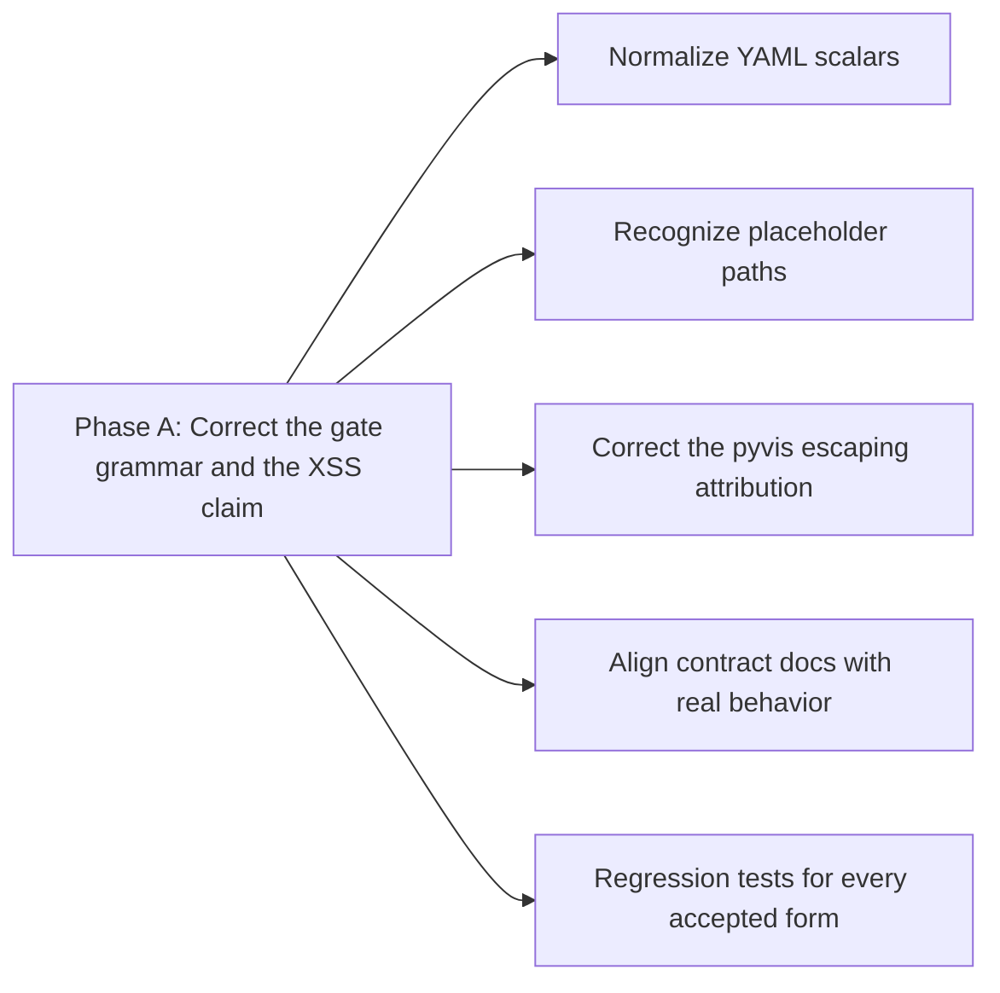

# Big Plan: 2026-09-12_validator-grammar-and-xss-claim

## Context

A post-merge review of `2026-09-12_skill-library-hardening` (merged to `dev`
as `cffc351`) found defects that plan introduced and its own reviews missed.
A consumer agent reported two; probing for the same root cause found four
more, and a technical fact-check of the rewritten claims found one security
defect.

Two distinct root causes:

1. **The new skill-frontmatter gate validates raw text, not YAML.** Its
   contract says "well-formed YAML", but `extract_frontmatter_name` does
   `line[len("name:"):].strip()` with no scalar normalization, so valid YAML
   such as `name: "example"` is rejected as a name mismatch. The pre-existing
   `visibility` check has the same limitation via substring matching. Every
   one of the 54 current skills happens to use bare unquoted scalars, so the
   gate passes today and the defect is latent until a consumer writes valid
   YAML the gate does not accept.
2. **A rewritten security rationale asserts a property that does not exist.**
   `shared/skills/pyvis-xss-testing/SKILL.md` now says pyvis HTML-escapes
   `title` before JSON-encoding it. Verified against pyvis upstream: it does
   not escape at all.

Both root causes are the same mistake in different forms: the work was
verified against the data that exists rather than against the contract it
claims to enforce. The reviews checked the new rules against all 54 real
skills and found no false positives, which was true and insufficient.

## Goals

- Make the skill-frontmatter gate accept the YAML its contract promises, or
  state a narrower grammar honestly. Do not let the documented contract and
  the implementation disagree.
- Correct the false claim that pyvis escapes `title`, so a reader does not
  skip the escaping their own application must perform.
- Cover every newly accepted form with a regression test proven to fail
  against the pre-change code.
- Remove documentation that describes behavior this work changes.

## Non-Goals

- Do not rewrite the gate as a full YAML parser or add a YAML dependency. The
  repository deliberately hand-parses this flat frontmatter schema, mirroring
  `generate_targets.parse_policy`; scalar normalization is the fix, not a
  parser.
- Do not relax the tab prohibition in frontmatter. Banning tabs is a
  defensible house rule; the defect is the contract wording that calls the
  grammar "well-formed YAML", not the rule itself.
- Do not weaken the local-reference rule into accepting genuinely broken
  paths. Only placeholder syntax needs recognizing.
- Do not change the assertion in `pyvis-xss-testing`. It correctly tests that
  the application escaped; only its stated rationale is wrong.
- Do not touch the hash-pinned vendored files
  (`shared/skills/ponytail/SKILL.md`, `ponytail-review/SKILL.md`,
  `humanize/SKILL.md`).
- Do not revisit settled decisions from the merged plan, including the
  Hydra policy scoping and the choice not to bump Ponytail to `v4.9.0`.

## Design Overview



One phase. The findings are small, share one working set, and have no
internal ordering dependency: the tests depend on the code change, and the
documentation depends on the decisions, all within the same commit. Splitting
would add lifecycle ceremony without reducing risk.

## Verified audit evidence

Each row was reproduced against the current `dev` before planning. The coder
must re-read each cited line before editing, because line numbers drift.

| # | Severity | Finding | Evidence | Correction |
| --- | --- | --- | --- | --- |
| 1 | MAJOR | `shared/skills/pyvis-xss-testing/SKILL.md:63` says "so pyvis HTML-escapes it before JSON-encoding it". pyvis performs no escaping: `node.py` and `network.py` contain no escape/markupsafe/bleach/sanitize call, `templates/template.html:434` serializes via Jinja2 `{{nodes\|tojson}}`, and `:506` assigns `popup.innerHTML = nodeData[0].title`. `tojson` escapes `<` to `<` for safety inside a `<script>` block; the JS parser decodes it back before it reaches `innerHTML`. | pyvis upstream source, fetched and grepped | Attribute the escaping to the calling application. Keep the assertion, which correctly tests that the application escaped. |
| 2 | MAJOR | `name: "example"` and `name: 'example'` are rejected `SKILL_NAME_MISMATCH`. `extract_frontmatter_name` strips whitespace only. | `scripts/validate_targets.py:7958-7962`; reproduced | Normalize YAML scalars before comparing. |
| 3 | MAJOR | `name: example  # comment` is rejected the same way. A trailing YAML comment is not part of the value. | reproduced against `skill_name_errors` | Strip trailing comments during normalization. |
| 4 | MAJOR | `visibility: "public"` is rejected. The check is a raw substring test, not a value comparison. Pre-existing, but the same class. | `scripts/validate_targets.py:8177-8182`; reproduced | Compare a normalized scalar instead of substring matching. |
| 5 | MINOR | `shared/skills/<your-skill>/SKILL.md` is rejected `SKILL_BROKEN_REFERENCE`. Placeholder detection recognizes `**` and `[...]` but not `<...>`, so behavior is uneven: a bracket placeholder passes and an angle placeholder does not. | reproduced against `skill_local_reference_errors` | Recognize `<...>` as placeholder syntax. |
| 6 | MINOR | `docs/architecture.md:68-80` states the gate enforces "well-formed YAML". The implementation rejects several valid YAML forms. | read against behavior | Describe the real grammar, including that tabs are prohibited by house rule. |
| 7 | MINOR | `shared/third_party/ponytail/UPSTREAM.md:35-38` says the paragraph's wrapping is load-bearing because the validator matches literal substrings spanning line breaks. Phase C normalized those checks, so this is now false. | read against `validate_targets.py` | Delete the stale note. |

## Checked and found clean

Recorded so the fix does not over-correct, and so a later audit does not
re-open them:

- Duplicate-key detection correctly ignores key-like text inside block
  scalars (`description: |` containing `name: not-a-key` is accepted).
- URLs ending in `.md` are not treated as repository references.
- Generated paths that genuinely exist, such as
  `.claude/instructions/workspace.md`, are accepted.
- `caveman-compress`'s documented protected list matches `detect.py` exactly,
  including the `references/` addition.
- The `run-tests` example snippet is safe as written: it does not set `-u`,
  and the repository's Bash 3.2 empty-array guard scopes to hook scripts.
- The BentoML CORS snippet's empty `ALLOWED_ORIGINS` list genuinely means no
  cross-origin access, confirmed against Starlette's middleware.
- The SQLite `mode=ro` framing, `set_authorizer` guidance, Haystack
  `output_name` explanation, and every numpy and pandas claim were verified
  correct by execution or against upstream documentation.

## Phases

- [ ] `2026-09-12_phase-A-validator-grammar-and-xss-claim` — normalize YAML scalars in the frontmatter gate, recognize placeholder paths, correct the pyvis escaping attribution, align the contract documentation, and cover every accepted form with a regression test.

## Verification

Generation runs before validation, so the validators inspect a current tree:

```bash
uv run python scripts/generate_targets.py --all
uv run python scripts/validate_targets.py
uv run python scripts/check_runtime.py
uv run pytest tests/ -q --tb=short
uv run mypy shared scripts tests --ignore-missing-imports --explicit-package-bases
uv run ruff check shared scripts tests
uv run ruff format --check shared scripts tests
```

During implementation, prefer the deterministic verifier:

```bash
uv run python .claude/scripts/verify.py fast --format text     # during IMPLEMENT
uv run python .claude/scripts/verify.py phase --format text    # before REVIEW
```

Read every exit status from the command itself, never through a pipe: `cmd |
tail; echo $?` reports `tail`'s status and has already hidden one real failure
in this repository.

## Completion Evidence

The only phase listed under `phases:` is also the last, so it must run the
documentation, memory, and LEARN audit: sweep every live-advice surface for
claims this plan or earlier work invalidated, correct or supersede each one,
leave dated records (archived plans, dated design narratives, closed session
logs) unchanged, and record the audited surfaces and each one's outcome under
a `## Stale-claims surfaces checked` heading in that phase's closeout session
log. `verify.py`'s closeout gate requires that exact heading, non-empty,
whenever the phase it is closing out is this list's last entry.
