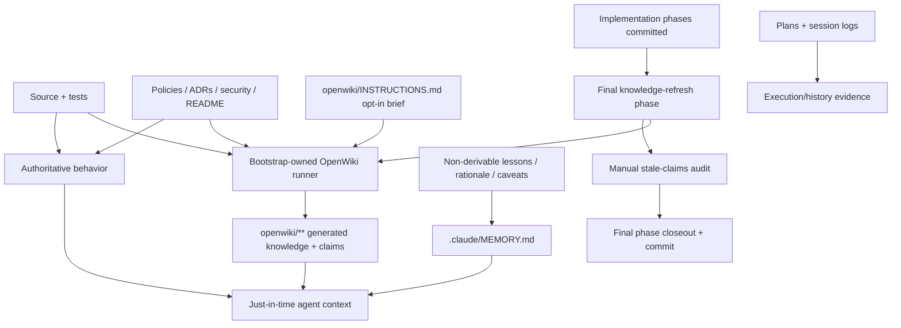

# Big Plan: 2026-09-19_openwiki-knowledge-layer-integration

## Context

The bootstrap keeps durable agent state under `.claude/`, maintains repository documentation
by hand, and treats `.claude/MEMORY.md` as a cross-session project-memory surface. This works,
but repository-derived facts get duplicated across source, `README.md`, `docs/`, root guidance,
and memory. The standing final-phase stale-claims audit reduces drift, but it still relies on
manual discovery.

OpenWiki (`langchain-ai/openwiki`, pinned at `0.5.2`) can provide a generated, evidence-backed
repository knowledge layer under `openwiki/`. Its code mode maintains Markdown pages plus
grounded claim sidecars under `openwiki/.claims/`, records the last documented Git HEAD in
`openwiki/.last-update.json`, and updates incrementally by diffing that HEAD against the current
one. It is a good fit for derived architecture, component, workflow, API, testing, and runtime
knowledge.

Verified upstream behavior that shapes this plan (checked against the `v0.5.2` source):

- Every code-mode run, both `--init` and `--update`, rewrites a managed
  `<!-- OPENWIKI:START -->…<!-- OPENWIKI:END -->` block in root `AGENTS.md` and `CLAUDE.md`.
  There is no flag or environment variable that disables this. The bootstrap requires those
  adapters to remain bootstrap-owned and restorable byte-for-byte.
- `--init` also creates `.github/workflows/openwiki-update.yml`, a scheduled GitHub Actions
  workflow. `--update` never does, and upstream's own CI example documents that `--update`
  performs the first generation when no wiki exists yet.
- Provider choice, keys, and OAuth tokens live in `~/.openwiki/` (relocatable with
  `OPENWIKI_CONFIG_DIR`). Non-interactive runs fail with an actionable message when
  credentials are missing.
- Anonymous telemetry is on by default and honors `OPENWIKI_TELEMETRY_DISABLED=1` and
  `DO_NOT_TRACK=1`.
- In-progress generation state lives in `openwiki/.run.json`, kept across interrupted runs for
  resume and deleted only after successful finalization.
- A no-op update skips model work but still rewrites `openwiki/.last-update.json`.
- Incremental change detection is best-effort: when the recorded base HEAD is unreachable
  (for example after a squash merge or history rewrite), OpenWiki silently falls back to
  dirty and untracked paths only.
- `mermaid` and `jsdom` are optional peer dependencies; without them OpenWiki uses a
  lightweight Mermaid validator.

This plan adds OpenWiki as an **opt-in generated knowledge layer**, dogfoods it on the
bootstrap repository, and makes a dedicated final knowledge-refresh phase the lifecycle pattern
for future OpenWiki-enabled big plans.

## Goals

- Pin and expose a compatible OpenWiki CLI, with its optional Mermaid validators, in the
  bootstrap devcontainer, and persist the user's OpenWiki configuration across rebuilds without
  the bootstrap owning any provider credential.
- Drive OpenWiki host-driven from Claude Code and Codex, using OpenWiki's own supported host
  integrations and the coding session's own model, with no provider credential anywhere in the
  bootstrap. Copilot and Antigravity read `openwiki/**` but cannot refresh it. (Amended
  2026-09-19: the original goal assumed a bootstrap-owned subprocess runner, which cannot work
  against OpenWiki 0.5.2 — see `.claude/session_logs/2026-09-19_openwiki-phase-D-E-cancellation.md`.)
- Preserve bootstrap ownership of `AGENTS.md`, `CLAUDE.md`, workflow files, and other
  control-plane surfaces even though upstream writes its own managed snippets.
- Never run OpenWiki from deterministic verification, hooks, post-commit automation, or
  scheduled CI as part of this integration.
- Keep the runner privacy-preserving by default: telemetry off unless the user chooses
  otherwise; resumable run state never enters Git.
- Define an explicit knowledge-ownership model:
  - source/tests define behavior;
  - human-authored policy, security, ADR, runbook, and README content remains authoritative;
  - `openwiki/**` contains generated descriptive repository knowledge;
  - `MEMORY.md` contains durable project-specific learning that is not derivable from the
    repository;
  - plans and session logs remain execution/history evidence.
- Make OpenWiki activation explicit and repository-local. Presence of
  `openwiki/INSTRUCTIONS.md` is the enablement marker.
- For OpenWiki-enabled multi-phase big plans, make the last phase a small knowledge-refresh
  phase that runs after implementation phases have completed and committed.
- Dogfood the design on `github_copilot_bootstrap` itself, then reduce duplicated descriptive
  docs/memory only where generated coverage is proven adequate.
- Preserve the current manual final-phase stale-claims audit for normative and non-derivable
  surfaces that OpenWiki cannot own.

## Non-Goals

- Do not delete `MEMORY.md`.
- Do not delete `docs/` wholesale.
- Do not make generated OpenWiki pages normative source of truth.
- Do not install OpenWiki's host integrations automatically. They are the supported enablement
  step for host-driven mode and are installed once per checkout by a deliberate human-initiated
  action, never by the bootstrap installer, generator, hooks, `verify.py`, state-sync, or CI, and
  never with `--force`.
- Do not add an OpenWiki scheduled GitHub Actions workflow or auto-merge path.
- Do not store provider credentials, OAuth state, or OpenWiki private configuration in the
  repository, and do not forward individual provider API keys through the devcontainer.
- Do not make `verify.py` invoke a model, network service, or OpenWiki generation.
- Do not initialize OpenWiki automatically in every consumer repository in this first rollout.
- Do not optimize the integration for one model provider.
- Do not change the repository's merge policy to suit OpenWiki. The user owns merge and
  squash decisions.

## Design Overview



### Activation and execution contract

An outer repository is OpenWiki-enabled only when `openwiki/INSTRUCTIONS.md` exists.

The bootstrap runner:

1. exits cleanly without mutation when OpenWiki is not enabled, unless `--require-enabled`
   was requested;
2. invokes `openwiki code --update --print`, including for the first generation;
3. never invokes `--init`, because `--init` scaffolds a scheduled workflow and replaces the
   whole wiki;
4. builds the child environment from the current environment and sets
   `OPENWIKI_TELEMETRY_DISABLED=1` only when the user has not already set that variable;
5. snapshots bootstrap-owned root `AGENTS.md` and `CLAUDE.md` as exact working-tree bytes,
   restores them in `finally`, and proves the bytes match the pre-run state;
6. snapshots `.github/workflows/openwiki-update.yml` when it exists and proves it was not
   created or changed;
7. permits OpenWiki-caused outer-repository changes only under `openwiki/**` after protected
   surfaces are restored;
8. preserves `openwiki/.run.json` or other OpenWiki-owned recovery state on a failed run so a
   later retry can resume; `openwiki/.run.json` is ignored by Git through the installer-managed
   ignore block;
9. never reads, writes, or persists provider secrets itself;
10. runs serially. The lifecycle must not start parallel OpenWiki runs against one checkout.

The runner is an explicit model-backed lifecycle action, not a deterministic quality gate.

### Rebaseline rule

Incremental refresh quality depends on the base HEAD recorded in `openwiki/.last-update.json`
staying reachable. When a squash merge or history rewrite makes it unreachable, OpenWiki's
fallback is degraded incremental assistance, not a failure. When a clean baseline is required:
preserve `openwiki/INSTRUCTIONS.md`, remove the rest of `openwiki/**`, and run the standard
runner again. Never use `--init` for this. The runner gets no rebaseline flag in this plan; the
OpenWiki skill documents the manual procedure.

### Knowledge ownership

| Surface | Ownership |
| --- | --- |
| Source code and tests | Authoritative behavior |
| Shared policies, security docs, ADRs, operator runbooks | Human-authored normative authority |
| `README.md` | Small human entry point and externally useful instructions |
| `openwiki/INSTRUCTIONS.md` | Human-authored OpenWiki scope/priority brief and enablement marker |
| `openwiki/**` except `INSTRUCTIONS.md` | Generated descriptive repository knowledge |
| `.claude/MEMORY.md` / `shared/MEMORY.md` seed | Non-derivable durable lessons, rationale, caveats, operational knowledge |
| Plans / explorations / session logs / receipts | Historical execution and evidence |

A fact that can be re-derived from current source/tests should normally not be copied into
`MEMORY.md`. A policy or design decision remains human-authored even if OpenWiki describes it.

## Cross-Model Principles

1. OpenWiki execution is owned by a repository script/skill, not by one model vendor's native
   integration.
2. Codex, Claude, Copilot, and Antigravity receive the same rule: generated wiki is optional
   just-in-time context; source/tests and canonical policy remain authoritative.
3. Missing OpenWiki provider authentication is an actionable lifecycle failure only when an
   enabled repository reaches its required knowledge-refresh phase. It must not break ordinary
   bootstrap installation or deterministic verification.
4. Automated tests use fakes/test doubles for OpenWiki subprocess behavior. Real model-backed
   generation is limited to explicit acceptance/dogfood runs.
5. Generated OpenWiki pages are reviewed as generated artifacts; agents do not hand-edit them.

## Phases

- [x] `2026-09-19_phase-A-openwiki-runtime-and-safety-boundary` — pin the dependency and its optional validators, persist user config, add the target-neutral runner, protect bootstrap-owned surfaces, ignore resumable run state, and cover the failure/restore contract with deterministic tests.
- [x] `2026-09-19_phase-B-openwiki-knowledge-ownership-and-agent-access` — encode the knowledge-ownership contract in canonical policy, add the narrow OpenWiki skill with the rebaseline rule, and add provider-neutral root guidance.
- [x] `2026-09-19_phase-C-openwiki-lifecycle-integration` — teach planner, orchestrator, documenter, learn, and onboard behavior how OpenWiki-enabled big plans end with a small knowledge-refresh phase, without touching disabled repositories.
- [ ] `2026-09-19_phase-D-openwiki-dogfood-migration-and-closeout` — cancelled: written against the native-CLI runner model; replaced by F–K (see `.claude/session_logs/2026-09-19_openwiki-phase-D-E-cancellation.md`).
- [ ] `2026-09-19_phase-E-openwiki-child-process-sandbox` — cancelled: host-driven mode spawns no bootstrap child process; prevention moved to the guard hook and verify backstop in G.
- [x] `2026-09-19_phase-F-openwiki-hook-mechanics-spike` — evidence-only spike in a scratch repository with a throwaway MCP server: observe whether `PreToolUse`/`PostToolUse` fire for MCP tools on Claude Code and Codex, the tool name, whether a deny is honored, and the payload shape; record GO / GO-with-adaptations / RE-PLAN for G.
- [x] `2026-09-19_phase-F2-verification-evidence-guardrails` — process guardrails so the Phase A failure class cannot recur: mandated required/optional verification lists in small plans, `verify closeout` running every required item itself and recording the results in the receipt's `extensions` (completing phase only, no new check ID or schema change), a plan-time lint refusing hedged checks, the spike skill routed to third-party binaries/CLIs/MCP servers, and a `tests` review question on direct exercise of external dependencies.
- [x] `2026-09-19_phase-F3-hook-target-scoping` — scope four guards to the target a command acts on rather than to the command's text or the hook's own install location. The commit, push and branch-creation gates stop judging commands aimed at another repository, and the protected-file classifier stops matching the credential-file pattern inside longer words and stops treating this repository's control-plane filenames as protected in any directory. Credential-shaped names stay protected everywhere; pull-request creation stays checked every time, because `gh` has no directory redirect and comparing remote addresses is the one failure this phase refuses to risk; and the push hook's restructure closes a pre-existing hole where a nested-state push let an unchecked pull request through.
- [ ] `2026-09-19_phase-G-openwiki-host-driven-guard` — built only against F's evidence: replace the subprocess runner with a PreToolUse/PostToolUse guard on `openwiki_begin`, add the OpenWiki managed-state backstop to `VFY-GEN-001` and the commit gate, fix the devcontainer smoke line, add a real-binary MCP handshake test, retire `openwiki_refresh.py`, and make OpenWiki-installed skill bundles third-party-owned.
- [ ] `2026-09-19_phase-H-openwiki-skill-rename-and-host-rules` — rename the bootstrap skill to `knowledge-refresh`, rewrite it for host-driven operation with the precise host-integration rule, and sweep every reference.
- [ ] `2026-09-19_phase-I-openwiki-enable-and-first-generation` — enable OpenWiki here, install the Claude Code and Codex integrations, re-probe the guard against the real server, run one host-driven generation, commit, and stop for inspection.
- [ ] `2026-09-19_phase-J-openwiki-docs-memory-migration` — after explicit confirmation, migrate only proven duplicate descriptive docs and MEMORY content; no refresh.
- [ ] `2026-09-19_phase-K-knowledge-refresh` — the small knowledge-refresh shape: one update, diff inspection, repository-wide stale-claims/MEMORY/LEARN audit, closeout.

## Step Summary

| Phase | Owner | Main target files | Required Skills | Review Profiles | Verification |
| --- | --- | --- | --- | --- | --- |
| A | coder | `shared/devcontainer/Dockerfile`, `shared/devcontainer/devcontainer.json`, new `shared/scripts/openwiki_refresh.py`, `scripts/generate_targets.py`, `scripts/install_bootstrap.py`, `scripts/validate_targets.py`, runner tests, devcontainer docs | `create-feature`, `add-dependency`, `ponytail` (full), `code-style`, `testing-patterns` | `code`, `architecture`, `security`, `tests`, `ponytail` | focused runner/generator/installer tests; `verify.py fast`; canonical phase/closeout receipts |
| B | coder + documenter | `shared/policies/workflow.instructions.md`, `shared/policies/workspace.instructions.md`, `shared/MEMORY.md`, `docs/architecture.md`, `README.md`, new `shared/skills/openwiki/SKILL.md`, authoring `AGENTS.md` / `CLAUDE.md` | `create-feature`, `ponytail` (full), `code-style`, `testing-patterns`, `documentation`, `humanize` | `code`, `architecture`, `security`, `tests`, `ponytail`, `documentation` | focused policy/skill/root tests; generated-target validation; `verify.py fast`; receipts |
| C | coder + documenter | planner/orchestrator/documenter prompts, `plan-decomposition`, `documentation`, `learn`, `onboard` skills, `shared/templates/plan-big.md`, `shared/policies/workflow.instructions.md` | `ponytail` (full), `code-style`, `testing-patterns`, `documentation`, `humanize` | `code`, `architecture`, `security`, `tests`, `ponytail`, `documentation` | focused plan-generation/lifecycle tests; generated-target validation; `verify.py fast`; receipts |
| D | cancelled — see Phases | — | — | — | — |
| E | cancelled — see Phases | — | — | — | — |
| F | coder (user runs the host sessions) | scratch repository outside this checkout (`spike_mcp_server.py`, `spike_hook.py`, scratch `.mcp.json`, `.claude/settings.json`, `.codex/config.toml`, `.codex/hooks.json`); new `docs/2026-09-19-openwiki-hook-mechanics-spike.md`; raw logs under `.claude/explorations/2026-09-19_openwiki-hook-mechanics-spike/` | `integration-gate-spike`, `documentation`, `humanize` | `architecture`, `security`, `tests`, `documentation` | scripted server round trip; observed per-host U1–U7 table; decision line; `verify.py fast`; receipts |
| F2 | coder + documenter | `shared/policies/workflow.instructions.md`, `shared/templates/plan-small.md`, `shared/templates/session-log.md`, `shared/skills/plan-decomposition/SKILL.md`, `shared/skills/integration-gate-spike/SKILL.md`, `shared/skills/add-dependency/SKILL.md`, `shared/skills/commit/SKILL.md`, `shared/agents/planner/prompt.md`, `shared/agents/orchestrator/prompt.md`, `shared/review-profiles/tests.md`, `scripts/validate_plan_frontmatter.py`, `shared/scripts/verify.py`, their tests, `docs/runtime-checks.md`, live plans G and I | `create-feature`, `ponytail` (full), `code-style`, `testing-patterns`, `documentation`, `humanize` | `code`, `architecture`, `security`, `tests`, `ponytail`, `documentation` | focused validator/verifier tests; `validate_plan_frontmatter.py` over all plans; generate/validate/check_runtime; `verify.py fast`; receipts — this phase's own completion is the gate's first real run |
| F3 | coder + documenter | `shared/hooks/scripts/_lib-frontmatter.sh`, `shared/hooks/scripts/reporting-reminder.sh`, `shared/hooks/scripts/enforce-commit-gate.sh`, `shared/hooks/scripts/enforce-pr-gate.sh`, `shared/hooks/scripts/enforce-branch-state.sh`, `shared/hooks/scripts/protect-files.py`, `tests/test_hook_gates.py`, `tests/test_lifecycle_hooks.py`, `tests/test_branch_state.py`, `docs/runtime-checks.md`, `docs/smoke-tests.md`, `docs/architecture.md` | `ponytail` (full), `refactor`, `code-style`, `testing-patterns`, `documentation`, `humanize` | `code`, `architecture`, `security`, `tests`, `ponytail` | focused hook-gate/classifier tests against real temporary repositories; generate/validate/check_runtime; `verify.py fast`; receipts |
| G | coder + documenter | new `shared/hooks/scripts/openwiki-guard.py`/`.sh`, `scripts/generate_targets.py`, `scripts/validate_targets.py`, `scripts/runtime_ownership.py`, `scripts/check_runtime.py`, `scripts/install_bootstrap.py`, `shared/scripts/verify.py`, `shared/devcontainer/Dockerfile`, delete `shared/scripts/openwiki_refresh.py` + `tests/test_openwiki_refresh.py`, new guard/verify/smoke tests, runner mentions in policies, prompts, root guidance, docs | `create-feature`, `ponytail` (full), `code-style`, `testing-patterns`, `documentation`, `humanize` | `code`, `architecture`, `security`, `tests`, `ponytail`, `documentation` | focused hook/verify/smoke tests; generate/validate/check_runtime; `verify.py fast`; receipts |
| H | coder + documenter | `shared/skills/openwiki/` → `shared/skills/knowledge-refresh/`, root guidance, `render_root_guidance`, workflow/workspace policies, orchestrator/documenter prompts, `docs/architecture.md`, `README.md` | `ponytail` (full), `code-style`, `documentation`, `humanize` | `code`, `architecture`, `security`, `tests`, `ponytail`, `documentation` | skill validators; generated-target validation; `check_runtime`; receipts |
| I | coder | new `openwiki/INSTRUCTIONS.md`, new `.openwikiignore`, `.mcp.json`, `.codex/config.toml` (via `openwiki integrations install`), installed OpenWiki skills, generated `openwiki/**` | `knowledge-refresh`, OpenWiki `openwiki`, `integration-gate-spike`, `documentation`, `humanize` | `code`, `architecture`, `security`, `tests`, `documentation` | guard re-probe; one host-driven update; adapters byte-stable; `check_runtime`; receipts |
| J | documenter + coder | `README.md`, selected live `docs/**`, `shared/MEMORY.md`, `openwiki/INSTRUCTIONS.md` | `documentation`, `humanize`, `deep-audit`, `learn`, `ponytail` (full) if code | `documentation`, `architecture`, `security`; `code`, `tests`, `ponytail` if code | link integrity; `verify.py fast`; receipts |
| K | coder + documenter | generated `openwiki/**`, stale live-advice surfaces, `shared/MEMORY.md` | `knowledge-refresh`, OpenWiki `openwiki`, `documentation`, `humanize`, `learn`, `deep-audit` | `code`, `architecture`, `security`, `tests`, `documentation` | one host-driven update; diff inspection; `## Stale-claims surfaces checked`; receipts |

Skill names above refer to `shared/skills/<name>/SKILL.md`.

## Risks and Fallback Paths

| Risk | Level | Mitigation / fallback |
| --- | --- | --- |
| Upstream CLI behavior changes after installation (0.4.x to 0.5.2 shipped within weeks) | HIGH | Pin `openwiki@0.5.2`, `mermaid@11.16.0`, `jsdom@29.1.1`. Do not float `latest`. Upgrade only through a reviewed dependency change with runner acceptance tests. |
| Host-driven runs consume the coding session's own model budget | MEDIUM | No provider credentials are involved, so there is no auth failure mode in closeout. Keep the generation phases bounded, never call OpenWiki from automated tests, and shape deterministic test payloads like the Phase F observations. |
| Devcontainer rebuild loses the OpenWiki configuration directory | LOW | The `~/.openwiki` bind mount is retained for run state and connector config, but host-driven mode needs no provider credential there, so a lost directory no longer blocks a refresh. |
| Resumable `openwiki/.run.json` is committed by mistake | MEDIUM | Add it to the installer-managed `.gitignore` block and assert it in the target validator. Resume still works because the file stays on disk. |
| Generated wiki duplicates or contradicts normative docs | HIGH | Keep authority matrix explicit. Review generated content against source. Never delete normative docs because OpenWiki generated similar prose. |
| Incremental detection silently degrades after squash merge or history rewrite | MEDIUM | Document the rebaseline rule in the OpenWiki skill and in planning policy. Do not change the merge policy for OpenWiki. |
| Every big plan gains ceremony | MEDIUM | Add the final knowledge phase only in repositories that have enabled OpenWiki and only for multi-phase big plans that change documentable outer-repository behavior. Disabled repos retain the existing lifecycle. |
| OpenWiki generation consumes unnecessary model budget | MEDIUM | Use deterministic fakes for automated tests. Dogfood only the minimum real runs needed to prove initial generation and post-migration update. Do not run generation inside broad test matrices. |
| Concurrent OpenWiki runs corrupt/churn state | MEDIUM | Lifecycle requires one serial runner per checkout. If this cannot be guaranteed operationally, add a small atomic lock in the runner before enabling consumer rollout. |
| A new closeout-evidence rule re-judges already-completed phases at push time | HIGH | The accounting runs only for the phase being completed (`verify closeout` run and `gate --head-relation exact`); `ancestor`/`certified` gating and `historical_chain_errors` are untouched, so A–C and F are never re-judged. |
| A new `CHECK_IDS` entry changes the receipt schema and invalidates A–C's receipts in the historical chain | HIGH | Neither F2 nor G adds a check ID; both surface through the existing closeout-evidence error path. G's Step G2 is amended accordingly. |
| The hedge lint fails ordinary prose and gets ignored | MEDIUM | Verb-anchored closed pattern list, published verbatim; measured 10/107 plans hit, 7 genuine; scoped to live plans dated on or after 2026-09-19 and to text outside fenced code and `## Optional Verification`; documented fallback scope if review finds the rate too high. |
| A required check that self-skips (pytest `skipif`) records PASS without having run | MEDIUM | The canonical text requires the recorded outcome to show the item ran; the `tests` profile question asks for the evidence; `\|\| true` in required items is refused. |
| Consumers mid-phase at upgrade hit the new lint or gate | MEDIUM | Two `docs/runtime-checks.md` rows with exact message prefixes and recovery; only the next completion is affected. |
| Host hook semantics for MCP tools are documented but had never been observed; the guard design depends on them | HIGH | Phase F observes them on both hosts with a throwaway MCP server before any guard code exists; per-host outcomes O1–O5 map to defined changes in G; if the exit condition triggers on Claude Code (or `PreToolUse` fires on neither host), G is re-planned, not built. |
| `openwiki_begin` rewrites root `AGENTS.md` / `CLAUDE.md` with no opt-out (the only out-of-`openwiki/**` write on the host path) | HIGH | `openwiki-guard` PreToolUse snapshots and PostToolUse restores byte-for-byte on the hosts F confirmed; the OpenWiki managed-state condition in `VFY-GEN-001` and the commit gate refuses a commit carrying the managed block; `openwiki-guard.sh post </dev/null` is the manual recovery. |
| The agent calls `openwiki_begin` with `mode: init`, creating a scheduled workflow and replacing the wiki | HIGH | The guard denies `init` where F confirmed denies are honored; the skill forbids it everywhere; `post` restores the workflow path's pre-state; the OpenWiki managed-state condition in `VFY-GEN-001` and the commit gate flags an untracked `openwiki-update.yml`. |
| Devcontainer image build fails at `openwiki --version` (Phase A defect) | HIGH | Phase G replaces the smoke line with a pin check that works non-interactively, updates the validator, and adds a real-binary MCP handshake test. |
| Skill-name collision: OpenWiki installs `openwiki` where the bootstrap skill lives, on both hosts | MEDIUM | Phase H renames the bootstrap skill to `knowledge-refresh`; OpenWiki owns `openwiki`; never `--force` (it leaves a backup dir inside the skills tree). |
| Bootstrap refresh or `check_runtime.py` removes or flags OpenWiki's installed skill bundle | MEDIUM | Phase G makes `skills/openwiki` under `.claude/` and `.agents/` third-party-owned: preserved by the installer, exempt from drift. |
| `update`-mode first generation on an empty wiki is inferred from code, not executed | MEDIUM | Phase I is the proof; if `openwiki_begin` refuses, stop and re-plan; never fall back to `init`. |
| Model budget is now the coding session's own | MEDIUM | Keep I and K runs bounded; automated tests never call OpenWiki; deterministic tests use payloads shaped like F's observations. |
| Generated docs become a second hidden control plane | HIGH | Root guidance treats OpenWiki as optional just-in-time context. Source/tests/policies remain authority and the runner is not allowed to mutate bootstrap control-plane files. |

## Verification

During implementation, use focused tests plus the repository's deterministic fast verifier.
Do not make OpenWiki model execution part of deterministic verification.

```bash
uv run python scripts/generate_targets.py --all
uv run python scripts/validate_targets.py
uv run python scripts/check_runtime.py
uv run python .claude/scripts/verify.py fast --format json
```

At each phase closeout, follow the canonical workflow and require `verify phase` followed by
`verify closeout` PASS receipts.

The real OpenWiki CLI is exercised only in Phase D acceptance. Phases A, B, and C must be fully
testable without provider credentials or model calls.

## Completion Evidence

The final phase listed under `phases:` (Phase D) must also run a documentation, memory, and
LEARN audit: sweep every live-advice surface for claims this plan or earlier work invalidated,
correct or supersede each one, leave dated records unchanged, and record the audited surfaces
and each one's outcome under a `## Stale-claims surfaces checked` heading in that phase's
closeout session log. `verify.py`'s closeout gate requires that exact heading, non-empty,
whenever the phase it is closing out is this list's last entry.

## Done Criteria

- OpenWiki is pinned to `0.5.2` with pinned optional Mermaid validators, and the runtime
  satisfies its Node engine (`>=22.22.0`).
- The devcontainer persists `~/.openwiki` from the host; no provider key is forwarded or stored.
- Consumer generation installs one bootstrap-owned OpenWiki runner under `.claude/scripts/`.
- The runner can initialize/update an enabled repository using `openwiki code --update --print`
  while preserving bootstrap root adapters and any existing OpenWiki workflow byte-for-byte,
  with telemetry disabled unless the user opted in.
- A failed OpenWiki subprocess restores protected surfaces and leaves resumable OpenWiki-owned
  state intact; `openwiki/.run.json` is ignored by Git in every bootstrap-managed repository.
- No automated verifier, hook, installer, state-sync action, or scheduled workflow performs
  model-backed OpenWiki generation.
- Knowledge ownership is explicit in canonical policy, the OpenWiki skill, and root guidance.
- `MEMORY.md` is narrowed to non-derivable durable knowledge rather than repository facts that
  OpenWiki can regenerate.
- Planner/orchestrator behavior adds a small final knowledge-refresh phase for applicable
  OpenWiki-enabled big plans without changing disabled repositories.
- The documenter does not hand-edit generated OpenWiki pages.
- The bootstrap repo contains an intentional `openwiki/INSTRUCTIONS.md`, safe
  `.openwikiignore`, and a generated evidence-backed wiki.
- Any `docs/` or memory content removed during migration has a reviewed replacement or is
  proven redundant; normative/manual content remains.
- Final repository-wide stale-claims audit is recorded in the Phase D closeout log.

## Devil's Advocate Report

| Concern | Risk | Alternative | Recommendation |
| --- | --- | --- | --- |
| Why add a wrapper instead of waiting for an upstream opt-out for agent files? | HIGH | Wait for upstream and make no integration now. | CHANGE: isolate upstream behavior behind one wrapper so the bootstrap can ship safely now and later delete the workaround when upstream exposes a stable policy. |
| Why not reuse `restore-root-adapters.sh` instead of a new snapshot? | MEDIUM | Call the existing hook script after each run. | ACCEPT the snapshot: the hook restores the canonical mirrored adapters, while the wrapper must preserve the exact pre-run working-tree bytes, including legitimate uncommitted edits, and must work before any mirror exists. This is not duplicated functionality. |
| Why not use OpenWiki's native host integrations? | MEDIUM | Install each supported host integration and add separate behavior for unsupported targets. | REVERSED 2026-09-19: the original ACCEPT rested on a wrong model of the tool. Host-driven mode is the only path that needs no provider credential and uses the session's own model, which is what the user wants; it is also the only mode where the integration exists. Claude Code and Codex are supported; Copilot and Antigravity read the generated wiki without refreshing it. |
| Why keep `MEMORY.md` if OpenWiki is intended as memory? | HIGH | Replace it entirely with generated wiki. | ACCEPT: keep a smaller MEMORY surface because rationale, operational lessons, user/project decisions, and AI-state are not reliably derivable from outer-repository source. |
| Why append a final knowledge phase instead of invoking OpenWiki in `verify.py`? | HIGH | Treat docs freshness as a deterministic verification check. | ACCEPT: model/network work is not deterministic verification. A separate phase preserves lifecycle evidence and retry semantics. |
| Why forward no provider keys through the devcontainer? | MEDIUM | Add `OPENAI_API_KEY`, `ANTHROPIC_API_KEY`, and similar to `containerEnv` like `HF_TOKEN`. | CHANGE to bind mount only: OpenWiki supports many providers including OAuth and cloud credentials; forwarding keys makes the bootstrap own a provider matrix it should not own. |
| Why not require merge commits so incremental refresh stays reliable? | MEDIUM | Prohibit squash merges in OpenWiki-enabled repos. | ACCEPT with documentation: the user owns merge decisions; document the rebaseline procedure instead of constraining Git policy. |
| Was the original three-phase split too coarse? | MEDIUM | Keep one phase for all policy, skill, agent, and root-guidance edits. | CHANGE to four phases: the ownership contract and agent access (B) is a dependency of the lifecycle integration (C); splitting along that boundary keeps each control-plane commit reviewable. |
| Could the final knowledge phase become expensive boilerplate? | MEDIUM | Run OpenWiki on every commit or in scheduled CI instead. | ACCEPT with guard: only explicitly enabled repos get the phase, its normal shape is small (refresh, inspect, audit, review, verify, commit), and automated tests never spend model calls. |
| Is removing descriptive `docs/` too aggressive in the first rollout? | HIGH | Keep all existing docs permanently and only add OpenWiki. | CHANGE: migration is evidence-based and optional per file. Remove or shorten a document only after generated coverage and remaining human audience needs are reviewed. |

No unresolved HIGH-risk user decision remains. The conservative defaults are: opt-in consumer
activation, no scheduled CI, no provider credential management, telemetry off by default,
no blanket docs deletion, no merge-policy change, and no replacement of MEMORY.
