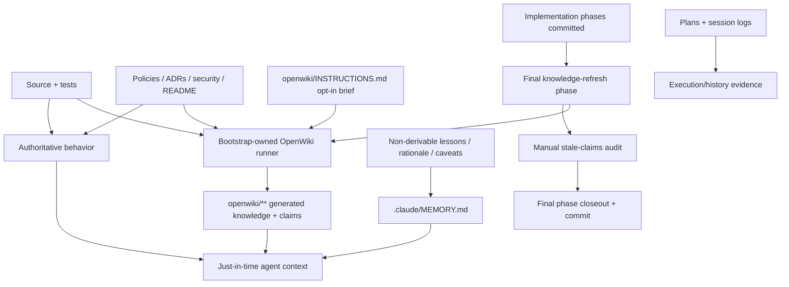

# Big Plan: 2026-09-19_openwiki-knowledge-layer-integration

## Context

The bootstrap currently keeps durable agent state under `.claude/`, uses manually maintained
repository documentation, and treats `.claude/MEMORY.md` as a cross-session project-memory
surface. This works, but repository-derived facts can be duplicated across source, `README.md`,
`docs/`, root guidance, and memory. The existing final-phase stale-claims audit reduces drift,
but it still relies on manual discovery.

OpenWiki can provide a generated, evidence-backed repository knowledge layer under `openwiki/`.
Its current code mode maintains Markdown plus grounded claim sidecars and supports incremental
updates. It is a good fit for derived architecture, component, workflow, API, testing, and
runtime knowledge.

The integration must not give OpenWiki authority over the bootstrap control plane. The bootstrap
owns root `AGENTS.md` / `CLAUDE.md`, canonical policies, plans, session logs, and AI-state. Current
OpenWiki code mode also writes a managed block into root `AGENTS.md` and `CLAUDE.md` on every run,
while the bootstrap requires those adapters to remain bootstrap-owned and restorable
byte-for-byte. OpenWiki also has model/provider credentials and network behavior that must not
become a deterministic verifier or hook dependency.

This plan therefore adds OpenWiki as an **opt-in generated knowledge layer**, dogfoods it on the
bootstrap repository, and makes a dedicated final knowledge-refresh phase the lifecycle pattern
for future OpenWiki-enabled big plans.

## Goals

- Pin and expose a compatible OpenWiki CLI in the bootstrap development/runtime environment.
- Add one bootstrap-owned, target-neutral OpenWiki runner that works from Codex, Claude,
  GitHub Copilot, and Antigravity without requiring host-specific OpenWiki integration.
- Preserve bootstrap ownership of `AGENTS.md`, `CLAUDE.md`, workflow files, and other
  control-plane surfaces even when upstream OpenWiki writes its own managed snippets.
- Never run OpenWiki from deterministic verification, hooks, post-commit automation, or
  scheduled CI as part of this integration.
- Define an explicit knowledge-ownership model:
  - source/tests define behavior;
  - human-authored policy, security, ADR, runbook, and README content remains authoritative;
  - `openwiki/**` contains generated descriptive repository knowledge;
  - `MEMORY.md` contains durable project-specific learning that is not derivable from the
    repository;
  - plans and session logs remain execution/history evidence.
- Make OpenWiki activation explicit and repository-local. Presence of
  `openwiki/INSTRUCTIONS.md` is the enablement marker.
- For OpenWiki-enabled multi-phase big plans, make the last phase a knowledge-refresh phase
  after implementation phases have completed and committed.
- Dogfood the design on `github_copilot_bootstrap` itself, then reduce duplicated descriptive
  docs/memory only where generated coverage is proven adequate.
- Preserve the current manual final-phase stale-claims audit for normative and non-derivable
  surfaces that OpenWiki cannot own.

## Non-Goals

- Do not delete `MEMORY.md`.
- Do not delete `docs/` wholesale.
- Do not make generated OpenWiki pages normative source of truth.
- Do not install OpenWiki's Codex/Claude-specific integrations as a bootstrap requirement.
- Do not add an OpenWiki scheduled GitHub Actions workflow or auto-merge path.
- Do not store provider credentials, OAuth state, or OpenWiki private configuration in the repo.
- Do not make `verify.py` invoke a model, network service, or OpenWiki generation.
- Do not initialize OpenWiki automatically in every consumer repository in this first rollout.
- Do not optimize the integration for one model provider or GPT model.

## Design Overview



### Activation and execution contract

An outer repository is OpenWiki-enabled only when `openwiki/INSTRUCTIONS.md` exists.

The bootstrap runner:

1. exits cleanly without mutation when OpenWiki is not enabled, unless `--require-enabled`
   was requested;
2. invokes `openwiki code --update --print`, including for the first generation;
3. never invokes `--init`, because initial rollout must not scaffold a scheduled workflow;
4. snapshots bootstrap-owned root `AGENTS.md` and `CLAUDE.md`, restores them in `finally`,
   and proves their bytes match the pre-run state;
5. snapshots `.github/workflows/openwiki-update.yml` when it exists and proves it was not
   created or changed;
6. permits OpenWiki-caused outer-repository changes only under `openwiki/**` after protected
   surfaces are restored;
7. preserves `openwiki/.run.json` or other OpenWiki-owned recovery state on a failed run so a
   later retry can resume;
8. never reads, writes, or persists provider secrets itself;
9. runs serially. The lifecycle must not start parallel OpenWiki runs against one checkout.

The runner is an explicit model-backed lifecycle action, not a deterministic quality gate.

### Knowledge ownership

| Surface | Ownership |
| --- | --- |
| Source code and tests | Authoritative behavior |
| Shared policies, security docs, ADRs, operator runbooks | Human-authored normative authority |
| `README.md` | Small human entry point and externally useful instructions |
| `openwiki/INSTRUCTIONS.md` | Human-authored OpenWiki scope/priority brief |
| `openwiki/**` except `INSTRUCTIONS.md` | Generated descriptive repository knowledge |
| `.claude/MEMORY.md` / `shared/MEMORY.md` seed | Non-derivable durable lessons, rationale, caveats, operational knowledge |
| Plans / explorations / session logs / receipts | Historical execution and evidence |

A fact that can be re-derived from current source/tests should normally not be copied into
`MEMORY.md`. A policy or design decision remains human-authored even if OpenWiki describes it.

## Cross-Model Principles

1. OpenWiki execution is owned by a repository script/skill, not by one model vendor's native
   integration.
2. Codex, Claude, Copilot, and Antigravity receive the same rule: generated wiki is optional
   just-in-time context; source/tests and canonical policy remain authoritative.
3. Missing OpenWiki provider authentication is an actionable lifecycle failure only when an
   enabled repository reaches its required knowledge-refresh phase. It must not break ordinary
   bootstrap installation or deterministic verification.
4. Automated tests use fakes/test doubles for OpenWiki subprocess behavior. Real model-backed
   generation is limited to explicit acceptance/dogfood runs.
5. Generated OpenWiki pages are reviewed as generated artifacts; agents do not hand-edit them.

## Phases

- [ ] `2026-09-19_phase-A-openwiki-runtime-and-safety-boundary` — pin the dependency, add the target-neutral runner, protect bootstrap-owned surfaces, generate the installed script, and cover the failure/restore contract with deterministic tests.
- [ ] `2026-09-19_phase-B-knowledge-model-and-lifecycle-integration` — define knowledge ownership, add the OpenWiki skill, narrow MEMORY/documentation responsibilities, and teach planner/orchestrator/documenter/onboarding how OpenWiki-enabled big plans end with a knowledge-refresh phase.
- [ ] `2026-09-19_phase-C-dogfood-migration-and-closeout` — enable OpenWiki for the bootstrap repository, run the real generation/update path, migrate only proven duplicate descriptive knowledge, verify ownership/idempotence behavior, and complete the repository-wide stale-claims audit.

## Step Summary

| Phase | Owner | Main target files | Required Skills | Review Profiles | Verification |
| --- | --- | --- | --- | --- | --- |
| A | coder | `shared/devcontainer/Dockerfile`, new `shared/scripts/openwiki_refresh.py`, `scripts/generate_targets.py`, OpenWiki runner tests | `shared/skills/create-feature/SKILL.md`, `shared/skills/add-dependency/SKILL.md`, `shared/skills/ponytail/SKILL.md`, `shared/skills/code-style/SKILL.md`, `shared/skills/testing-patterns/SKILL.md` | `code`, `architecture`, `security`, `tests`, `ponytail` | focused runner/generator tests; `verify.py fast`; canonical phase/closeout receipts |
| B | coder + documenter | workflow/workspace policy, planner/orchestrator/documenter prompts, plan-decomposition/documentation/learn/onboard/OpenWiki skills, templates, memory seed, architecture docs/root guidance | `shared/skills/create-feature/SKILL.md`, `shared/skills/ponytail/SKILL.md`, `shared/skills/code-style/SKILL.md`, `shared/skills/testing-patterns/SKILL.md`, `shared/skills/documentation/SKILL.md`, `shared/skills/humanize/SKILL.md` | `code`, `architecture`, `security`, `tests`, `ponytail`, `documentation` | focused policy/plan-generation tests; generated-target validation; `verify.py fast`; canonical phase/closeout receipts |
| C | coder + documenter | new `openwiki/INSTRUCTIONS.md`, new `.openwikiignore`, generated `openwiki/**`, `README.md`, `docs/**`, `shared/MEMORY.md`, stale live-advice surfaces | `shared/skills/openwiki/SKILL.md`, `shared/skills/documentation/SKILL.md`, `shared/skills/humanize/SKILL.md`, `shared/skills/learn/SKILL.md`, `shared/skills/deep-audit/SKILL.md`, `shared/skills/ponytail/SKILL.md` for any code fix | `code`, `architecture`, `security`, `tests`, `ponytail` when code changes, `documentation` | real OpenWiki acceptance runs plus deterministic repository checks; final stale-claims audit; canonical phase/closeout receipts |

## Risks and Fallback Paths

| Risk | Level | Mitigation / fallback |
| --- | --- | --- |
| OpenWiki currently writes root `AGENTS.md` / `CLAUDE.md`, conflicting with bootstrap ownership | HIGH | The bootstrap runner restores those files byte-for-byte in `finally`, verifies the result, and rejects any unexpected out-of-scope mutation. Keep root adapters out of OpenWiki evidence via `.openwikiignore` in the dogfood repo. If upstream adds a stable `no-agent-files` policy before implementation, use it and retain restore assertions as defense-in-depth. |
| Upstream CLI behavior changes after installation | HIGH | Pin the exact tested OpenWiki package version. Do not float `latest`. Upgrade only through a reviewed dependency change with runner acceptance tests. |
| Model/provider auth makes closeout nondeterministic | MEDIUM | OpenWiki remains opt-in. Do not call it from `verify.py`, hooks, installer, or CI. The explicit final knowledge phase reports actionable auth/provider failures and can be retried without bypassing the phase. |
| Generated wiki duplicates or contradicts normative docs | HIGH | Keep authority matrix explicit. Review generated content against source. Never delete normative docs because OpenWiki generated similar prose. |
| Every big plan gains ceremony | MEDIUM | Add the dedicated final knowledge phase only in repositories that have explicitly enabled OpenWiki and only for multi-phase big plans that change documentable outer-repository behavior. Disabled repos retain the existing lifecycle. |
| OpenWiki generation consumes unnecessary model budget | MEDIUM | Use deterministic fakes for automated tests. Dogfood only the minimum real runs needed to prove initial generation, post-migration update, and expected no-op behavior. Do not run generation inside broad test matrices. |
| Concurrent OpenWiki runs corrupt/churn state | MEDIUM | Lifecycle requires one serial runner per checkout. Do not parallelize OpenWiki refresh. If this cannot be guaranteed operationally, add a small atomic lock in the runner before enabling consumer rollout. |
| Generated docs become a second hidden control plane | HIGH | Root guidance treats OpenWiki as optional just-in-time context. Source/tests/policies remain authority and the runner is not allowed to mutate bootstrap control-plane files. |

## Verification

During implementation, use focused tests plus the repository's deterministic fast verifier.
Do not make OpenWiki model execution part of deterministic verification.

```bash
uv run python scripts/generate_targets.py --all
uv run python scripts/validate_targets.py
uv run python scripts/check_runtime.py
uv run python .claude/scripts/verify.py fast --format json
```

At each phase closeout, follow the canonical workflow and require `verify phase` followed by
`verify closeout` PASS receipts.

The real OpenWiki CLI is exercised only in Phase C acceptance. Phases A and B must be fully
testable without provider credentials or model calls.

## Done Criteria

- OpenWiki is pinned to an explicitly tested version and the runtime satisfies its Node engine.
- Consumer generation installs one bootstrap-owned OpenWiki runner under `.claude/scripts/`.
- The runner can initialize/update an enabled repository using `openwiki code --update --print`
  while preserving bootstrap root adapters and any existing OpenWiki workflow byte-for-byte.
- A failed OpenWiki subprocess restores protected surfaces and leaves resumable OpenWiki-owned
  state intact.
- No automated verifier, hook, installer, state-sync action, or scheduled workflow performs
  model-backed OpenWiki generation.
- Knowledge ownership is explicit in canonical policy and root guidance.
- `MEMORY.md` is narrowed to non-derivable durable knowledge rather than repository facts that
  OpenWiki can regenerate.
- Planner/orchestrator behavior adds a final knowledge-refresh phase for applicable
  OpenWiki-enabled big plans without changing disabled repositories.
- The documenter does not hand-edit generated OpenWiki pages.
- The bootstrap repo contains an intentional `openwiki/INSTRUCTIONS.md`, safe
  `.openwikiignore`, and a generated evidence-backed wiki.
- Any `docs/` or memory content removed during migration has a reviewed replacement or is
  proven redundant; normative/manual content remains.
- Final repository-wide stale-claims audit is recorded in the Phase C closeout log.

## Devil's Advocate Report

| Concern | Risk | Alternative | Recommendation |
| --- | --- | --- | --- |
| Why add a wrapper instead of waiting for upstream `no-agent-files` support? | HIGH | Wait for upstream and make no integration now. | CHANGE: isolate upstream behavior behind one wrapper so the bootstrap can ship safely now and later delete the workaround when upstream exposes a stable policy. |
| Why not use OpenWiki's native Codex/Claude integrations? | MEDIUM | Install each supported host integration and add separate behavior for unsupported targets. | ACCEPT: keep one CLI path. Host-specific installation would undermine the bootstrap's cross-target contract and still does not cover all targets. |
| Why keep `MEMORY.md` if OpenWiki is intended as memory? | HIGH | Replace it entirely with generated wiki. | ACCEPT: keep a smaller MEMORY surface because rationale, operational lessons, user/project decisions, and AI-state are not reliably derivable from outer-repository source. |
| Why append a final knowledge phase instead of invoking OpenWiki in `verify.py`? | HIGH | Treat docs freshness as a deterministic verification check. | ACCEPT: model/network work is not deterministic verification. A separate phase preserves lifecycle evidence and retry semantics. |
| Could the final knowledge phase become expensive boilerplate? | MEDIUM | Run OpenWiki on every commit or in scheduled CI instead. | ACCEPT with guard: only explicitly enabled repos get the phase, and automated tests never spend model calls. |
| Is removing descriptive `docs/` too aggressive in the first rollout? | HIGH | Keep all existing docs permanently and only add OpenWiki. | CHANGE: migration is evidence-based and optional per file. Remove or shorten a document only after generated coverage and remaining human audience needs are reviewed. |

No unresolved HIGH-risk user decision remains. The conservative defaults are: opt-in consumer
activation, no scheduled CI, no provider credential management, no blanket docs deletion, and
no replacement of MEMORY.
