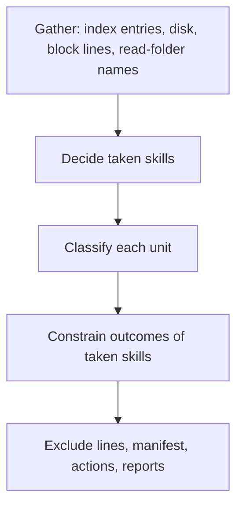

# Small Plan: Phase G — Sidecar Ownership and Precedence

## Scope

Fix how the sidecar decides what it owns and when a team skill takes
precedence. Today the planner decides collisions after choosing each unit's
action, so recovery paths escape the rule. It reads ownership from files on
disk instead of the Git index, and it trusts its own exclude line only when
re-adopting a unit. It also ignores symlinked team skill folders, and checks
team `.gitignore` rules in a way that misses rules ending in `/`. This phase
makes one precedence decision per skill before any action. It moves an
edited copy of a taken skill into a backup folder inside the Git directory,
and fixes the report lines and remedies these rules produce.

Findings covered (IDs from the two 2026-09-25 review reports): R1, R2, R4,
design items 1-3, S3, S4, S9, S12, S15 (planner items), S16 (planner
remedies), L1, L3, L4. Big plan Decisions 22-25, 30, 32. L2 is closed by
Phase H's complete-source rule (Decision 31).

This phase changes planner inputs and outputs, adds one action kind
(`preserve`), and changes snapshot gathering and the gate paths. Installer
entry, mode detection, Git-directory validation, and bytes-safe I/O belong to
Phase H. The functions this phase rewrites use `os.fsdecode` for Git output
already, so Phase H does not redo them.



### Required Skills

- `shared/skills/ponytail/SKILL.md` — `full`
- `shared/skills/code-style/SKILL.md`
- `shared/skills/testing-patterns/SKILL.md`
- `shared/skills/safe-consumer-bootstrap-refresh/SKILL.md`
- `shared/skills/debug-investigator/SKILL.md` — for any regression that does not fail as described

## Primary Files

- `scripts/sidecar_overlay.py` — planner (`_classify_unit`, `_team_takeover`,
  `plan_sidecar_reconciliation`, `required_snapshot_units`), snapshot
  gathering (`_tracked_files`, `_gather_unit`, `_build_snapshots`,
  `_read_list_skill_names`, `_excluded_units`), manifest path validation
  (`_validate_unit_path`, `_validate_retained_path`), gate paths
  (`_write_raw_paths`), apply (`_apply_actions`, new preserve move), and
  reporting (`_print_report`, `_describe_dry_run_actions`, remedy functions).
- `scripts/runtime_ownership.py` — `SIDECAR_PRESERVED_NAME`,
  `SIDECAR_RETIRED_SKILL_WRITE_ROOTS`, `SIDECAR_RETIRED_BRIDGES`. This module
  is copied byte for byte into `dist/multi-agent/.claude/scripts/`, so
  regenerate targets.
- `tests/test_sidecar_overlay.py`, `tests/test_sidecar_install.py`,
  `tests/test_sidecar_update.py`, `tests/sidecar_test_helpers.py`.
- `README.md` ("Personal sidecar install") and `docs/target-mapping.md`
  (sidecar layout) — only the behavior this phase changes.

## Steps

Every step adds regression tests that fail on HEAD `c90aac9` before the
change. Assert on the files, the manifest, the exclude block, the printed
report, and `git status --porcelain --untracked-files=all`, not only on
actions. Run a second run after each scenario and assert that nothing
changes, and run a dry run and assert that it predicts the same result.

- [ ] **1. Read ownership from the Git index (Decision 25; R4).**
  - **Owner:** `coder`
  - Replace the disk-filtered tracked set in `_build_snapshots`:
    `UnitSnapshot.tracked_files` becomes every index path at or under the
    unit (the exact path for a bridge), relative to the unit, whether or not
    it exists on disk. Update the `UnitSnapshot` docstring.
    `untracked_files` stays "files on disk minus tracked".
  - Read the index once with `git ls-files -s -z` and return each path
    (decoded with `os.fsdecode`) with its mode. Index entries include
    `skip-worktree`, intent-to-add, gitlink (`160000`), and symlink
    (`120000`) entries. Phase H reuses this reader for its gitlink and
    `.claude` checks; do not add a second one.
  - When `core.ignorecase` is true, compare index paths with unit paths, and
    with files inside a unit, using `casefold()`. A case-variant tracked
    folder then makes the unit tracked (team-owned or team takeover), and a
    case-variant tracked file is never counted as untracked, deleted,
    removed, or preserved.
  - A tracked unit is classified as team-owned or team takeover before the
    planner's symlink abort, so a tracked team symlink at a unit path skips
    that skill instead of aborting the run. An untracked symlink at a unit
    path is foreign: the skill is taken, and nothing is written through it.
    A symlinked ancestor of a unit still aborts, tracked or not (non-goal).
  - `_read_list_skill_names` adds the first path segment of every index path
    under each read folder to that folder's names.
  - `_team_takeover` still iterates only files on disk. Never restore,
    check out, or write over a deleted tracked file.
  - Tests: tracked `.claude/skills/ponytail` folder deleted from disk; only
    its `SKILL.md` deleted (empty folder left); sparse checkout without the
    team skill; `skip-worktree` entry; gitlink at a skill path with no
    folder; a team takeover followed by the person deleting the tracked
    file; a tracked bridge deleted locally; a tracked `.github/skills/<name>`
    deleted locally; a tracked symlink `.agents/skills/ponytail`. In each:
    exit 0, `ponytail` is skipped with a report naming the tracked path, the
    other units are installed, and nothing is written into or next to the
    tracked path. The local deletion stays (`git status --short` still lists
    the file as deleted, or `git ls-files -t` still shows `S`).
  - Also test an untracked personal symlink at `.claude/skills/ponytail`:
    `ponytail` is skipped at every root, and the link and its target are
    untouched.
  - Case-insensitive test (pure planner, since Linux has no
    case-insensitive filesystem): the index entry
    `.claude/skills/Ponytail/SKILL.md`, a disk folder `ponytail/` holding the
    team bytes plus the sidecar `LICENSE`, a record, and ignorecase true.
    Expect a team takeover: `LICENSE` deleted, `SKILL.md` untouched, no
    preserve.

- [ ] **2. Decide taken skills first (Decision 22; R1, R2, S12, L3, design item 1).**
  - **Owner:** `coder`
  - Keep `plan_sidecar_reconciliation` pure. Add inputs through the
    gathered data, not new I/O inside the planner.
  - A skill is taken when any of these holds:
    - an index path exists under any read folder for its name;
    - a read-only folder (`.github/skills`, `.agent/skills`, `.codex/skills`)
      has an entry with its name on disk: a folder, a symlink to a folder, or
      a broken symlink;
    - a write-root unit for it is team-owned, team takeover, or foreign;
    - a non-sidecar `SKILL.md` directly under a read folder declares it as
      its frontmatter `name:`. Open only a regular file (checked with
      `lstat`), read at most 4 KB, read the leading `---` block only, and
      strip quotes and a trailing comment from the value. An unreadable or
      malformed file declares nothing;
    - `git config --bool core.ignorecase` is true and a case variant of its
      name exists in a read folder. An unset value (exit 1, no output) means
      false; it is not a Git error.
  - Symlinks: list a symlinked read folder through its link, unless the link
    resolves to a write root or to a folder inside one. Skip an entry that
    resolves to one of the sidecar's own unit paths. Never write through a
    symlink. The common layout `.github/skills -> ../.claude/skills` must
    stay stable: no alternating install and remove.
  - For a taken skill, convert each unit outcome: `install` becomes no-op;
    `unchanged`, `update`, and `adopt` become remove; locally modified and
    unfinished become preserve (step 4); team-owned, team takeover, foreign,
    no-op, drop, and remove stay. Add a helper that returns the allowed set,
    and a parametrized planner test asserting that no taken skill ever
    produces `install`, `update`, `unchanged`, or `adopt`.
  - The report names every path that took the skill, including a read-only
    folder when a write root is also foreign (S15), and never says "skipped
    at every root" while a copy remains in a client folder.
  - Tests:
    - R1: install, move the manifest aside, commit `.github/skills/ponytail/SKILL.md`,
      rerun. Both ponytail copies are gone, the manifest and block have no
      ponytail entry, the report has no false claim, and status is unchanged.
    - R1 siblings: a `before_manifest_write` fault followed by a collision; an
      adoptable copy at one root and a foreign copy at the other; a
      team-tracked copy at one root and an adoptable copy at the other.
    - R2: a symlinked read-only root, a symlinked skill folder, and a broken
      symlink entry, parametrized over the three read-only folders. Also
      `.github/skills -> ../.claude/skills` over three runs.
    - S12: `core.ignorecase=true` with `.github/skills/Ponytail/`; a case
      variant at a write root. The person's visible `Ponytail/` folder is
      never hidden.
    - L3: `.github/skills/team-humanize/SKILL.md` declaring `name: humanize`;
      a malformed frontmatter block declares nothing; a named pipe named
      `SKILL.md` is never opened.
    - S15: a foreign copy at a write root plus a `.github/skills` collision
      for the same skill. The report names both paths.

- [ ] **3. Prove ownership with the record or the exclude line (Decision 23; S3).**
  - **Owner:** `coder`
  - Add `unescape_exact_path`, the inverse of `escape_exact_path`. Parse the
    sidecar block into unit lines and file lines. A unit line is one whose
    unescaped path passes `_validate_unit_path` (current plus retired roots
    and bridges, step 7) and re-escapes to the same line. This also finds a
    listed unit for a skill that no longer ships. A file line is one whose
    unescaped path passes `_validate_retained_path` and re-escapes to the
    same line.
  - Keep any other line inside the block, and report it once, so no run
    un-hides a file through a line it does not understand.
  - Add every listed unit to the required units, so it is always classified.
  - Rows, per the big plan's updated table:
    - listed, no record, content equals desired: adopt (unchanged);
    - recorded, content equals desired, line missing: adopt;
    - listed, no record, content differs from desired, or no desired
      content: unfinished sidecar copy; keep files and line, record nothing,
      report;
    - tracked and listed with no record: team takeover, using the desired
      files as the ownership reference;
    - team takeover in general: delete untracked files whose bytes match the
      record or the desired content.
  - With no manifest, a file line keeps hiding its file while the file
    exists and is untracked, and it is reported as retained.
  - Tests (each scenario from S3):
    - A crash during a fresh install, then new content before the rerun.
    - A crash, or the manifest moved aside, then a skill stops shipping.
    - A crash during a fresh install, then the team tracks a file in the unit.
    - A crash during an update, then a team takeover. Sidecar bytes must not
      be marked RETAINED.
    - A crash during an update, then the block deleted: equal content is
      adopted, not reported as locally modified.
    - Retained files survive a lost manifest and stay hidden.
    - Also check that the invalid-manifest recovery run no longer un-hides
      anything.

- [ ] **4. Preserve edited copies of taken skills (Decision 24; design item 2).**
  - **Owner:** `coder`
  - Add action kind `preserve`. The planner emits it for a taken skill's
    locally modified or unfinished unit. `_write_raw_paths` includes it, so
    the unit keeps its line during the write phase, and the final block drops
    it.
  - Destination: `<git dir>/ai-bootstrap-sidecar-preserved/<unit path with "/" replaced by "__">--<unit hash>`,
    one level deep: a folder for a skill, a file for a bridge (a bridge is
    preserved only by Phase H's uninstall). Build it from
    `git rev-parse --absolute-git-dir`, never from `git_path`. Add
    `SIDECAR_PRESERVED_NAME` to `scripts/runtime_ownership.py`.
  - Before any write, refuse a preserved path that is a symlink or exists and
    is not a folder. Phase H step 3 folds this into its general Git-directory
    checks.
  - Pass the set of units whose destination already exists into the planner,
    so dry-run matches the real run. When the destination exists, the unit
    stays in place with its record and line, and the report names a
    conflict and both paths. Exit 0 (Decision 9: per-path conflict).
  - Move with `os.replace` after creating parent folders. Print
    `PRESERVED <unit> -> <path>` and count it in the summary. Dry-run prints
    "would preserve".
  - Crash convergence: add a `_fault_point` after the move and before the
    manifest write. The rerun finds the unit absent and drops its record.
  - Tests: a `.github` collision with an edited `.agents/skills/ponytail`, and
    the same with an edited copy at a write-root takeover. In each, the
    edited bytes are identical at the destination, the record and line are
    gone, status is unchanged, and a rerun changes nothing. Also cover: an
    existing destination (conflict, nothing moved), dry run, and the fault
    point.

- [ ] **5. Treat an empty leftover unit folder as absent (S9).**
  - **Owner:** `coder`
  - `_gather_unit` reports `exists=False` for an untracked unit folder that
    holds only folders (no file, symlink, pipe, or socket at any depth).
    `_place_unit` already moves any existing folder into staging with
    `os.replace`, so it needs no change.
  - Test: team takeover, then the team stops tracking, then the person deletes
    the retained file as told. The rerun reinstalls the skill.

- [ ] **6. Gate skill folders with a trailing slash (Decision 30; S4).**
  - **Owner:** `coder`
  - `_write_raw_paths` returns `<unit>/` for skill units (bridges stay file
    paths). The gate's expected set and its comparison use the same
    spelling, in both apply and dry-run.
  - Tests, parametrized over team rules: `!.claude/skills/*/`,
    `.claude/skills/*` then `!.claude/skills/*/`, `!.agents/skills/**/`,
    `!**/ponytail/`, and `!.claude/skills/ponytail/`. Each fails the gate on
    the first run (dry run and real run), writes no unit, and restores the
    exclude file. The common `.claude/*` plus `!.claude/skills/` pattern
    still passes.

- [ ] **7. Stable manifest namespace (Decision 32; L1, L4).**
  - **Owner:** `coder`
  - Add `SIDECAR_RETIRED_SKILL_WRITE_ROOTS: tuple[str, ...] = ()` and
    `SIDECAR_RETIRED_BRIDGES: tuple[str, ...] = ()` to
    `scripts/runtime_ownership.py`. `_validate_unit_path` and
    `_validate_retained_path` accept current and retired values. A recorded
    unit outside the desired set goes through the normal remove row. Reject
    a unit or retained path that contains a backslash.
  - Tests: monkeypatch one bridge from current to retired; the update removes
    the old bridge and drops its line, with status unchanged. A manifest with
    a backslash path is invalid.

- [ ] **8. Correct the planner's report and remedies (S15, S16 planner items).**
  - **Owner:** `coder`
  - Use the remedy texts in the big plan's "Remedies printed in the report"
    section (the wording may tighten, the meaning may not change): locally
    modified (with and without a shipped skill), unfinished copy, preserved,
    foreign (names the skip at every root), team-owned skill (names the
    tracked path actually found), team-owned bridge, retained (mentions
    `git add -f` and that a pull can overwrite it).
  - A real run and a dry run print one line per removed, deleted, or
    preserved path, as well as the counts.
  - Tests assert the exact report lines for each category.

- [ ] **9. Document this phase's behavior.**
  - **Owner:** `documenter`
  - `README.md` "Personal sidecar install": the preserved folder and how to
    recover from it, the taken-skill rule (index, symlinks, case variants,
    frontmatter names), and the warning that a pull overwrites hidden files
    (Decision 35).
  - `docs/target-mapping.md`: the preserved folder in the sidecar layout.
  - Phase H does the full documentation pass; do not rewrite unrelated text
    here.

## Acceptance Criteria

- Every R1, R2, R4, S3, S4, S9, S12, and L1-L4 scenario above has a test that
  fails on `c90aac9` and passes after this phase.
- A taken skill never produces install, update, unchanged, or adopt, in any
  path (property test).
- No scenario in this phase exposes a sidecar file or a personal file in
  `git status`, except the documented block-deletion recovery.
- An edited copy of a taken skill ends up byte-identical in the preserved
  folder, or stays in place with a conflict report when the destination
  exists.
- Existing sidecar tests pass. The 45-combination crash convergence and the
  second-run idempotence still hold.
- Dry run predicts the same actions and reports as the real run.

## Verification

```bash
uv run python scripts/generate_targets.py --all
uv run pytest tests/test_sidecar_overlay.py tests/test_sidecar_install.py tests/test_sidecar_update.py -q --tb=short
uv run python scripts/validate_targets.py
uv run python scripts/check_runtime.py
uv run python .claude/scripts/verify.py fast --format json
```

This phase changes `scripts/runtime_ownership.py`, which is installed as
`.claude/scripts/runtime_ownership.py`. Run the self-install
(`uv run python scripts/install_bootstrap.py . --allow-self --local-only`)
after regenerating and before `verify closeout`.

## Review Profiles

- `code`
- `architecture`
- `security`
- `tests`
- `ponytail`
- `documentation`

## Closeout Checklist

Follow the fixed closeout order in `shared/policies/workflow.instructions.md`
(Canonical Orchestrator Loop, step 5: CLOSEOUT).

- [ ] Documentation updated or explicitly skipped as pure-internal
- [ ] LEARN entries saved or no-lessons marker recorded
- [ ] Closeout session log has `**Status:** COMPLETED`
- [ ] Nested plan state checkpointed (`.claude` ai-state) before staging outer-repository files
- [ ] Intended outer files explicitly staged and `git diff --cached` reviewed
- [ ] Every surviving MINOR has an explicit disposition and non-empty reason
- [ ] Review findings resolved and persisted with branch/phase metadata
- [ ] Verification passed (`verify phase` PASS; `verify closeout` runs the plan's required verification items itself and PASS)
