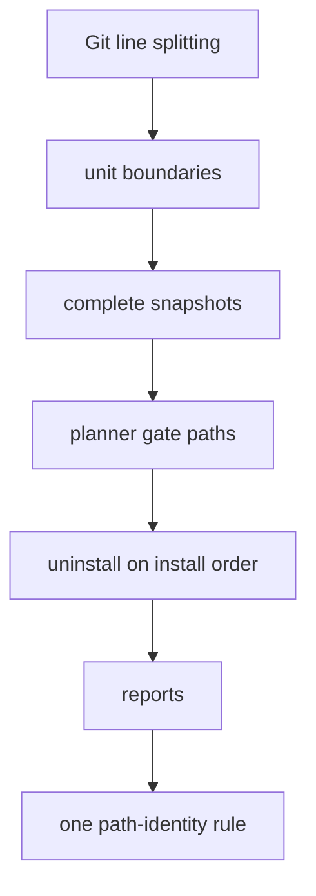

# Small Plan: Phase J — Sidecar Safety Follow-up

## Scope

Two independent reviews of the completed Phases A-I failed the branch on
safety grounds, though both kept the architecture. The problems:

- Uninstall can delete files inside a team submodule.
- Uninstall can expose an edited copy of a dropped skill, or be blocked
  permanently by false preserve conflicts.
- A named pipe inside a unit can be deleted.
- The skill-name scans follow symlinks by different rules.
- A form feed in a file name can inject a raw ignore pattern.
- Several reports and docs claim more than the code does.

This phase fixes every finding in both reports. It also rebuilds uninstall
on the install's write order, so both commands share one apply step and
one gate rule.

Findings covered: R1-R5 from
`.claude/quality_reports/2026-09-26_consumer-sidecar-bootstrap-overlay-review.md`
and O1-O19 from `...-review-2.md` (its mapping table links the two). Big
plan Decisions 37-47. An independent review of this plan text found four
gaps: an uninstall gate that a team rule could block, a symlink unit gated
with a trailing slash, a contradiction between Decisions 37 and 25, and a
submodule inside a team skill folder aborting every run. They are fixed in
the decisions and in the steps below.



### Required Skills

- `shared/skills/ponytail/SKILL.md` — `full`
- `shared/skills/code-style/SKILL.md`
- `shared/skills/testing-patterns/SKILL.md`
- `shared/skills/safe-consumer-bootstrap-refresh/SKILL.md`
- `shared/skills/debug-investigator/SKILL.md` — for any regression that does not fail as described
- `shared/skills/documentation/SKILL.md` — step 11

## Primary Files

- `scripts/sidecar_overlay.py` — block parsing and writing, snapshots
  (`_gather_unit`, `_build_snapshots`, `UnitSnapshot`), `_check_ignore`,
  the read-folder enumerator, `required_snapshot_units`, `_classify_unit`,
  `_team_takeover`, `plan_sidecar_reconciliation` (`PlanResult` gate paths
  and `kept_conflicts`), `_gate_spelling`, `_skill_name`, `run_ignore_gate`,
  the install and uninstall apply and dry-run paths, and the remedies.
- `scripts/install_bootstrap.py` — the `--mode full` sidecar refusal, the
  CLI "nothing to do" path, and `warn_tracked_paths`.
- `scripts/validate_plan_frontmatter.py` — `_knowledge_refresh_phase_settled`
  and its module comment.
- `tests/test_sidecar_overlay.py`, `tests/test_sidecar_install.py`,
  `tests/test_sidecar_update.py`, `tests/test_sidecar_uninstall.py`,
  `tests/test_install_bootstrap.py`, `tests/test_validate_plan_frontmatter.py`,
  `tests/sidecar_test_helpers.py`.
- `README.md`, `docs/target-mapping.md`, and the Termination paragraph in
  `shared/policies/workflow.instructions.md` — step 11 only.

## Steps

Test rules for every step (Decision 47):

- Each sidecar behavior finding gets a real-Git regression test through
  `install_sidecar`, `uninstall_sidecar`, or the installer CLI, not only a
  pure-planner test.
- Each finding's regression test must fail on HEAD `010f08c` before the
  fix; the two review reports describe each reproduction. A test that
  guards behavior that already works is named as a guard in its docstring.
- Assert on files, the manifest, the exclude block, the printed report, and
  `git status --porcelain --untracked-files=all`.
- After each scenario, run a second run and assert that nothing changes,
  and assert that a dry run predicts the same result.
- Implement every scenario listed below, not a representative subset.
- Never open a named pipe; run pipe scenarios in a subprocess with a
  timeout.

- [ ] **1. Git line splitting (Decision 42; O5).**
  - **Owner:** `coder`
  - One helper splits exclude text on `\n` only and ignores one trailing
    `\r` when comparing, while writes keep the original bytes. Use it in
    `parse_exclude_block`, `sidecar_evidence`, `_read_exclude_block`,
    `_replace_exclude_block`, and `_remove_exclude_block`. No exclude-file
    reader or writer uses `str.splitlines()`.
  - Tests:
    - Retained names containing `\f`, `\v`, and U+2028 never produce a
      separate pattern line, and a team `app/src/main.py` stays visible.
    - Guard: a CRLF block still works, and the existing escape tests pass.

- [ ] **2. Repository boundaries at units (Decision 37; R1, O1).**
  - **Owner:** `coder`
  - Gathering detects a `.git` entry (file or folder) at any depth in a
    unit folder without following symlinks, stops hashing below it, and
    runs before `_build_snapshots` calls `check-ignore`.
  - Nothing at or under any gitlink index entry (mode `160000`, anywhere in
    the index, including below a unit) is sent to `git check-ignore`, gets
    a file action, or keeps a file line. Such a line is dropped and
    reported, because the outer exclude file does not apply inside a
    submodule.
  - A unit that is itself a gitlink is team-owned. `_team_takeover` plans
    no file action for it, and the report says the sidecar never touches
    files inside a submodule.
  - A recorded or listed unit that holds a `.git` entry whose parent folder
    is not a gitlink aborts the run before any write, with the
    nested-repository message. This applies in install, update, dry run,
    and uninstall; during uninstall every well-known unit is checked. A
    unit with such an entry that is neither recorded nor listed is foreign:
    its skill is taken, and nothing inside it is touched.
  - Decision 28's `--show-toplevel`, gitlink, and shape checks stay on the
    write roots and bridge parents. Its device check also runs on every
    existing unit folder.
  - `_check_ignore` treats a Git exit other than 0 or 1 as an error that
    aborts the run with Git's message, instead of returning a partial set.
  - Tests:
    - Install, then turn `.claude/skills/ponytail` into a nested repository
      with committed files, then `git add -f` it as a gitlink. Install,
      update, dry run, and uninstall all exit 0. No file inside the nested
      repository changes (its own `git status` is clean), and the report
      says it is a submodule the sidecar never touches.
    - The same without the gitlink (a disk-only nested repository at a
      recorded unit). Install, update, dry run, and uninstall all abort
      before any write with the nested-repository message. Nothing moves.
    - A personal clone at `.claude/skills/ponytail` that the sidecar never
      owned. `ponytail` is skipped as foreign, the other units install,
      and nothing inside the clone changes (guard for today's behavior).
    - A real submodule at a recorded unit path, added with
      `git -c protocol.file.allow=always submodule add`. Install exits 0
      without a false gate message, and uninstall deletes nothing inside
      it.
    - A team skill folder that is tracked and holds its own submodule one
      level down (`.claude/skills/ponytail/vendor`). Install, update, dry
      run, and uninstall all exit 0.
    - A fatal `check-ignore` error, triggered by a patched `subprocess.run`
      or a `git` shim on `PATH` that exits 128. The run aborts naming
      Git's message, and nothing is written.

- [ ] **3. Complete snapshots (Decision 38; R4, O9, the O17 special-file bullet).**
  - **Owner:** `coder`
  - A unit folder with no non-folder entry at any depth and no unreadable
    subfolder counts as absent, and install replaces it. Otherwise
    `_gather_unit` marks a unit `incomplete` when it holds a symlink, named
    pipe, socket, device, empty subfolder, or unreadable subfolder.
    `UnitSnapshot` records the flag and the unit's own type (folder,
    symlink, or other).
  - `_classify_unit`: an incomplete unit never matches its record or the
    desired content. It is locally modified when recorded, unfinished when
    listed, and foreign otherwise. A taken skill's incomplete unit is
    preserved intact with `os.replace`.
  - Only a symlinked ancestor of a unit aborts the run; an inner symlink no
    longer does. A team takeover never deletes a non-regular entry. An
    untracked symlink inside a taken-over unit is retained with its own
    exact-path line when ignored, is carried forward while it exists, and
    is reported as now visible on uninstall.
  - Tests:
    - A named pipe in an installed unit, then uninstall. The unit is
      preserved with the pipe intact at the destination, never deleted.
    - A named pipe in an installed unit, then an update whose content
      changed. The unit is kept as locally modified, not replaced.
    - A Unix socket in an installed unit behaves the same as the pipe.
    - An empty subfolder added to an installed unit makes it locally
      modified.
    - A team-tracked skill folder that holds a symlink is team-owned, and
      the other units are installed.
    - An untracked sidecar unit with an inner symlink is kept as locally
      modified, with no abort.
    - `.claude/skills/ponytail/mylink` exists, then the team commits
      `.../SKILL.md`. On rerun `mylink` stays hidden and is reported
      RETAINED; a second run is stable; uninstall reports it as now
      visible.
    - Guard: a symlinked ancestor still aborts.

- [ ] **4. Retained files of dropped skills (Decision 43; O4).**
  - **Owner:** `coder`
  - `required_snapshot_units` also adds the owning unit of every file line
    in the block.
  - Tests: the O4 scenario. Install; a team takeover retains `notes.md`;
    version 2 drops `humanize`; the manifest is moved aside; rerun.
    `notes.md` stays hidden and reported. Uninstall reports it as now
    visible.

- [ ] **5. Planner gate paths (Decision 40; O10, O11).**
  - **Owner:** `coder`
  - The planner returns the gate paths next to the exclude lines, from
    what it already knows about each path and unit type:
    - For install and update, every unit and file path the write-phase
      block lists. That covers unfinished and locally modified units,
      retained files, and takeover deletions, and never unrecognized
      lines.
    - For uninstall, only the paths whose lines the final block keeps.
  - `_gate_spelling` gives `<unit>/` only for a real folder or an absent
    unit, and `<unit>` for a unit that exists as a symlink or another
    non-folder. `_gate_spelling` and `_skill_name` use
    `_ALL_SKILL_WRITE_ROOTS`, so retired roots are spelled correctly.
  - `run_ignore_gate` treats a Git exit other than 0 or 1 as an error:
    restore the exclude file and abort with Git's message. It passes
    `expected - ignored` to `_parse_check_ignore_verbose`.
  - Tests:
    - A team negation exposes an unfinished unit: the install aborts and
      restores the exclude file, instead of reporting "stays hidden".
    - A team `!/.claude/skills/humanize` rule: the failure names only
      `.claude/skills/humanize/`, with the team rule.
    - An installed unit replaced by a symlink to a personal folder: install
      exits 0 and reports it as locally modified and still hidden, with no
      gate failure.

- [ ] **6. Uninstall on the install's write order (Decision 39; R2, O2, O3, O18).**
  - **Owner:** `coder`
  - Planner: during uninstall, every classified unit is taken (`taken_units`
    is every unit in `outcomes`), including dropped skills, retired roots,
    and retired bridges. `PlanResult` gains `kept_conflicts`: the units kept
    in place because their preserve destination exists.
  - Rebuild `_uninstall_sidecar_apply` and `_uninstall_sidecar_dry_run`:
    1. Write the write-phase block. Skip that write when there is no block
       and no line to write.
    2. Run the gate over the uninstall gate paths from step 5; none when
       `kept_conflicts` is empty. Restore the exclude file on failure.
    3. Empty staging and apply actions through `_apply_actions`. A missing
       source is allowed, because uninstall never plans install, update, or
       adopt; assert that.
    4. When `kept_conflicts` is empty, remove the block (writing
       unrecognized lines back as plain lines), delete the manifest, and
       remove the staging folder. Otherwise write the final block and a
       manifest with only the kept units' records, empty staging, and exit
       1.
  - Remove `_uninstall_conflict_pre_write_gate`,
    `_uninstall_conflict_post_rewrite_gate`, `_apply_uninstall_actions`, and
    every branch on the raw `preserved_conflicts` set outside the planner.
    Keep the existing fault-point names the tests use.
  - Tests:
    - R2/O2: an edited copy of a skill that a later profile drops is
      preserved by uninstall, not exposed.
    - A retired bridge from an older manifest: when it matches its record,
      it is removed; when it was edited, it is preserved as a file. The
      test patches `_ALL_BRIDGES` and `_ALL_SKILL_WRITE_ROOTS`, which are
      computed at import time.
    - O3 scenario (a): a crash or a manifest moved aside, then uninstall,
      reinstall, and uninstall again. Both uninstalls exit 0, and nothing
      is left.
    - O3 scenario (b): a unit symlink preserved once, then the team takes
      that skill. Uninstall exits 0.
    - A team `!/.claude/skills/humanize` rule is added after install.
      Install fails its gate, but uninstall exits 0, removes every unit,
      and leaves `git status` clean.
    - An installed unit replaced by a symlink: uninstall preserves the
      symlink and exits 0, with no gate failure.
    - A crash between block removal and manifest deletion: the rerun
      writes nothing to the exclude file and deletes the manifest.
    - Guard: a real preserve conflict still exits 1, keeps that unit
      hidden, and the gate checks it.
    - Every fault point converges on rerun, and every existing uninstall
      test still passes.

- [ ] **7. Accurate reports and the NITs (Decisions 44, 46; O12, O15, O16, O17).**
  - **Owner:** `coder`
  - While a conflict copy remains, a taken skill's reports say it is kept
    until the conflict is resolved, never "skips at every root".
  - Uninstall prints the preserved-copy folder's path whenever that folder
    holds anything. This includes both "no sidecar found; nothing to do"
    paths: the CLI's in `install_bootstrap.py` and `uninstall_sidecar`'s.
  - The `--mode full` sidecar refusal mentions `--uninstall`.
  - `warn_tracked_paths` turns a `GitDetectionError` into a warning instead
    of aborting after the full install's writes. Test it with a patched Git
    call.
  - The named-pipe test uses a subprocess run of the CLI with `timeout=`.
    The old executor deadline cannot fire.
  - Guard test (O15): a repository that tracks only code and `.gitignore`
    gets a plain full install.
  - Tests assert each message.

- [ ] **8. One path-identity rule for collision sources (Decision 41; R3, O6, O7, O8).**
  - **Owner:** `coder`
  - Add one enumerator over the read folders:
    - a read-only folder is listed through its symlink unless it resolves
      into a write root;
    - a symlink entry in any read folder, including a write root, that
      resolves into a write root is an alias and never takes a skill;
    - every other entry is listed by its own name.
  - `_read_list_skill_names` (plus the index names) and
    `_declared_skill_names` both use it.
  - Tests:
    - R3 case 1: `.github/skills` is a symlink to a team folder, and a
      differently named folder there declares `name: humanize`. `humanize`
      is taken.
    - R3 case 2 and O7: after an install,
      `.github/skills/ponytail -> ../../.claude/skills/ponytail`. Three runs
      are stable, and both copies stay.
    - A write-root alias,
      `.claude/skills/pt -> ../../.agents/skills/ponytail`: three runs are
      stable, and nothing dangles.
    - O8: `.codex/skills -> ../shared-skills`, with a declaration of
      `ponytail-review`. `ponytail-review` is taken.
    - O6: `core.ignorecase=true` and a personal `.claude/skills/Ponytail/`.
      `ponytail` is taken, and the personal folder stays visible.
    - Guard: `.github/skills -> ../.claude/skills` stays stable over three
      runs.

- [ ] **9. Precedence property test (Decision 47; O13).**
  - **Owner:** `coder`
  - Fix the fixtures so the adopt case's content equals the desired content,
    and the unchanged case's record equals the desired content.
  - Check that adding `"adopt"` to `_ALLOWED_TAKEN_OUTCOMES` (the R1 escape:
    the conversion loop then leaves an adopt outcome alone) makes the
    property test fail on its assertion, not on an exception. Restore it,
    and record the result in the session log.

- [ ] **10. Settled refresh identity (Decision 45; R5).**
  - **Owner:** `coder` (a separate run; disjoint files)
  - `_knowledge_refresh_phase_settled` also takes the big plan's `name`,
    which must be non-empty. A sibling counts only when all of these hold:
    - it is a regular file, not a symlink (checked with `lstat`);
    - its frontmatter declares `type: small-plan`;
    - its `name` equals the phase slug;
    - its `parent_plan` equals the big plan's `name`;
    - its `status` is `complete` or `cancelled`.
  - Correct the docstring's confinement claim and the module comment.
    Standard library only, and Python 3.9-compatible.
  - Tests:
    - Update the Phase F tests to use valid small-plan fixtures.
    - Reject, each as its own case: a symlinked sibling (pointing outside
      the plans folder), an unrelated `parent_plan`, the wrong `type`, the
      wrong `name`, and an empty big-plan `name`.
    - Every real plan still validates.

- [ ] **11. Documentation (Decisions 44, 45, 46; O14, O15).**
  - **Owner:** `documenter`
  - `README.md` (around lines 692-696) must say that full mode checks only
    `state-sync.sh`, and that the sidecar source must match its exact
    allowlist.
  - `README.md` (around lines 678-683) must state the unit-level boundary
    rule as implemented:
    - a recorded or listed unit that is a nested repository is refused;
    - a personal clone the sidecar never owned is skipped;
    - a gitlink unit is team-owned and never touched.
  - Replace "tracks a path the full install writes" with "tracks an
    agent-harness path" (around lines 65 and 659).
  - Describe uninstall's preserved-folder message, the rule that a conflict
    is the only non-preflight exit 1, and the rule that a team rule
    exposing a sidecar path never blocks uninstall.
  - Update the Termination paragraph in
    `shared/policies/workflow.instructions.md` to state the settled-refresh
    identity check.
  - Update `docs/target-mapping.md` where it restates any of these.
  - Never hand-edit `openwiki/`; Phase K refreshes it.

## Acceptance Criteria

- Every R1-R4, O1-O12, O16, and O17 behavior scenario has a real-Git test
  that fails on `010f08c` and passes after this phase. R5 and O13 have
  their own tests. O14, O15, O18, and O19 have recorded dispositions.
- No run deletes, moves, or writes anything inside a nested repository or
  submodule. No run deletes an entry the unit hash cannot represent, except
  the empty folders of a unit that counts as absent.
- Uninstall works after a profile change. It exits 1 only for a unit it
  kept because of a preserve conflict, or on a preflight refusal that names
  its cause. It never exposes a sidecar file, and a team rule that exposes
  a sidecar path never blocks it.
- The gate checks every path the write-phase block claims to hide on
  install and update, and only the kept paths on uninstall. It spells a
  symlink unit without a trailing slash, and a failure names only the paths
  that are not ignored.
- Folder names, case variants, and frontmatter names follow one
  path-identity rule, and every symlink layout in step 8 is stable over
  three runs.
- No exclude parser or writer uses `str.splitlines()`.
- The plan validator exempts only a correctly identified, confined sibling.
- Existing tests pass. Crash convergence, second-run idempotence, and
  dry-run parity hold for install, update, and uninstall.

## Verification

```bash
uv run python scripts/generate_targets.py --all
uv run pytest tests/test_sidecar_overlay.py tests/test_sidecar_install.py tests/test_sidecar_update.py tests/test_sidecar_uninstall.py tests/test_install_bootstrap.py tests/test_validate_plan_frontmatter.py tests/test_check_runtime.py -q --tb=short
uv run python scripts/validate_plan_frontmatter.py
uv run python scripts/validate_targets.py
uv run python scripts/check_runtime.py
uv run python .claude/scripts/verify.py fast --format json
```

This phase changes `scripts/validate_plan_frontmatter.py` and
`shared/policies/workflow.instructions.md`, which are copied into
`dist/multi-agent/` and installed under `.claude/`. Run the self-install
(`uv run python scripts/install_bootstrap.py . --allow-self --local-only`)
after regenerating and before `verify closeout`. Run `verify.py phase` and
closeout step 4 in the foreground (MEMORY lesson on the conftest leak
guard).

## Review Profiles

- `code`
- `architecture`
- `security`
- `tests`
- `ponytail`
- `documentation`

## Closeout Checklist

Follow the fixed closeout order in `shared/policies/workflow.instructions.md`
(Canonical Orchestrator Loop, step 5: CLOSEOUT).

- [ ] Documentation updated or explicitly skipped as pure-internal
- [ ] LEARN entries saved or no-lessons marker recorded
- [ ] Closeout session log has `**Status:** COMPLETED`
- [ ] Nested plan state checkpointed (`.claude` ai-state) before staging outer-repository files
- [ ] Intended outer files explicitly staged and `git diff --cached` reviewed
- [ ] Every surviving MINOR has an explicit disposition and non-empty reason
- [ ] Review findings resolved and persisted with branch/phase metadata
- [ ] Verification passed (`verify phase` PASS; `verify closeout` runs the plan's required verification items itself and PASS)
