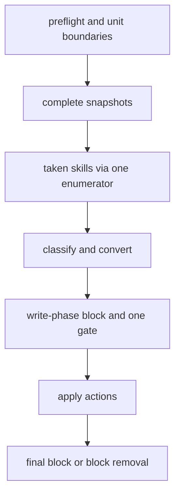

# Small Plan: Phase J — Sidecar Safety Follow-up

## Scope

Two independent reviews of the completed Phases A-I failed the branch on
safety grounds, though both kept the architecture. The problems:

- Uninstall can delete files inside a team submodule.
- Uninstall can expose an edited copy of a dropped skill, or be blocked
  permanently by false preserve conflicts.
- A named pipe inside a unit can be deleted.
- The skill-name scans follow symlinks by different rules.
- A form feed in a file name can inject a raw ignore pattern.
- Several reports and docs claim more than the code does.

This phase fixes every finding in both reports. It also rebuilds uninstall
on the install's write order, so both commands share one gate and one
apply step.

Findings covered: R1-R5 from
`.claude/quality_reports/2026-09-26_consumer-sidecar-bootstrap-overlay-review.md`
and O1-O19 from `...-review-2.md` (its mapping table links the two). Big
plan Decisions 37-47.



### Required Skills

- `shared/skills/ponytail/SKILL.md` — `full`
- `shared/skills/code-style/SKILL.md`
- `shared/skills/testing-patterns/SKILL.md`
- `shared/skills/safe-consumer-bootstrap-refresh/SKILL.md`
- `shared/skills/debug-investigator/SKILL.md` — for any regression that does not fail as described
- `shared/skills/documentation/SKILL.md` — step 11

## Primary Files

- `scripts/sidecar_overlay.py` — snapshots (`_gather_unit`,
  `_build_snapshots`, `UnitSnapshot`), `_check_ignore`, the read-folder
  scans, `required_snapshot_units`, `_classify_unit`, `_team_takeover`,
  `plan_sidecar_reconciliation` (`PlanResult.kept_conflicts`), block
  parsing and writing, `_write_raw_paths`, `run_ignore_gate`, the install
  and uninstall apply and dry-run paths, and the remedies.
- `scripts/install_bootstrap.py` — the `--mode full` sidecar refusal and
  `warn_tracked_paths`.
- `scripts/validate_plan_frontmatter.py` — `_knowledge_refresh_phase_settled`.
- `tests/test_sidecar_overlay.py`, `tests/test_sidecar_install.py`,
  `tests/test_sidecar_update.py`, `tests/test_sidecar_uninstall.py`,
  `tests/test_install_bootstrap.py`, `tests/test_validate_plan_frontmatter.py`,
  `tests/sidecar_test_helpers.py`.
- `README.md`, `docs/target-mapping.md` — step 11 only.

## Steps

Every step adds real-Git regression tests through `install_sidecar`,
`uninstall_sidecar`, or the installer CLI (Decision 47), not only
pure-planner tests. Each test must fail on HEAD `010f08c` before the fix;
the two review reports describe each reproduction. Assert on files, the
manifest, the exclude block, the printed report, and
`git status --porcelain --untracked-files=all`. After each scenario, run a
second run and assert that nothing changes, and assert that a dry run
predicts the same result. Implement every scenario listed below, not a
representative subset.

- [ ] **1. Repository boundaries at every unit (Decision 37; R1, O1).**
  - **Owner:** `coder`
  - `_gather_unit` records whether a unit folder holds a `.git` entry (file
    or folder) at any depth, without following symlinks. The planner aborts
    before any write, with the nested-repository message, when such a unit
    is not a gitlink in the outer index. Apply this to install, update,
    dry run, and uninstall; during uninstall every well-known unit is
    checked.
  - A unit that is a gitlink in the outer index (Phase G's index reader
    returns mode `160000` at the unit path) is team-owned. `_team_takeover`
    plans no file action for it (no delete, retain, move, or write). It
    drops the sidecar's record and line and reports any sidecar file left
    inside the submodule, with a remedy to remove it there.
  - `_build_snapshots` never sends a path inside a gitlink unit to
    `git check-ignore`. `_check_ignore` treats a fatal Git exit (not 0 or 1)
    as an error that aborts the run, instead of returning a partial set.
  - Tests:
    - Install, then turn `.claude/skills/ponytail` into a nested repository
      with committed files, then `git add -f` it as a gitlink. Install,
      update, and uninstall all exit 0. No file inside the nested
      repository changes (its own `git status` is clean). The report names
      the path and any leftover sidecar file.
    - The same without the gitlink (a disk-only nested repository). Install,
      update, dry run, and uninstall all abort before any write with the
      nested-repository message, and nothing is moved.
    - A real `git submodule add` of a local repository at a recorded unit
      path: install exits 0 without a false gate message, and uninstall
      deletes nothing inside the submodule.
    - A fatal `check-ignore` error surfaces as an abort that names Git's
      message.

- [ ] **2. Complete snapshots (Decision 38; R4, O9, the O17 special-file bullet).**
  - **Owner:** `coder`
  - `_gather_unit` marks a unit `incomplete` when it holds any symlink,
    named pipe, socket, device, or empty subfolder. A folder that holds only
    folders still counts as absent (Phase G). `UnitSnapshot` gains the flag.
  - `_classify_unit`: an incomplete unit never matches its record or the
    desired content. It is locally modified when recorded, unfinished when
    listed, and foreign otherwise. A taken skill's incomplete unit is
    preserved intact with `os.replace`.
  - Only a symlinked ancestor of a unit aborts the run. An inner symlink no
    longer does, whether the unit is tracked or not. A team takeover never
    deletes a non-regular entry.
  - Tests:
    - A named pipe in an installed unit, then uninstall. The unit is
      preserved with the pipe intact at the destination, never deleted.
    - A named pipe in an installed unit, then an update whose content
      changed. The unit is kept as locally modified, not replaced.
    - A Unix socket in an installed unit behaves the same as the pipe.
    - An empty subfolder added to an installed unit makes it locally
      modified.
    - A team-tracked skill folder that holds a symlink is team-owned, and
      the other units are installed.
    - An untracked sidecar unit with an inner symlink is kept as locally
      modified, with no abort.
    - A symlinked ancestor still aborts.
    - Never open a pipe; guard the pipe tests with a subprocess timeout.

- [ ] **3. Uninstall on the install's write order (Decision 39; R2, O2, O3, O18).**
  - **Owner:** `coder`
  - Planner: during uninstall, every classified unit is taken (`taken_units`
    is every unit in `outcomes`), including dropped skills, retired roots,
    and retired bridges. `PlanResult` gains `kept_conflicts`: the units
    kept in place because their preserve destination exists.
  - Rebuild `_uninstall_sidecar_apply` and `_uninstall_sidecar_dry_run` on
    the install's order:
    1. Write the write-phase block (`exclude_lines_write`).
    2. Run one gate (step 4), and restore the exclude file on failure.
    3. Empty staging and apply actions through `_apply_actions`. A missing
       source is allowed, because uninstall never plans install, update, or
       adopt; assert that.
    4. When `kept_conflicts` is empty, remove the block, writing
       unrecognized lines back as plain lines, delete the manifest, and
       remove the staging folder. Otherwise write the final block and a
       manifest with only the kept units' records, empty staging, and exit
       1.
  - Remove `_uninstall_conflict_pre_write_gate`,
    `_uninstall_conflict_post_rewrite_gate`, `_apply_uninstall_actions`, and
    every branch on the raw `preserved_conflicts` set outside the planner.
    Keep the existing fault-point names the tests use.
  - Tests:
    - O2/R2: an edited copy of a skill that a later profile drops is
      preserved by uninstall, not exposed. A retired bridge from an older
      manifest is removed or preserved.
    - O3 scenario (a): a crash or a manifest moved aside, then uninstall,
      reinstall, and uninstall again. Both uninstalls exit 0, and nothing
      is left.
    - O3 scenario (b): a unit symlink preserved once, then the team takes
      that skill. Uninstall exits 0.
    - A real preserve conflict still exits 1 and keeps that unit hidden.
    - Every fault point converges on rerun.
    - Every existing uninstall test still passes.

- [ ] **4. One gate over every kept line (Decision 40; O10, O11).**
  - **Owner:** `coder`
  - `_write_raw_paths` derives the gate set from `exclude_lines_write`:
    every line that is a unit line or a file line, unescaped and
    gate-spelled. Unrecognized lines are skipped. This covers unfinished
    and locally modified units and retained files.
  - `run_ignore_gate` passes `expected - ignored` to
    `_parse_check_ignore_verbose`.
  - Tests:
    - A team negation exposes an unfinished unit: the install aborts and
      restores the exclude file, instead of reporting "stays hidden".
    - A team `!/.claude/skills/humanize` rule: the failure names only
      `.claude/skills/humanize/`, with the team rule.

- [ ] **5. One path-identity rule for collision sources (Decision 41; R3, O6, O7, O8).**
  - **Owner:** `coder`
  - Add one enumerator over the read folders:
    - a read-only folder is listed through its symlink unless it resolves
      into a write root;
    - an entry that resolves into a write root is skipped as an alias;
    - write roots are listed directly.
  - `_read_list_skill_names` (plus the index names) and
    `_declared_skill_names` both use it.
  - Tests:
    - R3 case 1: `.github/skills` is a symlink to a team folder, and a
      differently named folder there declares `name: humanize`. `humanize`
      is taken.
    - R3 case 2 and O7: after an install,
      `.github/skills/ponytail -> ../../.claude/skills/ponytail`. Three runs
      are stable, and both copies stay.
    - O8: `.codex/skills -> ../shared-skills`, with a declaration of
      `ponytail-review`. `ponytail-review` is taken.
    - O6: `core.ignorecase=true` and a personal `.claude/skills/Ponytail/`.
      `ponytail` is taken, and the personal folder stays visible.
    - `.github/skills -> ../.claude/skills` stays stable over three runs.

- [ ] **6. Git line splitting (Decision 42; O5).**
  - **Owner:** `coder`
  - One helper splits exclude text on `\n` only and ignores one trailing
    `\r` when comparing, while writes keep the original bytes. Use it in
    `parse_exclude_block`, `sidecar_evidence`, `_read_exclude_block`,
    `_replace_exclude_block`, and `_remove_exclude_block`.
  - Tests:
    - Retained names containing `\f`, `\v`, and U+2028 never produce a
      separate pattern line, and a team `app/src/main.py` stays visible.
    - A CRLF block still works, and the existing escape tests pass.

- [ ] **7. Retained files of dropped skills (Decision 43; O4).**
  - **Owner:** `coder`
  - `required_snapshot_units` also adds the owning unit of every file line
    in the block.
  - Tests: the O4 scenario. Install; a team takeover retains `notes.md`;
    version 2 drops `humanize`; the manifest is moved aside; rerun.
    `notes.md` stays hidden and reported. Uninstall reports it as now
    visible.

- [ ] **8. Accurate reports and the NITs (Decision 44; O12, O16, O17).**
  - **Owner:** `coder`
  - While a conflict copy remains, a taken skill's reports say it is kept
    until the conflict is resolved, never "skips at every root".
  - Uninstall prints the preserved-copy folder's path whenever that folder
    holds anything.
  - The `--mode full` sidecar refusal mentions `--uninstall`.
  - `warn_tracked_paths` turns a `GitDetectionError` into a warning instead
    of aborting after the full install's writes.
  - The named-pipe test uses a subprocess run of the CLI with `timeout=`.
    The old executor deadline cannot fire.
  - Tests assert each message.

- [ ] **9. Settled refresh identity (Decision 45; R5).**
  - **Owner:** `coder` (a separate run; disjoint files)
  - `_knowledge_refresh_phase_settled` also takes the big plan's `name`. A
    sibling counts only when all of these hold:
    - it is a regular file, not a symlink (checked with `lstat`);
    - its frontmatter declares `type: small-plan`;
    - its `name` equals the phase slug;
    - its `parent_plan` equals the big plan's `name`;
    - its `status` is `complete` or `cancelled`.
  - Correct the docstring's confinement claim. Standard library only, and
    Python 3.9-compatible.
  - Tests:
    - Update the Phase F tests to use valid small-plan fixtures.
    - Reject, each as its own case: a symlinked sibling (pointing outside
      the plans folder), an unrelated `parent_plan`, the wrong `type`, and
      the wrong `name`.
    - Every real plan still validates.

- [ ] **10. Precedence property test (Decision 47; O13).**
  - **Owner:** `coder`
  - Fix the fixtures so the adopt case's content equals the desired content,
    and the unchanged case's record equals the desired content.
  - Check that reintroducing the adopt escape (removing `adopt` from
    `_TAKEN_OUTCOME_CONVERSION` handling) fails the planner test, then
    restore.

- [ ] **11. Documentation (Decisions 44, 46; O14, O15).**
  - **Owner:** `documenter`
  - `README.md` (around lines 692-696) must say that full mode checks only
    `state-sync.sh`, and that the sidecar source must match its exact
    allowlist.
  - `README.md` (around lines 678-683) must state the unit-level boundary
    rule as implemented: a disk-only nested repository at a unit is refused,
    and a gitlink unit is team-owned and never touched.
  - Replace "tracks a path the full install writes" with "tracks an
    agent-harness path" (around lines 65 and 659).
  - Describe uninstall's preserved-folder message and the rule that a
    conflict is the only exit 1.
  - Update `docs/target-mapping.md` where it restates any of these.
  - Never hand-edit `openwiki/`; Phase K refreshes it.

## Acceptance Criteria

- Every R1-R5 and O1-O17 scenario has a real-Git test that fails on
  `010f08c` and passes after this phase, or a documented disposition.
- No run deletes, moves, or writes anything inside a nested repository or
  submodule, and no run deletes an entry the unit hash cannot represent.
- Uninstall works after a profile change, exits 1 only for a unit it kept
  because of a preserve conflict, and never exposes a sidecar file.
- The gate checks every path the write-phase block claims to hide, and a
  gate failure names only the paths that are not ignored.
- Folder names, case variants, and frontmatter names follow one
  path-identity rule, and every symlink layout in step 5 is stable over
  three runs.
- No exclude parser or writer uses `str.splitlines()`.
- The plan validator exempts only a correctly identified, confined sibling.
- Existing tests pass. Crash convergence, second-run idempotence, and
  dry-run parity hold for install, update, and uninstall.

## Verification

```bash
uv run python scripts/generate_targets.py --all
uv run pytest tests/test_sidecar_overlay.py tests/test_sidecar_install.py tests/test_sidecar_update.py tests/test_sidecar_uninstall.py tests/test_install_bootstrap.py tests/test_validate_plan_frontmatter.py tests/test_check_runtime.py -q --tb=short
uv run python scripts/validate_plan_frontmatter.py
uv run python scripts/validate_targets.py
uv run python scripts/check_runtime.py
uv run python .claude/scripts/verify.py fast --format json
```

This phase changes `scripts/validate_plan_frontmatter.py`, which is copied
into `dist/multi-agent/` and installed under `.claude/scripts/`. Run the
self-install (`uv run python scripts/install_bootstrap.py . --allow-self
--local-only`) after regenerating and before `verify closeout`. Run
`verify.py phase` and closeout step 4 in the foreground (MEMORY lesson on
the conftest leak guard).

## Review Profiles

- `code`
- `architecture`
- `security`
- `tests`
- `ponytail`
- `documentation`

## Closeout Checklist

Follow the fixed closeout order in `shared/policies/workflow.instructions.md`
(Canonical Orchestrator Loop, step 5: CLOSEOUT).

- [ ] Documentation updated or explicitly skipped as pure-internal
- [ ] LEARN entries saved or no-lessons marker recorded
- [ ] Closeout session log has `**Status:** COMPLETED`
- [ ] Nested plan state checkpointed (`.claude` ai-state) before staging outer-repository files
- [ ] Intended outer files explicitly staged and `git diff --cached` reviewed
- [ ] Every surviving MINOR has an explicit disposition and non-empty reason
- [ ] Review findings resolved and persisted with branch/phase metadata
- [ ] Verification passed (`verify phase` PASS; `verify closeout` runs the plan's required verification items itself and PASS)
