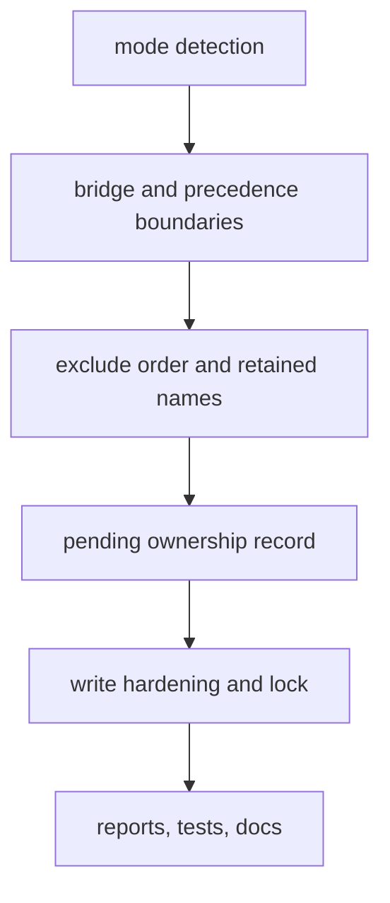

# Small Plan: Phase L — Sidecar Detection and Recovery Follow-up

## Scope

A third review of the completed Phases A-K found two blockers, six
majors, and a set of minors in corners the phase-scoped reviews did not
reach:

- A plain install still takes over a team repository that tracks
  `.claude/bootstrap-ownership.env`, including one that ships it in a
  `.claude` submodule, and then pushes an `ai-state` branch to the team's
  remote.
- A tracked folder at a bridge path is read as untracked, and uninstall
  moves the team's file out of the worktree.
- A skill dropped from the profile is never taken by a team copy.
- Frontmatter names are missed after a mid-character cut or a BOM.
- A read folder reached through a symlinked parent flips runs between
  install and remove.
- A retained name with a backslash produces a manifest the next run refuses.
- User lines inside the exclude block are re-sorted, flipping negations.
- An update interrupted before the manifest write, then a newer version,
  never converges and reports the sidecar's own bytes as edits.

This phase fixes every finding in the report and hardens the write path
(file modes, `fsync`, writability preflight, clean aborts, a run lock).

Findings covered: N1-N20 and the NITs from
`.claude/quality_reports/2026-09-27_consumer-sidecar-bootstrap-overlay-review-3.md`.
Big plan Decisions 48-58. Every BLOCKER, MAJOR, and MINOR fix below was
prototyped and proven before this plan was written: each new test failed
on `f6f36c8` and passed after its fix, and the three prototypes merged
into one tree where 467 sidecar and installer tests, ruff, and mypy pass.
The step text quotes those designs; the coder applies them, not new ones.
The prototype patches live in the planning session's scratch folder and
are not durable; each step below is precise enough to rebuild them.



### Required Skills

- `shared/skills/ponytail/SKILL.md` — `full`
- `shared/skills/code-style/SKILL.md`
- `shared/skills/testing-patterns/SKILL.md`
- `shared/skills/safe-consumer-bootstrap-refresh/SKILL.md`
- `shared/skills/debug-investigator/SKILL.md` — for any regression that does not fail as described
- `shared/skills/documentation/SKILL.md` — step 14

## Primary Files

- `scripts/install_bootstrap.py` — `_full_install_evidence`,
  `_sidecar_evidence`, `detect_install_mode`, `_run_uninstall`, `main`.
- `scripts/sidecar_overlay.py` — `_validate_retained_path`,
  `_validate_unit_path`, `serialize_manifest`, `_classify_unit`,
  `_team_takeover`, `plan_sidecar_reconciliation`, `_unit_index_relpaths`,
  `_gather_unit` (read call sites only), `_parse_frontmatter_name`,
  `_reflects_a_write_root`, `_enumerate_read_entries`, `sidecar_evidence`,
  `_read_exclude_block`, `_atomic_write`, `_unwritable_paths_for_actions`,
  `_run_target_preflight`, `_install_sidecar_apply`,
  `_uninstall_sidecar_apply`, `install_sidecar`, `uninstall_sidecar`,
  `_info`, `_abort`, and the remedies.
- `scripts/runtime_ownership.py` — `SIDECAR_FORBIDDEN_TEXT_TOKENS`.
- `tests/test_install_bootstrap.py`, `tests/test_sidecar_install.py`,
  `tests/test_sidecar_update.py`, `tests/test_sidecar_uninstall.py`,
  `tests/test_sidecar_overlay.py`, `tests/sidecar_test_helpers.py`.
- `README.md`, `docs/target-mapping.md`, `docs/architecture.md` — step 14
  only.

## Steps

Test rules for every step (Decision 47 applies unchanged):

- Each behavior finding gets a real-Git regression test through
  `install_sidecar`, `uninstall_sidecar`, or the installer CLI, not only a
  pure-planner test. A test that pins behavior that already works is named
  as a guard in its docstring.
- Each regression test must fail on HEAD `f6f36c8` before its fix. The
  review report describes each reproduction.
- Assert on files, the manifest, the exclude bytes, the printed report, and
  `git status --porcelain --untracked-files=all`. After each scenario run
  a second run and assert nothing changes, and assert that a dry run
  predicts the same result.
- Tests that need an unreadable file or folder skip when running as root.
- Implement every scenario listed below, not a representative subset.

- [ ] **1. Tracked `.claude` never yields full evidence (Decision 48; N1, N13, N17, N11a).**
  - **Owner:** `coder`
  - `_full_install_evidence(target, allow_self)` keeps its signature and
    reads the index once, before either evidence branch: `claude_tracked`
    is true when any index entry of any mode (file, symlink `120000`, or
    gitlink `160000`) is `.claude` or starts with `.claude/`. A
    `CalledProcessError` whose stderr lacks "not a git repository" aborts
    through `_detection_abort_message`; otherwise the entries are empty.
    Then `.claude/.git` counts only when it is a directory (`lstat`) and
    not `claude_tracked`; `.claude/bootstrap-ownership.env` counts only
    when `os.path.lexists` finds it and not `claude_tracked`. The target
    then falls through to the existing team-config refusal.
  - `_sidecar_evidence`: the `except ExcludeMarkerError` branch raises
    `SystemExit("Refusing to detect an install mode: <exc>. To recover, <_EXCLUDE_MARKER_REMEDY>.")`,
    importing `_EXCLUDE_MARKER_REMEDY` from `sidecar_overlay`; the
    `safe.directory` hint is never shown for markers.
  - `_run_uninstall`: after the `--mode full` refusal, a target that is not
    a directory exits 1 with `Refusing --uninstall: <target> is not a directory.`;
    a `CalledProcessError` with "not a git repository" from `git_path`
    exits 1 with `Refusing --uninstall: <target> is not a Git repository, so it cannot hold a sidecar overlay.`
  - `main`: wrap `_run_uninstall` and `detect_install_mode` in one `try`;
    a `FileNotFoundError` whose `filename` is `git` exits 1 with
    `git not found on PATH: install Git or add it to PATH, then rerun.`;
    any other `FileNotFoundError` propagates.
  - Tests (`tests/test_install_bootstrap.py`, real Git, parametrized over
    the three shapes: tracked files under `.claude` with the env file, a
    submodule at `.claude` whose content includes the env file, and
    `.claude` as a tracked symlink to a folder holding a `.git` dir and the
    env file):
    - a plain install refuses with the team-config message; status, every
      byte under `.claude`, the submodule's HEAD and branch, `.gitignore`,
      `.devcontainer`, and `core.hooksPath` are unchanged;
    - `--uninstall` on the same shapes never prints "full-install evidence"
      or a traceback;
    - guard: a real full consumer (untracked `.claude` with a nested `.git`
      and the env file) and a pre-git-state consumer (env file only) still
      detect as full, and `--dry-run` prints the Copilot surface banner;
    - doubled markers in `info/exclude`: plain and `--mode sidecar` exit 1
      naming the marker lines and "fix info/exclude by hand", without
      "safe.directory" or "git failed on";
    - `--uninstall` on a missing path and on a non-Git folder each exit 1
      with the message above and never print "nothing to do";
    - `git` absent from `PATH` (subprocess with `PATH` set to an empty
      folder): plain, `--mode sidecar`, and `--uninstall` exit 1 with the
      message and no traceback, and no `.claude` is created.

- [ ] **2. Fresh-default refusals (Decision 48; N18).**
  - **Owner:** `coder`
  - Only the "otherwise -> current full install (fresh default)" row of the
    mode table changes. With no `--mode`, or with `--mode full`, and no
    bootstrap evidence, refuse before any write when: the target is not
    `git rev-parse --show-toplevel` of its repository; the target is a
    linked worktree (absolute `--git-dir` differs from
    `--git-common-dir`); the repository is bare; or `.claude` exists as a
    regular file (`lstat`). Each refusal names the evidence and says the
    full install supports only a main-worktree repository root. Existing
    full consumers carry evidence and are unaffected.
  - Tests: each shape with a plain and a `--mode full` run refuses and
    writes nothing; guard: a full consumer refresh at a repository root
    still runs; `--mode sidecar` on the same shapes keeps today's results.

- [ ] **3. Bridge index boundary (Decision 49; N2).**
  - **Owner:** `coder`
  - `_unit_index_relpaths`, bridge branch: the bridge counts as tracked
    when any index path equals the bridge path or starts with
    `<bridge path>/` (casefolded under `ignorecase`); return the bridge
    file name as today. `_gather_unit` already yields `file_hashes={}` for
    a folder, so `_classify_unit` routes to team takeover (recorded or
    listed: `drop_record` only) or team-owned, on install, rerun, dry run,
    and uninstall.
  - An untracked folder at a bridge path with no record is foreign and is
    never preserved. An untracked folder at a bridge path that still has a
    record stays locally modified and is preserved on uninstall (Decision
    23: never silently un-hide); the report wording from step 12 applies.
  - Tests (`tests/test_sidecar_install.py`, both bridge paths): install;
    team commits `<bridge>/note.md` with `git add -f`; dry run shows only
    "would drop the record"; rerun exits 0 with "the repository tracks",
    no PRESERVED, record and line gone, note intact, status unchanged;
    uninstall exits 0, note intact, preserved folder empty or absent;
    second runs stable. Guard: an untracked `<bridge>/note.md` without a
    record is foreign on install, rerun, dry run, and uninstall.

- [ ] **4. Precedence covers dropped skills (Decision 50; N3).**
  - **Owner:** `coder`
  - In `plan_sidecar_reconciliation`, before the precedence loops:
    `decided_skills = set(SIDECAR_SKILLS) | {skill of every required unit path that _skill_name recognizes}`;
    both loops iterate `sorted(decided_skills)`. The non-uninstall
    `taken_units` comprehension iterates `_ALL_SKILL_WRITE_ROOTS`.
    `_convert_for_taken_skill` and its allowlist are unchanged: a dropped
    skill's edited copy becomes `preserve`; its unchanged copy is already
    `remove`.
  - Tests (`tests/test_sidecar_update.py`): v1 ships `humanize`; the
    person edits `.claude/skills/humanize/SKILL.md`; v2 drops it and the
    team commits `.github/skills/humanize/SKILL.md`. Dry run says "would
    preserve .claude/skills/humanize" and "would remove
    .agents/skills/humanize"; the run leaves both roots empty, one
    preserved folder with the edited bytes, no record or line, PRESERVED
    and SKIPPED `.github/skills/humanize` reported, no "copy your edits
    elsewhere", status unchanged; second run identical. Guard: the same
    with an unedited copy removes both copies and reports the team copy.

- [ ] **5. Frontmatter parsing (Decision 51; N4).**
  - **Owner:** `coder`
  - `_parse_frontmatter_name(data)`: decode with `errors="replace"` and
    strip a leading ``; keep `_FRONTMATTER_MAX_BYTES = 4096` as the
    accepted window (a closing `---` beyond it declares nothing).
  - Tests: a team `.github/skills/team-review/SKILL.md` with
    `name: ponytail` followed by 2000 three-byte characters, so byte 4096
    falls inside a character (the helper asserts the strict decode of the
    first 4096 bytes raises), with and without a BOM: `ponytail` is
    skipped at both roots, `humanize` still installs, no record or line,
    stable. Guard: a closing `---` past 4 KB still installs `ponytail`,
    documented as the accepted limit.

- [ ] **6. Alias by identity (Decision 52; N5).**
  - **Owner:** `coder`
  - `_reflects_a_write_root(target, path)` returns False when the resolved
    path equals `path` (the target is already resolved, so equality means
    no symlink on the way), else True only when the resolved path is a
    write root or lies inside one. `_enumerate_read_entries` drops both
    `is_symlink()` preconditions and asks that function for the root and
    for every entry. Update its docstring, which still says "the root's
    own symlink" and "a symlink entry".
  - Tests: `.agent -> .claude` and `.codex -> .claude`: three runs each
    exit 0 with no SKIPPED, no removals, 10 manifest units, status
    unchanged, then stable. Guard: `.agent -> <folder outside the repo>`
    holding `skills/ponytail/SKILL.md` still takes `ponytail`. Every
    existing symlink test from Phase J step 8 passes unchanged.

- [ ] **7. Retained names with a backslash (Decision 53; N6).**
  - **Owner:** `coder`
  - `_validate_retained_path` no longer rejects `\`; unit paths keep their
    rejection in `_validate_unit_path`. `serialize_manifest` fails closed
    by validating every retained path before rendering. The escape pair
    already round-trips `\`, and `parse_exclude_block` keeps a line only
    when it re-escapes byte for byte, so nothing else changes.
  - Flip `test_manifest_rejects_a_retained_path_with_a_backslash` to
    assert acceptance.
  - Tests (parametrized over `back\slash`, `end\`, `a b\ c `): install,
    create the file, team `git add -f` the unit's `SKILL.md`, rerun twice
    (exit 0, hidden, status unchanged, exclude and manifest bytes stable),
    dry run agrees; uninstall reports the file as now visible and status
    shows it. Pure test: `serialize_manifest` raises `ManifestError` on
    `../outside`.

- [ ] **8. User lines keep their order (Decision 54; N7).**
  - **Owner:** `coder`
  - `plan_sidecar_reconciliation(..., unrecognized_lines: Sequence[str] = (), ...)`
    replaces the set parameter. The loop only reports those lines;
    `exclude_lines_write` and `exclude_lines_final` become
    `tuple(sorted(<sidecar lines>)) + tuple(unrecognized_lines)`. Both
    callers pass `exclude_block.unrecognized_lines`, the tuple
    `parse_exclude_block` already returns in file order.
    `_uninstall_write_phase_text` and `_remove_exclude_block` need no
    change.
  - Test: the block holds `*.tmp` then `!keep.tmp` (the fixture's
    `.gitignore` already has `*.log`, which outranks `info/exclude`);
    `keep.tmp` is `??` before and after a rerun; `*.tmp` precedes
    `!keep.tmp` in the file; both are reported RETAINED; uninstall writes
    `*.tmp\n!keep.tmp\n` back in that order with status unchanged.

- [ ] **9. Pending ownership record (Decision 55; N8).**
  - **Owner:** `coder`
  - `_install_sidecar_apply`: right after the gate passes and before
    `_fault_point("after_exclude_write")`, `_atomic_write` the serialized
    `next_manifest` to `_pending_manifest_path(manifest_path)`, which is
    `<git dir>/ai-bootstrap-sidecar.json.next`; after the real manifest
    lands, unlink it (`missing_ok=True`).
  - `_run_target_preflight`: a `.next` that is a regular file (`lstat`) and
    parses becomes `_TargetPreflight.pending_manifest: Manifest | None`;
    one that does not parse is ignored there (a dry run writes nothing
    under `.git`) and removed by the next real run's end-of-apply unlink.
  - `plan_sidecar_reconciliation(..., pending_manifest: Manifest | None = None)`
    passes `pending_manifest.units.get(unit_path)` as
    `_classify_unit(..., next_record: ManifestUnit | None = None)`. One new
    row after the adopt row and before `locally_modified`: when the unit
    is complete and `current_hash == next_record.hash`, plan `remove` when
    nothing is desired, else `update`. `_team_takeover` also treats a file
    whose hash matches the pending record as sidecar-owned (deleted on
    takeover, not retained). `_uninstall_sidecar_apply` unlinks `.next` in
    both branches. Dry run honors it through the planner input.
  - The record is ownership evidence only: it never drives an action on
    its own (Decision 10 still holds).
  - Update `test_crash_before_manifest_write_then_new_content_stays_hidden_as_unfinished`
    to delete `.next` before its rerun, keeping its "no ownership record
    at all" scenario.
  - Tests (`tests/test_sidecar_update.py`): v1 installed; v2 crashes at
    `before_manifest_write`; `.next` exists; v3 dry run predicts no
    SKIPPED and writes nothing; the v3 run reports `updated 2`, both roots
    at v3, manifest at v3, `.next` gone, status unchanged; second run
    `updated 0` with stable bytes. The same crash at `after_exclude_write`
    already has `.next` and converges. `--uninstall` after the crash
    removes the sidecar's own bytes, reports no PRESERVED, and leaves the
    preserved folder empty. A team takeover after the crash deletes the
    matching v2 file instead of retaining it.

- [ ] **10. Write hardening (Decision 56; N9, N10, N11, N19).**
  - **Owner:** `coder`
  - `_atomic_write`: when the destination exists, `os.fchmod` the temp
    descriptor to `stat.S_IMODE` of the existing mode; otherwise
    `0o666 & ~umask`; `os.fsync` the descriptor before close and the parent
    directory after `os.replace`.
  - `_unwritable_paths_for_actions(target, actions, git_dir, preserved_destinations)`
    also checks the Git directory (and `info` when it is a directory), the
    parent of every `team_takeover_delete` path, and the nearest existing
    ancestor of every `preserve` destination. Dry runs run this check too,
    as they already do for unit folders.
  - `install_sidecar` and `uninstall_sidecar` wrap everything after
    preflight in `except OSError`, which `_abort_write_failure(exc)` turns
    into `ABORT: filesystem error at <filename>: <strerror>` plus a rerun
    remedy. Move the post-preflight bodies verbatim into
    `_install_sidecar_planned` and `_uninstall_sidecar_planned`.
  - `sidecar_evidence`: an unreadable regular `info/exclude` is evidence
    `unreadable <path> (<strerror>)`. `_read_exclude_block` swallows only
    `FileNotFoundError` and `NotADirectoryError`; `_run_target_preflight`
    turns any other `OSError` into `cannot read <exclude>: <strerror>`.
    `_gather_unit`: an `OSError` at either read call site marks the unit
    incomplete (Decision 38) instead of raising. Preflight aborts when
    `info` exists and is a symlink or not a directory (`lstat`).
  - `_printable(message)` = `os.fsencode(message).decode("utf-8", "backslashreplace")`,
    used by `_info` and both `_abort` lines (Decision 29).
  - Tests: exclude at 0664 stays 0664 after install and uninstall, and a
    fresh exclude and manifest get `0o666 & ~umask`; a read-only unit
    folder with a tracked `SKILL.md` aborts before the block write naming
    the folder, and converges after `chmod`; a monkeypatched `_place_unit`
    raising `PermissionError` gives exit 1, the ABORT line, no traceback,
    and the next run installs 10 units; uninstall with an edited unit and
    a read-only preserved root aborts naming it, nothing moves, and
    converges after `chmod`; an unreadable `info/exclude` makes install
    and uninstall exit 1 naming the file; an unreadable `LICENSE` inside a
    unit reports SKIPPED and keeps the file; `.git/info` as a regular file
    and a read-only `info/` each abort naming it with nothing installed;
    a retained `bad\xffname` prints as `bad\xffname` with no surrogate on
    stdout.

- [ ] **11. Run lock (Decision 56; N12).**
  - **Owner:** `coder`
  - `_acquire_run_lock(git_dir, target)`: `os.open` on
    `<git dir>/ai-bootstrap-sidecar.lock` with
    `O_RDWR | O_CREAT | O_NOFOLLOW`, then `fcntl.flock(LOCK_EX | LOCK_NB)`;
    `BlockingIOError` aborts with `another sidecar run is active in <target>`
    and the remedy "wait for it to finish, then rerun". Taken right after
    preflight (after uninstall's "no sidecar found" return) and held
    through the end of apply. A dry run takes no lock. The empty lock file
    stays in place after a run.
  - Test: the test process holds the lock; the CLI run as a subprocess
    exits 1 with the message and no traceback, nothing installed; after
    release a normal run succeeds and the lock file exists with size 0.

- [ ] **12. Reports and small corrections (Decision 57; N14, N16, NITs).**
  - **Owner:** `coder`
  - A unit line for a skill name that is neither in `SIDECAR_SKILLS` nor
    in the manifest stays a listed unit (turning it into an unrecognized
    plain line would hide the folder forever, the N6 end state), but the
    unfinished and preserved remedies say "listed by the sidecar's exclude
    block but never recorded" instead of "your edited copy".
  - On uninstall, a retained file that a team rule still ignores is
    reported as "no longer hidden by the sidecar; a team rule still
    ignores it": run `check-ignore` on the un-hidden paths against the
    final exclude text.
  - `_run_uninstall` warns about ignored `--source`, `--local-only`,
    `--state-remote`, and `--commit-copilot-surface` through the same
    helper the sidecar path uses.
  - `_validate_unit_path` rejects a segment containing `\n`, `\r`, `\x00`,
    or only spaces; `_validate_retained_path` rejects a `.` segment.
  - A blank or whitespace-only line inside the block is kept but not
    reported.
  - `_NO_MATCHING_RULE` also names a plain negation for the folder anywhere
    below the block or in a `.gitignore`.
  - During uninstall, team-owned, gitlink, and foreign reports say the
    sidecar leaves the path alone, not "skips at every root".
  - `SIDECAR_FORBIDDEN_TEXT_TOKENS` adds `MEMORY.md`, `openwiki`,
    `.github/hooks/`, `.claude/plans/`, and `.claude/session_logs/`;
    `validate_targets.py` still passes.
  - After uninstall, remove `.claude/skills`, `.agents/skills`,
    `.claude/rules`, `.github/instructions`, and then `.claude`, `.agents`,
    and `.github` when each is empty; never when it holds anything.
  - Tests assert each message and behavior; the empty-folder test checks
    that a team's non-empty `.claude/` survives.

- [ ] **13. Test-suite hygiene (Decision 58; N20).**
  - **Owner:** `coder`
  - Delete `assert install_sidecar is not None` from
    `tests/test_sidecar_uninstall.py`.
  - `test_uninstall_dry_run_cli_flag` asserts the exclude and manifest bytes
    are unchanged and "would remove" lines are printed;
    `test_listed_copy_with_no_record_is_preserved_on_uninstall` asserts
    the units left the worktree and status is clean;
    `test_update_consumers_never_forwards_uninstall_source_has_no_flag`
    runs the updater against a sidecar consumer and asserts the installer
    command line it builds.
  - Add guard tests, named as guards, for: team-tracked `.claude/rules/`
    and `.github/instructions/` with other files plus `CLAUDE.md`, install
    then uninstall; a team-tracked bridge path, install then uninstall; a
    deleted unit and bridge, then uninstall; block deleted but manifest
    present with one edited unit; uninstall from main with a linked
    worktree present; uninstall, install, uninstall; team tracks one file
    of `.agents/skills/ponytail` with an untracked matching `LICENSE`.

- [ ] **14. Documentation (Decisions 48-58).**
  - **Owner:** `documenter`
  - `README.md` around lines 697-700: a tracked `.claude` in any form
    (files, submodule, symlink) is team config even when it carries
    `bootstrap-ownership.env`; the mode table's "full evidence" line
    reads as Decision 48 states it.
  - `README.md` around lines 591-598: past preflight, uninstall also
    refuses before any write on a symlinked or nested-repository unit, an
    unwritable folder, or a failed ignore proof for a unit it must keep; a
    preserve conflict is the only case where it writes and still exits 1.
  - `README.md` around line 516 and the report table: quote the remedies
    the code prints (team-tracked path, foreign file, unfinished copy).
  - Describe the pending record file, the lock file, retained names with
    backslashes, the fresh-default refusals, the empty-folder cleanup, and
    that installing into a submodule's own worktree works.
  - Update `docs/target-mapping.md` and `docs/architecture.md` where they
    restate any of these. Never hand-edit `openwiki/`; Phase M refreshes
    it.

## Acceptance Criteria

- Every N1-N12 scenario has a real-Git test that fails on `f6f36c8` and
  passes after this phase. N13-N20 and the NITs have tests or a recorded
  disposition.
- A plain install never takes over a repository whose index has any entry
  at or under `.claude`, and never full-installs a subfolder, a linked
  worktree, a bare repository, or a target whose `.claude` is a file.
- A tracked entry under a bridge path makes the bridge team-owned; no run
  moves a tracked file out of the worktree.
- A dropped skill obeys the same precedence as a shipped one.
- The name scans survive a mid-character cut, a BOM, and a symlinked parent
  read folder; every symlink layout from Phase J step 8 and this phase is
  stable over three runs.
- The block never re-orders a person's own lines. A retained name with a
  backslash round-trips through install, rerun, and uninstall.
- An update interrupted at any fault point converges on a rerun with the
  same or a newer source, and uninstall after such a crash never preserves
  the sidecar's own bytes.
- No pre-existing file mode changes. Every environmental failure named in
  the report ends in a clean abort with exit 1, and a concurrent run is
  refused.
- Existing tests pass. Crash convergence, second-run idempotence, and
  dry-run parity hold for install, update, and uninstall.

## Verification

```bash
uv run python scripts/generate_targets.py --all
uv run pytest tests/test_sidecar_overlay.py tests/test_sidecar_install.py tests/test_sidecar_update.py tests/test_sidecar_uninstall.py tests/test_install_bootstrap.py tests/test_check_runtime.py -q --tb=short
uv run python scripts/validate_plan_frontmatter.py
uv run python scripts/validate_targets.py
uv run python scripts/check_runtime.py
uv run python .claude/scripts/verify.py fast --format json
```

This phase changes `scripts/` files that are copied into `dist/multi-agent/`
and installed under `.claude/`. Run the self-install
(`uv run python scripts/install_bootstrap.py . --allow-self --local-only`)
after regenerating and before `verify closeout`. Run `verify.py phase` and
closeout step 4 in the foreground (MEMORY lesson on the conftest leak
guard).

## Review Profiles

- `code`
- `architecture`
- `security`
- `tests`
- `ponytail`
- `documentation`

## Closeout Checklist

Follow the fixed closeout order in `shared/policies/workflow.instructions.md`
(Canonical Orchestrator Loop, step 5: CLOSEOUT).

- [ ] Documentation updated or explicitly skipped as pure-internal
- [ ] LEARN entries saved or no-lessons marker recorded
- [ ] Closeout session log has `**Status:** COMPLETED`
- [ ] Nested plan state checkpointed (`.claude` ai-state) before staging outer-repository files
- [ ] Intended outer files explicitly staged and `git diff --cached` reviewed
- [ ] Every surviving MINOR has an explicit disposition and non-empty reason
- [ ] Review findings resolved and persisted with branch/phase metadata
- [ ] Verification passed (`verify phase` PASS; `verify closeout` runs the plan's required verification items itself and PASS)
