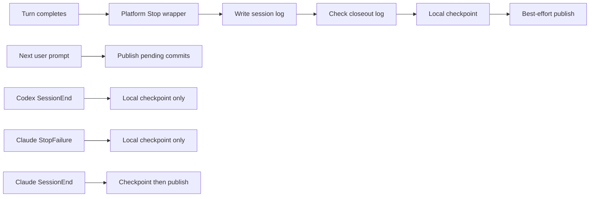

# Big Plan: ai-state-lifecycle-sync

## Goal and Constraints

Make AI-state persistence reliable at turn, prompt, failure, and session
boundaries in OpenAI Codex and Claude Code without weakening the existing
warn-never-fail, conflict-preserving Git sync contract.

The plan is constrained by established runtime behavior:

- Codex and Claude execute matching handlers concurrently; array order is not
  an execution-order guarantee.
- `Stop` is turn-scoped, not a guaranteed final session boundary.
- Codex project hooks are trusted by content hash. An installed or updated
  `.codex/hooks.json` requires an explicit user trust/retrust action in Codex
  for VS Code; the installer must never mutate the trust store itself.
- Codex `Stop` must return valid JSON and must not mix plain text into stdout.
- Codex `SessionEnd` has a maximum three-second timeout and may itself be
  delayed, so it can perform only a short local checkpoint and cannot be the
  sole durability mechanism.
- Claude Code in VS Code uses the bundled Claude runtime and the same project
  `.claude/settings.json` as the CLI. Claude exposes `StopFailure`; a project
  `SessionEnd` timeout may be raised to at most 60 seconds.
- `shared/` remains the editable source of truth. `dist/multi-agent/` is
  regenerated and validated, never hand-edited.
- All hook failures remain non-blocking and data-preserving. No force push,
  silent ours/theirs resolution, discarded local commit, or mid-rebase/merge
  repository is acceptable.
- Apply `.claude/skills/ponytail/SKILL.md` in `full` mode to every coding step
  and resolve every surviving `.claude/review-profiles/ponytail.md` finding.

## Success Criteria

- Local checkpointing and remote publication are explicit shared operations.
- Codex and Claude `Stop` each invoke one platform-specific wrapper; the
  wrapper performs `session-log` -> `stop-session-log-check` -> `checkpoint`
  -> best-effort `publish` sequentially.
- Both runtimes publish pending committed state at `UserPromptSubmit`.
- Codex `SessionEnd` performs only a local checkpoint with timeout `3`.
- Claude `StopFailure` checkpoints locally, and Claude `SessionEnd` performs
  checkpoint plus best-effort publish within timeout `60`.
- Codex Stop stdout is exactly one valid JSON object; no child diagnostic can
  corrupt it. Other Codex lifecycle sync commands emit no plain stdout.
- Repeated publication of an already-published checkpoint is harmless: no new
  state commit, no lost file, and a successful/no-op result.
- A read-only status command reports live local Git state and points to the
  existing error log without contacting the remote or exposing its URL.
- Installer and batch-updater output explains Codex VS Code hook hash trust
  and retrust after an install/update. It does not claim trust was granted.
- Generator, validator, runtime checker, behavioral tests, and living docs
  agree, and generation is byte-for-byte deterministic.

## Non-Goals

- Do not change GitHub Copilot lifecycle wiring in this plan. Its existing
  `state-sync.sh push` call continues through the compatibility path.
- Do not replace the nested `.claude/` Git design or its `ai-state` branch.
- Do not add a daemon, queue, lock service, dependency, background process,
  configurable lifecycle DSL, or mutable status sidecar.
- Do not automatically trust Codex hooks or write to a user-level Codex trust
  database/configuration.
- Do not guarantee that editor/tab closure emits any hook. Keep the existing
  post-commit and manual VS Code push paths as independent durability paths.
- Do not rewrite historical plans or ADRs merely to make their past-tense
  descriptions match the new lifecycle. Update living operational docs.

## Current Flow and Root Cause

`shared/hooks/scripts/state-sync.sh push` currently combines local commit,
remote reconciliation, and push. Generated Codex and Claude `Stop` groups each
list three handlers (`session-log.sh`, `stop-session-log-check.sh`, and
`state-sync.sh push`). Because matching handlers run concurrently, the sync can
commit/publish before the log/check scripts finish, leaving the just-written
turn state for an indeterminate later checkpoint. A network-bound `push` is
also the only operation available where a runtime needs a short local-only
checkpoint.

## Design Overview



### Shared state-sync contract

Extend the existing shell script instead of creating a second sync engine:

- `checkpoint`: initialize the local nested repository if necessary and commit
  dirty `.claude/` state as `session: <ISO-timestamp>`. It must perform no
  `fetch`, `ls-remote`, pull, merge, or push. It is the short local durability
  primitive.
- `publish`: publish already-committed state. It must not stage or commit the
  working tree. If the tree is dirty, warn and leave it untouched for a later
  checkpoint instead of smuggling a commit into the publication boundary. On
  a clean tree, retain the existing reconcile-before-push, conflict-abort, and
  no-force behavior.
- `push`: compatibility composition of `checkpoint` then `publish`. Existing
  installer, updater, post-commit, manual VS Code task, and GitHub Copilot
  callers retain their current semantics.
- `pull`: retain the existing commit-before-rebase safety guarantee. It may
  reuse `checkpoint` before the established reconciliation path but does not
  publish.
- `status`: read-only and network-free. Report whether the nested repository
  exists, branch, clean/dirty state, configured-remote boolean, and cached
  ahead/behind counts when a tracking ref exists; identify the existing
  `.claude/session_logs/hooks-errors.log` diagnostic path/last state-sync error
  without printing a credential-bearing remote URL.

All operational information moves to stderr; only `status` intentionally
writes human-readable stdout. The top-level dispatch remains warn-never-fail,
while internal functions return enough status for `push` to skip publication
after a failed checkpoint/reconciliation.

### Platform lifecycle wiring

| Runtime event | Codex | Claude Code |
|---|---|---|
| `Stop` | One `codex-stop.sh` command: log -> check -> checkpoint -> publish; timeout remains the established long Stop budget; stdout is exactly valid JSON | One `claude-stop.sh` command with the same sequence; diagnostics only on stderr |
| `UserPromptSubmit` | One `state-sync.sh publish` command, recommended timeout `60` | One `state-sync.sh publish` command, timeout `60` |
| `StopFailure` | Not available/in scope | One local `state-sync.sh checkpoint`, normal short command timeout |
| `SessionEnd` | One local `state-sync.sh checkpoint`, timeout exactly `3`; no network | One `state-sync.sh push` compatibility composition, timeout exactly `60` |

Each multi-step boundary is one runtime handler. The shell wrapper/composition,
not the hook array, owns ordering. Duplicate `publish` calls are retries/no-ops,
so a prompt hook following a successful Stop publish is safe.

### Ponytail decisions

- Reuse `state-sync.sh`, `run-hook.sh`, the existing log/check scripts, existing
  Git reconciliation, and existing installer/updater delegation.
- Add only two runtime-specific wrappers because Codex and Claude have
  materially different output contracts. Do not create a generalized hook
  orchestration framework.
- Keep `push` instead of migrating every existing human/GitHub/Git-hook caller.
- Derive status from live Git state and the existing error log. Do not create a
  tracked or ignored status database whose own writes need checkpointing.
- Let `update_consumers.py` surface the installer's trust notice naturally;
  change updater code only if a regression test proves delegation hides it.
- Use standard shell/Git and Python standard-library parsing only; add no
  dependency.

## Phase Breakdown

- [ ] `2026-08-01_phase-A-state-sync-operations` — split the shared local and
  remote operations, add live status/error visibility, retain `push`, and add
  direct Git-backed regression coverage.
- [ ] `2026-08-01_phase-B-codex-state-lifecycle` — add the Codex sequential
  Stop wrapper plus prompt/session hooks and enforce the JSON/three-second
  contracts in generation and validation.
- [ ] `2026-08-01_phase-C-claude-state-lifecycle` — add the Claude sequential
  Stop wrapper, prompt/failure/session hooks, and the 60-second SessionEnd
  publication contract.
- [ ] `2026-08-01_phase-D-install-trust-and-closeout` — add safe Codex VS Code
  trust/retrust guidance, finish cross-runtime docs/parity checks, and run the
  deterministic full closeout.

## Step Summary

| Phase | Primary owner | Main files | Required skills | Review profiles | Phase verification |
|---|---|---|---|---|---|
| A | `coder` | `shared/hooks/scripts/state-sync.sh`, `tests/test_state_sync.py`, `scripts/validate_targets.py` | `.claude/skills/ponytail/SKILL.md` (`full`), `.claude/skills/testing-patterns/SKILL.md`, `.claude/skills/run-tests/SKILL.md` | `.claude/review-profiles/code.md`, `.claude/review-profiles/architecture.md`, `.claude/review-profiles/security.md`, `.claude/review-profiles/tests.md`, `.claude/review-profiles/ponytail.md` | shell syntax, focused pytest, generate, validator, lint/type/score |
| B | `coder` | `shared/hooks/scripts/codex-stop.sh`, `scripts/generate_targets.py`, `scripts/validate_targets.py`, `scripts/check_runtime.py`, lifecycle tests | Ponytail full, testing patterns, run-tests | `code`, `architecture`, `security`, `tests`, `config`, `ponytail`, then `documentation` | wrapper behavior/JSON, generated Codex structure, full validator/runtime checks |
| C | `coder` | `shared/hooks/scripts/claude-stop.sh`, `scripts/generate_targets.py`, `scripts/validate_targets.py`, `scripts/check_runtime.py`, lifecycle tests | Ponytail full, testing patterns, run-tests | `code`, `architecture`, `security`, `tests`, `config`, `ponytail`, then `documentation` | wrapper order, generated Claude events/timeouts, full validator/runtime checks |
| D | `coder` + `documenter` | `scripts/install_bootstrap.py`, living docs/policy, installer validation | Ponytail full, safe consumer refresh, testing patterns, documentation, run-tests | `code`, `architecture`, `security`, `tests`, `ponytail`, `documentation` | installer/updater notices, full suite, deterministic generation, score/findings |

Every phase is one reviewable commit. The orchestrator owns branch creation,
persisted findings/score, LEARN/session-log closeout, and the atomic commit.

## Dependency Ordering

1. Phase A must land first; every later hook references `checkpoint` or
   `publish`.
2. Phase B establishes the strictest output/time contract and the shared
   lifecycle-test harness.
3. Phase C extends that harness and generator/validator contract for Claude.
4. Phase D runs only after both generated runtimes are structurally complete,
   because the trust notice and final docs describe the final hook hash/content.

The generator and its validator changes for each platform stay in the same
phase. This follows the repository learning that a generated contract and the
allow-list that accepts it must cross a phase boundary atomically.

## Risks and Fallback Paths

| Risk | Level | Mitigation / fallback |
|---|---|---|
| `publish` runs with dirty state because a delayed event overlaps another turn/runtime | Medium | Refuse to commit in `publish`; warn, preserve the dirty tree, expose it via `status`, and retry at Stop/UserPromptSubmit/SessionEnd/post-commit/manual `push`. Do not add a non-portable global lock unless a regression demonstrates data loss rather than a safe retry. |
| Codex child output corrupts required Stop JSON | High | Route every child stdout away from wrapper stdout and parse the complete result in a behavioral test. Final stdout must be one JSON object on success and child failure. |
| A three-second Codex SessionEnd cannot finish a large local commit | High | Keep it local-only and minimal; document it as best-effort redundancy. Prior Stop, next UserPromptSubmit, post-commit, and manual push remain independent checkpoints/publication paths. |
| Claude SessionEnd network work exceeds its configured timeout | Medium | Cap at `60`, checkpoint before publication, preserve the local commit on timeout/failure, and retry later. |
| Moving informational output to stderr breaks a human caller assumption | Low | Manual VS Code/terminal tasks display stderr; update tests/docs and reserve stdout for explicit `status`. Keep exit-zero behavior. |
| A status file would make the nested repo perpetually dirty | High | Do not create one. Calculate status from local Git refs/worktree and read the existing error log. |
| Hook update silently remains untrusted in Codex VS Code | High | Print deterministic install/update guidance and document hash-scoped retrust. Never claim success or automate trust. |
| Two small wrappers duplicate orchestration | Medium | Accept the small duplication because output contracts differ. Keep the sequence literal and reviewed; do not introduce a framework for two scripts. |
| Structural validation passes on stray substrings | Medium | Inspect parsed event objects and execute wrappers/operations; assert exact commands, handler counts, timeout values, JSON parsing, and state transitions. |

## Devil's Advocate Report

| Concern | Risk | Alternative | Recommendation |
|---|---|---|---|
| Keep only `push`; the split may add interface surface | Medium | Continue network work at every short lifecycle boundary | **CHANGE** — the runtimes require a genuinely local primitive; retain `push` as compatibility to cap migration scope. |
| Put all Stop commands in the generated array and rely on list order | High | Runtime-native ordered handlers | **CHANGE** — established runtime behavior is concurrent; one wrapper must own the sequence. |
| Use one generic cross-runtime wrapper | Medium | Parameterize target/output mode | **ACCEPT two scripts** — exact JSON versus no-output behavior makes two tiny wrappers clearer and safer than branching abstraction. |
| Persist a last-sync JSON status artifact | High | Store it under `.claude/` or `.git/` | **CHANGE** — live `status` plus `hooks-errors.log` meets the current need without state recursion or a new file contract. |
| Add custom locking for cross-runtime invocations | Medium | `flock`, lock directory, or daemon | **ACCEPT RISK** unless tests prove loss; Git already fails safely under lock contention and the lifecycle supplies retries. A new portable stale-lock protocol is disproportionate. |
| Publish from Codex SessionEnd despite the short timeout | High | Attempt network work and hope it completes | **CHANGE** — checkpoint only; publication happens at Stop/prompt/post-commit/manual boundaries. |
| Automatically add the new hook hash to Codex trust state | High | Installer writes user-level trust data | **CHANGE** — guidance only; trust remains an explicit human security decision. |

Resolved design questions from the critique:

- Stop wrappers do include a best-effort publish after checkpoint; the prompt
  hook is an idempotent retry, not the sole normal publisher.
- Observability uses a minimal read-only `status` operation and the existing
  `hooks-errors.log`; no mutable status artifact is authorized.

## Full Verification

Run per-phase focused checks first, then this final suite after staging every
file intended for the phase (the score/findings content hash excludes untracked
files and rejects unstaged tracked changes):

```bash
bash -n shared/hooks/scripts/state-sync.sh
bash -n shared/hooks/scripts/codex-stop.sh
bash -n shared/hooks/scripts/claude-stop.sh
uv run python scripts/generate_targets.py --all
uv run python scripts/validate_targets.py
uv run python scripts/check_runtime.py
uv run pytest tests/ -q --tb=short
uv run mypy scripts/ tests/ --ignore-missing-imports --explicit-package-bases
uv run ruff check scripts/ tests/
uv run ruff format --check scripts/ tests/
uv run python .claude/scripts/quality_score.py scripts/ --phase <current_phase> --base-ref dev --json --out .claude/quality_reports/score-<timestamp>.json
```

The implementation must also persist a matching findings report with
`counts.critical == 0`, `ponytail_reviewed: true`, and
`ponytail_findings: 0` before each phase commit; `counts.major == 0` is required
before final push/PR closeout.

## Done Criteria

- All four small plans are complete, each with one atomic implementation
  commit and a completed closeout session log.
- Exact generated event contracts, wrapper execution order, output purity,
  timeout ceilings, idempotent publication, local-only checkpointing, status,
  and installer guidance have behavioral regression coverage.
- `validate_targets.py`'s temp-output comparison proves deterministic
  generation and rejects a stale/incorrect lifecycle config.
- Living docs and generated policy describe Stop as turn-scoped and retain
  post-commit/manual push as independent durability paths.
- Full verification passes, score is at least 90 per phase, review has no
  surviving Ponytail finding, and required finding severity gates pass.

