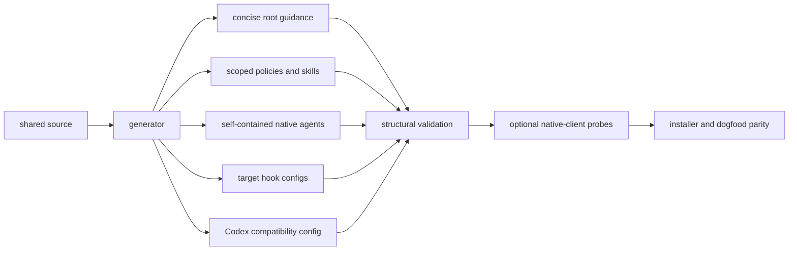

# Big Plan: bootstrap-guidance-runtime-modernization

## Context

The bootstrap's core multi-target architecture and deterministic gates are
sound, but the current dogfood installation has drifted from `shared/`, the
generated root guidance is expensive to load, and parts of the Codex config
look legacy without carrying their historical compatibility rationale beside
the tests. This plan improves correctness, context efficiency, and native
client confidence without weakening the lifecycle, state durability, or
Sol/Terra/Luna custom-agent routing.

The Codex MultiAgent V2 block is a protected compatibility contract. Commit
`82e9fbe` and
`.claude/session_logs/2026-07-18_codex-gpt-5.6-model-tiering.md` record that
Codex 0.144.x initially spawned every named child as the parent
`gpt-5.6-sol/high`. Exposing spawn metadata with
`hide_spawn_agent_metadata = false` and `tool_namespace = "agents"` restored
all six configured model/effort pairs, including verifier Luna/low. Public-doc
silence is not evidence that this workaround is removable.

## Goals

- Detect stale bootstrap-controlled runtime overlays before they misdirect an
  agent.
- Keep always-loaded root guidance well below native client context limits.
- Preserve one authoring source while generating target-native scoped rules
  and self-contained agent adapters.
- Modernize documented Codex keys without regressing named-agent routing.
- Reduce hook fan-out while preserving fail-closed guards and durable state.
- Make lightweight and orchestrated task eligibility unambiguous.
- Define shared versus native memory authority and add a threat model.
- Add opt-in real-client probes for instruction discovery, hook wiring, and
  exact custom-agent model/effort routing.

## Design Overview



## Historical Do-Not-Regress Invariants

- Retain the MultiAgent V2 metadata-exposure shim until a trusted-project,
  no-root-model-override native probe proves all named roles preserve their
  exact model and effort on every supported Codex version.
- Preserve the six-role matrix: orchestrator/planner/reviewer Sol,
  coder Terra with one bounded Sol escalation, documenter/verifier Luna.
- Keep the interactive Codex root model and effort unpinned (`9310cbb`).
- Keep the reviewer single-depth and self-refuting; do not recreate helper
  review agents (`858c147`, `9304f54`).
- Keep DOCUMENT before persisted SCORE/FINDINGS (`d872d10`).
- Keep the verifier as the single score-report owner (`27f1362`).
- Keep consumer `MEMORY.md` byte-identical on reinstall/migration (`18e0a08`).
- Keep Stop lifecycle work sequential and best-effort, with post-commit as the
  durable checkpoint (`b3cc34e`, `7f17c59`, `a1ba0b1`).
- Preserve compound-command, nested-`.claude`, secret-path, and fail-closed
  guard regressions (`5cf5545`, `0964212`, `2fea84a`).
- Do not duplicate authoritative routing/profile/report ownership content
  after earlier single-homing work (`5eea6e6`, `0be7381`, `3bd9438`).

## Phases

- [ ] `2026-08-04_phase-A-runtime-drift-contract`
- [ ] `2026-08-04_phase-B-root-guidance-budgets`
- [ ] `2026-08-04_phase-C-scoped-policy-adapters`
- [ ] `2026-08-04_phase-D-codex-routing-compatibility`
- [ ] `2026-08-04_phase-E-codex-agent-self-containment`
- [ ] `2026-08-04_phase-F-hook-routing-efficiency`
- [ ] `2026-08-04_phase-G-task-lane-contract`
- [ ] `2026-08-04_phase-H-memory-security-authority`
- [ ] `2026-08-04_phase-I-native-client-acceptance`

## Verification

```bash
uv run python scripts/generate_targets.py --all
uv run python scripts/validate_plan_frontmatter.py .claude/plans/bootstrap-guidance-runtime-modernization.md .claude/plans/2026-08-04_phase-*.md
uv run pytest tests/ -q --tb=short
uv run mypy scripts/ --ignore-missing-imports --explicit-package-bases
uv run ruff check scripts/ tests/
uv run ruff format --check scripts/ tests/
uv run python scripts/validate_targets.py
uv run python scripts/check_runtime.py
```

Native Claude/Codex probes introduced by Phase I remain opt-in locally unless
CI has authenticated test clients. Structural validation must remain fully
offline and deterministic.
