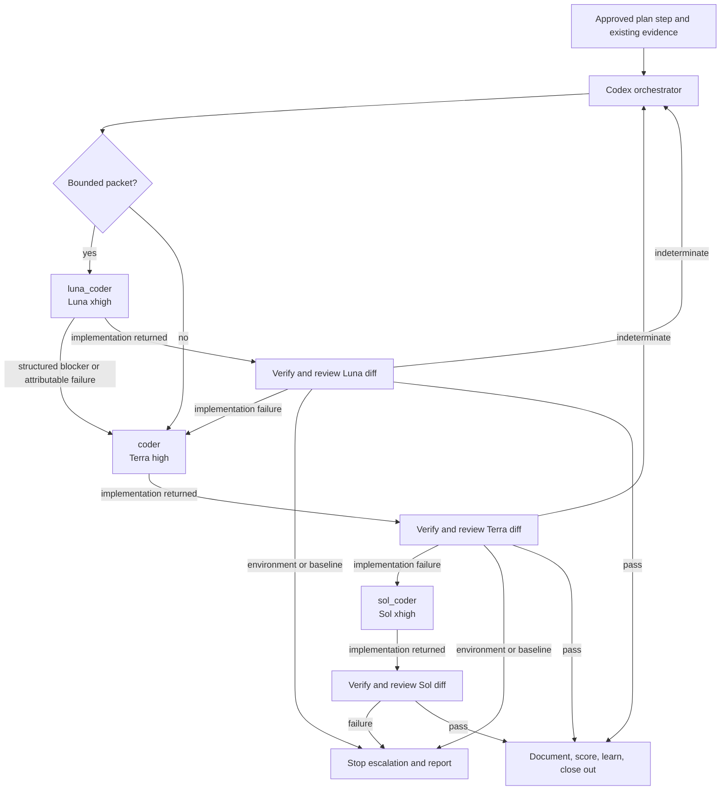

# Big Plan: codex-luna-coder-routing

## Context

The bootstrap currently emits the same six shared agents for GitHub Copilot,
Claude Code, and OpenAI Codex. Codex implementation work uses `coder` at
`gpt-5.6-terra` / `high`. Its metadata also declares a Sol/xhigh escalation,
but the generated custom-agent file pins Terra/high; a spawn-time Sol override
therefore must not be treated as deterministic.

This plan introduces an experimental, cost-optimized Codex implementation path
without changing Claude Code or GitHub Copilot routing. Bounded implementation
steps may start with a Codex-only Luna/xhigh specialist. Attributable failures
move to the existing Terra/high coder and then to a distinct Codex-only
Sol/xhigh recovery specialist. Each tier is a named, statically configured
custom agent rather than a spawn-time model override.

The feature is intentionally structural and policy-driven. It does not claim
that Luna/xhigh has been empirically proven cheaper or better, and it does not
add paid benchmarks, native-run merge gates, or a new telemetry system.

## Goals

- Add explicit target eligibility to canonical agent metadata, defaulting to
  all supported targets when omitted.
- Use one canonical loader/validator for agent metadata in generation and
  validation.
- Keep the existing six agents on Claude Code and GitHub Copilot.
- Emit eight Codex agents: the existing six plus `luna_coder` and `sol_coder`.
- Preserve the existing `coder` at Terra/high.
- Route Codex implementation per plan step through the deterministic chain
  `luna_coder -> coder -> sol_coder -> stop`.
- Use Luna only when the orchestrator already has a bounded work packet; do not
  perform extra discovery merely to qualify a step for Luna.
- Compose fully self-contained Codex coder prompts from the unchanged shared
  coder contract plus small role-specific supplements.
- Keep all model-specific orchestrator guidance in a Codex-only additive
  supplement.
- Escalate automatically only for implementation-attributable failures.
- Preserve historical six-role native evidence as historical evidence.
- Record only concise routing facts in existing session logs when useful.

## Non-Goals

- No changes to Claude Code or GitHub Copilot agent counts, models, routing, or
  implementation behavior.
- No Luna/max route.
- No spawn-time model override as a deterministic escalation mechanism.
- No paid/native benchmark, frozen workload corpus, token/cost comparison, or
  native smoke test as a merge gate.
- No claim that the experimental route is empirically superior.
- No generalized model-profile framework, routing database, or telemetry
  subsystem.
- No planner micromanagement of function bodies, helper decomposition, exact
  edits, or local algorithms.
- No changes to lifecycle hooks, quality gates, branch rules, state sync, or
  historical compatibility conclusions.

## Design Overview



### Canonical Target Eligibility

Agent metadata gains an optional `targets` array using the canonical target
identifiers `github-copilot`, `claude-code`, and `openai-codex`. Omission means
all three. Empty, duplicate, or unknown values are invalid. Generation and
validation consume the same validated agent definitions and calculate expected
agent sets per target.

`luna_coder` and `sol_coder` declare:

```json
"targets": ["openai-codex"]
```

Target eligibility is never inferred from missing `model_intent` entries.

### Coder Prompt Composition

`shared/agents/coder/prompt.md` remains the single shared implementation
contract and remains unchanged. Codex-only coding specialists use one-level
metadata composition:

```json
"prompt_base": "coder"
```

Their role-specific instructions live in:

- `shared/agents/luna_coder/prompt.openai-codex.md`
- `shared/agents/sol_coder/prompt.openai-codex.md`

For Codex, the renderer target-transforms the base prompt, appends exactly one
`--- Codex role supplement: <agent-id> ---` delimiter, then appends the target-transformed
supplement. The generated TOMLs remain fully self-contained. The loader rejects
missing bases, self-reference, multi-level inheritance, and cycles. This is a
small composition contract for these target-scoped roles, not a general model
profile system.

### Codex-Only Orchestrator Guidance

The universal orchestrator prompt remains at
`shared/agents/orchestrator/prompt.md`. Codex routing guidance lives at
`shared/agents/orchestrator/prompt.openai-codex.md` and is appended with a
stable Codex supplement delimiter. Claude Code and GitHub Copilot never consume
this supplement. Obsolete Codex-only spawn-override prose is removed from the
universal prompt without introducing any Claude/Copilot routing behavior.

### Bounded Luna Work Packet

The orchestrator may select `luna_coder` for one implementation step only when
the evidence already establishes all five conditions:

1. A clear desired outcome.
2. Known relevant files, symbols, entry points, or failing checks.
3. Known constraints and must-not-change behavior.
4. Objective acceptance criteria and verification commands.
5. No unresolved architecture, interface, root-cause, migration, security, or
   ownership decision that Luna would have to invent.

The packet includes the step identity, focused evidence, constraints, rejected
approaches when relevant, required skills, acceptance criteria, and verification
commands. It explicitly leaves local implementation design to the coder. The
orchestrator must not run additional discovery solely to make a packet qualify
for Luna; an unbounded packet goes directly to Terra.

### Deterministic Routing and Failure Attribution

The named Codex route is:

```text
bounded implementation -> luna_coder (Luna/xhigh)
otherwise or attributable Luna failure -> coder (Terra/high)
attributable Terra failure -> sol_coder (Sol/xhigh)
Sol failure -> stop and report
```

The Codex orchestrator owns failure attribution from verifier/reviewer evidence:

- `implementation`: automatically advance one tier.
- `environment`: stop model escalation and report the environmental blocker.
- `baseline`: stop model escalation and report the pre-existing failure.
- `indeterminate`: return to orchestrator judgment; do not auto-escalate.

No universal verifier or reviewer contract changes solely to support this
classification.

Luna validates its packet before editing where possible. When it cannot proceed,
it returns an exact escalation object with status, enumerated reason,
`workspace_changed`, evidence, and needed context. If it changed the workspace,
the next coder must inspect the existing diff rather than assume a clean tree.

## Historical Do-Not-Regress Invariants

- Claude Code and GitHub Copilot retain exactly the current six agents.
- Their existing model, effort, tool, delegation, and implementation contracts
  remain unchanged.
- Codex retains the six universal role mappings and adds two explicitly
  Codex-only roles.
- Historical six-role native observations remain dated historical evidence and
  are not rewritten as eight-role results.
- MultiAgent V2 routing-shim and `max_depth` removal gates remain unchanged.
- Codex agents remain self-contained and inherit trusted project MCP/skills when
  their TOMLs omit overrides.
- Generated files under `dist/multi-agent/` are regenerated, never hand-edited.
- Existing hook, commit, push, score, learning, and session-log gates remain
  intact.

## Phases

- [ ] `2026-08-13_phase-A-codex-agent-target-scoping`
- [ ] `2026-08-13_phase-B-codex-luna-sol-coder-agents`
- [ ] `2026-08-13_phase-C-codex-orchestrator-coder-routing`
- [ ] `2026-08-13_phase-D-codex-routing-failure-attribution-and-validation`
- [ ] `2026-08-13_phase-E-codex-routing-documentation-and-native-bookkeeping`

## Verification

```bash
uv run python scripts/validate_plan_frontmatter.py \
  .claude/plans/codex-luna-coder-routing.md \
  .claude/plans/2026-08-13_phase-A-codex-agent-target-scoping.md \
  .claude/plans/2026-08-13_phase-B-codex-luna-sol-coder-agents.md \
  .claude/plans/2026-08-13_phase-C-codex-orchestrator-coder-routing.md \
  .claude/plans/2026-08-13_phase-D-codex-routing-failure-attribution-and-validation.md \
  .claude/plans/2026-08-13_phase-E-codex-routing-documentation-and-native-bookkeeping.md

uv run pytest tests/ -q --tb=short
uv run mypy . --ignore-missing-imports --explicit-package-bases
uv run ruff check scripts/ tests/
uv run ruff format --check scripts/ tests/
uv run python scripts/generate_targets.py --all
uv run python scripts/validate_targets.py
uv run python scripts/check_runtime.py
```

No paid/native Codex run or matched Luna/Terra/Sol evaluation is required by
this plan. The final documentation must label the route experimental and must
not claim uncollected runtime evidence.
