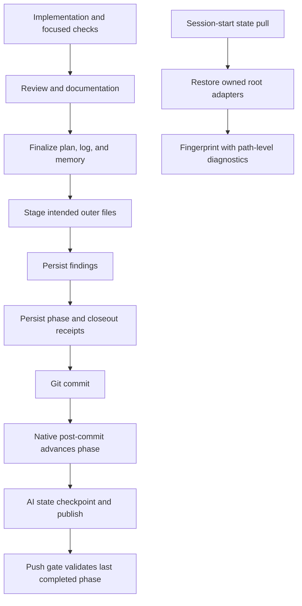

# Big Plan: Consumer Lifecycle Friction Hardening

## Context

A Python consumer ran a three-phase plan end to end and reported repeated
failures around closeout receipts, commit-driven phase advancement, root
adapter restoration, plan authoring, and shell classification. The severity
gates and two-pass review caught real defects and must remain intact. This plan
removes accidental ceremony and misleading recovery paths without weakening
those controls.

The current source already contains a narrow exception for the exact final
big-plan transition and makes terminal push validation select the last
completed phase. Phase A must therefore reproduce the consumer's complete
generated-runtime sequence before changing receipt semantics. A passing unit
test for the narrow helper is not sufficient evidence that commit,
PostToolUse, nested state checkpointing, and pre-push compose correctly.

All small plans start with `status: in-progress` only because the currently
installed validator has no `planned` state. Phase C changes the template and
future lifecycle to represent not-yet-started phases accurately.

## Goals

- Make a successful phase-completion commit advance plan state exactly once,
  independent of `git commit -m`, `-F <file>`, stdin, GUI, or heredoc syntax.
- Preserve receipt freshness across the sole automatic terminal plan
  transition and provide exact recovery guidance for completed plans.
- State and test one canonical closeout order, including staging and
  `record_findings.py` dirty semantics.
- Restore installer-owned ignored root adapters after session-start pulls and
  name the exact adapter mismatch when provenance cannot be established.
- Accept readable phase annotations and add an honest `planned` small-plan
  state with deterministic activation.
- Make incremental implementation constraints explicit in coder briefs and
  ensure read-only reviewers receive diff-scoped evidence without generic
  shell access.
- Allow safe heredocs and process substitutions while recursively detecting
  protected-file mutations inside executable shell constructs.
- Keep generated targets, source mirrors, tests, and user-facing workflow
  documentation consistent.

## Design Overview



The implementation must reuse the existing verifier, findings recorder,
frontmatter helpers, ownership manifest, restoration script, and generated
target tests. It must not introduce a second receipt authority or a second
shell policy engine.

## Settled Decisions

- Do not run `verify.py closeout` from `post-commit`. Git ignores post-commit
  failures, and rerunning project verification there would be slow and unable
  to protect the commit that already succeeded.
- Run plan advancement from the native Git `post-commit` hook before state
  synchronization. Read the created commit from Git there; do not infer it
  solely from an intercepted shell command.
- Do not automatically stage files and do not use `git add -A`. The workflow
  will require explicit staging of intended outer-repository paths before
  findings and persisted receipts are generated.
- Do not add a new all-in-one finalizer in this plan. First make one exact
  closeout sequence authoritative, machine-tested, and recoverable. A wrapper
  can be reconsidered only if consumer evidence shows that the remaining
  explicit steps still cause errors.
- Do not grant the reviewer generic execute access. The orchestrator must
  provide a scoped diff or equivalent changed-hunk evidence when the runtime
  cannot expose a safe read-only diff tool.
- Do not blindly skip heredoc bodies or trust the outer command of a process
  substitution. Executable inner content is recursively classified; malformed
  or unresolved mutation targets remain fail-closed.
- Do not attempt to strip host-injected system or developer context. Generated
  prompts will say to use only callable tools and will restate the repository's
  guarded context-mode surface without claiming precedence over the host.
- Preserve receipt schema v4 unless the consumer reproduction proves the
  existing schema cannot represent the correct behavior.

## Phases

- [x] `2026-09-10_phase-A-commit-closeout-reliability`
- [x] `2026-09-10_phase-B-root-adapter-recovery-diagnostics`
- [ ] `2026-09-11_phase-B2-hook-empty-array-safety`
- [ ] `2026-09-10_phase-C-plan-and-delegation-semantics`
- [ ] `2026-09-10_phase-D-shell-classifier-runtime-guidance`

## Cross-Phase Contracts

- Phase A keeps `record-commit-closeout.sh` as the single phase-transition
  implementation but invokes it from the native Git post-commit hook. Phase C
  extends that same transition to activate a next phase whose status is
  `planned`.
- Phase B retains the ownership manifest as the only authority for restorable
  root paths. Diagnostics may expose relative paths and failure categories,
  never file contents.
- Phase B2 changes shell expansion safety only. It adds no gate, alters no
  severity, message text, or protected-path inventory, and must land before
  Phase C because Phase C edits the same frontmatter library.
- Phase C keeps compatibility with installed plans whose future phases already
  say `in-progress`; new templates use `planned`.
- Phase D changes parsing only. The protected-path inventory, target-specific
  deny/ask decisions, and fail-closed result for genuinely malformed input do
  not change.

## Risks and Controls

- A post-commit transition cannot roll back a commit if it fails. Make the
  transition idempotent, emit one exact recovery command, and run state sync
  only after the transition attempt.
- Moving authoritative persisted verification later in closeout could reduce
  evidence available to review. Keep coder-focused checks and `verify fast`
  before review; run `verify phase --persist` after all commit-bound state is
  final and staged. Any later code change restarts review and closeout.
- Restoring ignored adapters can replace local bytes. Restrict restoration to
  paths declared installer-owned by the validated manifest and preserve the
  existing tracked-file skip rule.
- `planned` can break old consumers if enforced immediately. Accept legacy
  future `in-progress` plans and transition only exact `planned` values.
- Shell-parser relaxation is security-sensitive. Require nested-write negative
  tests for every new safe construct before accepting its positive case.

## Devil's Advocate Report

| Concern | Risk | Alternative | Recommendation |
|---|---|---|---|
| Native post-commit failures cannot block the commit | High | Keep parsing PostToolUse command text | Change: use an idempotent native transition, exact recovery output, and integration tests; this is still more reliable than command parsing |
| One finalizer command could become a second workflow engine | Medium | Add `verify.py finalize` now | Accept risk: centralize and test the existing commands first; defer a wrapper until further consumer evidence |
| Later persisted verification gives the reviewer less formal evidence | Medium | Run the full phase suite twice | Change: provide focused/fast evidence before review and run authoritative persisted phase verification once after final state |
| Automatic `planned` activation could overwrite terminal state | High | Keep all phases `in-progress` | Change: transition only exact `planned`, preserve legacy `in-progress`, and reject unexpected states |
| Parsing more shell syntax could weaken protected-file controls | High | Continue rejecting all complex syntax | Change: recursively classify executable inner constructs and retain fail-closed malformed-input behavior |
| Four phases add lifecycle overhead | Low | Merge unrelated adapter, plan, and shell work | Accept: each phase is independently testable and limits the blast radius of security-sensitive changes |

## Verification

Each phase runs its focused tests plus the generated-runtime checks. Final
acceptance requires:

```bash
uv run python scripts/validate_plan_frontmatter.py
uv run python scripts/generate_targets.py --all
uv run python scripts/validate_targets.py
uv run python scripts/check_runtime.py
uv run pytest tests/ -q
uv run ruff check shared scripts tests
uv run mypy shared scripts tests --ignore-missing-imports --explicit-package-bases
uv run python .claude/scripts/verify.py phase --format json --persist
uv run python .claude/scripts/verify.py closeout --format json --persist
```

## Completion Evidence

The final phase must run the repository-wide stale-claims audit, record its
results under `## Stale-claims surfaces checked` in the closeout session log,
and prove one generated consumer can complete all four lifecycle phases and
pass its terminal push gate without manual plan edits or receipt repair.
