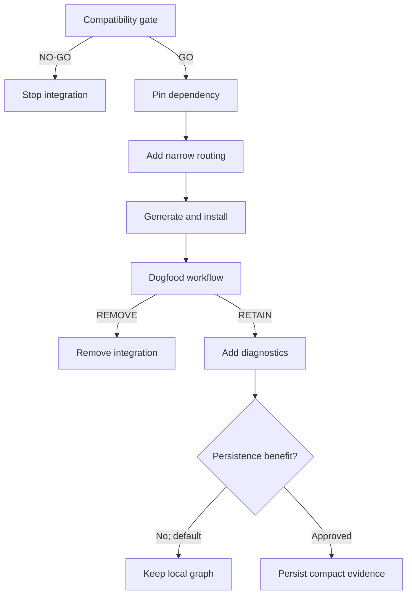

# Big Plan: graphify-structural-code-intelligence

## Outcome: STOPPED AT PHASE 0 — NO-GO

This plan is closed as **complete in lifecycle terms only**. Phase 0 was the
authorized gate and it returned NO-GO, which by design terminates the plan.
**Phases A through F were never authorized and were never implemented.**
`status: complete` here means "this plan is finished", not "all phases shipped";
`complete` is the only terminal status the frontmatter validator accepts.

Evidence:
`.claude/explorations/2026-08-09_graphify-compatibility-value-gate/evidence.md`.
The bootstrap-only test scored 1/3 real questions. The user-authorized
cross-project supplement then scored RAG 0/3 and industrial-inspection 2/3;
since the override required both consumers to independently reach 2/3, it
failed. Do not add an adapter, dependency, routing surface, generated output,
hook, MCP configuration, or workaround on the strength of this plan. Reopening
adoption requires a new plan and a fresh gate.

## Context

This bootstrap already routes known paths to direct reads, exact literals and
symbols to `rg`, semantic repository discovery to Semble, large artifacts and
session continuity to context-mode, and current external documentation to
context7. The proposed Graphify integration fills a narrower gap: deterministic
local questions about callers, imports, inheritance, paths between symbols,
and structural blast radius.

The supplied Graphify documents set useful boundaries, but they build runtime
and state infrastructure before proving value. They also assume that
`graph.json` should be synchronized, prescribe a state wrapper before the
pinned command-line interface (CLI) is verified, and use review routing that
predates the current ordinary severity gates. This plan moves compatibility
and value testing to a disposable first gate, keeps raw graph output local and
ignored, and makes both dependency retention and later compact persistence
evidence-based decisions.

The source documents are
`/home/ghisso/work/Graphify Structural Code Intelligence.docx` and
`/home/ghisso/work/Graphify Structural Code Intelligence Plan.docx`. Their
provisional raw commands, wrapper signatures, and persistence layout are input
for Phase 0 testing, not approved implementation contracts.

## Goals

- Test exactly `graphifyy==0.9.35` in a disposable, local, code-only gate before
  any tracked runtime, adapter, routing, or state change.
- Retain Graphify only when at least three real structural questions show
  source-confirmed value at acceptable freshness, latency, size, and churn.
- If the gate passes, install the exact package only in the managed
  devcontainer and add the thinnest bootstrap adapter justified by evidence.
- Keep Graphify optional and fail-open outside the managed devcontainer.
- Add one canonical structural-routing contract through `shared/`, with
  selective full-plan use and no automatic micro-plan invocation.
- Let the Orchestrator prepare compact structural evidence for the
  non-executing Reviewer; require direct source verification before findings.
- Generate and install GitHub Copilot, Claude Code, and OpenAI Codex surfaces
  deterministically without giving Graphify ownership of any client, hook, or
  Model Context Protocol (MCP) configuration.
- Keep raw graph output disposable and ignored. Consider compact report and
  manifest persistence only after retention and explicit risk acceptance.

## Non-Goals

- Graphify does not replace direct reads, `rg`, Semble, context-mode, or
  context7.
- Do not run `graphify install`, a platform installer, `graphify hook install`,
  Graphify MCP, or any command that lets Graphify write `AGENTS.md`,
  `CLAUDE.md`, hooks, or MCP configuration.
- Do not add an LLM-backed Graphify mode, remote source upload, documentation
  indexing, or general memory/reflection features.
- Do not add a custom graph state engine, duplicate Graphify's refresh logic,
  or persist `graph.json` by default.
- Do not give Reviewer execute capability or accept a graph edge as final
  evidence.

## Design Overview

The first gate controls all later work. Raw graph artifacts remain local even
when the dependency is retained; compact persistence is a separate final gate.



### Retrieval contract

| Need | Primary tool | Required follow-up |
| --- | --- | --- |
| Known path | Direct read | None unless the source raises a new question |
| Exact text, symbol, error, key, or filename | `rg` | Read the matching source |
| Semantic behavior ownership or related code | Semble | Read the candidate source |
| Callers, imports, inheritance, dependency path, blast radius | Graphify | Verify every material relationship in source |
| Large output, artifact, or session continuity | context-mode | Retrieve the relevant excerpt |
| Current external library contract | context7 | Prefer primary documentation |

Graphify is considered only when connectivity is the question. Planner may use
it selectively in full plans with cross-module or consumer uncertainty.
Micro-plans do not invoke it by default. Coder may use it when useful. Verifier
has no mandatory Graphify path. Orchestrator may query it before a structurally
significant review and pass a compact evidence packet to Reviewer. Reviewer
remains read/search-only and confirms every candidate in source.

### Evidence packet contract

The Orchestrator supplies only a compact navigation aid:

```text
Structural evidence
Graph status: fresh | unavailable
Purpose: <blast radius, callers, dependency path, ...>
Anchors:
- <symbol>
Observations:
- <source> --<edge>--> <target> [EXTRACTED|INFERRED|AMBIGUOUS]
Candidate files:
- <relative path>
Caveats:
- <fallback, ambiguity, or freshness note>
```

Reviewer must inspect the cited source. `INFERRED` and `AMBIGUOUS` edges are
navigation leads only. `EXTRACTED` edges are stronger leads, not authority.
Missing Graphify evidence is not a review failure.

### Output and ownership contract

- Phase 0 uses temporary repositories and writes only its task-specific
  evidence to
  `.claude/explorations/2026-08-09_graphify-compatibility-value-gate/evidence.md`.
  Mandatory plan/session/quality lifecycle state remains under `.claude/`.
- After GO, raw Graphify output uses one evidence-confirmed local directory
  under `.claude/`. It is ignored by both the outer repository and nested
  AI-state repository, survives safe reinstall as consumer-local state, and is
  disposable.
- The exact directory name, Graphify argv, emitted filenames, update behavior,
  and output schema remain unverified until Phase 0. Later phases must use the
  gate artifact rather than the provisional contracts in the source DOCX files.
- `graph.json` is never synchronized by default.
- If Phase F passes, only a bounded compact report and manifest may live under
  `.claude/quality_reports/graphify/`; raw graph/cache/source bodies remain
  local and ignored.

## Phase Order

- [ ] `2026-08-09_phase-0-graphify-compatibility-and-value-gate` — run a
  disposable compatibility, privacy, performance, and usefulness gate; NO-GO
  stops every later phase.
- [ ] `2026-08-09_phase-A-graphify-managed-dependency-and-thin-adapter` — after
  GO, pin the managed-devcontainer dependency and implement only the adapter
  behavior that the evidence proves necessary.
- [ ] `2026-08-09_phase-B-graphify-routing-and-agent-integration` — add the
  canonical skill, retrieval routing, Planner selection, Orchestrator evidence
  preparation, and Reviewer source-verification contract through `shared/`.
- [ ] `2026-08-09_phase-C-graphify-generation-and-safe-install` — project the
  shared sources to all three clients, preserve authoring adapters and consumer
  state, enforce ignore boundaries, and prove deterministic generation and
  reinstall.
- [ ] `2026-08-09_phase-D-graphify-dogfood-and-retention` — run real end-to-end
  workflows, then retain or cleanly remove the default dependency.
- [ ] `2026-08-09_phase-E-graphify-runtime-diagnostics` — only after RETAIN,
  add deterministic availability, exact-version, and health reporting with
  host-side WARN/fallback behavior.
- [ ] `2026-08-09_phase-F-graphify-optional-persistence-gate` — default to
  local-only output; persist only a compact report/manifest if cross-session
  value and privacy, size, churn, and staleness risks are explicitly accepted.

## Gate Decisions

### Phase 0 GO

GO requires every mandatory compatibility and privacy check, all material
Graphify claims source-confirmed, at least two of three real structural
questions to add useful connectivity evidence beyond the `rg`/Semble baseline,
zero source-network access during network-isolated execution, and all working
performance/size/churn budgets in the Phase 0 plan. Any mandatory failure is
NO-GO. NO-GO records evidence and stops Phases A-F; it does not trigger an
adapter workaround or a different Graphify version.

After the initial bootstrap-only gate returned NO-GO, the user authorized one
supplementary applicability test against the refreshed consumer projects
`/home/ghisso/work/RAG` and
`/home/ghisso/work/git_projects/industrial-inspection`. This does not erase or
reclassify the original result. A cross-project override may authorize Phase A
only when both consumers independently add source-confirmed structural value
on at least two of three predefined questions, accept zero known material false
relationships, remain within the Phase 0 cold/query/size budgets, and leave
both already-dirty consumer worktrees byte-for-byte and status-for-status
unchanged. Failure in either consumer preserves NO-GO and stops Phases A-F.

### Phase D RETAIN

Retention requires the Phase 0 value result to survive the generated consumer
workflow: current-worktree freshness, correct rename/delete behavior,
source-confirmed results, selective routing, acceptable latency and local
output cost, deterministic generation/reinstall, and clean missing-tool
fallback. Failure produces REMOVE: delete the dependency and Graphify-specific
runtime/routing surfaces in the Phase D atomic change while retaining the dated
decision evidence.

### Phase F PERSIST

SKIP is the default. PERSIST additionally requires demonstrated cross-session
benefit, explicit approval to synchronize structural metadata, bounded and
stable compact artifacts, a staleness manifest, and privacy checks that exclude
source bodies, secrets, absolute paths, and raw graph data.

## Review and Closeout Rules

- Every code-writing task loads `.claude/skills/ponytail/SKILL.md` in `full`
  mode and implements the minimum evidence-backed behavior.
- Every multi-file or control-plane implementation phase uses at least `code`,
  `architecture`, `security`, `tests`, and `ponytail`; add `config`,
  `documentation`, and `performance` as listed in the small plan.
- Review uses the ordinary severity gates. CRITICAL blocks commit, MAJOR blocks
  push/PR, and MINOR is advisory. There is no special zero-Ponytail rule.
- Documentation runs after code review converges and before findings and score
  persistence, so both reports bind to the final code and docs.
- Complete LEARN and session-log closeout, then make one atomic commit for each
  completed implementation phase. Phase 0 makes one atomic nested AI-state
  checkpoint because it is forbidden to change tracked outer-repository files;
  do not create an empty outer commit.
- `shared/` remains the source of truth. Regenerate `dist/multi-agent/`; never
  hand-edit or commit generated output.

## Assumptions

- `graphifyy==0.9.35` and the `graphify` executable name are candidate inputs,
  not verified contracts. Phase 0 must confirm both.
- The Phase 0 operational budgets are initial bootstrap budgets, not claims
  about Graphify generally. Weakening them requires a plan amendment with
  measured evidence.
- The managed devcontainer is the only environment where Graphify availability
  may become required. Ordinary host use remains optional.
- The adapter can stay standard-library-only and delegate graph lifecycle to
  the pinned CLI. If Phase 0 disproves that assumption, prefer NO-GO over a
  custom state engine unless a small, evidence-backed mapping is sufficient.
- The repository is a bootstrap, not an application; Hydra feature scaffolding
  does not apply. Configuration changes belong in canonical `shared/` and its
  existing generator/validator surfaces.

## Risks and Fallbacks

- **Unstable or invented CLI contract:** Phase 0 captures exact argv, outputs,
  exit codes, update rules, and emitted files before code. Later phases stop if
  that evidence is incomplete.
- **Dependency or supply-chain risk:** pin exactly, record distribution origin,
  license, artifact digest, transitive dependencies, and advisory scan, and
  document an explicit re-gate upgrade procedure.
- **Duplicate state engine:** keep one thin subprocess adapter at most. Do not
  parse or rewrite `graph.json`, infer freshness from Git HEAD, or normalize
  Graphify's internal format.
- **Private or ignored source exposure:** run code-only under a network-denied
  test boundary after package acquisition, honor `.gitignore`, and prove
  `.claude/` and `dist/` are absent. Never use `--no-gitignore`.
- **Reviewer false positives:** compact graph evidence only identifies files to
  inspect; source confirmation and existing adversarial review passes remain
  mandatory.
- **Latency or context overhead:** no automatic micro-plan or every-task call;
  retain only if measured cold, warm, and no-op behavior meets the gate.
- **AI-state size or churn:** raw output stays ignored and disposable. Compact
  persistence is later, optional, bounded, and independently removable.
- **Missing host dependency:** warn, state the fallback, and continue through
  direct reads, `rg`, and Semble.

## Devil's Advocate Report

| Concern | Risk | Alternative | Recommendation |
| --- | --- | --- | --- |
| Infrastructure could precede proof of value | HIGH | Disposable gate before tracked work | CHANGE: Phase 0 now blocks all later phases |
| A state wrapper could duplicate Graphify | HIGH | Thin argv adapter or no extra behavior | CHANGE: gate exact CLI and prohibit a custom state engine |
| Synchronizing `graph.json` could leak metadata and create churn | HIGH | Keep raw output local; persist compact evidence only | CHANGE: persistence is the final, default-SKIP gate |
| Structural routing could slow small work | MEDIUM | Selective full-plan and review triggers | CHANGE: micro-plans and Verifier have no default call |
| Graph edges could become unsupported review claims | HIGH | Orchestrator evidence plus Reviewer source reads | CHANGE: every material claim requires source confirmation |
| Host diagnostics could turn an optional tool into a blocker | MEDIUM | WARN by default; explicit managed-container strict mode | CHANGE: diagnostics occur only after retention |
| A future upgrade could silently change semantics | HIGH | Re-run compatibility/value/security gate for each version | CHANGE: exact pin and explicit upgrade procedure |

No unresolved HIGH-risk decision remains before Phase 0. The later persistence
approval is intentionally deferred until dogfood produces evidence.

## Verification

At full-plan completion, run focused commands from every phase and at least:

```bash
uv run python scripts/generate_targets.py --all
uv run python scripts/validate_targets.py
uv run python scripts/check_runtime.py
uv run pytest tests/ -q --tb=short
uv run mypy . --ignore-missing-imports --explicit-package-bases
uv run ruff check scripts/ shared/scripts/ tests/
uv run ruff format --check scripts/ shared/scripts/ tests/
uv run python scripts/validate_plan_frontmatter.py .claude/plans/graphify-structural-code-intelligence.md .claude/plans/2026-08-09_phase-0-graphify-compatibility-and-value-gate.md .claude/plans/2026-08-09_phase-A-graphify-managed-dependency-and-thin-adapter.md .claude/plans/2026-08-09_phase-B-graphify-routing-and-agent-integration.md .claude/plans/2026-08-09_phase-C-graphify-generation-and-safe-install.md .claude/plans/2026-08-09_phase-D-graphify-dogfood-and-retention.md .claude/plans/2026-08-09_phase-E-graphify-runtime-diagnostics.md .claude/plans/2026-08-09_phase-F-graphify-optional-persistence-gate.md
git diff --check
```

## Done Criteria

- Phase 0 has a clear GO/NO-GO artifact with exact pinned CLI and measured value.
- NO-GO stops implementation; GO never weakens the tested contract.
- If retained, Graphify is exact-version managed-devcontainer tooling and is
  optional elsewhere.
- The adapter contains no custom graph state engine and raw output remains
  local, ignored, and disposable.
- Canonical routing is narrow, Planner is selective, Orchestrator prepares
  evidence, Reviewer remains non-executing, and source is final authority.
- All three client surfaces generate and install deterministically without any
  Graphify-owned hooks, installers, MCP, or root guidance takeover.
- Reinstall preserves authoring root adapters and consumer-owned state.
- Retention follows dogfood; diagnostics follow retention; persistence remains
  independently skippable and never includes `graph.json` by default.
- Full verification, documentation-before-score, ordinary severity review,
  LEARN, session log, and atomic phase closeout are complete.
