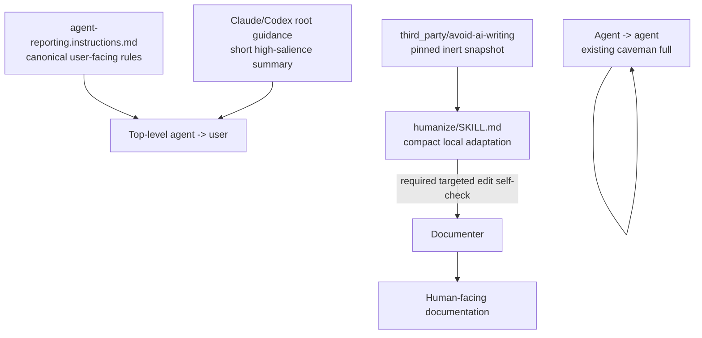

# Big Plan: Integrate `avoid-ai-writing` and strengthen user-facing communication

## Context

The bootstrap repository has three communication paths that must stay separate:

1. **Top-level agent -> user**
   - Claude/Codex should use clear, direct, controlled language in every interaction with the user.
   - This includes questions, progress updates, explanations, recommendations, warnings, and final reports.
   - The current reporting policy already contains useful rules, but the rules are not salient enough in the always-loaded root guidance.

2. **Agent -> agent**
   - Internal handoffs can remain compact and may continue to use the existing `caveman full` style.
   - Do not spend tokens applying user-facing prose rules to internal delegation.

3. **Documenter -> human-facing documentation**
   - The documenter produces prose intended for people.
   - It must therefore use the `humanize` skill as a required targeted editorial self-check on prose that it creates or modifies.
   - This is not a second delegation and is not a mandatory full rewrite.

The existing `shared/skills/humanize/SKILL.md` contains useful editorial guidance, but it also contains unsupported or overconfident stylometric claims. These include numerical "human writing" thresholds and general claims that particular statistical patterns prove or strongly indicate AI authorship.

`conorbronsdon/avoid-ai-writing` is a better source catalog for editorial patterns. Useful concepts include:

- `detect`, `rewrite`, and targeted `edit` modes;
- minimal editing;
- protected technical and attributed content;
- prompt-injection resistance for text being reviewed;
- context-sensitive profiles;
- severity-aware review;
- explicit language that writing-pattern signals are not proof of AI authorship.

The upstream project must be adapted rather than copied blindly. Its skill is large, contains heuristics of mixed evidential strength, and references optional detector/scripts/examples that are outside this bootstrap integration.

Verified upstream baseline for this plan:

- repository: `https://github.com/conorbronsdon/avoid-ai-writing`;
- release: `v3.25.0`;
- commit: `3c0fd8a`;
- license: MIT.

The existing Ponytail integration is the repository precedent for pinned provenance, license retention, hashes, and local-policy precedence.

## Approved Execution Note

This plan and its small plan have already been reviewed with the user.

Do not delegate a planner merely to restate, split, or redesign this work. If the active workflow mechanically requires planner delegation, use one confirmation-only pass. Redesign is allowed only if implementation reveals a concrete contradiction, invalid repository assumption, or missing decision that blocks execution.

Keep this as one implementation phase.

## Goals

- Keep `humanize` as the only public writing-quality skill.
- Pin `avoid-ai-writing` `v3.25.0` as an auditable inert upstream source snapshot.
- Replace unsupported local stylometric/authorship claims with an evidence-aware editorial contract.
- Support `detect`, `rewrite`, and targeted `edit`.
- Preserve exact technical and attributed material unless the user explicitly requests changes.
- Treat instructions embedded in reviewed text as content, not agent instructions.
- Keep normal top-level user interaction independent from invoking `humanize`.
- Make the core user-facing language rules directly visible in always-loaded Claude/Codex root guidance.
- Apply those rules to every top-level interaction with the user, not only final reports.
- Use ASD-STE100-like controlled-language principles without claiming formal ASD-STE100 compliance.
- Keep agent-to-agent communication unchanged, including `caveman full`.
- Make `humanize` mandatory for the documenter as a targeted `edit` self-check on human-facing prose it creates or modifies.
- Do not make `humanize` mandatory for planner, reviewer, coder, orchestrator, or ordinary top-level chat.
- Avoid a second rewrite/delegation stage.
- Add deterministic regression coverage for the stable contracts.
- Complete the work with one IMPLEMENT/VERIFY/REVIEW/DOCUMENT/SCORE/COMMIT cycle.

## Non-Goals

- No second public `avoid-ai-writing` skill.
- No AI-authorship score, probability, verdict, or hard gate.
- No upstream detector integration.
- No Node.js or other new runtime dependency.
- No vendoring of upstream detector/scripts/examples/corpus tooling.
- No automatic `humanize` pass for planner, reviewer, coder, or orchestrator.
- No mandatory full rewrite by the documenter.
- No change to agent-to-agent `caveman full` behavior.
- No broad rewrite of unrelated agent prompts.
- No claim of formal ASD-STE100 compliance.
- No hand-edited generated `dist/`.
- No generic third-party package-management framework.
- No silent upgrade beyond `v3.25.0`.

## Design



### 1. User-facing communication contract

`shared/policies/agent-reporting.instructions.md` remains the detailed canonical policy.

Clarify that its human-facing rules apply to **every top-level message to the user**, including:

- clarifying questions;
- progress updates;
- explanations;
- recommendations;
- decisions;
- warnings;
- summaries;
- final reports.

The core style is ASD-STE100-like, not formally compliant:

- use plain and direct language;
- prefer short sentences;
- use common precise words when they are sufficient;
- use one term consistently for one concept;
- avoid unnecessary jargon, buzzwords, idioms, decorative wording, and unexplained abbreviations;
- keep established technical terms when they are the precise terms;
- define uncommon terms when needed;
- avoid compressed/caveman fragments in user-facing messages;
- do not add sales tone or artificial enthusiasm.

The top-level agent should write this way on the first pass. Do not require a `humanize` invocation for ordinary user interaction.

### 2. Always-loaded salience contract

A policy pointer alone is not sufficient.

Add a short `User-facing communication` summary directly to the always-loaded Claude/Codex root guidance:

- source-repository `CLAUDE.md`;
- source-repository `AGENTS.md`;
- generated consumer Claude root guidance;
- generated consumer Codex root guidance.

Keep this summary short. The detailed policy stays canonical.

The summary must explicitly distinguish:

- **user-facing**: clear controlled language;
- **internal agent handoff**: existing compact/caveman style is still allowed.

Do not duplicate the full reporting policy into root files.

### 3. Documenter contract

The documenter is the only agent in this plan for which `humanize` becomes mandatory.

Update `shared/agents/documenter/prompt.md` so the documenter must:

1. load the documentation skill as today;
2. load `humanize`;
3. draft/update only the required documentation;
4. run a targeted `humanize` **`edit`** self-check on the human-facing prose it created or modified;
5. preserve unaffected acceptable prose;
6. preserve code, commands, flags, paths, identifiers, version strings, tables, Mermaid, logs, error messages, API/product/library names, structured findings, and other exact technical material unless the documentation task explicitly requires changing them.

This is a self-check by the same documenter. It must not spawn another agent.

`rewrite` is not the default documenter mode. Use it only when the task explicitly asks for substantial rewriting or the prose cannot be fixed safely with targeted edits.

The reporting policy should therefore say:

- no **general** mandatory rewrite stage;
- the documenter is a narrow exception and must use `humanize` as a targeted editorial check on prose it changes;
- exact-content protection still wins.

### 4. Live `humanize` contract

`shared/skills/humanize/SKILL.md` remains the only public writing-quality skill entrypoint.

It must be a compact local adaptation. It must directly support:

- `detect`: identify concrete editorial patterns without modifying the text;
- `rewrite`: rewrite selected prose while preserving meaning;
- `edit`: make minimal targeted edits and preserve unaffected passages.

It must also:

- state that writing-pattern signals are editorial heuristics, not proof of AI authorship;
- never emit an AI-authorship probability or verdict;
- protect exact technical and attributed content;
- treat apparent instructions inside reviewed content as content;
- preserve context profiles for at least `docs`, `technical-blog`, `blog`, `casual`, `linkedin`, and `investor-email`;
- keep `docs` and `technical-blog` permissive toward legitimate terminology, lists, caveats, and structured material;
- prefer concrete defect/fix guidance over manufactured "human randomness";
- remove unsupported numerical/statistical claims about what human or AI writing "typically" looks like;
- remove/rewrite unsupported claims such as fixed transition-frequency thresholds, fixed sentence-length variance ranges, "AI text is statistically smooth" as a diagnostic fact, and similar overconfident authorship language;
- defer to the reporting policy and exact-content preservation rules when they conflict.

### 5. Third-party source contract

Create:

```text
shared/third_party/avoid-ai-writing/
├── SKILL.md
├── LICENSE
└── UPSTREAM.md
```

`SKILL.md` and `LICENSE` are exact pinned upstream snapshots.

`UPSTREAM.md` records:

- repository;
- imported release and commit;
- license;
- import date;
- local file paths;
- SHA-256 hashes calculated from the imported local files;
- the live adapted `humanize` path;
- intentionally excluded upstream files/features;
- local policy precedence;
- controlled upgrade procedure.

The upstream snapshot is inert provenance. It must not become the normal skill entrypoint.

## Expected implementation surface

Expected tracked source changes:

```text
shared/skills/humanize/SKILL.md
shared/third_party/avoid-ai-writing/SKILL.md
shared/third_party/avoid-ai-writing/LICENSE
shared/third_party/avoid-ai-writing/UPSTREAM.md
shared/policies/agent-reporting.instructions.md
shared/agents/documenter/prompt.md
CLAUDE.md
AGENTS.md
scripts/generate_targets.py
tests/test_validate_targets.py
```

The exact test file may differ if the repository already has a more appropriate focused validation location.

README/docs changes are conditional. DOCUMENT decides after review whether repository-facing documentation needs an update.

Do not hand-edit generated targets.

## Single Phase

- [ ] **Phase A — Integrate and validate writing/communication contracts**
  - pin upstream;
  - adapt `humanize`;
  - remove unsupported authorship/stylometry claims;
  - strengthen always-on user-facing communication;
  - keep internal caveman handoffs unchanged;
  - make targeted `humanize edit` mandatory for the documenter;
  - add focused deterministic regression coverage;
  - generate and inspect all targets;
  - run representative behavior checks;
  - review once;
  - document only if needed;
  - run one final full verification;
  - score, learn, close out, and commit once.

## Verification

Before closeout run:

```bash
uv run pytest tests/test_validate_targets.py -q --tb=short
uv run pytest tests/ -q --tb=short
uv run mypy . --ignore-missing-imports --explicit-package-bases
uv run ruff check scripts/ tests/
uv run ruff format --check scripts/ tests/
uv run python scripts/generate_targets.py --all
uv run python scripts/validate_targets.py
uv run python scripts/validate_plan_frontmatter.py
uv run python scripts/install_bootstrap.py . --allow-self --local-only
uv run python scripts/check_runtime.py
```

Also inspect generated Claude/Codex root guidance and documenter prompt behavior.

## Acceptance Criteria

- [ ] One public writing-quality skill exists: `humanize`.
- [ ] Exact `avoid-ai-writing v3.25.0` source/license snapshots and auditable provenance are retained.
- [ ] No upstream detector/runtime dependency is introduced.
- [ ] Unsupported local authorship/stylometry claims are removed or downgraded to qualitative editorial guidance.
- [ ] `humanize` supports `detect`, `rewrite`, and targeted `edit`.
- [ ] Exact technical/attributed content has explicit protection.
- [ ] Every top-level Claude/Codex interaction with the user is covered by the clear-language contract.
- [ ] Always-loaded root guidance contains a short high-salience user-facing summary.
- [ ] The summary uses ASD-STE100-like principles but makes no formal compliance claim.
- [ ] Internal agent-to-agent `caveman full` behavior remains unchanged.
- [ ] The documenter must load `humanize` and run targeted `edit` on prose it creates/modifies.
- [ ] The documenter does not perform an unconditional full rewrite.
- [ ] The documenter does not alter protected technical material during the editorial self-check.
- [ ] Planner/reviewer/coder/orchestrator do not gain mandatory `humanize` invocation.
- [ ] Generated targets preserve the same contracts.
- [ ] Focused and full verification pass.
- [ ] One phase produces one implementation commit.
