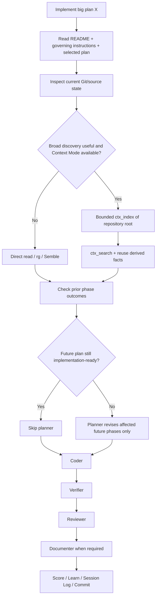

# Big Plan: orchestrator-plan-execution-defaults

## Context

The bootstrap already has the workflow, retrieval policy, agent roles, Context Mode integration, and human-facing language policy. The gap is composition: users still need to repeat a long execution prompt, planner is invoked even when planning is already complete, delegated agents can repeat repository discovery, and Claude/Codex still skip the language rules often enough that compliance needs an explicit execution-time check.

Current `dev` also deliberately blocks Context Mode directory indexing in `shared/hooks/scripts/context-mode-mcp-filter.mjs`. Re-checking the pinned Context Mode runtime shows that `1.0.169` already supports bounded directory `ctx_index` with defaults `maxDepth: 5`, `maxFiles: 200`, `respectGitignore: true`, `followSymlinks: false`, a default extension allow-list, and default noisy-path exclusions. Upstream also applies Read deny-policy checks at the root and per file during the walk.

The bootstrap filter currently allows only `content`, `path`, and `source`, rejects every extra `ctx_index` argument, enforces repository containment, rejects traversal and root symlinks, and then explicitly rejects directories. Therefore repository indexing can be enabled with a small filter change while leaving directory policy under the pinned upstream defaults.

The desired user interaction is:

```text
Implement big plan `<plan-name>`.
```

The orchestrator should load the repository workflow, selected plan, previous-phase evidence, retrieval rules, reusable repository context, delegation context, language rules, and lifecycle steps without another long user prompt.

This is control-plane/high-risk work because it changes canonical workflow instructions, retrieval/security filtering, generated guidance, and validation contracts.

## Goals

- Make an approved existing big plan directly executable without routine replanning.
- Skip planner when current/future small plans are implementation-ready.
- Before every new phase, inspect completed-phase implementation, verification, and review outcomes for evidence that materially affects remaining work.
- Reinvoke planner only when no implementation-ready plan exists or new evidence materially affects future work.
- When replanning is required, revise only affected future phases.
- Make README + governing instructions + selected plan/current phase loading part of orchestrator pre-flight.
- Preserve retrieval routing: direct read for known paths, exact search for literals, Semble for semantic discovery, Context Mode for guarded reusable indexed context.
- Allow pinned Context Mode to index repository-contained directories through the existing filter.
- Keep directory policy bounded by pinned upstream defaults; do not expose `include`, `exclude`, `maxDepth`, `maxFiles`, `extensions`, `respectGitignore`, or `followSymlinks` to agents.
- Use one bounded project index as an optional/nonblocking pre-flight optimization when broader repository discovery is useful.
- Use a stable source prefix such as `project:<repository-name>` for later focused `ctx_search`.
- Reuse indexed/search results and pass derived facts/source locations to delegated agents.
- Prefer continuing an existing role agent when its context remains valid and the runtime supports it; spawn fresh when isolation or stale context requires it.
- Make the existing human-facing language policy an explicit send-time requirement.
- Prevent internal `caveman full` shorthand from leaking directly into user-facing prose.
- Keep the existing mandatory `humanize` edit self-check for documentation.
- Document the short `Implement big plan <name>` workflow.

## Non-Goals

- No new `plan-execution.instructions.md`.
- No slash command or provider-specific execution command.
- No new agent type, context manager, orchestration state store, indexing daemon, watcher, post-commit indexing queue, or indexing manifest.
- No custom Git/file walker while pinned Context Mode already provides bounded directory walking.
- No agent-controlled directory-index options.
- No Context Mode version bump solely for this work; current pinned/published `1.0.169` is sufficient unless the installed artifact disproves the verified release behavior.
- No mandatory indexing gate.
- No treating Context Mode cache as repository truth.
- No delete/rename cache-reconciliation subsystem.
- No always-skip-planner rule and no always-reuse-agent rule.
- No full parent-history forwarding to every subagent.
- No duplication of the complete reporting policy into every prompt.
- No `humanize` pass for ordinary chat, code, exact technical material, structured findings, or internal handoffs.
- No change to quality thresholds, branch/commit/pause/push/PR rules, review severity, Semble architecture, or provider model policy.

## Verified Current Contracts

### Orchestration

`shared/agents/orchestrator/prompt.md` currently owns PRE-FLIGHT → BRANCH → PLAN → IMPLEMENT → VERIFY → REVIEW → DOCUMENT → SCORE → LEARN → SESSION LOG → COMMIT; always delegates PLAN to `planner`; already uses compact evidence packets; says typed roles should be spawned fresh when appropriate; and points delegated agents to `agent-reporting.instructions.md`.

`shared/policies/workflow.instructions.md` and `shared/policies/workspace.instructions.md` also describe planner as unconditional. These must become consistent with conditional replanning.

### Context Mode filter

`shared/hooks/scripts/context-mode-mcp-filter.mjs` currently:

- pins Context Mode `1.0.169`;
- exposes exactly `ctx_index`, `ctx_search`, `ctx_stats`, `ctx_doctor`;
- permits only `content`, `path`, `source` for `ctx_index`;
- rejects traversal;
- canonicalizes and enforces repository containment;
- rejects root symlinks;
- explicitly rejects directory input;
- then permits only regular files.

The required filter change is only to allow a real contained directory. File behavior and all other argument restrictions remain.

### Pinned Context Mode directory behavior

Verified against Context Mode `v1.0.169` on 2026-08-29:

- directory `ctx_index` dispatch exists;
- defaults include `maxDepth: 5`, `maxFiles: 200`, `respectGitignore: true`, `followSymlinks: false`, extension filtering, and noisy-path exclusions;
- Read deny policy is applied at root and per file;
- directory indexing creates per-file source labels under the supplied source prefix;
- relevance `ctx_search` uses LIKE-mode source filtering;
- indexed file-backed sources carry file path/content hash and changed indexed files can auto-refresh during later search.

This does not make the index authoritative: newly created files require another directory indexing pass to be discovered, and this plan does not solve stale deleted/renamed entries.

### Language

`shared/policies/agent-reporting.instructions.md` already owns the language policy. It requires clear/direct prose, short sentences, precise/common terminology, limited jargon/idioms, exact preservation of technical evidence, and keeps `caveman full` internal. Documentation already uses mandatory `humanize` `edit`.

The change is stronger execution ownership, not another language standard.

## Design

### Existing-plan pre-flight



Known authoritative files remain direct reads first. Do not index the repository merely to read README, instructions, or the selected plan.

When broader discovery is useful and guarded Context Mode is available:

```text
ctx_index(
  path: <absolute repository root>,
  source: "project:<repository-name>"
)
```

Do not pass directory-policy overrides. Then use focused searches such as:

```text
ctx_search(
  source: "project:<repository-name>",
  queries: ["relevant contract", "related implementation", "existing tests"]
)
```

Indexing is best-effort: failure/cap must not block the workflow, caps must not be auto-raised, files to edit must still be read normally, and current Git/filesystem state is authoritative.

### Delegation evidence packet

Pass only useful derived context:

- current phase and exact task;
- plan requirements/non-goals;
- files/symbols already found;
- verified invariants;
- relevant prior-phase outcomes/findings;
- settled decisions and rejected approaches;
- skills/review profiles;
- verification commands;
- artifact paths where useful;
- Context Mode source/search terms when useful;
- reporting-policy pointer.

Do not send raw repository dumps merely to avoid rediscovery.

### Agent reuse

Reuse/continue an existing role when the follow-up is the same role/phase and its context remains correct. Spawn fresh when independent judgment is required, context is stale/materially changed, continuation is unavailable, or runtime isolation requires it. Reviewer/verifier independence remains more important than token savings.

### Planner rule

Before each new phase:

1. Review completed-phase implementation/verification/review outcomes that can affect future work.
2. If remaining plans still hold, skip planner.
3. If new evidence materially invalidates future assumptions, invoke one planner with the evidence packet.
4. Revise affected future phases only.
5. Do not reopen completed or unaffected scope.

### Language compliance

Keep `agent-reporting.instructions.md` as the single source of truth. Add a concise execution rule:

> Before sending user-facing prose, self-check it against the human-facing rules and correct obvious violations.

The orchestrator owns the internal-to-external boundary: compact internal shorthand may remain internal, but it must be adapted before being shown to the user while preserving exact technical evidence.

## Ponytail / Adversarial Review

Rejected as unnecessary:

1. New execution-policy file.
2. Custom `/implement-plan` command.
3. Always planner / never planner.
4. Always reuse / always respawn agents.
5. Git-driven per-file custom indexer.
6. Agent-exposed `maxDepth`, `maxFiles`, `respectGitignore`, etc.
7. Post-commit refresh/watchers.
8. Mandatory indexing.
9. Index-before-known-read behavior.
10. Copying language rules into every role prompt or running `humanize` on every message.

The minimum correct design is to strengthen existing orchestrator/workflow/reporting contracts and remove the single bootstrap-level directory prohibition while preserving the rest of the filter policy.

## Phase

- [ ] `2026-08-29_phase-A-orchestrator-plan-execution-defaults`

One phase is intentional. These mutually dependent control-plane contracts should land atomically.

## Verification

```bash
node --check shared/hooks/scripts/context-mode-mcp-filter.mjs
uv run python scripts/generate_targets.py --all
uv run python scripts/validate_targets.py
uv run python scripts/check_runtime.py
```

Run existing Context Mode filter/native MCP regression coverage plus the focused directory cases in the small plan.

Required review profiles:

- `code`
- `architecture`
- `security`
- `tests`
- `ponytail`
- `documentation` when applicable

## Done Criteria

- `Implement big plan <name>` starts an approved plan without mandatory replanning.
- Planner is skipped while remaining work is implementation-ready.
- Completed-phase evidence is checked before each new phase.
- Planner is reinvoked only when evidence materially affects remaining work, and only affected future phases are revised.
- Known authoritative files are read directly before broad indexed discovery.
- Real repository-contained directories may pass guarded `ctx_index`.
- Outside paths, traversal, root symlinks, and extra index-policy arguments remain denied.
- Orchestrator can establish one bounded project index using pinned upstream defaults when broad discovery is useful.
- Indexing failure/cap never blocks implementation or causes automatic cap escalation.
- Current files/Git remain authoritative.
- Indexed/search context is reused across delegation instead of causing repeated discovery.
- Same-role context is reused when safe/useful; fresh independent review/verification remains supported.
- User-facing output gets an explicit language self-check.
- Internal compressed handoffs are adapted before user-facing output.
- Documentation keeps the existing `humanize` edit requirement.
- Generated guidance reinforces the behavior without duplicating canonical policy.
- Generator, validator, Context Mode regressions, runtime checks, reviews, score, docs, learning, and session-log gates pass.
