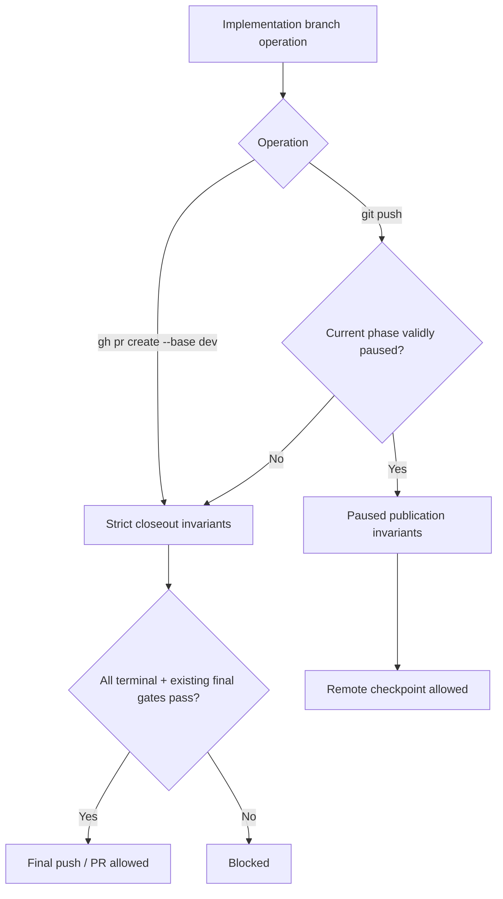
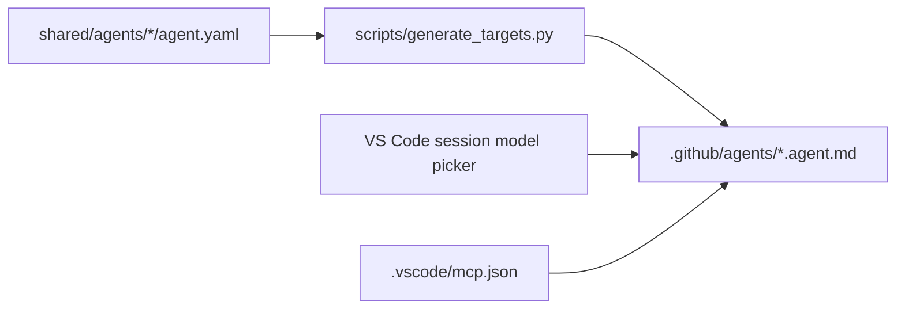

# Big Plan: paused-push-copilot-vscode-parity

## Context

This plan covers two independent bootstrap gaps on the current `dev` branch.

First, the existing paused-phase lifecycle allows a valid checkpoint commit but still blocks every implementation-branch push until all phases are terminal. This makes a pause unsafe for long-running work because the checkpoint can exist only on the local machine. The required behavior is narrower: a valid paused checkpoint may be pushed as a durable remote backup, but it must remain unfinished and must not become PR-ready.

Second, GitHub Copilot support in VS Code is behind the other supported agent targets in a few concrete areas. Current canonical metadata still pins exact Copilot models for `orchestrator`, `planner`, and `coder`. The Copilot `search` capability still omits the configured MCP retrieval servers because the tool naming convention was previously unverified. The generated adapter also does not fully express existing canonical delegation intent: the orchestrator says it is not itself delegatable, while a planner with `delegates: []` currently receives the `agent` tool without an explicit empty `agents` restriction.

This work is control-plane/high-risk because it changes lifecycle gates, generated agent adapters, and validator contracts. Follow the full lifecycle and use review profiles `code`, `architecture`, `security`, `tests`, and `ponytail`.

## Goals

- Allow an implementation branch whose current phase is validly `paused` to be pushed to a remote as a checkpoint.
- Keep `gh pr create --base dev` blocked while any phase is paused or otherwise non-terminal.
- Preserve the existing strict completed/cancelled push and PR closeout behavior.
- Reuse the existing pause evidence contract; do not add a second checkpoint state model.
- Make GitHub Copilot in VS Code a first-class native agent target without adding Copilot CLI or cloud-agent scope.
- Remove current exact Copilot model pins from canonical agents and let generated VS Code agents inherit the session-selected model. If the user selects Copilot Auto, Auto remains a session/runtime choice; the bootstrap must not claim per-role adaptive model routing.
- Map existing canonical delegation and visibility intent to current VS Code custom-agent frontmatter.
- Add the configured retrieval MCP servers to Copilot search-capable agents using documented VS Code MCP tool wildcard syntax.
- Remove stale validation that exists only to maintain the current exact Copilot model allow-list.
- Add regression checks at the smallest useful boundaries so future generator or lifecycle changes cannot silently restore the current gaps.

## Non-Goals

- Do not add a new `pause_checkpoint_sha`, checkpoint database, branch type, WIP branch prefix, or remote-publication status.
- Do not relax PR readiness, merge readiness, final findings, score, LEARN, DOCUMENT, or completed-closeout requirements.
- Do not allow an ordinary `in-progress` phase to push.
- Do not change branch naming from `<plan>_implementation`.
- Do not create a provider-neutral `execution.tier`, `fast/deep`, or adaptive-effort schema in this plan.
- Do not change Claude Code, OpenAI Codex, or Google Antigravity model policy except for generated/shared validation effects that are strictly necessary to keep the existing target valid.
- Do not add GitHub Copilot CLI or GitHub cloud coding-agent support.
- Do not extend `scripts/check_native_clients.py` merely to claim Copilot parity.
- Do not add a dependency or a generic YAML/frontmatter framework for the small Copilot metadata changes.

## Verified Constraints

### Repository contracts checked on `dev`

- `assert_commit_invariants` already permits a paused current phase when:
  - the big plan remains `in-progress`;
  - the current small plan has `status: paused`; and
  - `assert_pause_evidence` accepts `paused_at`, `paused_reason`, and `pause_session_log`.
  It returns before completion-only score/findings/LEARN checks.
- `assert_push_invariants` currently treats push and PR as one terminal ceremony. It rejects every phase that is not `complete` or evidenced `cancelled`, requires at least one completed phase, checks commit count, checks bypass acknowledgment, and applies the final findings/Ponytail gate.
- `shared/hooks/scripts/enforce-pr-gate.sh` currently sends both `git push` and `gh pr create` through `assert_push_invariants`.
- `shared/hooks/git-hooks/pre-push` already passes the actual pushed branch and `local_sha` into `assert_push_invariants`; it does not need a new checkpoint identifier.
- Existing paused regression fixtures explicitly expect paused push to fail and therefore must be updated.
- `model_intent.github-copilot` already accepts the string `target-default`, and `render_github_agent_adapter` already omits `model:` when that value is used.
- `reviewer`, `verifier`, and `documenter` already use `target-default`; only `orchestrator`, `planner`, and `coder` currently pin an exact Copilot model.
- `shared/mcp/servers.json` defines `semble`, `context-mode`, and `context7`.
- `shared/policies/tool-routing.instructions.md` assigns Semble and Context Mode to repository retrieval and context7 to current external library documentation.
- `COPILOT_TOOL_MAP["search"]` currently contains only `search` and carries a source comment that MCP naming was an unresolved gap.
- The current GitHub renderer already:
  - emits an `agents:` list when canonical `delegates` is non-empty;
  - emits `user-invocable: false` for hidden agents;
  - omits `model:` for `target-default`.
  The plan extends these existing branches instead of replacing the renderer.

### VS Code Copilot behavior checked on 2026-08-28

Official current documentation:

- https://code.visualstudio.com/docs/agent-customization/custom-agents
- https://code.visualstudio.com/docs/agents/run/subagents
- https://docs.github.com/en/copilot/concepts/models/auto-model-selection

Verified behavior used by this plan:

- Workspace custom agents live in `.github/agents/*.agent.md`.
- `model` may be a string or prioritized availability-fallback list. When omitted, the currently selected model in the model picker is used.
- `user-invocable: false` hides an agent from the user picker while leaving it available as a subagent/programmatic agent.
- `disable-model-invocation: true` prevents general model-driven subagent invocation.
- `agents:` restricts which subagents an agent may use; `[]` prevents subagent use and `*` is the default.
- When `agents:` is present, the `agent` tool must also be present.
- Explicitly listing an agent in a coordinator's `agents:` list can make that agent available to that coordinator even when the child has `disable-model-invocation: true`.
- MCP tool allowlists can include all tools from a server with `<server-name>/*`.
- Copilot Auto may consider task complexity and service/model availability, but current VS Code custom-agent metadata does not provide a documented semantic per-agent `fast/deep` class or per-agent adaptive reasoning-effort contract.

Therefore this plan uses model inheritance rather than inventing a routing abstraction.

## Design Overview

### Phase A: separate backup publication from final closeout

Keep the existing strict push/PR invariant body as the final-closeout path. Add only a narrow paused-publication path around it.



The paused-publication path must validate only what is needed to make the remote backup meaningful:

- big plan is `in-progress`;
- `current_phase` is a safe listed small-plan slug;
- current small plan belongs to the big plan and has exactly one `status: paused`;
- existing pause evidence passes;
- every phase before `current_phase` is terminal (`complete` or evidenced `cancelled`);
- the pushed ref contains at least one commit for each prior completed phase plus one additional checkpoint commit for the paused current phase.

Future phases after `current_phase` must not block the checkpoint. They are commonly pre-created and may still be `in-progress`.

No new SHA frontmatter is needed. The native pre-push hook already receives the actual pushed `local_sha`; the existing `dev..local_sha` commit-count mechanism is enough to prove that a checkpoint commit exists without creating a second source of truth.

### Phase B: use the existing Copilot adapter more completely

Do not create a new execution-policy schema.



Use the existing `github-copilot: "target-default"` sentinel for all current universal agents. Generated Copilot agents then omit `model:` and inherit the VS Code session choice.

Extend the existing renderer only where current canonical intent is not expressed:

- search capability -> built-in `search` plus `semble/*`, `context-mode/*`, and `context7/*`;
- non-empty `delegates` -> current explicit `agents:` list;
- delegate capability with `delegates: []` -> explicit `agents: []`;
- orchestrator -> `disable-model-invocation: true`, because canonical metadata already states it is not itself a delegatable subagent;
- hidden agents -> keep current `user-invocable: false`.

No new metadata field is required.

## Ponytail / Adversarial Review

The following larger designs were considered and rejected before implementation:

1. **Add `pause_checkpoint_sha` to plan frontmatter.**
   - Rejected. The pre-push hook already receives the real pushed SHA and existing plan state already carries pause evidence. A second SHA field would create synchronization and recovery rules with no current need.

2. **Create a generic publish/checkpoint state machine.**
   - Rejected. There are only two required paths: valid paused backup versus existing strict final closeout. A small wrapper plus a strict helper is sufficient.

3. **Create provider-neutral model classes such as `fast`, `balanced`, and `deep`.**
   - Rejected. VS Code Copilot does not currently expose a matching per-agent semantic routing contract, and the user only requested Copilot VS Code parity. Existing `target-default` already expresses the required inheritance behavior.

4. **Pin a list of strong Copilot models per agent.**
   - Rejected. VS Code documents lists as availability fallback order, not complexity routing. Exact names also create maintenance churn.

5. **Modernize Claude, Codex, Antigravity, Copilot CLI, and Copilot cloud in the same change.**
   - Rejected. That expands risk and usage without serving the current request.

6. **Build a new automated VS Code native-client harness.**
   - Rejected for this phase. Structural generation/validation is deterministic. Native VS Code behavior should be checked through the current VS Code customization diagnostics and a small manual smoke test when an authenticated client is available. Do not claim native runtime evidence if it was not executed.

Ponytail target: preserve the current architecture, reuse current helpers/sentinels, and make the minimum correct diff while retaining the lifecycle and security checks.

## Phases

- [ ] `2026-08-28_phase-A-paused-remote-checkpoints`
  - Split paused checkpoint publication from strict push/PR closeout.
  - Update regression fixtures and lifecycle documentation.
- [ ] `2026-08-28_phase-B-copilot-vscode-parity`
  - Remove current Copilot model pins, complete native VS Code delegation/tool metadata, simplify stale model validation, and document the exact supported behavior.

## Cross-Phase Dependency

The phases are intentionally separate and independently verifiable.

Phase A changes lifecycle gates and does not depend on Copilot adapter work.

Phase B changes generated Copilot VS Code metadata and does not depend on paused publication behavior.

Do not split either phase further unless implementation discovers a real atomicity problem. Generator changes and matching validator changes in Phase B must land in the same phase so generation and validation cannot temporarily reject each other.

## Verification

Run after each phase, and again after both phases are complete:

```bash
uv run python scripts/generate_targets.py --all
uv run python scripts/validate_targets.py
uv run python scripts/check_runtime.py
```

Phase-specific regression commands are defined in each small plan.

For the final review, run the required control-plane profiles:

- `code`
- `architecture`
- `security`
- `tests`
- `ponytail`

Resolve all CRITICAL findings before commit. Resolve all MAJOR findings before final push/PR closeout. Persist the required score/findings/session-log/LEARN evidence according to the existing workflow.

## Done Criteria

- A valid paused current phase can create its existing checkpoint commit and push the implementation branch to a remote.
- The same paused branch is still rejected by `gh pr create --base dev`.
- An ordinary `in-progress` phase remains blocked from push.
- Completed/cancelled final push and PR closeout retain the existing strict gates.
- First-phase pause is supported; it is not rejected only because zero phases are complete.
- Copilot VS Code generated agents no longer pin the current exact model names.
- Copilot VS Code search-capable agents can see the configured Semble, Context Mode, and context7 MCP server tool surfaces through documented server wildcards.
- Generated delegation restrictions match the current canonical `delegates` contract for orchestrator and planner.
- The orchestrator is user-selectable but not generally model-invocable as a subagent.
- Existing hidden agents remain hidden from the picker but usable by an explicitly allowed orchestrator.
- README/runtime documentation describes VS Code Copilot only and does not imply CLI/cloud parity or unsupported per-role adaptive model routing.
- Generator, validator, runtime check, lifecycle regression fixtures, required reviews, quality score, and closeout evidence pass.
