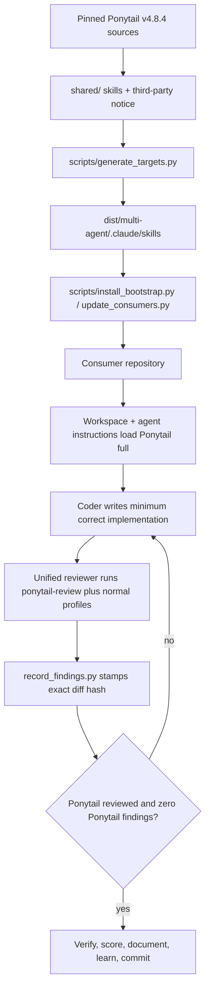

# Big Plan: ponytail-integration

## Context

[Ponytail](https://github.com/DietrichGebert/ponytail) is an MIT-licensed,
agent-portable coding skill that makes an agent stop at the first viable rung
of a minimal-solution ladder: do nothing when the feature is unnecessary,
reuse existing code, prefer the standard library or native platform, reuse an
installed dependency, and only then write the minimum correct code. It
explicitly preserves trust-boundary validation, data-loss handling, security,
accessibility, root-cause analysis, and a small runnable check for non-trivial
logic.

The upstream project supports plugin installation for Claude Code, Codex, and
Copilot CLI, but this bootstrap must also cover GitHub Copilot IDE users,
fresh clones, offline consumer sessions, and contributors who have not
installed a personal plugin. Therefore Ponytail must be distributed from this
repository's `shared/` source of truth and rendered into
`dist/multi-agent/`, not treated as an undocumented workstation prerequisite.

The requirement "every time code is written, it should go through Ponytail"
has two enforceable parts:

1. **Before and during implementation:** every direct coding path and coding
   agent loads the Ponytail skill in `full` mode.
2. **After implementation:** the exact diff must pass a Ponytail
   over-engineering review. A content-hash-stamped findings report makes the
   review stale as soon as the diff changes and blocks commit/push until the
   review is rerun.

This design deliberately reuses the bootstrap's existing instruction, skill,
reviewer, findings, content-hash, and commit-gate machinery. It does not add a
second quality system or require upstream Node.js lifecycle hooks in the first
integration.

### Upstream basis

- Latest researched release: [`v4.8.4`](https://github.com/DietrichGebert/ponytail/releases/tag/v4.8.4),
  commit `bc9ee94`.
- Portable behavior:
  [`skills/ponytail/SKILL.md`](https://github.com/DietrichGebert/ponytail/blob/v4.8.4/skills/ponytail/SKILL.md)
  and
  [`skills/ponytail-review/SKILL.md`](https://github.com/DietrichGebert/ponytail/blob/v4.8.4/skills/ponytail-review/SKILL.md).
- Portability guidance:
  [`docs/agent-portability.md`](https://github.com/DietrichGebert/ponytail/blob/v4.8.4/docs/agent-portability.md).
- License:
  [MIT](https://github.com/DietrichGebert/ponytail/blob/v4.8.4/LICENSE).

## Goals

- Make Ponytail available from the generated `.claude/skills/` basis in every
  downstream consumer without per-user plugin installation.
- Apply Ponytail `full` mode to every task that writes, changes, fixes,
  refactors, or designs code.
- Require a fresh Ponytail review for every non-documentation implementation
  diff before commit and push.
- Require all surviving Ponytail findings to be resolved, including findings
  that would otherwise be classified as `MINOR`.
- Preserve the existing correctness, security, accessibility, testing,
  documentation, score, and findings gates.
- Keep the integration deterministic, license-compliant, and upgradeable from
  one pinned upstream version.
- Preserve warning/fallback behavior for optional retrieval helpers; Ponytail
  itself must not depend on Semble, context-mode, Node.js, or network access at
  consumer runtime.

## Non-Goals

- Automatically installing Ponytail into a contributor's global Claude,
  Codex, or Copilot plugin marketplace.
- Shipping Ponytail's status-line UI or runtime mode-switching hooks in the
  first integration.
- Replacing the unified correctness/security reviewer with Ponytail review.
- Applying Ponytail's terse output style to documentation or user-requested
  explanations; Ponytail governs what is built, not how the agent talks.
- Blindly minimizing validation, error handling, security, accessibility, or
  tests.

## Design Overview



### Distribution choice

Vendor only the portable skills required by this workflow, plus the upstream
license and provenance metadata. Keep those files under the editable
`shared/` source tree and let the existing generator copy them into the
canonical downstream `.claude/` basis. Do not download Ponytail during
consumer installation or startup.

### Activation choice

Use the bootstrap's native skill discovery and canonical instruction files:

- Mark `ponytail` and `ponytail-review` as upstream-derived public skills.
- Add an always-on coding rule that requires `ponytail` in `full` mode before
  a code-writing action.
- Add the same requirement to the coder role and to root target adapters so
  main-thread coding is covered, not only delegated coding.
- Preserve an explicit user override for a single task only when the user
  directly asks to disable Ponytail; the mandatory post-write review remains
  required unless the bootstrap's existing bypass policy is invoked and
  ledgered.

### Enforcement choice

Extend the existing findings artifact instead of inventing a separate report:

- `record_findings.py` records `profiles_reviewed`,
  `ponytail_reviewed: true|false`, and `ponytail_findings`.
- The reviewer emits `profile: "ponytail"` on Ponytail findings and lists
  `ponytail` among reviewed profiles even when the final findings list is
  empty.
- Commit and push gates require a fresh report with
  `ponytail_reviewed == true` and `ponytail_findings == 0` whenever the diff is
  not documentation-only.
- The existing content hash invalidates the review after any real diff change.

Documentation-only means every changed path is Markdown or lives under
`docs/`, `plans/`, `.claude/plans/`, `.claude/session_logs/`, or
`.claude/quality_reports/`. Any source, test, script, hook, configuration,
manifest, template, container, or generator change requires Ponytail review.
This conservative classifier avoids maintaining a fragile programming-language
extension allow-list.

## Risks and Decisions to Verify

- **Upstream format drift:** pin to release `v4.8.4` and validate the recorded
  version and file hashes. Upgrades are explicit pull requests.
- **License preservation:** ship the upstream MIT license and provenance in
  generated consumer output.
- **Skill frontmatter compatibility:** retain the upstream behavior text while
  normalizing only the local `visibility` metadata required by this bootstrap.
- **False documentation-only classification:** validate mixed code/docs,
  renamed files, deleted files, staged files, and untracked files.
- **Report parser limits:** expose gate-critical Ponytail values as top-level
  scalar fields so the pure-Bash hook library does not need nested JSON parsing.
- **Review loop:** Ponytail review only identifies deletions/simplifications.
  The coder applies them, then verification and the full review are rerun.
- **Current branch:** planning occurred on `agent-model-effort-tiers`. Start
  implementation only from a clean `dev` after the current branch is merged or
  its plan commits are moved intentionally.

## Phases

- [x] `2026-07-18_phase-A-vendor-ponytail`
- [x] `2026-07-18_phase-B-activate-ponytail`
- [x] `2026-07-18_phase-C-enforce-ponytail-review`
- [x] `2026-07-18_phase-D-validate-and-document-ponytail`

## Verification

```bash
uv run python scripts/generate_targets.py --all
uv run python scripts/validate_targets.py
uv run python scripts/check_runtime.py
git diff --exit-code -- dist/multi-agent/
```

The final generated-output determinism check should use the repository's
existing validator contract if `dist/` remains gitignored; do not commit
generated files.
