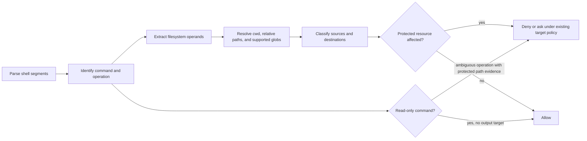

# Big Plan: protect-files-operation-resolution

## Context

`shared/hooks/scripts/protect-files.py` currently mixes two different safety
models. Known mutators classify literal command operands, while unknown,
interpreter, and non-read-only Git commands scan their complete argument text
for protected-looking words. Neither path resolves the filesystem operation
that the shell will actually perform.

This causes confirmed false positives for a legitimate `git mv` involving
`secrets.tf`, the word `credentials` in a commit message, and a Python heredoc
that defines a `secret` identifier. The exact reported read-only `grep` of a
hook script is already allowed by the canonical source and must remain allowed
as an explicit compatibility regression. Conversely, `mv terraform/*
terraform/aws/` is allowed because the classifier sees an unexpanded wildcard
rather than the protected files it can select. The false positives impede
ordinary work while the wildcard behavior violates the documented guarantee
that move/copy/install source operands cannot exfiltrate protected files.

The previous ambiguity and Git-parsing fixes (`b968835` and `80a6495`)
improved failure handling and Git option parsing, but deliberately retained
opaque protected-literal scanning and did not add filesystem or wildcard
resolution. This plan closes that remaining root cause in one control-plane
change.

## Goals

- Classify the files an operation can actually read, write, copy, or move
  instead of matching arbitrary prose or interpreter source text.
- Expand supported wildcard operands safely and deterministically before
  evaluating protected sources and destinations.
- Preserve hard denial for genuine mutations of high-confidence protected
  files and hook/control-plane configuration.
- Remove the broad `"secret" in basename` behavior that treats ordinary
  source/configuration names such as `secrets.tf`, `secretmanager.py`, and
  `test_secrets.py` as credentials.
- Keep read-only inspection, including direct inspection of hook scripts,
  usable for diagnosis.
- Generate and validate every client target so consumer projects receive the
  corrected canonical implementation.

## Design Overview

Replace command-wide word scanning with an operation-aware pipeline:



Resolution must use Python filesystem APIs and must never evaluate command
substitutions, execute a shell, or inspect file contents for secrets. Relative
paths are resolved against the command's effective repository working
directory, wildcard matches are deterministic, and unmatched or unsupported
expansion syntax is handled conservatively. Source and destination operands
remain distinct so copy/move/install cannot bypass protection through a
protected source.

Protected-path matching will use explicit, high-confidence resource families:
`.env*`, `uv.lock`, `credentials*`, private key material, hook trees, and the
listed hook/client configuration files. Generic source filenames containing
the substring `secret` are not credential evidence. Content-based credential
detection is out of scope because it is both unreliable and inappropriate for
a pre-tool command guard.

## Non-Goals

- Executing or fully emulating arbitrary Bash.
- Scanning repository file contents for credentials.
- Weakening protection for `.env*`, credential files, private keys, hook
  scripts, or protected hook/client configuration.
- Changing branch, commit, push, PR, or lifecycle gates outside the
  protect-files lane.

## Phases

- [ ] `2026-08-14_phase-a-protect-files-operation-resolution`

## Verification

```bash
uv run pytest tests/test_hook_gates.py -q --tb=short
uv run pytest tests/test_validate_targets.py -q --tb=short
uv run python scripts/generate_targets.py --all
uv run python scripts/validate_targets.py
uv run python scripts/check_runtime.py
uv run pytest tests/ -q --tb=short
uv run mypy . --ignore-missing-imports --explicit-package-bases
uv run ruff check scripts/ shared/scripts/ tests/
uv run ruff format --check scripts/ shared/scripts/ tests/
git diff --check
```
