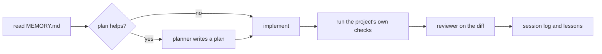

# Big Plan: Sidecar Workflow Profile

## Context

The sidecar install (`install_bootstrap.py TARGET --mode sidecar`, big plan
`consumer-sidecar-bootstrap-overlay`, complete at `c4b1a80`) projects four
skills and two one-paragraph bridges into a team-owned repository as
Git-ignored files. It ships none of the bootstrap's workflow: no agents, no
plans, no memory, no session logs, no review profiles, and none of the
other skills.

The maintainer wants the workflow available in repositories the team owns,
for personal use only, without any colleague seeing it:

- plans, `MEMORY.md`, session logs, explorations, and quality reports,
  available locally, never tracked, never visible in `git status`, and
  surviving pulls, merges to `dev` or `main`, and branch switches;
- the orchestrator, planner, coder, reviewer, and documenter agents, and
  the skills that make sense without the full install;
- a relaxed ceremony: no hooks, no receipts, no findings gate, no nested
  checkpoints, no forced planning, and no branch rules. Plans and reviews
  are tools the agents use when a task earns them, not gates.

`.claude/` is usually tracked by the team in these repositories, so every
personal file must be hidden path by path inside it, next to the team's own
files, the way the sidecar already hides its skills inside a team-tracked
`.claude/skills/`.

What the current sidecar already provides and this plan reuses unchanged:
the exclude block in `info/exclude` with one anchored line per unit, the
`git check-ignore` gate before any write, ownership by manifest record,
team precedence by name across every read folder, the preserved-copy
folder, the pending ownership record, the run lock, atomic writes, crash
convergence, and `--uninstall`. Everything Phase L hardened applies to the
new units without change.

What is different from the full install and stays out: hooks,
`core.hooksPath`, `.claude/settings.json` or `settings.local.json`, the
nested `.claude` repository and state sync, `verify.py`,
`record_findings.py`, receipts, MCP configuration, the devcontainer, root
adapters, and any edit to a tracked file.

## Goals

- Add a second sidecar profile, `--profile workflow`, beside today's
  default profile (named `skills`). `--mode sidecar` alone keeps today's
  behavior exactly.
- Ship, as Git-ignored units, the eligible skills, the agent definitions
  for the clients that discover them from an ignored file, the review
  profiles, the plan and log templates, a relaxed instruction set, a
  `MEMORY.md` seed, and the state folders.
- Keep all mutable state under one namespaced folder,
  `.claude/ai-bootstrap/`, hidden by one exclude line, created once, never
  compared, updated, or removed by a later update, and kept by `--uninstall`
  unless `--purge-state` is passed.
- Keep every invariant of the skills profile: no pre-existing byte changes,
  `git status --porcelain --untracked-files=all` is identical before and
  after install and update, a team file with the same name always wins,
  and every unit is proven ignored before it is written.
- Prove client behavior natively before claiming it, as Phase A of the
  first sidecar plan did.
- Keep the ceremony to three phases: one for evidence and authored
  content, one for all code and documentation, one for the knowledge
  refresh.

## Non-Goals

- Hooks of any kind, `core.hooksPath`, Claude Code settings files, the
  nested `.claude` repository, state sync, receipts, `verify.py`,
  `record_findings.py`, the commit and push gates, and the branch rules.
- Remote backup of the personal state. Local files are enough; the
  documented risk is `git clean -x`, and `--backup-state` is the only
  mitigation this plan offers.
- MCP servers, the devcontainer, root adapters, and any edit to `.gitignore`
  or another tracked file.
- Editing `.codex/config.toml`. Codex agents ship only if Phase A finds a
  discovery path that needs no config edit; otherwise Codex gets skills and
  state only.
- Antigravity support beyond what Phase A can verify natively.
- A per-user global install (`~/.claude`, `~/.codex`).

## Decisions

| # | Topic | Decision | Why |
| --- | --- | --- | --- |
| 1 | Profile model | A sidecar install has a profile, `skills` (today's four skills and two bridges) or `workflow`. The profile is a CLI flag, `--profile`, recorded in the manifest as `profile`, and reused by later runs and by `update_consumers.py` when the flag is absent. Manifest schema version rises to 2; a version-1 manifest reads as `skills`. | One reconciliation engine, two desired sets. The engine already handles added and removed units, so switching profiles is an update. |
| 2 | State namespace | All mutable state lives under `.claude/ai-bootstrap/`: `MEMORY.md`, `plans/`, `session_logs/`, `explorations/`, `quality_reports/`, each folder with a README. One exclude line, `/.claude/ai-bootstrap`, hides it. | One line cannot collide with anything a team plausibly tracks, and the agents' prompts and templates render to that path. `.claude/plans/` and friends would sit next to team files and need one line each. |
| 3 | State units | A state unit is created from its seed only when absent. A later run never compares, updates, removes, or preserves it. `--uninstall` keeps the folder and its exclude line and says so; `--uninstall --purge-state` removes it. A `--backup-state` flag copies the folder into `<git dir>/ai-bootstrap-sidecar-preserved/state--<timestamp>/`. | The state is the person's work, not the bootstrap's. The consumer-state rule of the full install applies. `git clean -x` is the one Git command that deletes ignored files, and the Git directory survives it. |
| 4 | No ceremony | The workflow profile ships no hook, no `settings.json` or `settings.local.json`, no nested repository, no receipts, and no `verify.py`. Gates become guidance: the relaxed instruction set tells the agents when a plan, a review, a session log, or a memory entry helps, and never blocks a commit. | The person asked for a relaxed version. Hooks would also require `core.hooksPath` or a settings file, both of which touch the team's setup or need a client-specific private file. |
| 5 | Relaxed instruction set | `shared/sidecar/workflow/` holds the profile's own instruction files, authored for the profile, not derived from `shared/policies/` by text replacement: one workflow rule (read `MEMORY.md` first, use plans and the specialists when the task earns them, log and record lessons at the end, run the project's own checks, review with the reviewer agent), one reporting rule, one tool-routing rule. They render as `.claude/rules/ai-bootstrap-*.md` for Claude Code and as one `.github/instructions/ai-bootstrap-workflow.instructions.md` for Copilot. The existing sidecar bridge stays for the `skills` profile. | The canonical policies are written around hooks, receipts, and the closeout sequence; a replacement table cannot turn them into a relaxed workflow honestly. Short, purpose-written rules are easier to keep true. |
| 6 | Agent variants | Each shipped agent has a complete, self-contained workflow-profile prompt, `shared/agents/<id>/workflow-prompt.md`, written for the profile: the relaxed loop (plan when useful, implement, verify with the project's own commands, review, log), the profile's rule files, the templates, the state paths, and only skills the profile ships. The generator renders it with the client adapter's frontmatter (name, description, tools) and never merges it with the canonical prompt. The validator rejects a workflow prompt that names a hook, a receipt, `verify.py`, the nested repository, an unshipped skill, or a `.claude/instructions/` path. | Amended 2026-09-27 during Phase A after two review rounds: a supplement that replaces a closed list of the canonical prompt's sections kept missing dangling references (skill tiers, reporting pointers, routing tables, quality gates), because the canonical prompts name full-install files in many places. A complete prompt per role is shorter, verifiable by grep, and trivial to render. |
| 7 | Client coverage | Claude Code gets skills, agents (`.claude/agents/<id>.md`), rules, review profiles, templates, and state. Copilot in VS Code gets skills, agents (`.github/agents/<id>.agent.md`), and the instructions file. Codex gets skills and state, plus agents only if Phase A finds a config-free discovery path. Antigravity stays unverified unless Phase A can run it. | Codex custom agents need `.codex/config.toml`, which may be the team's; the sidecar never edits a tracked file. |
| 8 | Skill selection | The workflow profile ships every `visibility: public` skill except a fixed denylist of skills that depend on the full install (`commit`, `context-status`, `knowledge-refresh`, `safe-consumer-bootstrap-refresh`, `setup-project`, `deep-audit`, `run-tests` where it names `verify.py`, and any skill whose text still trips the profile's forbidden tokens after replacements). Phase A fixes the list; the validator enforces it. | Everything else is either a coding skill or a workflow skill that works without hooks. Background skills stay out because no hook injects them. |
| 9 | Write roots and precedence | New write roots per unit kind: `.claude/agents`, `.claude/rules`, `.claude/review-profiles`, `.claude/templates`, `.github/agents`, `.github/instructions`, and the state folder. Each new root joins the read list for collision checks. A team file with the same name at any read folder takes the unit, as skills work today, and the run reports it. | Same rule, more unit kinds. Phase A freezes the exact lists on evidence. |
| 10 | Profile switching | `--profile skills` on a `workflow` install removes the workflow-only units through the ordinary remove and preserve rules and keeps the state folder hidden. `--profile workflow` on a `skills` install adds the missing units. A manifest with a different profile than the flag is an update, not an error. | The engine already reconciles a changed desired set. |
| 11 | Validator per profile | `validate_targets.py` gains a per-profile allowlist and forbidden-token list. The workflow profile allows `MEMORY.md`, the state paths, and the agent, rule, review-profile, and template paths, and still forbids hooks, `verify.py`, `record_findings`, `.claude/scripts/`, `mcp__`, `ctx_`, and `openwiki`. `dist/sidecar/` becomes `dist/sidecar/skills/` and `dist/sidecar/workflow/`, and the installer's `--source` default follows the profile. | The allowlist is the self-containment contract; two profiles need two lists. |
| 12 | Evidence before claims | Phase A records, per client, whether an ignored agent file, an ignored rules file among several, and an ignored instructions file load, from a fixture whose `.claude/` is team-tracked. A client without `native-run` evidence for a unit kind does not get that unit kind. | Decision 14 of the first sidecar plan, applied to the new unit kinds. |

## Design Overview

### Consumer layout after a workflow-profile install

```text
<git dir>/ai-bootstrap-sidecar.json            manifest, schema 2, profile: workflow
<git dir>/info/exclude                         one line per unit; one line for the state folder
.claude/ai-bootstrap/MEMORY.md                 state unit (seeded once)
.claude/ai-bootstrap/plans/                    state unit
.claude/ai-bootstrap/session_logs/             state unit
.claude/ai-bootstrap/explorations/             state unit
.claude/ai-bootstrap/quality_reports/          state unit
.claude/skills/<skill>/, .agents/skills/<skill>/   every eligible skill
.claude/agents/<id>.md                         Claude Code agents
.claude/rules/ai-bootstrap-*.md                relaxed instruction set
.claude/review-profiles/<name>.md              review profiles
.claude/templates/plan-big.md, plan-small.md, session-log.md, quality-report.md
.github/agents/<id>.agent.md                   Copilot agents, if Phase A proves discovery
.github/instructions/ai-bootstrap-workflow.instructions.md
.codex/agents/<id>.toml                        only if Phase A finds a config-free path
```

Everything above is an ignored, untracked path. The team's own files next to
them, including a tracked `.claude/settings.json` or a tracked skill, are
never read as sidecar content and never changed.

### The relaxed loop the instruction set describes



No step blocks a commit. The orchestrator is a coordinator, not a gate
keeper; the planner writes plans under `.claude/ai-bootstrap/plans/` using
the templates; the reviewer writes its report under
`.claude/ai-bootstrap/quality_reports/` as Markdown; lessons go to
`.claude/ai-bootstrap/MEMORY.md`.

### Unit kinds

| Kind | Path shape | Update rule | Uninstall rule |
| --- | --- | --- | --- |
| skill | `<write root>/<skill>/` | today's rules | today's rules |
| single file (bridge, rule, agent, review profile, template) | one file under its root | today's bridge rules | today's bridge rules |
| state | `.claude/ai-bootstrap/` | seeded once; never compared | kept and hidden; `--purge-state` removes |

## Pre-Flight Before Branching

- Done 2026-09-27: `consumer-sidecar-bootstrap-overlay_implementation` was
  merged into `dev` as pull request #41 (`094f1f0`), so Phase L's installer
  and planner code is on `dev` and the implementation branch can be
  created from it.
- Confirm right before branching: `git status --porcelain` empty, nested `.claude` clean,
  `uv run python scripts/check_runtime.py` PASS,
  `uv run python scripts/validate_plan_frontmatter.py` PASS,
  `uv run python .claude/scripts/verify.py fast --format text` PASS.
- The `openwiki` MCP server is reachable (`/mcp`), since Phase C needs it.

## Phases

- [x] `2026-09-27_phase-A-workflow-profile-evidence-and-content` — record per client, from documentation and native runs against a fixture with a team-tracked `.claude/`, whether ignored agent files, several rules files, and an instructions file load; freeze the profile's write roots, read roots, and client coverage; then author the relaxed instruction set, the agent supplements, the skill denylist, and the state seeds under `shared/sidecar/workflow/`. No code.
- [x] `2026-09-27_phase-B-workflow-profile-implementation` — profile constants, `dist/sidecar/workflow/` rendering with `dist/sidecar/skills/` byte-identical to today, the validator per profile, `--profile` and the manifest field, the new unit kinds and their precedence, the state folder with `--purge-state` and `--backup-state`, profile switching, the updater's reuse, README and docs, the end-to-end scenario test, and a manual run against a clone of a real consumer.
- [x] `2026-09-27_phase-C-workflow-profile-knowledge-refresh` — refresh OpenWiki and run the final stale-claims audit.

Three phases, folded from six to reduce ceremony: the two document-only
jobs share Phase A, and every code and documentation change shares Phase
B, as Phase L of the first sidecar plan did. The refresh must stay last.

## Decision Gate Inside Phase A

Phase A's content steps, and Phases B and C, run only when Phase A's
native runs record that at least Claude Code loads an ignored
`.claude/agents/<id>.md` and an ignored `.claude/rules/ai-bootstrap-*.md`
from a repository whose `.claude/` is team-tracked. Without that, the
profile has no client: Phase A closes with the evidence alone, and Phases
B and C are cancelled. Copilot and Codex results decide only which unit
kinds those two clients receive.

## Devil's Advocate Summary

- "Why not a full install with `info/exclude`?" Because the full install's
  value is its enforced lifecycle, and enforcement needs hooks that touch
  the team's setup. Without hooks it is the relaxed profile anyway, and the
  sidecar engine is the safer base for hidden files inside a team-tracked
  `.claude/`.
- "Why a namespaced state folder instead of `.claude/plans/`?" One exclude
  line, no plausible collision with team paths, and the full install's
  `.claude/plans/` stays free for a team that adopts the bootstrap later.
- "Is `git clean -x` really acceptable?" It is an explicit, rare command
  that deletes ignored files on purpose; the README states it, and
  `--backup-state` puts a copy in the Git directory, which `git clean` never
  touches. A nested repository would protect better and is a non-goal here.
- "Will relaxed instructions be followed?" As well as any instruction
  without a hook. That is the trade the person chose; the plan says so in
  the docs rather than pretending otherwise.

## Verification

```bash
uv run python scripts/generate_targets.py --all
uv run python scripts/validate_targets.py
uv run python scripts/check_runtime.py
```

Each small plan lists its own focused tests. Required review profiles:
Phase B uses `code`, `architecture`, `security`, `tests`, `ponytail`, and
`documentation`. Phase A changes documents and authored content only and
uses `documentation`, `architecture`, and `security`, plus `ponytail`
because the commit gate requires it for any diff of more than one file.
Phase C uses the full set, as every knowledge-refresh phase has.

## Done Criteria

- `install_bootstrap.py TARGET --mode sidecar` behaves exactly as today
  (`skills` profile), and `dist/sidecar/skills/` is byte-identical to
  today's `dist/sidecar/`.
- `--profile workflow` installs the eligible skills, the agents each
  verified client discovers, the rules, the instructions file, the review
  profiles, the templates, and the state folder, without changing any
  pre-existing byte, and `git status --porcelain --untracked-files=all` is
  unchanged by install, update, and uninstall.
- A team-tracked `.claude/settings.json`, a team skill, a team agent, or a
  team rule with the same name is never touched, and the run reports the
  skip.
- The state folder is seeded once, never touched by a later update, kept
  hidden by `--uninstall`, removed by `--purge-state`, and copied by
  `--backup-state`.
- Profile switching in both directions converges through the ordinary
  rules and never touches the state folder.
- Every shipped text passes the profile's forbidden-token check: no hook,
  receipt, `verify.py`, `record_findings`, nested repository, or MCP
  reference.
- Every client claim in the docs is backed by `native-run` evidence in
  `docs/sidecar-provider-contract.md`.
- The end-to-end run in Phase B passes against a clone of a real consumer
  with a team-tracked `.claude/`.
- The final knowledge refresh and stale-claims audit ran after the last
  code change (Phase C).

## Completion Evidence

The final phase listed under `phases:` is
`2026-09-27_phase-C-workflow-profile-knowledge-refresh`. It runs the
documentation, memory, and LEARN audit, sweeps every live-advice surface
for claims this plan invalidated, corrects or supersedes each one, leaves
dated records unchanged, and records the audited surfaces and each outcome
under `## Stale-claims surfaces checked` in its closeout session log.
`verify.py`'s closeout gate requires that heading, non-empty, for the last
listed phase. Because `openwiki/INSTRUCTIONS.md` exists, that phase is also
the dedicated knowledge-refresh phase defined in
`shared/policies/workflow.instructions.md`.
