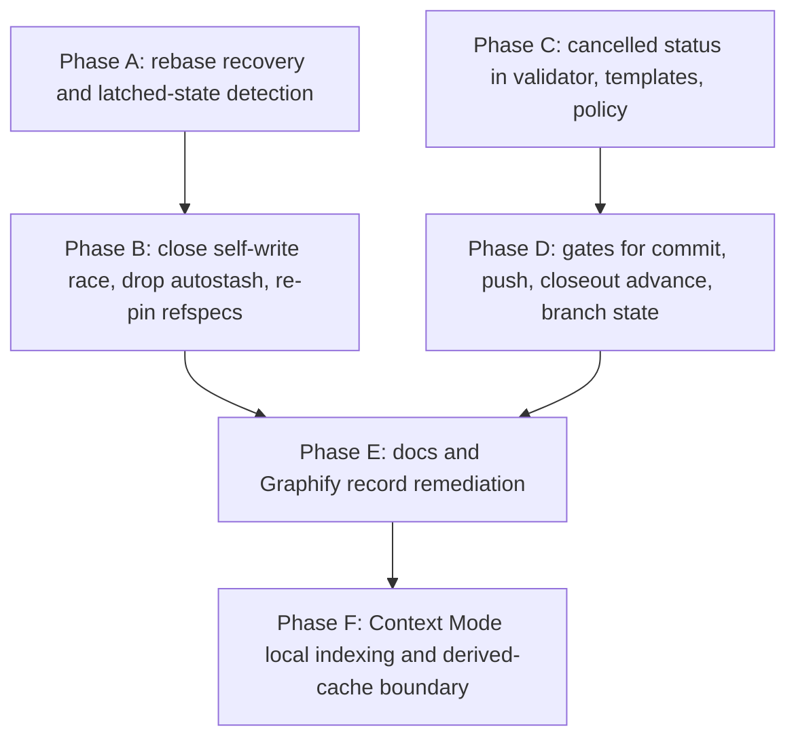

# Big Plan: state-sync-recovery-and-plan-cancellation

## Context

Two control-plane defects were root-caused in the same session. Both live in
`shared/hooks/scripts/`, both stay invisible until they block real work, and
both were found because the lifecycle refused an action that should have been
legal.

**Defect 1 - AI state sync latched into a permanent failure.**
`reconcile_committed_state` in `shared/hooks/scripts/state-sync.sh` runs
`git pull --rebase --autostash origin "$BRANCH"` (line ~243). Git wrote the
autostash commit, then aborted the rebase with
`error: cannot rebase: You have unstaged changes`, because the logging hooks
append to `session_logs/hooks-*.log` inside the very repository being synced.
That is a self-write race: the working tree was re-dirtied between the autostash
snapshot and the start of the rebase.

Git had already created `.git/rebase-merge/autostash` but had not yet written
`head-name`, `onto`, or `orig-head`. The recovery on line ~248 is
`git rebase --abort 2>/dev/null || true`. Without `head-name`, `--abort` cannot
succeed, and `|| true` discarded that failure. The half-initialized directory
survived, and every later sync failed with
`fatal: It seems that there is already a rebase-merge directory`.

Measured evidence in `.claude/session_logs/hooks-errors.log`: 1
`Created autostash` line and 9 `already a rebase-merge` lines. The failure
latched for roughly nine hours across eleven unpublished commits and stayed
invisible because state sync is deliberately warn-never-fail.

`git rebase --quit` is the correct recovery for the half-initialized case: it
clears the rebase state without moving `HEAD`, which is exactly what `--abort`
cannot do when `head-name` is missing. That does not make every pre-existing
rebase state sync's property: a structurally valid or unknown pre-existing
rebase is preserved for the operator rather than aborted or quit automatically.

The same log also holds 5 `Cannot rebase onto multiple branches` lines from an
earlier period. That trigger could NOT be reproduced. The nested remote is now
pinned to a single refspec (`+refs/heads/ai-state:refs/remotes/origin/ai-state`,
verified on disk) and a fresh fetch produces exactly one `FETCH_HEAD` entry.
This plan does not design a fix around that unverified cause; it adds only a
cheap idempotent re-pin, and labels the causal link as an assumption.

**Defect 2 - the lifecycle has no way to say "this phase will never run".**
`scripts/validate_plan_frontmatter.py` allows big-plan status only
`planning|in-progress|complete` (line ~66) and small-plan status only
`in-progress|complete` (line ~81).

The Graphify big plan stopped at Phase 0 with a NO-GO gate result. Phases A
through F were never authorized and will never be implemented, yet they are
still `in-progress`. `assert_push_invariants` in
`shared/hooks/scripts/_lib-frontmatter.sh` therefore refuses the branch with
`all small plans must be complete before PR/push` and demands findings reports
for phases that will never run.

The only way to clear that today is to write six false closeout records, which
would corrupt the exact audit trail the gate exists to protect. That was
correctly refused. The plan file itself already records the damage: it carries
`status: complete` plus a paragraph admitting that `complete` means "this plan
is finished", not "all phases shipped", because `complete` is the only terminal
status the frontmatter validator accepts. The audit trail is currently
inaccurate, and the missing vocabulary is why.

**Adjacent control-plane issue - Context Mode local indexing is being classified
too broadly.** Current guidance can cause agents to treat `ctx_index` as if it
were an external indexing service and refuse ordinary repository indexing. That
is not the intended boundary. Context Mode's index is local SQLite/FTS5 state;
the security requirement is to prevent protected files from being indexed and
to prevent derived cache data from entering `ai-state`, not to block approved
local processing.

This is included in the same big plan because the fix is small and touches the
same control-plane surfaces already being changed here: hook dispatch, nested
`.claude/` state hygiene, tool routing, runtime validation, and generated MCP
wiring. It does not introduce another retrieval system.

## Goals

- Recover the exact observed pre-existing orphaned-autostash directory shape
  with `--quit` only; any extra or non-file metadata is valid or unknown.
- Guard every potentially mutating state-sync entry point before dispatch. For
  valid or unknown pre-existing rebase state, use stderr-only operator guidance,
  bypass checkpointing and publication, make no persistent log write, and
  preserve the nested repository and remote.
- For a rebase known to have been started by the current pull, recover with
  `--abort`, then `--quit` as fallback, and never discard either recovery
  failure output.
- Detect pre-existing rebase state and report it as a distinct, latched
  condition, so an operator can tell a stuck sync from a one-off conflict.
- Close the self-write race so ordinary log churn cannot create orphan rebase
  state at all.
- Keep the warn-never-fail contract exactly as it is: a sync problem must never
  block a session from starting.
- Add a `cancelled` lifecycle status for small plans and big plans, with a
  recorded, artifact-backed reason that makes cancellation impossible to use as
  a silent bypass.
- Teach `assert_commit_invariants` and `assert_push_invariants` the new status
  so a branch with genuinely abandoned phases becomes pushable without
  falsifying any record.
- Correct the Graphify records using the new vocabulary rather than fabricated
  closeouts.
- Allow approved Context Mode `ctx_index` use on non-protected project content
  and state explicitly that local indexing is not external disclosure.
- Keep Context Mode's project index as local derived state under
  `.claude/.cache/context-mode/`; it must never be committed or published on
  `ai-state`.
- Preserve the existing protected-read boundary (`.env*`, secrets,
  credentials, and equivalent denied paths) and make that boundary win over
  local-index permission.
- Extend the existing Context Mode self-check/runtime validation just enough to
  prove the launcher, cache path, ignore rule, and generated MCP wiring are
  coherent. Do not create a new diagnostics subsystem.

## Non-Goals

- No fix designed around the unreproduced `Cannot rebase onto multiple branches`
  error. Only an idempotent defensive re-pin, explicitly marked as an assumption.
- No change to the severity model (`CRITICAL` blocks commit, `MAJOR` blocks
  push, `MINOR` advisory) and no new bypass class.
- No change to the Hugging Face retirement path, `cmd_migrate` semantics, or the
  durable checkpoint story (`post-commit` hook plus the manual VS Code task).
- No reopening of the Graphify adoption decision. The measured Phase 0 value was
  too low to justify integration. Phase E corrects stale records and wording
  only; it must not add Graphify dependencies, routing, persistence, or another
  trial.
- No new retrieval tools in this plan (`ast-grep`, Serena, another code graph,
  or another memory/index service).
- No capability registry, telemetry platform, full LLM evaluation harness, MCP
  gateway, or broad dependency-version project. Those ideas remain deferred
  until repeated real-world friction justifies them.
- No reimplementation of the completed `guidance-and-review-calibration` work.
  Its short root guidance, STE-inspired human-facing writing rules, and
  calibrated Ponytail/review policy are the baseline for this plan.

## Design Decisions

### One big plan, not two

Both workstreams are control-plane repairs to the same hook-script layer, found
in the same session, and both pass through the same generator, validator,
review, and score gates. One big plan means one implementation branch and one
PR, matching the recorded two-tier lifecycle: big plan to branch, small plan to
commit, all small plans done to a squash PR. Two big plans would need two
branches and two PRs for changes that overlap in `shared/hooks/scripts/`,
`scripts/validate_targets.py`, `tests/`, `README.md`, and `docs/`, and would
create a merge-order dependency for no benefit.

The workstreams stay independent at the code level, so phases A and B can land
and ship on their own timetable inside this plan without waiting for C, D, or E.
That is the practical advantage of one plan with ordered phases over two plans.

Phase F is intentionally bounded. It does not turn this plan into a general
tooling roadmap. It fixes a concrete Context Mode policy/runtime mismatch that
uses the same hook and `.claude/` state surfaces. Keeping it here avoids a
second big plan for a small control-plane correction while still giving it one
atomic small-plan commit.

### Rebase cleanup ownership boundary

A rebase present before any potentially mutating state-sync entry point starts
is not automatically owned by state sync. The orphan classifier matches only a
`rebase-merge` directory whose sole entry is a non-symlink regular file named
`autostash`, with no simultaneous `rebase-apply` state. Any extra entry or
non-file shape is valid or unknown. Only the exact observed shape is cleaned
automatically, using `--quit` without first running `--abort`.

One common preflight guards `setup`, `pull`, `checkpoint`, `publish`, `push`,
and `migrate-from-hf` before dispatch. `status` stays read-only and never
cleans state. A valid or unknown pre-existing rebase produces stderr-only
operator guidance and a protected internal outcome that bypasses command
dispatch and the normal persistent `warn` fallback. The public script exits 0
with empty stdout. Tests snapshot and compare `HEAD`, the logical index, the
worktree, rebase metadata, remote state, and the persistent error log. This
also protects automatic Stop checkpoint/publication and post-commit `push`
calls because they enter through the same guarded modes.

After that preflight proves no rebase was active, a failed pull owns any new
rebase state it created. That path may use `--abort`, then `--quit` as fallback;
the fake-Git side channel must record exactly that ordered sequence, and the
suite asserts that distinct failure output from both commands is retained.
Phase B re-runs the same common preflight immediately before its added
`commit_local_state`, so that checkpoint cannot stage an operator rebase that
became active after entrypoint dispatch.

### Status name: `cancelled`

Chosen over `abandoned`. "Cancelled" describes a deliberate decision by an
authority to call work off, which is exactly the semantics the gates enforce.
"Abandoned" connotes neglect and walking away, which is precisely the meaning
the anti-abuse rule forbids: this status must read to a future auditor as
"someone decided, and recorded why", not "someone stopped caring".

One literal spelling, `cancelled`, with no alias. The validator rejects any
unrecognised status, so `canceled` or a typo fails loudly as an invalid status
rather than being silently accepted.

### Big plans get `cancelled` too

Justified, not optional. The Graphify big plan currently carries
`status: complete` alongside a written admission that the status is inaccurate
and that the validator's vocabulary forced it. Without `cancelled`, the two
distinct terminal outcomes - "every authorized phase shipped" versus "the plan
was called off" - are indistinguishable in the one field the gates and the
validator read.

The addition is cheap and safe: `enforce-branch-state.sh` already rejects any
big-plan status other than `planning` or `in-progress`, so a cancelled big plan
is automatically non-startable with no new gate code. Phase D only improves the
denial message and locks the behavior in with a regression test.

The two terminal statuses mean different things and both stay legal:

- `complete` - every phase that was authorized to run has shipped.
- `cancelled` - the plan itself was called off; the remaining phases will never
  be authorized.

### The anti-abuse contract

A cancelled phase requires no commit, no findings report, no score, and no
closeout session log. In exchange it must carry three frontmatter fields, and
the third must point at a real artifact:

- `cancelled_at` - UTC timestamp, `YYYY-MM-DDTHH:MM:SSZ`.
- `cancelled_reason` - non-empty single-line prose.
- `cancelled_evidence` - a repository-relative path that must resolve to an
  existing file containing the line prefix `**Status:** CANCELLED`.

The evidence requirement is the crux. It mirrors the existing
`closeout_session_log` contract, which already requires an existing file
containing `**Status:** COMPLETED`. Cancelling therefore costs exactly what
completing costs in audit terms: one artifact, written deliberately, visible in
review. A silent bypass would require fabricating an evidence file, which is a
visible act with a reviewable diff - the same bar the closeout log already sets.
Cancellation is cheaper than doing the work, which is correct, but it is not
cheaper than being honest about not doing the work, which is the property that
matters.

### Is a branch with cancelled phases pushable? Yes, under three conditions

Refusing to push would strand completed, reviewed, committed work on a dead
branch, which is the exact failure that motivated this plan. Refusing does not
protect quality; it only creates pressure to falsify records. So the branch
becomes pushable when all three hold:

1. **At least one phase is `complete`.** A branch where every phase is cancelled
   produced no certified work; there is nothing to merge and the branch should
   be deleted, not pushed.
2. **Every cancelled phase satisfies the full evidence contract.** A cancelled
   phase with a missing reason, timestamp, or evidence artifact blocks push with
   its own distinct message.
3. **The commit-count check counts completed phases only.** Today the gate
   requires at least one commit per listed phase; it must require at least one
   commit per completed phase, or cancellation would demand commits for work
   that never happened.

A branch-level acknowledgement flag was considered and deliberately rejected.
The per-phase evidence contract already forces a reasoned, artifact-backed
record for every cancelled phase; a second big-plan flag would add bookkeeping
without adding information the reviewer does not already have in front of them.

One further correction falls out of the same change: the push gate today binds
its final findings report to `phases[last]`. If the last listed phase is
cancelled, no such report exists and never will. It must bind to the last
completed phase instead.

### Cancelling needs no outer-repo commit

`.claude/` is ignored by the outer repository (`.gitignore` line 20, verified)
and is its own nested `ai-state` git repository. Recording a cancellation
therefore changes no outer-repo tracked file and produces no outer commit. That
removes an entire class of design problem: there is no need for a "commit the
cancellation" path through `assert_commit_invariants`, and therefore no new way
to land code under a phase that was never reviewed.

Consequently, when `current_phase` points at a cancelled phase, the commit gate
blocks, with a message saying the pointer is stale and must be advanced. Phase D
also makes `record-commit-closeout.sh` skip cancelled phases when it advances
the pointer, so the stale-pointer state should not arise in normal use.

### Context Mode: local index, derived cache

`ctx_index` is classified as approved local processing when it indexes
non-protected content inside the current project. It is not treated as remote
disclosure merely because the operation is called "index".

The default bootstrap storage root for Context Mode becomes the absolute project
path `.claude/.cache/context-mode/`. Context Mode requires
`CONTEXT_MODE_DIR` to be absolute, so the existing dispatch script resolves the
repository root and exports that value before launching either the MCP server or
hook subcommands.

The cache is derived state, not AI authority:

- canonical plans, memory, reports, and session records stay as normal files in
  the nested `ai-state` repository;
- Context Mode may index those non-protected text files for local retrieval;
- `.claude/.cache/` is ignored by the nested repository and must never be
  committed, synced, used as cancellation evidence, or treated as a source of
  truth;
- protected read-deny rules remain authoritative. Local processing does not
  grant permission to index `.env*`, `secrets/**`,
  `config/credentials.json`, or any other denied path;
- `ctx_fetch_and_index` remains an external-fetch operation. This local-index
  permission does not broaden network policy or approve repository upload to
  another service.

The implementation extends the existing `context-mode-dispatch.sh`,
`state-sync.sh`, tool-routing policy, generated MCP config, and runtime checks.
It must not introduce a second Context Mode launcher or a new cache manager.

## Design Overview



Phases A and B are one workstream; C and D are the other. E closes those two
repairs and corrects the Graphify audit trail. F is a bounded adjacent hardening
phase for local Context Mode indexing. It runs after E to avoid concurrent edits
to `state-sync.sh`, generated wiring, README documentation, and validation
fixtures.

## Phases

- [ ] `2026-08-09_phase-A-state-sync-rebase-recovery`
- [ ] `2026-08-09_phase-B-state-sync-race-and-refspec-hardening`
- [ ] `2026-08-09_phase-C-cancelled-status-contract`
- [ ] `2026-08-09_phase-D-cancelled-phase-gates`
- [ ] `2026-08-09_phase-E-docs-and-graphify-remediation`
- [ ] `2026-08-11_phase-F-context-mode-local-indexing-and-cache-boundary`

## Dependency Ordering

- **A before B.** B removes `--autostash` and depends on A's common preflight,
  protected-state propagation, and recovery already being installed. B reuses
  that preflight before its new `commit_local_state`, so an active operator
  rebase is protected before the pull behavior changes underneath it.
- **C before D.** C makes the validator accept `cancelled`; D makes the gates
  honor it. This direction is safe at every boundary: after C alone, a plan may
  be marked cancelled and pass validation while the push gate still refuses it,
  which errs strict. The reverse order would let gates accept a status the
  validator rejects.
- **E after B and D.** E writes documentation and remediates the Graphify
  records, so it describes behavior that both repair workstreams have already
  shipped.
- **F after E.** F modifies the Context Mode dispatcher, nested-state ignore
  behavior, generated MCP wiring, runtime validation, and README documentation.
  Running it last keeps those control-plane edits out of the state-sync repair
  commits and gives the local-index change one clean review boundary.
- A/B and C/D are otherwise independent and may be reordered as pairs.

## Hard Constraint: Where Edits Go

This repository is a generator. `shared/` is the only editable source of truth
for everything it owns. Generated output - `.claude/`, `dist/`, the root
adapters, `.github/`, `.codex/` - must be produced by
`uv run python scripts/generate_targets.py --all` and must never be hand-edited
or hand-copied. This is a recorded lesson, not a preference.

Files edited directly in this plan, by category:

- **Generator source (`shared/`, regenerate after every edit):**
  `shared/hooks/scripts/state-sync.sh`, `shared/hooks/scripts/_lib-frontmatter.sh`,
  `shared/hooks/scripts/record-commit-closeout.sh`,
  `shared/hooks/scripts/enforce-branch-state.sh`,
  `shared/hooks/scripts/context-mode-dispatch.sh`,
  `shared/templates/plan-small.md`, `shared/templates/plan-big.md`,
  `shared/templates/session-log.md`, `shared/plans/README.md`,
  `shared/policies/workflow.instructions.md`,
  `shared/policies/tool-routing.instructions.md`, `shared/mcp/servers.json`.
- **Authoring-repo tooling (edited directly, not generated):**
  `scripts/validate_plan_frontmatter.py`, `scripts/validate_targets.py`,
  `scripts/check_runtime.py`, `tests/*.py`, `README.md`, `docs/*.md`.
- **Consumer-owned mutable state (edited directly, not generated):**
  `.claude/plans/*.md`, `.claude/MEMORY.md`, `.claude/session_logs/*.md`.

## Cross-Phase Verification

For every phase:

```bash
uv sync
uv run pytest tests/ -q --tb=short
uv run mypy . --ignore-missing-imports --explicit-package-bases
uv run ruff check scripts/ tests/
uv run ruff format --check scripts/ tests/
uv run python scripts/generate_targets.py --all
uv run python scripts/validate_targets.py
uv run python scripts/validate_plan_frontmatter.py
uv run python scripts/check_runtime.py
bash .claude/hooks/scripts/context-mode-dispatch.sh --self-check
```

Generator determinism, run after all edits for the phase have settled, because a
stale ignored `dist/` tree produces a false failure otherwise:

```bash
uv run python scripts/generate_targets.py --all
cp -a dist /tmp/dist-gen-a
uv run python scripts/generate_targets.py --all
diff -r /tmp/dist-gen-a dist
rm -rf /tmp/dist-gen-a
```

Note on the command set: `CLAUDE.md` names `mypy src/` and
`ruff check src/ tests/`. This authoring repository has no `src/` directory; its
Python lives in `scripts/` and `tests/`. The commands above are the same
canonical gates retargeted to the real layout, matching what previous phases in
this repository actually ran.

Before big-plan closeout:

- All six small plans complete and committed independently.
- Full regeneration and verification from a clean worktree.
- `bash .claude/hooks/scripts/state-sync.sh status` reports `rebase: none` and a
  `last-error` consistent with a healthy sync.
- `uv run python scripts/validate_plan_frontmatter.py` passes over every file in
  `.claude/plans/`, including the remediated Graphify records.
- `bash .claude/hooks/scripts/context-mode-dispatch.sh --self-check` reports the
  project-local Context Mode storage root and does not require network access.
- `.claude/.cache/context-mode/` is ignored by the nested repository:
  creating a sentinel file there leaves `git -C .claude status --porcelain`
  unchanged.

## Risks and Mitigations

| Risk | Mitigation |
|---|---|
| Phases A and B change a script this very session executes, so a defect could silently stop AI state publishing - the same class of failure being fixed. | Warn-never-fail keeps a defect from blocking sessions. Phase A adds a `rebase:` line to `cmd_status`, making `state-sync.sh status` a real health probe. Phases A, B, and E each require running it as an explicit verification step. |
| Dropping `--autostash` in Phase B could regress a caller that relied on it to absorb a dirty tree. | All three callers already guarantee a clean tree: `cmd_setup` and `cmd_pull` commit first, `cmd_publish` refuses when dirty. Phase B re-runs Phase A's common preflight before its added `commit_local_state` inside `reconcile_committed_state`; the existing publish-dirty regression and the new active-rebase preservation test must pass. |
| State sync stages, commits, publishes, or logs into an active operator rebase before it classifies ownership. | Phase A guards every mutating mode before dispatch and uses stderr-only guidance for valid or unknown state. Phase B re-runs the same guard at its new checkpoint boundary. Parameterized tests preserve repository, remote, and persistent-log snapshots across direct, Stop-used, and post-commit-used modes. |
| A regression test that passes under both old and new code proves nothing. | Recorded lesson. Phase A records actual fake-Git/trace invocations, asserts the exact quit-only orphan path and abort-then-quit current-pull path, and rejects extra-entry orphan fixtures. Phase B asserts no add, commit, pull, or push occurs after its second preflight protects an active rebase. |
| `cancelled` becomes a quiet way to skip reviewed work. | Three required fields plus an evidence file that must exist and contain `**Status:** CANCELLED`, and at least one phase must be `complete` for the branch to be pushable. |
| The `Cannot rebase onto multiple branches` cause is unverified, so a fix could target a phantom. | Phase B adds only an idempotent re-pin of the two refspecs, which is correct regardless of that error's cause, and marks the causal link as an assumption in both the plan and the code comment. |
| A phase whose only changes live under `.claude/` produces an empty outer-repo diff, so the commit gate's `content_hash` and `changed_files` cannot bind. | Phase E is the only phase touching `.claude/` records, and it also changes `README.md` and `docs/`, which are tracked. Stated as a sequencing constraint in that phase. |
| Local Context Mode indexing is mistaken for permission to expose protected repository data. | Phase F separates local processing from disclosure in the routing policy. Existing read-deny rules remain authoritative across targets, and tests assert they stay present in generated settings. |
| The Context Mode SQLite/FTS5 cache is accidentally added to `ai-state` by `git add -A`. | Store it under `.claude/.cache/context-mode/`, add an idempotent nested ignore rule before checkpoints, and test with a sentinel cache file that nested Git remains clean. |
| Project-local Context Mode storage works for hooks but not the MCP server, creating two indexes. | Route both server startup and hook dispatch through the same `context-mode-dispatch.sh` storage setup and validate all generated MCP targets. |
| The dogfood refresh (`install_bootstrap.py . --allow-self --local-only`) applies new hook behavior to the live session mid-plan. | Run it only after the phase's verification passes, then immediately re-run `state-sync.sh status` as a health check. |

## Verification

```bash
uv run python scripts/generate_targets.py --all
uv run python scripts/validate_targets.py
uv run python scripts/validate_plan_frontmatter.py
uv run python scripts/check_runtime.py
```
