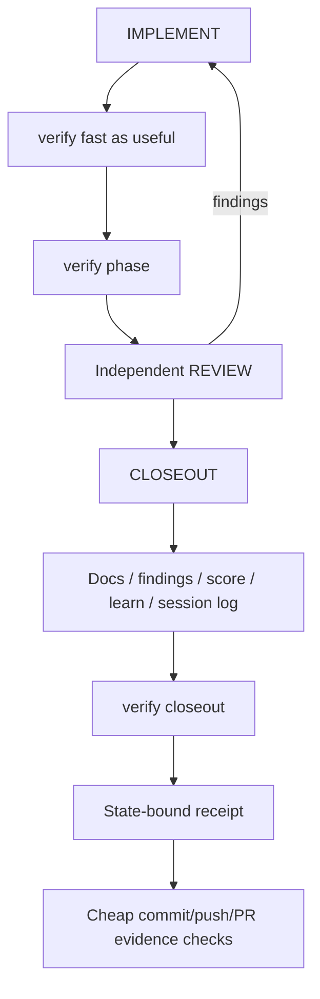

# Big Plan: verification-evidence-workflow-consolidation

## Context

The bootstrap already has strong branch, plan, review, score, documentation,
learning, session-log, commit, push, and PR controls, but deterministic
verification is repeated across coder, verifier, score generation, and hooks.

The useful lesson from `paiml/aprender` / PMAT is not to import their contract
stack. It is to make verification one explicit machine-readable, fail-closed
operation whose evidence is bound to the repository state it measured.

Current `dev` must remain authoritative. Preserve the recently merged behavior:

- approved implementation-ready plans normally skip planner;
- completed-phase evidence triggers planner only when future work is materially affected;
- planner revises affected future phases only;
- optional bounded Context Mode project indexing remains nonblocking;
- direct files/Git remain authoritative over cached retrieval;
- retrieved context/evidence packets are reused across delegation;
- same-role continuation is preferred when context remains valid;
- reviewer/verifier independence is preserved where judgment matters;
- user-facing prose gets the reporting-policy send-time self-check;
- documentation retains its mandatory `humanize` edit check;
- a valid paused phase may create a checkpoint commit and durable backup push,
  but remains unfinished and blocks PR/final closeout.

A fresh audit also found concrete measurement holes in current
`shared/scripts/quality_score.py`: Ruff return/parser failures can become zero
violations, mypy return code is ignored, and the script exits zero even for a
`BLOCKED` score. Existing hooks still independently enforce persisted score and
freshness, so this is not a claim that the current commit gate is trivially
bypassed. It is proof that the new verification layer must distinguish
"measured clean" from "failed to measure."

## Goals

- Add one deterministic verification entrypoint with `fast`, `phase`, and `closeout`.
- Use strict states: `PASS`, `FAIL`, `UNVERIFIED`, `NOT_APPLICABLE`.
- Make missing tools/data, timeout, parser/tool failure, malformed/empty required
  output, and stale evidence fail closed.
- Add stable high-value check IDs and targeted falsifier tests proving each
  authoritative check can turn red.
- Reuse current score/findings/Git metadata and control-plane classification.
- Add scoped freshness so unaffected code evidence can survive ordinary docs-only
  edits, while code/config/control-plane changes stale relevant evidence.
- Keep final closeout bound to the final tracked repository state.
- Reduce duplicate verification/model usage without reducing full CI coverage.
- Retire the standalone verifier LLM only after deterministic parity is proved.
- Keep independent semantic/adversarial reviewer.
- Group documentation/findings/score/learn/session-log/final receipt under CLOSEOUT.
- Make completed-phase commit/push/PR consume a cheap closeout receipt only after
  parity is proved.
- Preserve paused checkpoint publication as a separate non-final authority path.

## Non-Goals

- No `pv`, PMAT dependency, Lean, Kani, theorem prover, or generic YAML contract framework.
- No second task-lane/control-plane registry.
- No Context Mode/Semble redesign.
- No mandatory planner regression.
- No removal of reviewer independence.
- No quality threshold or severity relaxation.
- No weakening of protected-file/Git/branch/plan/pause/cancellation/bypass rules.
- No expensive pytest/mypy/Ruff/full validation inside hooks.
- No validator rewrite merely to create cleaner grouping.
- No provider model changes except removing verifier-role metadata after parity.

## Design Overview



Verification modes:

```text
fast     focused changed-scope feedback; never commit authority
phase    authoritative deterministic task-lane checks; reusable scoped evidence
closeout validates/reuses fresh evidence and emits final completed-phase receipt
```

Required status semantics:

```text
PASS            measured claim succeeded
FAIL            measured claim failed
UNVERIFIED      required claim was not successfully measured
NOT_APPLICABLE  canonical applicability logic proves it is irrelevant
```

High-value falsifiable IDs should include at least:

```text
VFY-STATUS-001
VFY-STATUS-002
VFY-RUFF-001
VFY-MYPY-001
VFY-FRESH-001
VFY-FRESH-002
VFY-CONTROL-001
VFY-GEN-001
VFY-DETERMINISM-001
VFY-RECEIPT-001
```

## Why Three Phases

1. Add and prove deterministic verification while current workflow/gates remain authoritative.
2. Migrate agents/providers after parity while legacy gates remain the rollback authority.
3. Migrate commit/push/PR trust only after both layers are stable.

Phase C stays separate because a false allow/deny at commit/push/PR is a
repository-integrity/security defect.

## Phases

- [x] `2026-08-29_phase-A-deterministic-verification-foundation` — deterministic verification/evidence foundation
- [x] `2026-08-29_phase-B-workflow-and-agent-migration` — workflow, agent, and provider migration
- [ ] `2026-08-29_phase-C-gate-evidence-migration-and-cleanup` — receipt-based gate authority and cleanup

## Repository-Wide Acceptance

- One deterministic verification entrypoint exists in source and generated consumers.
- Required measurement failure can never become PASS.
- Critical check adapters have negative/falsifier regressions.
- Full current validation/CI coverage remains available.
- Current conditional planning, retrieval/indexing/context-reuse, and language behavior remain intact.
- Lifecycle becomes:
  `PRE-FLIGHT -> BRANCH -> PLAN when needed -> IMPLEMENT -> VERIFY -> REVIEW -> CLOSEOUT -> COMMIT`.
- Canonical source and generated consumer guidance contain no stale unqualified
  `PRE-FLIGHT -> BRANCH -> PLAN -> IMPLEMENT -> VERIFY -> REVIEW -> DOCUMENT -> SCORE -> LEARN -> SESSION LOG -> COMMIT`
  lifecycle after Phase B, except clearly historical/migration documentation.
- Generated consumers do not present `PLAN` as mandatory when an approved
  implementation-ready plan exists.
- Verifier LLM disappears only after parity.
- Reviewer remains independent.
- Score >= 90, CRITICAL commit blocking, and MAJOR final push/PR blocking remain.
- Required documentation/LEARN/session-log evidence remains enforced.
- Completed-phase gate authority uses fresh closeout receipts after Phase C.
- Paused checkpoint commit + durable backup push remain distinct non-final behavior.
- Hooks remain cheap and provider-neutral.
- Install/update/prune/runtime/state-sync/self-install/determinism checks pass.

## Verification

Each small plan defines its transition checks. Final repository verification
must include current equivalents of:

```bash
uv run pytest tests/ -q --tb=short
uv run mypy shared scripts tests --ignore-missing-imports --explicit-package-bases
uv run ruff check shared scripts tests
uv run python scripts/generate_targets.py --all
uv run python scripts/validate_targets.py
uv run python scripts/check_runtime.py
```

## Upstream References

- https://github.com/paiml/aprender
- https://github.com/paiml/paiml-mcp-agent-toolkit
